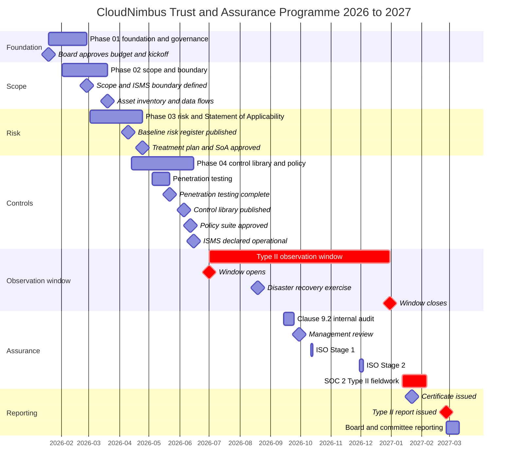

# 01.12 — Programme Roadmap and Milestones

| Field | Value |
|---|---|
| Document ID | `CNB-TRUST-2026-112` |
| Version | 1.0 |
| Date | 2026-08-11 |
| Owner | Karim Haddad, VP Security &amp; Trust |
| Approver | Marisol Vega, Chief Financial Officer |
| Classification | Confidential — Trust &amp; Assurance Programme // Illustrative Portfolio Sample |

---

## 1. Purpose

The Trust &amp; Assurance Programme runs for approximately fourteen months, from board approval on
2026-01-19 to the board and Audit &amp; Risk Committee report on 2027-03-11 that closes it. The last of the
two assurance deliverables, the SOC 2 Type II examination report, is planned for issue on 2027-02-26; the
fortnight that follows is the distribution and reporting runway described in 01.11 §8, and the programme is
not finished until it has been run. This document sets out the
nine phases into which the work is organised, the eighteen milestones by which progress is measured, the
dependencies between phases, and the critical path — including an explanation of why one date on that path
is harder than every other constraint in the programme, and why two milestones deliberately run out of
sequence.

## 2. The nine phases

The programme is organised into nine phases, each corresponding to a directory in this repository. The
phases are sequential in intent but overlapping in execution; a phase closes when its deliverables are
approved, not when the next one begins.

**Phase 01 — `01-program-foundation-dual-framework-governance`.** Establishes the programme's authority,
governance and boundaries: the charter, the objectives, the roles and the clause 5.3 assignment, the
external parties and the independence architecture between them, the stakeholder register, the obligations
and the assurance calendar, and this roadmap. It also fixes the five architectural decisions the rest of the
programme inherits, from the integrated operating model down to the acceptance of a scheduling collision.
Phase 01 decides how the programme will be run; it decides almost nothing about security.

**Phase 02 — `02-system-scope-isms-boundary-and-description`.** Draws two boundaries that are deliberately
not the same shape. The SOC 2 system scope describes a *system* — the infrastructure, software, people,
procedures and data that deliver the CloudNimbus Workforce Platform. The ISMS scope under clause 4.3
describes an *organisational* boundary, and at CloudNimbus that boundary is the whole company. Phase 02 also
produces the asset inventory, the data flows and the first draft of the system description against the
description criteria, and completes the clause 4.1 and 4.2 analysis this phase's stakeholder register feeds.

**Phase 03 — `03-risk-assessment-treatment-and-statement-of-applicability`.** Runs the risk assessment
against clause 6.1 and CC3.1 to CC3.4, establishes the baseline risk register, produces the risk treatment
plan, and disposes of every Annex A control in the Statement of Applicability under clause 6.1.3 d) —
recording, for each, the justification for inclusion or for exclusion and whether the control is
implemented. Which controls are determined necessary is Phase 03's determination and is not anticipated
here; what Phase 01 hands it is the instruction that an exclusion must be argued rather than assumed, and
the observation in 01.01 §6 that the A.7 physical theme is where the argument will be hardest.

**Phase 04 — `04-unified-control-framework-and-policy-architecture`.** Builds the single control library
serving both frameworks and the policy suite that sits above it. This is where the mapping between the trust
services criteria and Annex A is asserted, documented per mapped pair, and — because a mapping is an
assertion by the mapper and no authority blesses a crosswalk — made defensible on CloudNimbus's own
reasoning. It closes with the ISMS being declared operational.

**Phase 05 — `05-security-criteria-and-technical-controls`.** Implements and evidences the Common Criteria
and the technical Annex A controls: identity and access, network and infrastructure, secure development,
logging and monitoring, vulnerability and configuration management. Penetration testing sits in this phase
by subject matter even though it is executed early, for the reason given in section 6.

**Phase 06 — `06-availability-processing-integrity-and-operations`.** Covers the A1 and PI1 criteria and
the operational controls behind them: capacity, backup, disaster recovery and business continuity on the
availability side, and on the processing integrity side the completeness, validity, accuracy, timeliness and
authorisation of what the calculation engine computes. For a platform whose output becomes people's pay,
this is the phase where the product and the control environment are the same thing.

**Phase 07 — `07-confidentiality-privacy-and-third-party-assurance`.** Covers the C1 and P1 to P8 criteria,
multi-tenant isolation as the confidentiality control that actually matters, the data lifecycle and
retention, and the third-party assurance programme including the subservice organisation and sub-processor
populations.

**Phase 08 — `08-internal-audit-certification-and-type-ii-examination`.** The assurance phase: the clause
9.2 internal audit, the clause 9.3 management review, ISO Stage 1 and Stage 2, and the fieldwork of the
Type II examination. It also carries the internal audit charter, which is where the coverage question left
open at CAL-14 is resolved.

**Phase 09 — `09-executive-reporting-and-continuous-assurance`.** Reports the outcome of both deliverables
to the board and to customers, quantifies what the integration actually saved, computes the risk register's
close position from the Phase 03 baseline by the register's own rules, and establishes the steady-state
assurance operation that follows the programme.

## 3. Milestones

| ID | Milestone | Date | Phase |
|---|---|---|---|
| MS-01 | Board approves budget; programme kickoff | 2026-01-19 | 01 |
| MS-02 | SOC 2 system scope and ISMS boundary defined | 2026-02-27 | 02 |
| MS-03 | Asset inventory and data flows baselined | 2026-03-20 | 02 |
| MS-04 | Risk assessment complete; baseline register published | 2026-04-10 | 03 |
| MS-05 | Risk treatment plan and Statement of Applicability approved | 2026-04-24 | 03 |
| MS-06 | Penetration testing complete | 2026-05-22 | 05 |
| MS-07 | Unified control library published | 2026-06-05 | 04 |
| MS-08 | Policy suite approved | 2026-06-12 | 04 |
| MS-09 | ISMS declared operational | 2026-06-15 | 04 |
| MS-10 | Type II observation window opens | 2026-07-01 | 05 |
| MS-11 | Disaster recovery exercise complete | 2026-08-19 | 06 |
| MS-12 | Clause 9.2 internal audit complete | 2026-09-25 | 08 |
| MS-13 | Management review held | 2026-09-30 | 08 |
| MS-14 | ISO Stage 1 complete | 2026-10-14 | 08 |
| MS-15 | ISO Stage 2 complete | 2026-12-04 | 08 |
| MS-16 | Type II observation window closes | 2026-12-31 | 08 |
| MS-17 | ISO/IEC 27001:2022 certificate issued | 2027-01-22 | 09 |
| MS-18 | SOC 2 Type II report issued | 2027-02-26 | 09 |

## 4. Programme schedule

## 5. The critical path

The critical path runs **MS-09 → MS-10 → MS-16 → MS-18**: the ISMS is declared operational, the observation
window opens, the window closes, the report is issued. Everything else in the programme either feeds that
sequence or can slip without moving the end date.

The hardest constraint in the entire programme is **MS-10, 2026-07-01**, and it is hard for a reason that is
structural rather than logistical. A Type II examination reports on the suitability of design **and the
operating effectiveness** of controls **throughout a specified period**. Not at its end, and not on average.
A control that was not operating on 2026-07-01 cannot be tested for the full period, and there is no
remediation available after the fact — the period is what it is. A control implemented on 2026-08-15 leaves
six weeks of the window during which the control did not exist, and the service auditor's tests will either
find nothing to sample for those six weeks or will find the population incomplete. Either way, the criterion
is not met for the period examined.

This is the respect in which a Type II differs from every other kind of deadline a programme manages.
Elsewhere, being late costs time. Here, being late costs *period coverage*, and period coverage cannot be
bought back. It is why MS-09 sits two weeks and two days ahead of MS-10 rather than on the same day: the
ISMS is declared operational on 2026-06-15, to leave a margin in which controls can be observed operating
before the window opens rather than starting their operational life on the first morning of it.

The same logic pushes MS-07 and MS-08 into early June. The control library must be published before the
controls it describes are expected to operate, and the policy suite must be approved before staff can be
expected to follow it. Approving a policy inside the observation window is possible, but it means the
examination covers a period during which the policy was in two states, and that has to be described in the
system description rather than smoothed over.

MS-08 needs one clarification, because its name invites a misreading. It is **not** the point at which
CloudNimbus first has an information security policy. Clause 5.2 makes the information security policy an
obligation of top management, discharged by Elise Fontaine under A-06, and it exists from the start of the
ISMS work — an organisation that waited for a control library before issuing one would have a clause 5
nonconformity for the whole of the intervening period. MS-08 is the **reissue of the full nineteen-policy
suite** once the library it references has been published, which is a sequencing choice about doing the
drafting once rather than twice, not a claim that a mandate follows the thing it mandates.

MS-16 and MS-18 complete the path. The window closes on 2026-12-31; fieldwork runs 2027-01-12 to 2027-02-06;
the report is planned for 2027-02-26. The gap between the end of fieldwork and issuance is not slack. It
covers the completion of the system description, management's written assertion under O12, the
representation letter, and the service auditor's own completion procedures. Compressing it is not within
CloudNimbus's gift.

One item on the critical path is not CloudNimbus's to control at all, and it is worth naming as such. The
form of the opinion in the issued report is Ashcombe &amp; Doyle's, and so, in practice, is the issuance date
— the plan of 2027-02-26 is a plan agreed with the firm, not a commitment CloudNimbus can make on the firm's
behalf. The same applies to MS-17: the certification decision belongs to Northgate. Two of the programme's
three closing milestones are dates other organisations own.

## 6. Why MS-06 and MS-07 are out of order

The milestone table shows MS-06, penetration testing, dated 2026-05-22 and attributed to Phase 05, sitting
ahead of MS-07, the unified control library, dated 2026-06-05 and attributed to Phase 04. A phase-05
milestone completes before a phase-04 milestone. That is intentional and the reason is worth stating rather
than tidying away by renumbering.

The ordering is the consequence of a decision, not of a scheduling accident. **DEC-109, taken by Nathan
Oyelaran on 2026-03-04, commissions penetration testing before the control library is complete**, because
the question the testing has to answer cannot wait for documentation. CloudNimbus runs a multi-tenant
platform holding compensation data for 640 employers and 1.24 million individuals, and the single worst
outcome available to it is one tenant seeing another tenant's data. The programme has an assumption on
record — **AS-02**, that row-level security is uniformly enforced across every data access path — and an
assumption with that consequence attached is not something to carry into a six-month observation window on
the strength of a design document.

The engagement with Ironwood Security Labs (EP-06) is therefore scheduled for **2026-05-04 to 2026-05-22**
and scoped to cover external, internal and cloud, web application, mobile application and — the reason for
the whole exercise — **multi-tenancy isolation**. Remediation and retest are planned to complete before
2026-07-01, because a finding open on the first morning of the window is a finding the window carries.

Three arguments support the ordering, and each is available now rather than in hindsight. The first is that
a defect in the isolation model, if there is one, is worth finding while there is still time to remediate
and retest outside the window; the alternative is finding it inside the window, where the remediation is
still possible but the period is already contaminated. The second is that an assumption of AS-02's
consequence should be tested on evidence rather than carried on opinion, and the programme's habit is to
record assumptions precisely so that they can be put at risk. The third is about the library itself: a
control library published on 2026-06-05 with the test results in hand describes the isolation model as it
is, whereas a control library finished first would describe row-level security as designed and would then
have to be revised or, worse, would not be.

Testing early has a cost and it should be recorded now rather than discovered later. **A May test covers
the system as it stood in May.** It does not cover controls implemented between May and the opening of the
window, and it does not cover anything built during the window. The annual cadence at CAL-11, with
re-testing after significant change, is what addresses that, and the judgement about what counts as
significant change sits with Karim Haddad. A programme that tests early and never again has bought
certainty about a snapshot and described it as certainty about a system.

What the May testing finds is not stated here. It belongs to the phase that reports it, and Phase 01 writes
from a standpoint three months before the engagement begins.

## 7. Dependencies between phases

| Dependency | Predecessor | Successor | Why |
|---|---|---|---|
| DP — scope before risk | Phase 02 | Phase 03 | Risk cannot be assessed against an undefined boundary; assets and data flows are the input to the assessment |
| DP — risk before controls | Phase 03 | Phase 04 | Controls are the treatment of assessed risk; a control library built first would be a catalogue rather than a treatment |
| DP — SoA before control library | MS-05 | MS-07 | The Statement of Applicability determines which Annex A controls are necessary; the library implements that determination |
| DP — control library before policy suite reissue | MS-07 | MS-08 | Not because a mandate must follow the thing mandated — the clause 5.2 information security policy already exists and is top management's obligation, not a downstream product. MS-08 is the **reissue of the full nineteen-policy suite** against the published library, sequenced after MS-07 so it is done once rather than twice |
| DP — ISMS operational before window | MS-09 | MS-10 | Controls must be operating before the period during which their operation is tested |
| DP — window before internal audit outcome value | MS-10 | MS-12 | An internal audit of an ISMS that has not operated has nothing to sample |
| DP — internal audit before management review | MS-12 | MS-13 | Clause 9.3.2 requires internal audit results as an input to the management review |
| DP — internal audit and management review before Stage 2 | MS-12, MS-13 | MS-15 | A certification body will look for a completed cycle of clause 9.2 and 9.3 before assessing implementation and effectiveness |
| DP — Stage 1 before Stage 2 | MS-14 | MS-15 | Stage 2 proceeds on the basis of the documented information and readiness review at Stage 1 |
| DP — window closes before fieldwork completes | MS-16 | MS-18 | The examination covers the period; testing of the full period cannot conclude before the period ends |

Two dependencies are absent from this table and their absence is deliberate. There is no dependency running
from the ISO certification track to the SOC 2 examination track or the reverse. The two deliverables share a
control library, an evidence store and a risk assessment, but neither is a precondition of the other, and
building a schedule in which the examination waited on the certificate would have created a single point of
failure across two independent assurance products. And there is no dependency from Stage 2 to the close of
the observation window, even though **MS-15 falls inside the window**. That collision is not an accident of
scheduling; it was identified in February, accepted knowingly, and recorded as ADR-0005 with the
contradictory-evidence risk stated in terms at PR-05. The reasoning belongs to 01.06.

## Cross-References

| Document | Relationship |
|---|---|
| [01.00 Phase 01 README](01.00-README.md) | Phase index and reading order |
| [01.02 SOC 2 Landscape and Trust Services Criteria](01.02-soc-2-landscape-and-trust-services-criteria.md) | Why a Type II period cannot be recovered after the fact |
| [01.06 Dual-Framework Strategy and Integration Model](01.06-dual-framework-strategy-and-integration-model.md) | Sequencing decisions DEC-106 and DEC-107 and the ADR-0005 collision |
| [01.07 Programme Charter and Objectives](01.07-program-charter-and-objectives.md) | Objectives forecast against these milestones |
| [01.11 Assurance Calendar and Obligations](01.11-assurance-calendar-and-obligations.md) | Month-by-month view and the O2 runway following MS-18 |
| [01.13 Phase Summary and Transition](01.13-phase-summary-and-transition.md) | Entry criteria for Phase 02 |

---

← [01.11 Assurance Calendar and Obligations](01.11-assurance-calendar-and-obligations.md) · [Phase 01 README](01.00-README.md) · [01.13 Phase Summary and Transition](01.13-phase-summary-and-transition.md) →
