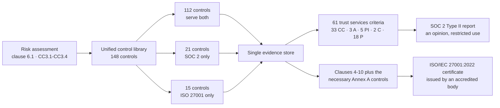

# Diagram — Dual-Framework Integration Model

| Field | Value |
|---|---|
| Document ID | CNB-TRUST-2026-D02 |
| Version | 1.0 |
| Date | 2026-08-11 |
| Owner | Karim Haddad |
| Approver | Nathan Oyelaran |
| Classification | Confidential — Trust &amp; Assurance Programme // Illustrative Portfolio Sample |

One risk assessment, one control library, one evidence store — and then the paths diverge and never rejoin.
Which of the 93 Annex A controls are necessary, and which the Statement of Applicability justifies leaving
out, is Phase 03's determination and is deliberately not asserted here.

There is no combined deliverable. The report is an opinion and the certificate is a certificate, and
conflating them is the single most common error in this field.

## Cross-References

| Document | Relationship |
|---|---|
| [01.06 Dual-Framework Strategy and Integration Model](../01.06-dual-framework-strategy-and-integration-model.md) | The argument this diagram summarises |
| [01.02 SOC 2 Landscape and Trust Services Criteria](../01.02-soc-2-landscape-and-trust-services-criteria.md) | Derives the 61 |
| [01.03 ISO/IEC 27001:2022 Landscape and Certification Route](../01.03-iso-iec-27001-2022-landscape-and-certification-route.md) | Derives the 93 |
