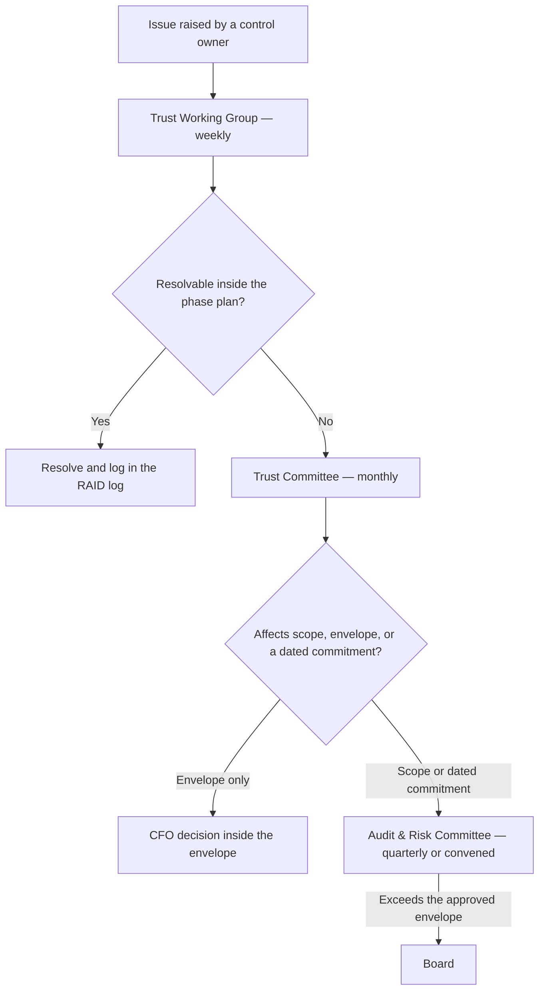

# Diagram — Governance and Escalation

| Field | Value |
|---|---|
| Document ID | CNB-TRUST-2026-D04 |
| Version | 1.0 |
| Date | 2026-08-11 |
| Owner | Rahul Bhargava |
| Approver | Karim Haddad |
| Classification | Confidential — Trust &amp; Assurance Programme // Illustrative Portfolio Sample |

Two thresholds do the work. Anything that changes the SOC 2 system scope, the ISMS boundary, or a dated
commitment to a customer or an audit body leaves management and goes to the Audit &amp; Risk Committee.
Anything that would exceed the approved envelope goes to the board, because the board approved the envelope
and the CFO is accountable only inside it.

## Cross-References

| Document | Relationship |
|---|---|
| [01.07 Programme Charter and Objectives](../01.07-program-charter-and-objectives.md) | Sets the escalation thresholds |
| [01.08 Roles, Responsibilities and RACI](../01.08-roles-responsibilities-and-raci.md) | Names who decides at each level |
