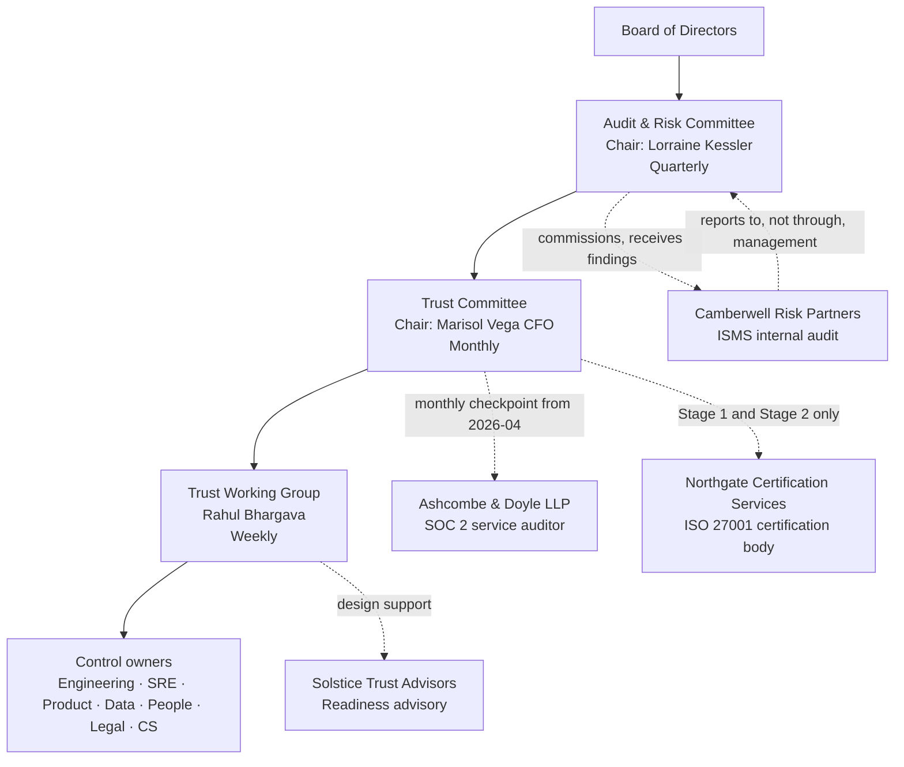

# Diagram — Programme Operating Model

| Field | Value |
|---|---|
| Document ID | CNB-TRUST-2026-D01 |
| Version | 1.0 |
| Date | 2026-08-11 |
| Owner | Rahul Bhargava |
| Approver | Karim Haddad |
| Classification | Confidential — Trust &amp; Assurance Programme // Illustrative Portfolio Sample |

The dotted lines are the ones that matter. Internal audit reports to the Audit &amp; Risk Committee rather
than through the VP Security &amp; Trust, because internal audit that reports to the person it audits is not
internal audit. The certification body has no line to the working group at all: it may not consult on the
management system it certifies, so the only contact points are Stage 1 and Stage 2.

## Cross-References

| Document | Relationship |
|---|---|
| [01.07 Programme Charter and Objectives](../01.07-program-charter-and-objectives.md) | Defines the committees shown |
| [01.08 Roles, Responsibilities and RACI](../01.08-roles-responsibilities-and-raci.md) | Allocates accountability across them |
| [01.09 External Parties and Independence](../01.09-external-parties-and-independence.md) | Explains the separation the dotted lines encode |
