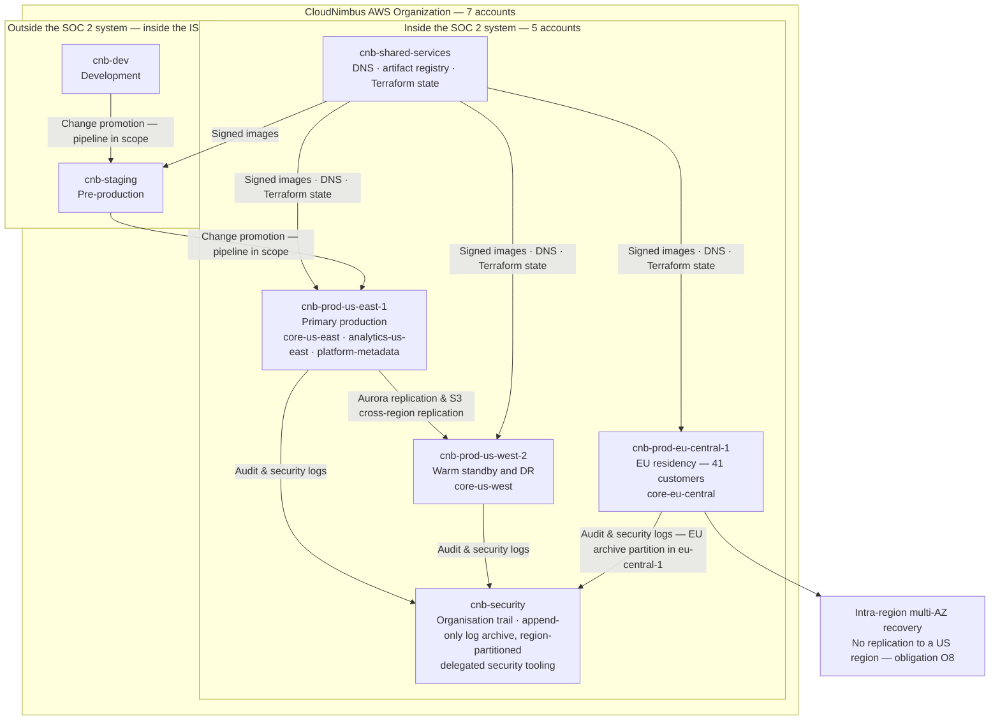

# 02.03 — Infrastructure and Cloud Architecture

| Field | Value |
|---|---|
| Document ID | `CNB-TRUST-2026-203` |
| Version | 1.0 |
| Date | 2026-08-11 |
| Owner | Wes Delacroix, Director of Infrastructure &amp; SRE |
| Approver | Nathan Oyelaran, Co-founder and Chief Technology Officer |
| Classification | Confidential — Trust &amp; Assurance Programme // Illustrative Portfolio Sample |

---

## 1. Purpose

This document describes the infrastructure component of the system under DC3: the AWS account model, the
region strategy, the compute and data tiers, the network design, and the separation of the security and
shared-services accounts from the production accounts. It also carries the phase's least comfortable
argument, which is why the non-production accounts are outside the system and what that exclusion is
actually resting on.

CloudNimbus runs on **AWS only**. There is no second cloud, no colocation footprint and no on-premises
infrastructure. The Denver office suite contains no server, no network closet and no comms room, and its
internet service is the landlord's building service. Every piece of infrastructure in the system is an AWS
resource in an AWS account, which makes the account the natural unit of the boundary — and makes AWS a
subservice organisation whose controls the system depends on, carved out of the description under DEC-108
and treated in 02.10.

## 2. The account model

CloudNimbus operates **seven AWS accounts** in a single AWS Organization. Five are inside the SOC 2 system.

| Account | Purpose | In the SOC 2 system |
|---|---|---|
| `cnb-prod-us-east-1` | Primary production | Yes |
| `cnb-prod-us-west-2` | Warm standby and disaster recovery | Yes |
| `cnb-prod-eu-central-1` | EU data residency for 41 customers | Yes |
| `cnb-security` | CloudTrail organisation trail, log archive, delegated security tooling administration | Yes |
| `cnb-shared-services` | DNS, artifact registry, Terraform state | Yes |
| `cnb-staging` | Pre-production | No |
| `cnb-dev` | Development | No |

The account is used deliberately as a **blast-radius boundary** rather than as an organisational
convenience. An identity in `cnb-dev` has no path to a resource in `cnb-prod-us-east-1` other than through
an explicitly assumed role with an explicit trust policy, and the three production accounts are separated
from one another for the same reason: the residency commitment in SC-04 is far easier to enforce when the
EU data has its own account, its own keys and its own network than when it is a tag on a resource in a
shared account.

Two of the five in-system accounts hold no customer data and are in the system anyway, which is worth
stating because it is a common scoping mistake in the other direction. `cnb-shared-services` holds DNS, the
container artifact registry and Terraform state. If DNS is wrong the platform is unreachable; if the
artifact registry serves an unsigned image the deployed software is not the software that was reviewed; if
Terraform state is altered the infrastructure drifts from what was approved. Each of those is a route to
failing a system requirement, so the account is in the system whether or not a customer record ever passes
through it. The test set out in 02.01 §3 is about what breaks a requirement, not about where the data
happens to sit.

## 3. `cnb-security` as a separate trust domain

`cnb-security` is the account that holds the CloudTrail organisation trail, the log archive, the delegated
administration of the security tooling, and the configuration and findings stores that go with them. It is
designed as a **separate trust domain**, which means something more specific than "a separate account".

The property being sought is that a principal capable of acting in production is not capable of altering
the record of what it did. Production roles can write to the log pipeline and cannot read, modify, delete
or expire what has landed in the archive; the archive's bucket policies and object lock configuration are
administered from `cnb-security` by a distinct set of principals; and the organisation trail is configured
at the organisation level so that an individual account cannot switch off its own logging. **SR-09** states
the requirement — audit logging of security-relevant events shipped to an append-only archive in a separate
account — and DF-09 in 02.04 is the flow that implements it.

This matters more than it might appear for an examination. Almost every test the service auditor performs
over the period will draw on evidence that ultimately derives from this account, and almost every ISO
clause 9 activity will too. An audit trail administered by the same people who administer the systems it
records is not worthless, but it is a weaker piece of evidence, and the weakness is structural rather than
a question of anyone's trustworthiness.

### 3.1 The archive is region-partitioned, and it has to be

A separate account is not a separate region, and the distinction has to be drawn explicitly here because
the logs shipped into this account carry personal data. **DF-09** ships audit and security events from every
service, including authentication metadata, which is personal data category **PD-12**; **RT-05** holds
those records for 13 months in the queryable store and then seven years in the archive, pseudonymised only
at the point they enter the archive. Personal data therefore sits in the archive for the whole of the first
13 months, in identifiable form, and the log pipeline runs from all three production accounts.

Against that stands **SC-04**, **SR-02** and obligation **O8**: the personal data of the 41 EU-residency
customers is held at rest in `eu-central-1`. Section 4 refuses cross-region disaster recovery for the EU
region for exactly that reason. A description that refuses to replicate an EU database into the United
States and then ships EU authentication records into a single global log bucket has not made a residency
commitment; it has made one and broken it in the place nobody looks.

So the commitment is stated in terms for the archive as well. **The `cnb-security` log archive is
region-partitioned.** There is an **EU archive bucket in `eu-central-1`**, encrypted under **EU-scoped
customer-managed keys** and administered from `cnb-security` by the same distinct set of principals that
administers the US partition; audit and security events originating in `cnb-prod-eu-central-1` land in that
partition and stay there for both the 13-month queryable period and the seven-year archive period.
**Only pseudonymised or non-personal telemetry crosses regions** — aggregate volumes, error rates, service
health and the pseudonymised records the archive holds after the 13-month boundary — so that estate-wide
monitoring and estate-wide search remain possible without an identifiable EU record leaving its region.
The separation of the *trust domain* from the *production account* is preserved in both partitions
independently: an EU production principal can write to the EU partition and cannot read, modify, delete or
expire what has landed there.

This is the reconciliation of Phase 01's assumption **AS-09** — *EU-resident personal data does not leave
`eu-central-1` in backups or logs* — and it is worth being clear that the assumption is what drove the
design rather than the design being discovered to satisfy it afterwards. AS-09 is carried in the Phase 01
assumption log as unverified, with the disproving observation stated as personal data from an EU tenant
found in a US-region log or snapshot, and it is scheduled for test in Phase 07. Phase 02's contribution is
to say where the assumption is load-bearing — here, and in the backup arrangements of section 6 — and to
make it a property of a stated architecture rather than of a habit. **02.04 restates the same position
against DF-09**, which is the flow that implements it.

## 4. Regions and residency

| Region | Role |
|---|---|
| `us-east-1` | Primary production for all non-EU-residency tenants |
| `us-west-2` | Warm standby and disaster recovery for `us-east-1` |
| `eu-central-1` | Production for the 41 customers with an EU data residency commitment |

Residency is a **tenant configuration property**, not a deployment variant: **SR-02** requires region
pinning of personal data at rest by tenant residency configuration, and the platform routes a tenant's
storage to its configured region rather than running a separate EU product. The same 63 microservices are
deployed to the EU region; what differs is which tenants' data they may hold.

The recovery design for the EU region is deliberately different from the US one, and the reason is a
commitment rather than an engineering preference. Recovery for `us-east-1` is cross-region into
`us-west-2`. Recovery for `eu-central-1` is **intra-region, across availability zones**, because
replicating EU tenants' personal data into a US region for disaster-recovery purposes would breach
obligation **O8** and the commitment **SC-04** that rests on it. A disaster recovery arrangement that
quietly violates a residency commitment at the moment it is invoked is a commitment that was never real,
and the architecture is built so the question cannot arise under pressure.

**SR-10** states the objectives: a **4-hour recovery time objective** and a **15-minute recovery point
objective**. The two recovery paths are not designed against those objectives for the same set of failures,
and the description has to say so rather than let the shared numbers imply a symmetry that does not exist.

The `us-east-1` path is designed to meet SR-10 for the loss of an availability zone **and** for the loss of
the region, because there is a second region holding replicated data and a standby estate to fail into.
**The `eu-central-1` path is designed to meet SR-10 for availability-zone-level failure only.** A multi-AZ
architecture recovers from the loss of a zone; it does not recover from the loss of the region it is
entirely contained in, on a 4-hour objective or on any other, because there is nowhere to recover to. To
claim otherwise would be to claim a recovery capability the architecture was deliberately not given.

**The loss of `eu-central-1` is therefore an accepted residual, and what drives it is obligation O8.**
CloudNimbus could hold a warm standby for EU tenants in a second region and meet SR-10 for a regional loss,
and it would do so by replicating EU-residency customers' personal data outside `eu-central-1`, which is
the one thing O8 and SC-04 forbid. The choice was between a residency commitment that survives an incident
and a recovery objective that survives a region, and the commitment won. Naming it as a residual rather
than describing the EU path as meeting the same objectives is the difference between a disclosed limitation
and an overstated one.

That residual is not a hypothetical, and 02.09 §3 is where this phase says so: the clause 4.1 determination
records climate change as a relevant issue precisely because regional-scale disruption to a dependency with
no substitute is a real event rather than an unthinkable one. Two parts of the same phase cannot hold that
a region may be lost and that a single-region architecture recovers within four hours.

**The treatment of the residual belongs to Phase 06**, where business continuity and disaster recovery are
designed and where the options — extended recovery objectives disclosed to the 41 EU-residency customers, a
second region that could be reconciled with O8 if one can be, or acceptance of the residual as it stands —
are evaluated on their merits. Phase 02 records the
exposure, its cause and its owner. Whether either architecture meets its stated objectives under test is
also Phase 06's to establish, and Phase 02 makes no claim about it.

## 5. Compute

CloudNimbus operates **4 EKS clusters**, of which **3 are in the system**: one in each of the three
production regions. The fourth serves `cnb-staging` and `cnb-dev` and is outside the system for the same
reason those accounts are.

The 63 microservices described in 02.04 run as containerised workloads on those clusters. Workload identity
is federated to IAM roles for service accounts, so a pod's permissions derive from its identity rather than
from the node it happens to land on; namespaces separate service domains; and no long-lived cloud
credential is issued to a running workload. Cluster administrative access is a distinct access tier, set
out in 02.05, and is not held by the same population that holds application administrative access.

**Version selection and patch acceptance on the managed services are CloudNimbus's responsibility, not
AWS's**, and the boundary is stated here because it is the one most often described the wrong way round.
AWS operates the hosts, the hypervisor and the control-plane software beneath EKS and Aurora, patches that
infrastructure, and publishes the Kubernetes versions, the Aurora PostgreSQL engine versions and the patch
levels available. **Choosing which of those versions to run, deciding whether and when to accept a minor
version upgrade, setting the maintenance window in which AWS may apply one, and moving off a version
approaching end of support are CloudNimbus's decisions**, taken by CloudNimbus's people in CloudNimbus's
accounts and promoted through the change pipeline SR-11 describes like any other change. A cluster left on
an unsupported Kubernetes version is not an AWS failure and no AWS assurance report says anything about it.
This is why **CSOC-07** in 02.10 is drawn to cover only the plane AWS operates: a complementary control that
claimed AWS managed the whole of it would have carved out a control CloudNimbus performs and placed it
outside the description's testing.

## 6. The data tier

Six Aurora PostgreSQL clusters exist. **Five are in the system**: `core-us-east` (primary transactional),
`core-us-west` (DR replica), `core-eu-central` (EU tenants), `analytics-us-east` (read replica serving the
reporting API), and `platform-metadata` (tenant configuration, pay rules, feature flags). **`staging-core`
is not.**

Three of those five deserve comment. **`analytics-us-east`** is the read replica the reporting API queries,
and it is where the tenant isolation question is at its sharpest: the reporting workload is the one that
composes across a tenant's whole population at the query layer rather than fetching one record at a time,
and it relies on the same row-level security predicate the transactional path relies on. 02.04 develops
this under DF-06. **`platform-metadata`** holds the configured pay rules, and a pay rule is an input to
every calculation the engine performs — which makes an integrity failure there a processing integrity
failure at scale rather than a configuration nuisance. **`core-eu-central`** holds EU tenants' data under
region-scoped keys and is the technical implementation of SC-04.

Alongside Aurora, **17 of 19 non-Aurora data stores** are in the system — Redis for session and cache,
OpenSearch for search indices over tenant data, and DynamoDB for high-write low-relational state — and
**168 of 214 S3 buckets**, which hold receipt images, export files, log archive objects and backups. The 46
buckets outside the system belong to non-production and to corporate functions. All of them remain inside
the ISMS with an owner and a classification, which is the 246-asset difference 02.06 quantifies.

Encryption at rest is under **region-scoped customer-managed keys** in KMS, per **SR-03**, which also
requires TLS 1.2 or above in transit. Region-scoped keys are the reason the residency commitment survives a
mistake: a snapshot copied to the wrong region is not merely a policy violation, it is unreadable.

## 7. Network design

Each production account runs a VPC with private subnets for compute and data and no public subnet
containing a workload. Ingress arrives at an edge and load-balancing tier and reaches the API gateway;
nothing else is reachable from the internet. Egress to customers' payroll providers and to the small number
of external services the platform calls is routed through NAT with an allowlist, so that an outbound
destination is a configuration decision rather than a default. Interface endpoints keep traffic to AWS
services off the public internet. There is **no VPC peering between production and non-production**, and no
route from the corporate network — which is, in a remote-first company with no data centre, simply the
public internet plus an identity provider — into a production subnet other than through the same
authenticated paths customers use or through the break-glass administrative path described in 02.05.

## 8. Account and region topology

The two arrows at the bottom are the point of the next section. The accounts they start in are outside the
system; the pipeline they represent is inside it.

## 9. Why `cnb-staging` and `cnb-dev` are excluded — ADR-0007

Non-production environments are routinely excluded from a SOC 2 system, and the exclusion is routinely
described as though it were self-evident. It is not, and this description will not present it that way.

**The exclusion is not a fact about the architecture. It is a claim about a control.**

Architecturally, `cnb-staging` is a close copy of production. It runs the same services on the same cluster
technology against the same schema. There is no property of the account, the network or the storage that
makes it *incapable* of holding production customer data; the schema would accept it, the disks would store
it and the services would serve it. The only thing that keeps production customer data out of those two
accounts is **SR-12** — non-production environments hold no production customer data — implemented by
seeded synthetic datasets, by a prohibition on restoring production snapshots into non-production, and by
the key separation that makes a copied snapshot unreadable outside its region and account.

So the boundary drawn in §2 is exactly as strong as SR-12 is, and no stronger. Which leads to the
consequence this document is required to state plainly: **if SR-12 fails, the boundary was wrong all
along.** Not wrong from the date somebody notices. Wrong from the moment production customer data first
landed in an account that the description says is outside the system — because from that moment the
description would have been asserting that customer data lives only inside a boundary that it had in fact
left, and every control the description attaches to that data would have had a population the auditor was
never shown. The failure is retrospective, and it is a **description** failure before it is a control
failure. That is a worse category of problem than a control deviation, because a deviation is disclosed and
evaluated whereas a description defect goes to whether the description is presented in accordance with the
description criteria at all.

Three things follow, and they are the substance of ADR-0007.

**First, SR-12 must be operated and evidenced as a control across the whole period**, not asserted as an
environmental fact in a diagram. The evidence has to be capable of showing the absence of something, which
is a harder evidential proposition than showing the presence of something and needs to be designed for
rather than assumed.

**Second, the exclusion is reversible and the description must be corrected if it is ever breached.** A
restore of a production snapshot into staging to reproduce a customer-reported bug is the single most
likely way this fails, because it is the version of the failure that a competent, well-meaning engineer
performs under time pressure while trying to help a customer.

**Third, the change-management pipeline stays in scope.** The pipeline that builds, tests and promotes code
*through* `cnb-dev` and `cnb-staging` into production serves **SR-11**, which requires change promotion
through an automated pipeline with recorded peer review, and SR-11 serves SC-01 and SC-07. Excluding the
environments does not exclude the mechanism that moves software into production through them. This is why
the code repository and CI/CD populations in 02.06 keep most of their count — **119 of 148 repositories and
71 of 87 pipelines are in the system** — while the accounts they deploy into are not. A scoping exercise
that had excluded "everything to do with non-production" would have removed the change control path from a
description whose availability and processing integrity commitments both depend on it.

## 10. Decision record

**ADR-0007 — Non-production environments excluded from the SOC 2 system on the strength of a control, not
an architecture.** Decided by Karim Haddad on 2026-02-24; logged as **DEC-202**. Alternatives considered
and rejected: including `cnb-staging` in the system, which would have brought a population of test data,
test identities and short-lived infrastructure into the description for no benefit to any user entity, and
would have implied controls over an environment deliberately operated with lower rigour; and excluding the
build and promotion pipeline along with the environments, rejected because SR-11 depends on it and because
it is the mechanism by which every change reaches production. Related records: ADR-0006 and DEC-201,
DEC-204, and the SR-12 entry in 02.12.

## Cross-References

| Document | Relationship |
|---|---|
| [02.02 Service Description and System Components](02.02-service-description-and-system-components.md) | States the infrastructure component populations detailed here |
| [02.04 Software and Data Flows](02.04-software-and-data-flows.md) | The services running on this infrastructure and the flows between them, including DF-06 and DF-09 |
| [02.06 Information Asset Inventory](02.06-information-asset-inventory.md) | Carries the AC-01 to AC-12 counts this document narrates |
| [02.10 Subservice Organisations and the Carve-Out](02.10-subservice-organisations-and-carve-out.md) | AWS as a carved-out subservice organisation and the shared responsibility model |
| [02.12 Principal Service Commitments and System Requirements](02.12-principal-service-commitments-and-system-requirements.md) | SR-02, SR-03, SR-09, SR-10, SR-11 and SR-12 |
| `06-availability-processing-integrity-and-operations` | Tests the recovery design described in §4 |

← [02.02 Service Description and System Components](02.02-service-description-and-system-components.md) · [Phase 02 README](02.00-README.md) · [02.04 Software and Data Flows](02.04-software-and-data-flows.md) →
