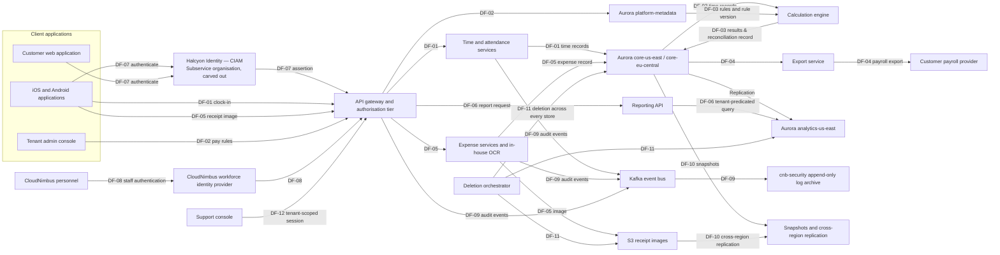

# 02.04 — Software and Data Flows

| Field | Value |
|---|---|
| Document ID | `CNB-TRUST-2026-204` |
| Version | 1.0 |
| Date | 2026-08-11 |
| Owner | Junia Okonkwo, Director of Engineering (Platform) |
| Approver | Nathan Oyelaran, Co-founder and Chief Technology Officer |
| Classification | Confidential — Trust &amp; Assurance Programme // Illustrative Portfolio Sample |

---

## 1. Purpose

This document describes the software component of the system under DC3 and the principal data flows that
connect it. It exists because a list of services is not a description: a reader who knows that CloudNimbus
runs 63 microservices knows almost nothing, and a reader who knows how a clock-in becomes a payroll export
knows most of what matters about where the risk is.

The twelve flows DF-01 to DF-12 are the flows that carry customer or personal data, or that carry the
evidence that the platform is behaving. They are not every request path in the platform; they are the paths
whose failure would breach a service commitment or expose personal data, which is the criterion by which
the register was built.

## 2. The software component

**63 microservices** run on the three in-system EKS clusters, deployed identically to all three production
regions. They fall into the following domains. Per-service allocation, ownership and language runtime are
held in the software inventory in `trackers/`; this table is the shape of the estate, not a substitute for
it.

| Domain | What the services in it do | Principal data handled |
|---|---|---|
| Identity and access | Session establishment from the CIAM assertion, tenant-scoped role evaluation, API authorisation, token issuance | Authentication metadata, role assignments |
| Time and attendance | Clock-in and clock-out capture, break handling, cost-centre transfer, validation of records against tenant rules | Time records, geolocation where enabled |
| Scheduling | Shift publication, assignment, acceptance, coverage and exception surfacing | Shift assignments, employee identifiers |
| Absence and leave | Absence recording against the controlled leave-type list, entitlement and accrual maintenance | Absence and leave records |
| Expense | Receipt intake, in-house optical character recognition, field extraction, policy evaluation, approval routing | Expense records, receipt images |
| Calculation engine | Derivation of overtime, differentials, accrual balances and reimbursement amounts from configured rules; production of the reconciliation record | Time records, pay rules, calculation output |
| Integration and export | Payroll export construction and delivery, inbound HR system-of-record synchronisation, the public REST API | Employment terms, calculation output, payroll routing tokens |
| Reporting and analytics | Tenant-scoped aggregate reporting from the analytics replica | Aggregated compensation and attendance data |
| Platform services | Notification, file handling, feature flagging, tenant configuration, scheduled job orchestration including retention deletion | Tenant configuration, notification addresses |
| Audit and telemetry | Security-relevant event emission, log shipping, service telemetry | Audit records, authentication metadata |
| Support and administration | The Customer Success support console and the tenant lifecycle tooling including the deletion orchestrator | All tenant data under a scoped session |

Four client applications consume these services: the **customer web application** used by employees, the
**tenant administration console** used by the employer's HR and operations administrators, the **iOS
application** and the **Android application**. The mobile applications are the only clients that capture
geolocation, and they capture it only where the employer has enabled it — a distinction 02.07 develops,
because it is the one that determines how far the Privacy category's direct-collection argument reaches.

A fifth consumer is not a client application at all: the **public REST API**, used by customers'
integration teams and by their payroll providers. It is inside the system, it authenticates through the
same gateway, and it is the path by which a customer can do at scale anything the console can do one record
at a time. **CUEC-11** in 02.11 is the disclosure that customers must configure and test their own
integration endpoints and credentials.

## 3. Principal data flows DF-01 to DF-12

| ID | Flow | Personal data | Crosses a subservice organisation |
|---|---|---|---|
| DF-01 | Clock-in from the mobile app to the time service and the core database | Yes | Yes — Halcyon Identity authenticates |
| DF-02 | Employer administrator configures pay rules through the admin console into `platform-metadata` | No | No |
| DF-03 | Nightly calculation run: rules and time records into the calculation engine, results and a reconciliation record back to the core database | Yes | No |
| DF-04 | Payroll export from the export service to the customer's payroll provider | Yes | No |
| DF-05 | Expense capture: receipt image to S3, in-house OCR, expense service | Yes | Yes — Halcyon Identity authenticates |
| DF-06 | Reporting query from the reporting API to the analytics replica | Yes | No |
| DF-07 | End-user authentication through the CIAM platform to the API gateway | Yes | Yes — Halcyon Identity |
| DF-08 | CloudNimbus staff authentication through the workforce identity provider into production | No | No |
| DF-09 | Audit and security log shipping from every service through Kafka to the `cnb-security` archive | Yes | No |
| DF-10 | Backup: Aurora automated snapshots and S3 cross-region replication | Yes | No |
| DF-11 | Customer offboarding: deletion orchestrator across every store, then a completion certificate | Yes | No |
| DF-12 | Customer Success support access through the support console, scoped to one tenant | Yes | No |

Read down the third column: **ten of the twelve flows carry personal data**. Only two do not — DF-02, in
which an administrator configures pay rules that are tenant configuration rather than anything about a
person, and DF-08, in which CloudNimbus staff authenticate into production through the workforce identity
provider rather than through the customer-facing CIAM platform. Every other flow touches an individual's
records, including the ones a security-minded reader tends to think of as infrastructure: DF-09 carries
authentication metadata, which is personal data category PD-12, and DF-10 carries whatever the primary
stores held at the moment the snapshot was taken.

Read down the fourth column: **nine of the twelve flows have no third party performing a step inside them,
and three cross a subservice organisation** — DF-01, DF-05 and DF-07, all three at Halcyon Identity, which
authenticates every end user. That concentration is the whole of the case for reclassifying Halcyon as a
subservice organisation rather than an ordinary vendor, argued in 02.10 as **ADR-0008** and **DEC-203**.

The fourth column needs one clarification, because a careful reader will otherwise think it wrong. **Every
flow in the register runs on AWS**, and AWS is itself a carved-out subservice organisation. The column
records where a subservice organisation **performs a step within the flow**, not where one hosts it. Read
the other way — as "does a subservice organisation's control matter to this flow?" — the answer for all
twelve is yes, which is exactly why 02.10 states eleven complementary subservice organisation controls for
AWS alongside three for Halcyon Identity.

Two observations follow that are easy to miss and expensive to miss.

**Personal data is not confined to the flows that look like it.** A programme that classifies its flows by
inspection will mark DF-01, DF-04, DF-05 and DF-12 as personal-data flows and treat logging and backup as
plumbing. That is how retention commitments come to be written for the transactional stores and quietly
broken in the archive. RT-05 and RT-07 in 02.07 exist because DF-09 and DF-10 were classified honestly.

**DF-09 is also where the residency commitment is most easily broken, and the register says how it is
not.** The flow ships audit and security events from every service, in all three production accounts,
through Kafka into the `cnb-security` archive. Those events carry **PD-12**, authentication metadata, and
**RT-05** pseudonymises them only when they pass the 13-month boundary into the archive — so for thirteen
months the records are identifiable. Read carelessly, that is a flow which takes EU end users' personal
data out of `eu-central-1` and into a security account, and it would sit directly across **SC-04**,
**SR-02** and obligation **O8**, which commit EU-residency customers' personal data to rest in
`eu-central-1`, and across the refusal in 02.03 §4 to replicate EU data to a US region for recovery.

It does not, because **the archive is region-partitioned** and DF-09 is a region-partitioned flow.
Events originating in `cnb-prod-eu-central-1` land in an **EU archive bucket in `eu-central-1`** under
**EU-scoped keys**, and remain there for both the queryable period and the seven-year archive period.
**Only pseudonymised or non-personal telemetry crosses a region boundary.** The separate-account property
that SR-09 requires and the same-region property that SR-02 requires are independent of one another, and
DF-09 satisfies both: the trust domain is separated by account, the residency is preserved by partition.

**DF-10 carries the same qualification and it is stated here so that the two flows are read together.** The
cross-region replication in DF-10 is the `us-east-1` to `us-west-2` path; **EU tenants' snapshots and
objects are not replicated out of `eu-central-1`**, which is why 02.03 §4 records the loss of that region
as an accepted residual rather than a recovered one, and why 02.07 §6.2 states that backups are held in the
same residency region as their source data under SR-02.

Both qualifications are the assumption **AS-09** carried out of Phase 01 — that EU-resident personal data
does not leave `eu-central-1` in backups or logs — attached to the two flows that would disprove it first.
02.03 §3.1 sets out the architecture behind them. AS-09 remains unverified at this phase's vantage and is
scheduled for test in Phase 07; what Phase 02 contributes is to say which flows it is load-bearing on.

**A flow crossing a subservice organisation does not stop being CloudNimbus's flow.** Halcyon authenticates
the user in DF-07; CloudNimbus still has to decide what to do with the assertion, how long the session
lives, and what the session is authorised to reach. The carve-out excludes Halcyon's controls from the
description. It does not excuse CloudNimbus's.

## 4. Principal flow diagram

## 5. DF-06 — the flow the tenant isolation question lives on

Every flow in the register is subject to **SR-01**: multi-tenant isolation enforced at the data layer on
every access path. Eleven of the twelve are variations on the same shape — a request arrives carrying an
authenticated identity bound to exactly one tenant, and the service reads or writes records belonging to
that tenant. The predicate that separates tenants is doing straightforward work, because the query it
constrains is itself straightforward.

**DF-06 is not that shape.** The reporting API exists to answer questions across a population rather than
about a record: how many hours a department worked, what a cost centre's overtime looks like against last
quarter, which locations are running above plan. It serves those questions from `analytics-us-east`, the
read replica described in 02.03, and it does so by composing filters supplied by the caller with the
mandatory tenant predicate imposed by the row-level security policy on the underlying tables. The caller
chooses dimensions, ranges, groupings and nested conditions; the platform is responsible for ensuring that
whatever the caller composes, the tenant predicate survives the composition and is applied to every table
the resulting plan touches.

That is a materially harder property to guarantee than "the service filters by tenant", and it is harder in
a way that scales badly: the surface is the space of queries the API will accept, not the set of endpoints
it exposes. It is also the flow whose failure would be worst. An isolation failure on DF-01 exposes one
person's clock-in. An isolation failure on DF-06 exposes an aggregate — and an aggregate over another
tenant's compensation data is a disclosure about that employer's whole workforce in a single response.

**This is exactly what AS-02 assumes and what SR-01 requires.** Phase 01 recorded **AS-02** — that
row-level security is uniformly enforced across every data access path — in the assumption log, with
Junia Okonkwo as owner, status **unverified**, and the disproving observation stated as "any query path
that returns another tenant's data, however aggregated". Phase 01 also recorded the reason for writing it
down: an assumption of this weight is not something to carry into a six-month observation window on the
strength of a belief.

Phase 02's contribution is to say **where** the assumption is load-bearing, which is here, and to make it
testable by attaching it to a stated system requirement rather than to a conviction. What Phase 02 does
**not** do is assert that the property holds. Multi-tenancy isolation testing by Ironwood Security Labs is
scheduled to begin on **2026-05-04**, five weeks after this phase's vantage of 2026-03-31. This document has no result to report,
takes no comfort from the absence of one, and does not describe the predicate as verified. An assumption
that has been located and made testable is in a better position than an assumption that has not. It is not
yet in the position of being known.

## 6. What the register deliberately does not include

DF-01 to DF-12 are the **principal** flows: those that carry customer or personal data across a boundary
that matters, or that carry the evidence the platform is behaving. Three categories of movement are
deliberately outside the register, and saying so is better than letting a reader discover it.

**Ordinary service-to-service calls inside a cluster.** The 63 microservices call one another constantly, and
enumerating those calls would produce a call graph rather than a register — a document nobody maintains
past the first quarter. The register records instead every point at which data enters a store, leaves the
platform, or crosses into a different trust domain, which is where a control can be placed and a
commitment broken.

**Egress to vendors that receive operational data rather than perform a control.** Service telemetry
reaches the observability platform; notifications and documents reach the transactional delivery provider.
Both are sub-processors, both are recorded in the sub-processor register, and neither performs a control
that any trust services criterion depends on — which is why 02.10 refuses to classify them as subservice
organisations. Their handling belongs to third-party assurance in Phase 07 rather than to the description
of the system's principal flows.

**Flows that exist only in non-production.** Synthetic data moving through `cnb-staging` and `cnb-dev` is
outside the register for the same reason those accounts are outside the system, and on the same conditional
footing: its completeness is only as good as **SR-12**.

The risk in all three exclusions is identical and worth naming. Each is a judgement that something is not
principal, and a judgement of that kind ages. A vendor that starts by receiving telemetry and later
receives customer records has changed category without anybody deciding to change it, which is why the
maintenance trigger below is a design decision rather than a calendar date.

## 7. How the register is maintained

The flow register is not a diagram exercise repeated annually. A new flow is created by a design decision,
so the trigger is the design decision: any change that introduces a new external destination for customer
data, a new store, a new client, or a new path into an existing store requires the register to be updated
before the change is promoted, and the promotion pipeline that **SR-11** describes is where that
requirement is enforced. Junia Okonkwo owns the register; Devon Ashby owns the data lifecycle attributes
attached to each flow; Rahul Bhargava reconciles it against the asset inventory in 02.06 each quarter.

The reconciliation is the part that finds errors. A store that appears in the asset inventory and in no
flow is either unused or undocumented, and both answers are worth knowing.

## Cross-References

| Document | Relationship |
|---|---|
| [02.02 Service Description and System Components](02.02-service-description-and-system-components.md) | States the software component populations detailed here |
| [02.03 Infrastructure and Cloud Architecture](02.03-infrastructure-and-cloud-architecture.md) | The accounts, clusters and stores these flows traverse |
| [02.06 Information Asset Inventory](02.06-information-asset-inventory.md) | The asset populations reconciled against this register quarterly |
| [02.07 Personal Information Inventory and Data Subjects](02.07-personal-information-inventory-and-data-subjects.md) | The personal data categories carried by the ten personal-data flows |
| [02.10 Subservice Organisations and the Carve-Out](02.10-subservice-organisations-and-carve-out.md) | Halcyon Identity, which sits on DF-01, DF-05 and DF-07 |
| [02.12 Principal Service Commitments and System Requirements](02.12-principal-service-commitments-and-system-requirements.md) | SR-01, the requirement behind AS-02, and SR-11 |

← [02.03 Infrastructure and Cloud Architecture](02.03-infrastructure-and-cloud-architecture.md) · [Phase 02 README](02.00-README.md) · [02.05 People, Procedures and the Organisational Boundary](02.05-people-procedures-and-organisational-boundary.md) →
