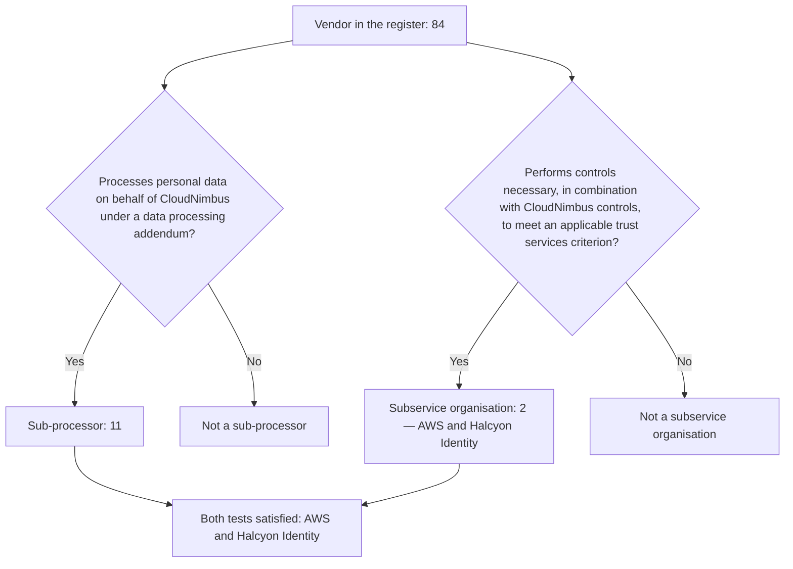

# 02.10 — Subservice Organisations and the Carve-Out

| Field | Value |
|---|---|
| Document ID | `CNB-TRUST-2026-210` |
| Version | 1.0 |
| Date | 2026-08-11 |
| Owner | Rahul Bhargava, Compliance Manager |
| Approver | Marisol Vega, Chief Financial Officer |
| Classification | Confidential — Trust &amp; Assurance Programme // Illustrative Portfolio Sample |

---

## 1. What DC7 requires

**DC section 200** requires the description of the system to disclose, under **DC7**, the **subservice
organisations** used, **the method used** to present them — carve-out or inclusive — and, where the
carve-out method is used, the **complementary subservice organisation controls** that CloudNimbus assumes
those parties perform in order for the applicable trust services criteria to be met.

Three obligations, and each of them is a place a description goes wrong. Naming the wrong parties inflates
the description. Naming the right parties and omitting the method leaves the reader unable to tell whether
the controls were tested. Naming the parties and the method and then writing vague complementary controls
produces a description that discharges DC7 in form and tells nobody anything.

This document performs the classification, states the method, and states what CloudNimbus assumes the two
subservice organisations do. It also records, without softening, that CloudNimbus got the classification
wrong at the start of this phase in exactly the way its predecessor auditor told it it would.

## 2. The test, and the two tests it is not

A vendor is a subservice organisation **only where it performs controls that are necessary, in combination
with CloudNimbus's own controls, for the applicable trust services criteria to be met.**

That is the whole test. Two plausible substitutes are not the test and are the reason most registers are
wrong.

**Access to data is not the test.** A vendor may hold, transmit or process customer personal data and
perform no control the criteria depend on. Nine of CloudNimbus's eleven sub-processors are in exactly that
position.

**Criticality to the business is not the test.** A vendor whose failure would stop the company trading —
payroll software, the CRM, the code hosting platform — is critical in the ordinary sense and may still
perform no control any criterion rests on. Criticality drives continuity planning; it does not drive DC7.

The two questions are **independent**, which is why they are drawn as two branches rather than as a sort.
A vendor may satisfy neither, either, or both.

## 3. The two subservice organisations

| ID | Subservice organisation | Service | Method | CSOCs |
|---|---|---|---|---|
| SUB-01 | Amazon Web Services | Infrastructure and platform services across three regions | Carve-out | 11 |
| SUB-02 | Halcyon Identity, Inc. | Customer identity and access management authenticating end users | Carve-out | 3 |

**AWS** satisfies the test because CloudNimbus runs entirely on it. The physical and environmental controls
the Security criteria rely on, and the infrastructure availability the A1 series relies on, are AWS's
controls. There is no CloudNimbus control that substitutes for a data centre's access control, and no
version of the description in which the criteria are met without AWS performing something.

**Halcyon Identity** satisfies the test because it authenticates every end user of the platform. CC6.1 and
CC6.2 concern logical access — the identification and authentication of users and the authorisation of
access. Where another organisation performs the authentication, those criteria cannot be met on the
strength of CloudNimbus's controls alone, whatever CloudNimbus does downstream of the assertion it receives.

## 4. Halcyon Identity was classified as an ordinary vendor, and that is ML-3 repeating

**When Phase 02 began, Halcyon Identity was recorded in the vendor register as an ordinary vendor.** It was
reclassified on 2026-03-03 (**DEC-203**, **ADR-0008**), when the test set out in section 2 was applied to
the whole register as a documented test for the first time.

Two matters of sequence have to be settled before anything else, because a reader who reconstructs the
dates without them will conclude that one of the two phases is wrong about its own record.

**The method was settled before the second party was identified, and it did not have to be retaken.**
**DEC-108**, taken on 2026-02-25, settled the *method*: use the carve-out method rather than the inclusive
method for subservice organisations. On that date AWS was the only identified subservice organisation, and
the decision was about how any subservice organisation would be presented, not about how many there were.
When the classification test was applied to the register on 2026-03-03 and identified Halcyon Identity as a
second, the method decided in February applied to it without amendment. A determination about presentation
method is general in exactly that way: it is a choice between two ways of describing a class of party, and
adding a member to the class does not reopen it. Had DEC-108 been a decision about two named parties
instead, the arrival of a third would have required a fresh decision every time, which is neither how DC7
works nor how the decision was framed.

That is also why Phase 01's documents name both organisations. Phase 01 and Phase 02 share a vantage of
**2026-03-31**, which is four weeks after the reclassification, and 01.09 §5 describes the position as at
that vantage — by which date there were two. The Phase 01 decision log records DEC-108 at the date the
method was decided; the Phase 01 narrative records the population as it stood when the phase was written.
Both statements are accurate, and they are not the same statement.

**The register had been reviewed before, and the earlier review strengthens the argument rather than
softening it.** ADR-0008 and GOV-06 record that Halcyon Identity's classification as an ordinary vendor had
already survived one review conducted under the closure plan for ML-3. That earlier review confirmed the
labels the register carried; it did not apply the definition of a subservice organisation as a documented
test with a stated question and a recorded answer against each vendor. The distinction between those two
activities is the whole of the ML-3 argument. A review that asks "is this register current and complete?"
returns a different answer from a review that asks, of each vendor in turn, "does this party perform a
control that an applicable trust services criterion depends on?" The first question was asked, and the
register passed it. The second had not been asked in that form until 2026-03-03, and the moment it was, the
answer for the party authenticating 1.24 million people was not a close one.

This document is not going to present that as diligence. The programme was chartered on 2026-01-19, and one
of the three matters it was chartered to fix was **ML-3** in the 2025 Type I management letter: *the vendor
register did not distinguish subservice organisations from ordinary vendors.* Six weeks later, the register
still did not distinguish them, and the party it failed to distinguish was the one that authenticates 1.24
million people. The finding did not recur; it had never stopped. A remediation plan with an owner and a
target date existed the whole time, and the register was wrong the whole time, which is the ordinary
relationship between a remediation plan and the thing it is meant to remediate until somebody actually does
the work.

The mechanism is the one 01.09 §5 anticipated. The old register carried a **single classification column**.
Halcyon Identity processes identity records for end users under a data processing addendum, so it was a
sub-processor; the person completing the column recorded the label that was true and moved on. A single
field cannot represent a vendor that is two things at once, and it does not fail loudly — it produces a
register that looks complete and is silently wrong about its most important entries. The remediation is
structural: **independent flags rather than one category field**, one documented test per flag, and an
owner competent to apply each test.

Two things follow that are worth stating for the record. The first is that had this not been caught in
Phase 02, it would have been caught by the service auditor at a much worse moment — a subservice
organisation absent from a description is a description-criteria problem before it is a control problem,
and it is discovered when someone asks how CC6.1 is met. The second is that catching it in March means the
complementary subservice organisation controls for Halcyon can be drafted, agreed and communicated before
the observation window opens on 2026-07-01, rather than asserted retrospectively.

## 5. Four vendors were proposed as subservice organisations and refused

The instinct that follows a finding like ML-3 is to over-correct, and it duly appeared. Four vendors were
proposed for classification as subservice organisations and all four were refused.

| Proposed | Why it was refused |
|---|---|
| **Lumenscope** — observability platform | Receives telemetry and logs, including some carrying personal data, and is a sub-processor. It performs no control the criteria depend on: CloudNimbus's own monitoring, alerting and incident response are CloudNimbus's controls, operated by CloudNimbus's people, whatever tool they look at |
| **Vantage Post** — transactional email and document delivery | Delivers notifications and documents to end users and is a sub-processor. Delivery is a service, not a control; no criterion is met by Vantage Post performing something |
| Code hosting and CI provider | Hosts repositories and runs pipeline jobs. The change-management controls the CC8 series concerns — peer review, approval, promotion — are CloudNimbus's controls configured and enforced in that platform, not controls the provider performs on CloudNimbus's behalf |
| Customer support ticketing platform | Holds support interaction records (PD-11) and is a sub-processor. Support is a procedure inside the system, operated by CloudNimbus staff; the platform is where it is recorded |

Each of the four has data access. Each is a sub-processor with the disclosure and notice obligations that
follow under O5. None performs a control any applicable criterion depends on.

The argument for including them was framed as caution, and **calling a vendor a subservice organisation is
not caution — it is a description defect.** It puts controls into the carve-out that the reader is then
entitled to look for, in an assurance report that in most cases does not exist, and it invites a question
CloudNimbus cannot answer: which control, precisely, does this party perform that a criterion depends on?
An inflated DC7 disclosure makes the description less useful, not more conservative, and it does so in the
direction that is hardest to walk back once the description has been issued.

The exposure runs in both directions, and this phase produced one instance of each: an omission that
mattered (Halcyon) and four inclusions that would have. That symmetry is the argument for a documented test
applied consistently rather than for a disposition towards caution or towards economy.

## 6. The vendor arithmetic, correctly stated

The three classifications are **overlapping sets over one population**, not a partition of it.

| Population | Count | Relationship |
|---|---|---|
| Vendors in the register | **84** | The whole population |
| Sub-processors under a data processing addendum | **11** | A subset of the 84 |
| — of which subservice organisations | **2** | AWS and Halcyon Identity; inside the 11, not alongside them |
| Ordinary vendors — neither sub-processor nor subservice organisation | **73** | The remainder |

**11 + 73 = 84.** Both subservice organisations sit inside the eleven. AWS hosts personal data for the 41
EU-residency customers in `eu-central-1` under the residency addendum, and Halcyon Identity holds identity
records for 1.24 million end users; both therefore satisfy the sub-processor test as well as the
subservice-organisation test, and both flags are set. **Nine of the eleven sub-processors are not
subservice organisations**, which is the clearest available demonstration that the two tests are
independent.

Any presentation of 84 as a three-way partition is wrong, and it is wrong in the specific way ML-3
recorded.

## 7. Carve-out, and what the alternative would have required

Both subservice organisations are presented using the **carve-out method**. The method was decided as
**DEC-108** on 2026-02-25 — use the carve-out method rather than the inclusive method for subservice
organisations — and is recorded in Phase 01 and argued here because scoping and foundation ran concurrently
through the first quarter. As section 4 sets out, the decision was about method rather than about a
population, which is why the identification of Halcyon Identity a week later added a party to the carve-out
without requiring the method to be decided again.

Under the carve-out method the subservice organisation's controls are **excluded from the description** and
are **not tested by the service auditor**, and the description states the complementary subservice
organisation controls CloudNimbus assumes are performed. Under the inclusive method those controls are
included in the description and tested, which requires the subservice organisation to provide its own
written assertion, to grant the service auditor access, and to be examined alongside CloudNimbus.

The inclusive method was not available in any practical sense. Neither AWS nor a CIAM provider of Halcyon
Identity's size will assert into a customer's SOC 2 description or admit that customer's auditor to test
its controls, and CloudNimbus has no leverage that would change that. The carve-out is the honest
consequence of the relationship rather than a preference.

What the carve-out costs the reader has to be said plainly: **the report will contain no evidence about
whether AWS or Halcyon Identity performed the controls attributed to them.** A reader who needs that
assurance obtains it from those organisations' own reports, and the description says so.

## 8. Complementary subservice organisation controls — 11 + 3 = 14

CSOCs are **assumptions**, stated so that the reader can see what the description depends on and does not
cover. **11 for AWS and 3 for Halcyon Identity, 11 + 3 = 14.**

DC7 requires the description to identify the complementary subservice organisation controls **and the
applicable trust services criteria they relate to**, so the table carries a **Criteria** column. Each entry
in that column names the criterion the control is necessary for, and is the same claim being made fourteen
times: without this control at the subservice organisation, and in combination with CloudNimbus's own
controls, that criterion is not met.

| ID | Party | Complementary subservice organisation control assumed | Criteria |
|---|---|---|---|
| CSOC-01 | AWS | Physical and environmental protections at the facilities supporting the three regions in use | CC6.4, A1.2 |
| CSOC-02 | AWS | Restriction and authorisation of physical access to infrastructure hosting customer workloads | CC6.4 |
| CSOC-03 | AWS | Secure decommissioning and sanitisation of storage media | CC6.5, C1.2 |
| CSOC-04 | AWS | Logical isolation between customers of the underlying virtualisation and managed service planes | CC6.1, C1.1 |
| CSOC-05 | AWS | Redundancy of power, cooling and network at region and availability-zone level, supporting the availability commitment | A1.1, A1.2 |
| CSOC-06 | AWS | Protection of key material within the key management service such that key material cannot be extracted | CC6.1, C1.1 |
| CSOC-07 | AWS | Patching, maintenance and vulnerability remediation of the infrastructure AWS itself operates beneath the managed services — hosts, hypervisor, and the control-plane software of EKS and Aurora — and publication of the engine, Kubernetes and patch versions from which CloudNimbus selects | CC6.6, CC7.1 |
| CSOC-08 | AWS | Durability and integrity of stored objects, snapshots and configured cross-region replication | A1.2, PI1.5 |
| CSOC-09 | AWS | Restriction of AWS personnel access to customer environments and content | CC6.1, C1.1 |
| CSOC-10 | AWS | Integrity and availability of control-plane APIs and of identity and access management authorisation decisions | CC6.1, CC6.3 |
| CSOC-11 | AWS | Notification to CloudNimbus of security incidents affecting the services in use | CC7.2, CC7.3 |
| CSOC-12 | Halcyon Identity | Authentication of end users in accordance with the authentication and multi-factor policy CloudNimbus configures | CC6.1, CC6.6 |
| CSOC-13 | Halcyon Identity | Protection of credential and identity records at rest and in transit, including credential storage; generation and delivery of authentication event records to CloudNimbus; and notification of incidents affecting the identity service | CC6.1, C1.1, CC7.2 |
| CSOC-14 | Halcyon Identity | Availability, capacity and continuity of the identity service, including recovery from disruption, at a level supporting the authentication of every end user on which SR-04 and the availability commitment depend | A1.1, A1.2, A1.3 |

**The qualifying property is necessity, and nothing else.** A control belongs on this list because the
control performed at the subservice organisation is necessary, in combination with CloudNimbus's own
controls, for an applicable trust services criterion to be met. That is the same test section 2 applies to
the party, applied here to the control, and it has to be — a description that used one test to identify the
organisation and a different test to enumerate its controls would be internally inconsistent in a way DC7
does not tolerate.

An earlier draft said instead that the qualifying property was that CloudNimbus cannot verify the control by
performing a control of its own. That is not the DC7 test and it contradicts section 2. It is also
under-inclusive and over-inclusive at once: there are things CloudNimbus cannot independently verify that
no criterion depends on, and things a criterion plainly depends on that CloudNimbus could partially
corroborate. The unverifiability point is worth keeping as an **observation about consequence rather than a
test of membership**: because these controls sit inside another organisation they are *disclosed* rather
than tested, and no evidence about their operation appears anywhere in the report. That is a statement
about what the reader will not find, not the reason the entries are on the list.

**CSOC-07 was redrawn for a specific reason and the reason is worth stating**, because the original wording
straddled the shared responsibility line and would have handed a reader the wrong picture of who does what.
As first drafted it claimed AWS performed "patching, maintenance and vulnerability management of managed
service planes, including the EKS control plane and Aurora" — which is not true as written. Selecting a
Kubernetes version and an Aurora engine version, deciding whether to accept a minor-version upgrade, and
setting the maintenance window in which AWS may apply one are **CloudNimbus's actions**, taken by
CloudNimbus's people in CloudNimbus's accounts. A CSOC that absorbed them would have carved out a control
CloudNimbus operates, which is the mirror image of the inflation error section 5 refuses, and it would have
placed a genuine CloudNimbus obligation in a part of the description that is expressly not tested. The
entry now covers only the plane AWS operates; **02.03 §5 states the version-selection and patch-acceptance
responsibility as CloudNimbus's**, where it belongs.

**Halcyon Identity's three entries were re-scoped so that one of them is about availability**, which is the
CSOC a careful reader looks for hardest and which the first draft did not have. **SR-04** requires every end
user to be authenticated through the CIAM platform, and **SC-01** commits to 99.9% monthly availability, outside announced maintenance, of
the platform. Those two statements together mean that if Halcyon Identity is unavailable, no end user can
authenticate, the platform is unavailable to the population that uses it, and the **A1** criteria cannot be
met by CloudNimbus's controls alone however healthy every CloudNimbus service is. A carve-out that
disclosed Halcyon's authentication behaviour and its credential handling but said nothing about whether the
service is there would have omitted the dependency with the largest and most obvious availability
consequence in the description. The 11 + 3 split is unchanged: the authentication event records and the
incident notification that previously stood as CSOC-14 are now carried in CSOC-13, alongside the credential
protection they belong with, and CSOC-14 carries availability and continuity.

## 9. The AWS point, stated once and stated properly

AWS publishes assurance reports covering AWS's controls. Those reports say **nothing whatever** about
whether CloudNimbus configured a bucket policy correctly, scoped an IAM role appropriately, enabled
encryption on a snapshot, or restricted a security group.

A misconfigured S3 bucket is **CloudNimbus's control failure in an environment AWS operated correctly**,
and no amount of AWS assurance touches it. The shared responsibility model is not a slogan; it is a
statement about which party's report answers which question. A reader who treats an AWS report as covering
CloudNimbus's use of AWS has misread both documents — and a service organisation that encourages that
reading, by citing its cloud provider's certifications in answer to questions about its own configuration,
is trading on the confusion rather than correcting it. This programme corrects it.

## Cross-References

| Document | Relationship |
|---|---|
| [02.01 Scope Methodology and the Two Boundaries](02.01-scope-methodology-and-two-boundaries.md) | Why these two parties are inside the SOC 2 system and outside the ISMS |
| [02.03 Infrastructure and Cloud Architecture](02.03-infrastructure-and-cloud-architecture.md) | The AWS estate the carve-out sits beneath |
| [02.04 Software and Data Flows](02.04-software-and-data-flows.md) | DF-01, DF-05 and DF-07, the three flows crossing a subservice organisation |
| [02.08 ISMS Scope Statement — Clause 4.3](02.08-isms-scope-statement-clause-4-3.md) | The same interfaces determined under clause 4.3 c) |
| [02.11 Complementary User Entity Controls](02.11-complementary-user-entity-controls.md) | The other set of complementary controls, disclosed under DC6 |
| [01.04 Prior Type I Baseline and Carried Matters](../01-program-foundation-dual-framework-governance/01.04-prior-type-i-baseline-and-carried-matters.md) | ML-3, the finding this section reports repeating |
| [01.09 External Parties and Independence](../01-program-foundation-dual-framework-governance/01.09-external-parties-and-independence.md) | EP-07 and EP-08; the vendor arithmetic and the three tests |
| `adr/ADR-0008` | Halcyon Identity reclassified as a subservice organisation |
| `logs/decision-log.md` | DEC-203 |

---

← [02.09 Interested Parties and Requirements — Clause 4.2](02.09-interested-parties-and-requirements-clause-4-2.md) · [Phase 02 README](02.00-README.md) · [02.11 Complementary User Entity Controls](02.11-complementary-user-entity-controls.md) →
