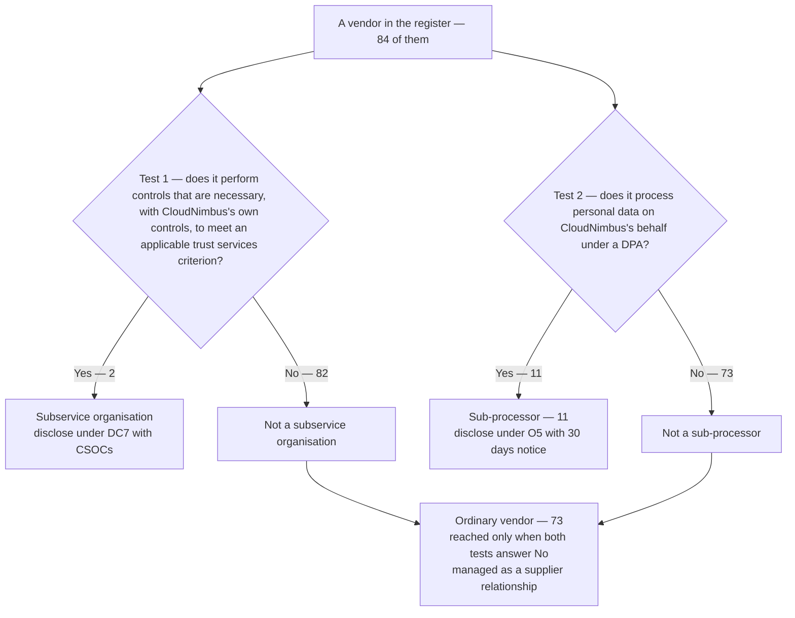

# Diagram — Is This Vendor a Subservice Organisation?

| Field | Value |
|---|---|
| Document ID | CNB-TRUST-2026-D08 |
| Version | 1.0 |
| Date | 2026-08-11 |
| Owner | Rahul Bhargava |
| Approver | Marisol Vega |
| Classification | Confidential — Trust &amp; Assurance Programme // Illustrative Portfolio Sample |

**The two tests are independent and are answered separately.** That is why the register is a set of
overlapping populations and not a partition: a vendor can be one, both or neither. Both subservice
organisations are also sub-processors, which is why 2 + 11 does not appear anywhere — the arithmetic that
holds is **11 + 73 = 84**, and "ordinary vendor" means a party that answered No to both.

Data access is not the test for DC7. Criticality to the business is not the test either. Treating the
classes as disjoint is the error ML-3 recorded in the 2025 Type I management letter.

Supplier relationships are managed under the supplier-relationship controls of Annex A — A.5.19 through
A.5.23. **Whether each of those controls is necessary is a Statement of Applicability determination and
belongs to Phase 03**; this diagram cites them, it does not determine them.

## Cross-References

| Document | Relationship |
|---|---|
| [02.10 Subservice Organisations and the Carve-Out](../02.10-subservice-organisations-and-carve-out.md) | The test and the four refusals |
| [templates/vendor-classification-template.md](../templates/vendor-classification-template.md) | The form the test is recorded on |
