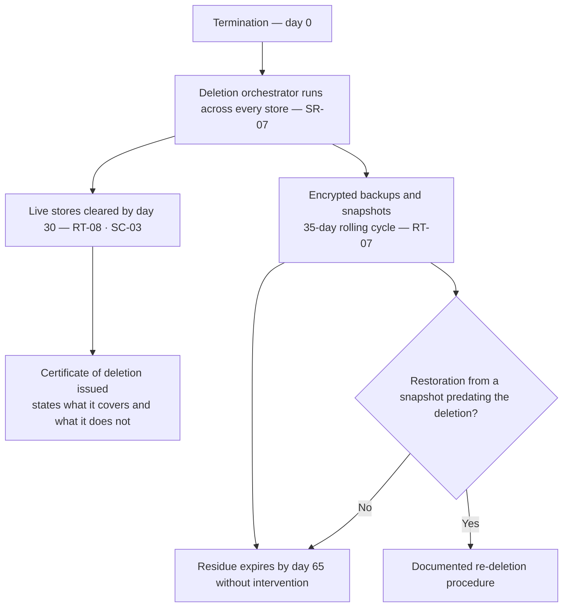

# Diagram — Deletion, Retention and the Backup Residue

| Field | Value |
|---|---|
| Document ID | CNB-TRUST-2026-D07 |
| Version | 1.0 |
| Date | 2026-08-11 |
| Owner | Devon Ashby |
| Approver | Tobias Lund |
| Classification | Confidential — Trust &amp; Assurance Programme // Illustrative Portfolio Sample |

**30 + 35 = 65.** A record cleared from the live stores on day 30 survives inside an encrypted backup until
day 65, and no amount of drafting makes that untrue. The certificate says what it covers, the keys are
region-scoped, access is restricted, the cycle expires the residue without anybody doing anything, and a
restoration triggers re-deletion. A deletion commitment that does not describe its own backup residue is a
commitment whose certificate is worth nothing.

## Cross-References

| Document | Relationship |
|---|---|
| [02.07 Personal Information Inventory and Data Subjects](../02.07-personal-information-inventory-and-data-subjects.md) | RT-01 to RT-08 |
| [02.12 Principal Service Commitments and System Requirements](../02.12-principal-service-commitments-and-system-requirements.md) | SC-03, SR-07, SR-08 |
