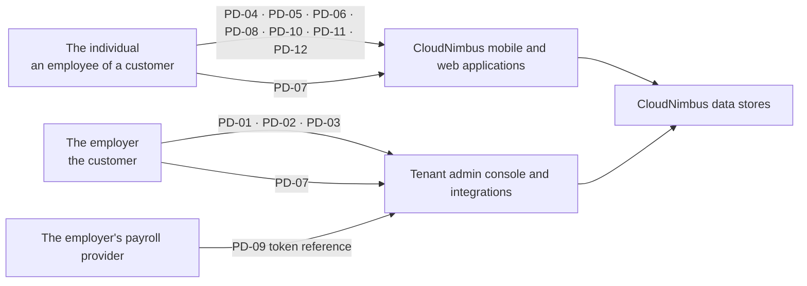

# Diagram — Personal Data Provenance

| Field | Value |
|---|---|
| Document ID | CNB-TRUST-2026-D06 |
| Version | 1.0 |
| Date | 2026-08-11 |
| Owner | Tobias Lund |
| Approver | Karim Haddad |
| Classification | Confidential — Trust &amp; Assurance Programme // Illustrative Portfolio Sample |

Seven categories arrive from the individual, four from the employer, one from both. That count is the
evidence behind keeping the Privacy category: a party you collect from directly is a party you owe
something to directly, and no contract between CloudNimbus and the employer changes who the data came from.

## Cross-References

| Document | Relationship |
|---|---|
| [02.07 Personal Information Inventory and Data Subjects](../02.07-personal-information-inventory-and-data-subjects.md) | PD-01 to PD-12 |
| `01-program-foundation-dual-framework-governance` | ADR-0002, the decision this count supports |
