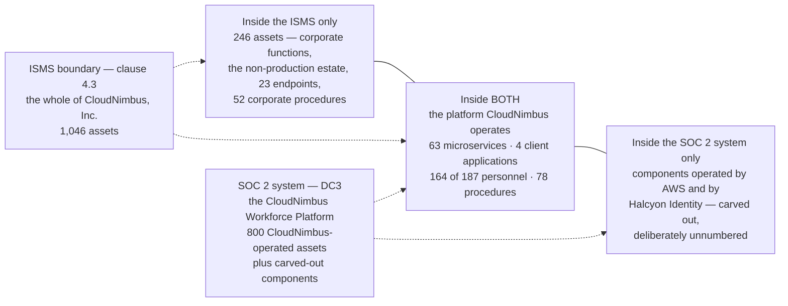

# Diagram — The Two Boundaries

| Field | Value |
|---|---|
| Document ID | CNB-TRUST-2026-D05 |
| Version | 1.0 |
| Date | 2026-08-11 |
| Owner | Karim Haddad |
| Approver | Nathan Oyelaran |
| Classification | Confidential — Trust &amp; Assurance Programme // Illustrative Portfolio Sample |

Read it as two overlapping sets rather than one box inside another, because that is the proposition the
phase exists to defend. The left block is inside the ISMS and outside the system. The right block is inside
the system and outside the ISMS: CloudNimbus cannot place AWS or Halcyon Identity inside a management
system it does not operate, and it cannot leave them outside a system description that DC3 defines by what
delivers the service. Only the middle is in both.

The left block is quantified at 246 and the right block is not quantified at all. That
asymmetry is deliberate and is argued at 02.06 §4: an asset register that counted a supplier's racks would
be a fiction, and a fiction in an inventory is worse than an omission because an omission is visible.

## Cross-References

| Document | Relationship |
|---|---|
| [02.01 Scope Methodology and the Two Boundaries](../02.01-scope-methodology-and-two-boundaries.md) | The argument this diagram summarises |
| [02.06 Information Asset Inventory](../02.06-information-asset-inventory.md) | Quantifies one direction and refuses to quantify the other |
| [02.10 Subservice Organisations and the Carve-Out](../02.10-subservice-organisations-and-carve-out.md) | SUB-01 and SUB-02 |
