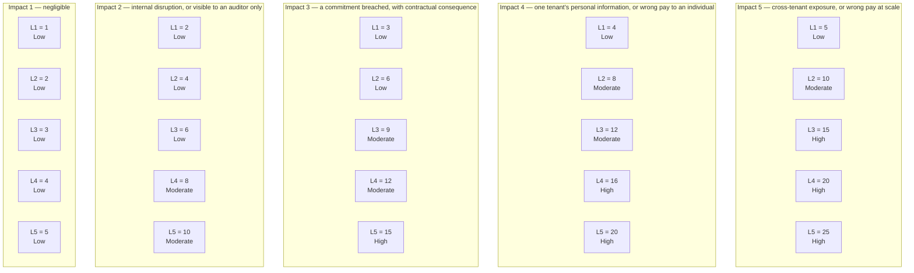

# 03.02 — Risk Criteria and Scoring Scale

| Field | Value |
|---|---|
| Document ID | `CNB-TRUST-2026-302` |
| Version | 1.0 |
| Date | 2026-08-11 |
| Owner | Karim Haddad, VP Security &amp; Trust |
| Approver | Marisol Vega, Chief Financial Officer |
| Classification | Confidential — Trust &amp; Assurance Programme // Illustrative Portfolio Sample |

---

## 1. Purpose

Clause 6.1.2 a) requires an organisation to establish and maintain information security risk criteria that
include **the risk acceptance criteria** and **criteria for performing information security risk
assessments**. Both must exist before the assessment they govern, because criteria written after the ratings
are known are not criteria, they are a rationalisation.

This document is those criteria. It fixes the scale, the bands, the acceptance thresholds, and the three
rules that govern how a rating is allowed to change over the life of the register. The rules are the part
that matters most, and they are the reason a re-rating anywhere in this portfolio can be checked by a reader
rather than taken on trust. It records **DEC-302**, **DEC-303**, **DEC-304** and **ADR-0012**.

## 2. The scale

Risk is rated as **likelihood (1–5) × impact (1–5)**, producing a score from 1 to 25, banded as
**High ≥ 15 · Moderate 8–12 · Low ≤ 6**.

| Likelihood | Meaning |
|---|---|
| 5 | Occurring now, or expected more than once a year |
| 4 | Expected at least once a year |
| 3 | Expected within the certification cycle — once in three years |
| 2 | Foreseeable but not expected within the cycle |
| 1 | **Not reasonably foreseeable.** Reserved, and used only where the scenario requires a combination of failures the environment does not make available |

| Impact | Meaning, on the dimension that matters here |
|---|---|
| 5 | Cross-tenant exposure of compensation data, or a wrong amount reaching pay at scale |
| 4 | Exposure of personal information for one tenant, or a wrong amount reaching an individual |
| 3 | A commitment in SC-01 to SC-10 breached, with contractual consequence |
| 2 | Internal disruption or a control failure visible to an auditor but not to a customer |
| 1 | Negligible |

Every anchor on the likelihood scale is a statement about frequency that somebody could be wrong about.
"Expected at least once a year" can be tested against what happened last year. "Likely" cannot. That is the
whole of the difference between a scale that produces comparable results under clause 6.1.2 b) and a scale
that produces a mood.

## 3. The impact dimension, and why it is not availability

The impact scale is the more opinionated of the two, because it declares what CloudNimbus considers bad.

For most SaaS companies the top of the impact scale is an outage. Here it is not. CloudNimbus's platform
derives what 1.24 million people are paid — overtime, differentials, accrual balances, reimbursement amounts
— and exports the result to customers' payroll providers. The two things that would do the most damage are
**a wrong amount reaching pay at scale** and **a cross-tenant disclosure of compensation data**, and both of
those are worse than being unavailable for an afternoon. An outage is visible, bounded, and recoverable by
doing the work later. A wrong paycheque is discovered by the person who received it, and a cross-tenant
disclosure cannot be undone at all.

That calibration has consequences a reader should notice rather than discover. **R-18** — an availability
incident breaching the 99.9% monthly commitment — carries impact **3**, because what it breaks is a
commitment in SC-01 to SC-10 with contractual consequence. **R-24** — geolocation retained or used beyond
the purpose the individual was told about — carries impact **4**, because it is personal information used
outside its notice. A register calibrated on downtime would have inverted those two, and it would have been
wrong about this business.

Impact 2 is worth its own sentence, because it is where most control failures actually land: **internal
disruption, or a control failure visible to an auditor but not to a customer**. That is the honest home for
things like documentation going stale or training completion slipping. They matter — they are exactly the
things a Type II examination samples and a Stage 2 audit tests — but they do not injure a customer, and a
scale that pretended otherwise would leave no headroom for the things that do.

## 4. The bands, and the gaps between them

Of the twenty-five cells, **six are High, seven are Moderate and twelve are Low**. The geometry is
deliberate: High is a small, expensive region of the grid that a rating has to earn by combining a serious
consequence with a real expectation of occurrence, and it is unreachable at all below impact 3.

Now the arithmetic property that makes the bands unambiguous, and it is a property of the scale rather than
a coincidence. **The products of two integers drawn from 1 to 5 are {1, 2, 3, 4, 5, 6, 8, 9, 10, 12, 15, 16,
20, 25} — fourteen distinct values.** The integers **7, 11, 13 and 14 cannot occur.** The band boundaries
sit at 6/8 and at 12/15, and both boundaries fall inside those gaps: there is no achievable score of 7 to
argue about at the Low/Moderate line, and none of 13 or 14 to argue about at the Moderate/High line.

The consequence is that **no rating in this register is ever ambiguous about its band**, and no reader has
to know a tie-breaking convention. The property that gap-placed thresholds actually buy is not freedom from
ambiguity — a gapless scale banded 1–5 / 6–14 / 15–25 states in terms that 5 is Low, and a reader who can
read the band definition is not confused by it. **What gap placement buys is insensitivity to an off-by-one
in the band definition itself.** On that gapless scale, writing the boundary as 1–5 or as 1–6, or as 15–25
or as 16–25, changes which entries are banded where: the definition has to be exactly right, and it has to
stay exactly right through every re-issue, every copy into a policy and every transcription into a
committee pack. Here it does not. Because no achievable product lies at 7, 11, 13 or 14, the Low/Moderate
line can be written as 6/8 or as 7/8, and the Moderate/High line as 12/15 or as 14/15, and **every entry in
the register lands in the same band either way**. The thresholds are robust to being mis-stated, which is
the failure that actually happens, and it costs nothing to place them there.

## 5. The three movement rules

A scale fixes what a rating means today. The movement rules fix what a *change* in a rating means, and they
are what keep a register honest between reviews. All three are recorded as **ADR-0012**, decided by Karim
Haddad on 2026-03-31.

### 5.1 A rating moves on likelihood, not impact, unless the consequence itself has changed

**DEC-304.** Treatment reduces likelihood. It very rarely reduces impact.

Consider what controls actually do. Branch protection makes an unreviewed change less likely to reach
production; it does not make an unreviewed change that reaches production any less damaging. Just-in-time
privileged elevation makes a compromised administrator account less likely; the compromised account, once it
exists, reaches exactly the same data. Detection is the interesting case, and it is still a likelihood
control in this scale: alerting on a silently failed deletion job does not change what happens when data is
kept past its rule, it changes how long the condition persists and therefore how often the full consequence
is realised.

Impact is a property of the consequence — of what data exists, how many people it concerns, and what
CloudNimbus has promised about it. It changes only when one of those changes. Removing a data field from an
export changes it. Renegotiating a commitment changes it. Shortening a retention period changes the exposed
population and can change it, which is why **ADR-0009**, cutting geolocation retention to thirteen months,
is a consequence-side decision rather than a control. Deploying a control does not.

The rule exists because the alternative is a specific and common failure: a programme under pressure to show
progress discovers that impact scores are softer than likelihood scores and starts trimming them. Nothing in
the environment has changed, but the register improves. **A programme that reduces impact scores to show
progress is reporting on its own optimism**, and the resulting trend line is a measure of how badly it
wanted a trend line. Freezing the impact dimension unless the consequence demonstrably changed means every
movement in this register is attributable to something that was done, which is also what makes the ratings
comparable across assessments as clause 6.1.2 b) requires.

### 5.2 Likelihood 1 is reserved for the not reasonably foreseeable

**DEC-303.** Likelihood 1 is not "we fixed it."

It is defined as a scenario requiring a combination of failures the environment does not make available, and
in this environment almost nothing qualifies. The loss of an entire AWS region is foreseeable — Phase 02's
clause 4.1 climate determination in **DEC-209** is one of the reasons it cannot be treated as unthinkable. A
disaster recovery exercise falling short of a four-hour objective in a real event is foreseeable to anyone
who has run one. An employee somewhere among 187 people clicking something over three years is foreseeable
to the point of near-certainty.

If 1 were available as a reward for good treatment, it would be claimed, and the claim would be almost
impossible to refute in the moment. Every treated risk would drift towards 1, the register would asymptote
to nothing, and it would report the diligence of the programme rather than the state of the environment.
Reserving 1 puts a hard floor under the likelihood scale at **2** for anything CloudNimbus can foresee, and
the register is explicit that this is what it has done rather than quietly rating everything at 2 and hoping
nobody asks why the bottom of the scale is empty.

The practical effect is stated plainly in 03.07, and it reaches further than the two entries usually quoted.
**R-19** and **R-20** — the two Moderate entries at the top of the impact scale, both at 2 × 5 = 10 —
**cannot move at all**, because the only remaining step on the dimension that is allowed to move is a step
into the reserved value, and neither consequence has changed. **For exactly the same reason, ten more
entries cannot move either**: R-24, already sitting on the floor at 2 × 4 = 8, and the nine Low entries
already at likelihood 2. **Twelve of the thirty-six are forecast not to move at all**, and 03.07 §5.1 names
them one by one. Reserving likelihood 1 is what produces that number; a scale that allowed 1 as a reward for
good treatment would have shown all twelve improving and would have been reporting the reservation it had
abandoned rather than the environment it was describing.

### 5.3 Eight is a floor

**DEC-304**, second limb. A 3 × 4 entry moving on likelihood alone reaches **2 × 4 = 8 and stops**. It
cannot reach Low without the consequence changing, and the consequence rarely changes.

This is not a defect in the arithmetic. It is the scale saying something true: an event whose consequence is
the exposure of one tenant's personal information, or a wrong amount reaching an individual, is not a Low
risk merely because it has become unlikely. Low means the organisation has stopped spending attention on it.
Nothing with an impact of 4 should have attention withdrawn from it, however good the controls are, because
the day the controls fail the consequence is undiminished.

The floor has a countable consequence in this register that is worth stating in advance. **Twelve of the
thirty-six baseline entries carry an impact of 4 or 5** — R-01, R-02, R-03, R-04, R-05, R-06, R-07, R-11,
R-12, R-19, R-20 and R-24 — and **not one of them can ever be rated Low** while its consequence stands. The
best available outcome for each is Moderate. Any forecast of this register that shows fewer than twelve
Moderate entries has broken its own rules, and 03.07's forecast is checked against exactly that constraint
before it is published.

## 6. Risk acceptance criteria

Clause 6.1.2 a) 1) requires acceptance criteria, and clause 6.1.3 f) requires risk owners to accept the
residual risks. Acceptance therefore has to name a person and a level of authority, not a threshold alone.

**The clause 6.1.3 f) acceptance is the risk owner's and is not delegable upwards.** Whatever the band, the
person named in the register's Owner column accepts the residual on that entry, because that is the person
the clause names and the person who would be asked to explain the failure. The table below adds a **second**
acceptance on top of the owner's, at a level that rises with the band. It does not substitute for the first.

| Band | Additional acceptance required, over and above the risk owner's | Reporting |
|---|---|---|
| Low (≤ 6) | The decision is recorded by the risk owner and **endorsed by the VP Security &amp; Trust** | Trust Committee, in the quarterly register review CAL-06 |
| Moderate (8–12) | **The VP Security &amp; Trust** accepts alongside the owner | Trust Committee monthly, Audit &amp; Risk Committee quarterly |
| High (≥ 15) | **The Chief Executive Officer**, with the reasoning minuted. A High residual may **not** be retained on the authority of the risk owner or of the VP Security &amp; Trust | Audit &amp; Risk Committee, with the reasoning minuted |

The High row is an **escalation, not a prohibition**, and the distinction is worth stating because the two
are routinely written as though they were the same thing. A criterion that says "not retainable at all" and
then sets out the conditions on which retention is permitted has said two incompatible things and will be
read as whichever suits the reader. What this criterion says is narrower and enforceable: **a High rating
requires treatment, and a residual that would still be High after treatment may be retained only by the
Chief Executive Officer, with the reasoning minuted at the Audit &amp; Risk Committee.** The authority exists,
it sits at one level and one level only, and **no entry in this register took that path** — the four
retentions in 03.07 are two Moderate at 10, one Moderate at 8 and one Low at 4.

One rider overrides the band: **any entry carrying impact 5 requires acceptance by the Chief Executive
Officer regardless of its band**, because the consequence limb is at maximum and the only reason the score
is not High is that the event is judged unlikely. That rider is why **R-19** and **R-20**, both rated
Moderate and both owned by **Wes Delacroix**, carry **Elise Fontaine's** acceptance as well as his, rather
than Karim Haddad's. **R-24**, owned by **Tobias Lund**, and **R-28**, owned by **Hannah Brill**, carry
**Karim Haddad's** acceptance and endorsement respectively alongside their owners'. 03.07 §3 sets out all
four with both signatures and their review dates.

Acceptance is reviewed at the management review under **CAL-15** and at each quarterly register review under
**CAL-06**. An acceptance with no review date is an abandonment.

## 7. What the criteria deliberately do not include

There is no monetary dimension. No annualised loss expectancy is calculated, no single loss expectancy is
estimated, and no fine, penalty or fee figure appears anywhere in the register. Two reasons. Financial
quantification at this scale would require loss estimates that CloudNimbus cannot evidence, and a number
produced that way acquires an authority it has not earned. And the consequences that dominate this register
— a wrong paycheque, a cross-tenant disclosure — sit in territory where the estimate would inevitably drift
towards a legal conclusion about liability. **This register does not reach legal conclusions**, and pricing
a risk is the fastest way to appear to have reached one.

There is also no separate "velocity" or "detectability" dimension. Detectability is folded into likelihood,
for the reason given in §5.1: a control that shortens the time to detection reduces how often the full
consequence is realised, which is a likelihood effect on this scale. Adding a third dimension would have
made the products ambiguous about their bands and thrown away the gap property in §4 for no analytical gain.

## 8. Decision record

**ADR-0012 — the movement rules: likelihood only, likelihood 1 reserved, eight is a floor.** Decided by
Karim Haddad on 2026-03-31; logged as **DEC-303** and **DEC-304**. The scale itself and the band thresholds
at 15 and 8 are **DEC-302**, 2026-03-27. Alternatives considered and rejected: a 4 × 4 scale, rejected
because it has no middle likelihood value and forces every judgement to one side of "expected"; a scale
allowing impact to be re-rated on control deployment, rejected for the reason in §5.1; and a qualitative
three-level scale with no arithmetic, rejected because it cannot be prioritised under clause 6.1.2 e) and
cannot be re-derived by a reader.

## Cross-References

| Document | Relationship |
|---|---|
| [03.01 Risk Management Methodology](03.01-risk-management-methodology.md) | The clause 6.1.2 process these criteria serve |
| [03.04 Risk Register — Baseline](03.04-risk-register-baseline.md) | Every rating in the register is scored on this scale |
| [03.05 Risk Analysis and the Seven High Ratings](03.05-risk-analysis-and-the-seven-high-ratings.md) | Applies the likelihood and impact anchors entry by entry |
| [03.07 Risk Acceptance and Residual Risk](03.07-risk-acceptance-and-residual-risk.md) | Applies the acceptance criteria in §6 and the movement rules to the forecast |
| [02.12 Principal Service Commitments and System Requirements](../02-system-scope-isms-boundary-and-description/02.12-principal-service-commitments-and-system-requirements.md) | SC-01 to SC-10, the commitments impact level 3 is anchored on |
| [01.11 Assurance Calendar and Obligations](../01-program-foundation-dual-framework-governance/01.11-assurance-calendar-and-obligations.md) | CAL-06 and CAL-15, the review points acceptance depends on |

← [03.01 Risk Management Methodology](03.01-risk-management-methodology.md) · [Phase 03 README](03.00-README.md) · [03.03 Threat Analysis and Risk Sources](03.03-threat-analysis-and-risk-sources.md) →
