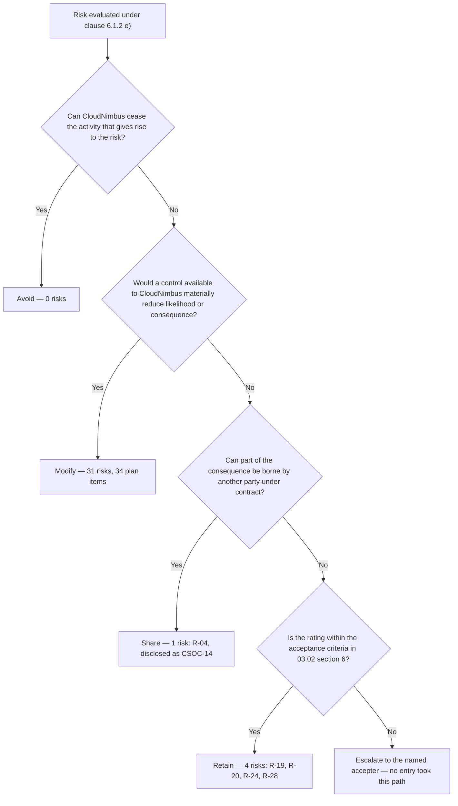

# 03.06 — Risk Treatment Plan

| Field | Value |
|---|---|
| Document ID | `CNB-TRUST-2026-306` |
| Version | 1.0 |
| Date | 2026-08-11 |
| Owner | Rahul Bhargava, Compliance Manager |
| Approver | Karim Haddad, VP Security &amp; Trust |
| Classification | Confidential — Trust &amp; Assurance Programme // Illustrative Portfolio Sample |

---

## 1. Purpose

Clause 6.1.3 has six lettered limbs and they are a sequence, not a menu. The organisation must **a)** select
appropriate risk treatment options taking account of the assessment results; **b)** determine all controls
necessary to implement the options chosen; **c)** compare those controls with Annex A to verify that no
necessary control has been omitted; **d)** produce a Statement of Applicability; **e)** formulate a risk
treatment plan; and **f)** obtain the risk owners' approval of the plan **and** their acceptance of the
residual risks.

This document is limbs a), b) and e). Limbs c) and d) are 03.08 to 03.11, and limb f) is recorded here and
completed in 03.07, because approval of the plan and acceptance of the residual are two different signatures
and a programme that collects only the first has approved a set of intentions.

The plan was approved at **MS-05 on 2026-04-24**.

## 2. The options, and the counts

Clause 6.1.3 a) does not prescribe a list of options; the four used here — **modify, retain, avoid, share** —
are the conventional set and were fixed as the programme's vocabulary so that every entry in the register is
disposed of by exactly one of them.

| Option | Count | Which |
|---|---|---|
| Modify | 31 | All except those below |
| Retain | 4 | **R-19, R-20, R-24, R-28** |
| Share | 1 | **R-04** — transferred in part to Halcyon Identity through the service availability commitment added at the **2026-03-18** master agreement renewal, and disclosed to user entities as **CSOC-14** |
| Avoid | 0 | **None** |

**31 + 4 + 1 + 0 = 36.** Every entry in the baseline register has exactly one disposition and no entry has
two.

## 3. The zero, and why it is recorded rather than filled

**No risk was avoided.** The Avoid column reads zero, and that is the honest output of the method rather
than a gap in it.

Avoidance has a precise meaning: **ceasing the activity that gives rise to the risk**. Not reducing it, not
containing it, not deciding to be careful about it — stopping it. Applied to this register, avoidance was
genuinely available in four places and was taken in none.

CloudNimbus could have **withdrawn geolocation capture at clock-in**, which would have removed **R-24**
entirely. It was argued for and refused: **ADR-0009** and **DEC-205** record the decision to retain
geolocation, and the refusal was paid for with a retention period cut to thirteen months, shorter than the
contract term that governs every other personal data category. A refusal that costs something is a decision;
one that costs nothing is a preference.

It could have **stopped holding leave type**, which would have removed **R-35**. **DEC-206** retained it as
a controlled list with no reason, no diagnosis and no medical detail stored — a narrowing of the field, which
is a modification of the consequence, not an avoidance of the activity.

It could have **exited the EU**, or declined to serve the 41 customers who require residency, which would
have removed **R-05** and **R-20** and materially changed **R-19**. Nobody proposed it seriously, and
recording that it was available and rejected is more useful than pretending it was never on the table.

And it could have **ceased to serve reporting queries from the analytics read replica**, which is the single
most interesting access path in the platform and the one **R-01** is mostly about. It is a product
capability customers pay for, and it stayed.

So the plan records a zero. The temptation to do otherwise is real and worth naming, because a treatment
plan showing all four options in use looks methodologically complete in a way that a plan with a zero does
not. But **completeness belongs to the option set, not to the outcome**: clause 6.1.3 a) requires appropriate
options to be selected, and appropriateness is decided by the risk, not by the shape of the table. The
manufactured avoidance is easy to spot once you know the form it takes — a decision not to build something
nobody was going to build, written up as a risk that was avoided. **A treatment plan that records an
avoidance it did not perform is a plan that has learned to fill in a form**, and once it has learned that,
every other column is worth less.

This is **ADR-0014** and **DEC-308**, decided by Karim Haddad on 2026-04-14.

## 4. The one shared risk

**R-04** is the only entry treated by sharing, and the reason is the shape of the risk rather than a
preference for insurance. Halcyon Identity authenticates the end users of the platform. Its availability is
not a thing CloudNimbus can modify — there is no control CloudNimbus can implement that makes a supplier's
platform more reliable — and the architectural alternatives that would remove the dependency trade an
availability risk for a confidentiality risk, which 03.05 §6 sets out.

What CloudNimbus can do is contract for service levels, monitor performance against them under **A.5.22**,
and **disclose the dependency to user entities as CSOC-14** so that a customer knows it exists before an
outage rather than during one. Sharing here means the consequence is partly borne elsewhere and partly
disclosed; it does not mean the risk has gone anywhere. A programme that treats "shared" as a synonym for
"resolved" has moved a risk into a column rather than out of the business.

**The share is a dated act and not a standing intention, and this document records the act rather than the
category.** R-04 carries no TP item, because the four treatment options are alternatives and a shared risk
is not also a modified one. That is a defensible structure and it creates a reporting hazard: an option with
no plan item has no owner, no date and no record behind it, and a risk disposed of into a column that
contains nothing is indistinguishable from a risk nobody treated. So the substance of the share is set out
here.

| Field | Record |
|---|---|
| What was done | The **Halcyon Identity master services agreement was renewed**, and the renewal added a **service availability commitment** and a **service credit regime** to the identity service. Neither existed under the previous agreement, which carried support response times and no availability undertaking at all |
| Date | **2026-03-18**, before the MS-04 baseline and before this phase's vantage of 2026-04-30 |
| Owner of the negotiation | **Wes Delacroix**, Director of Infrastructure &amp; SRE, who owns R-04 and the availability dependency |
| Owner of the terms | **Tobias Lund**, General Counsel, who settled the drafting and the credit mechanism |
| Ongoing obligation created | Monitoring of performance against the committed level under **A.5.22**, and disclosure to user entities as **CSOC-14** |

**What a contractual commitment is worth, stated exactly.** It allocates consequence and it creates a
monitoring obligation. It does not operate a control: **CloudNimbus operates none of Halcyon Identity's
availability controls**, designs none of them, tests none of them and cannot inspect them. A service credit
is a remedy, and a remedy is not a reduction in the frequency of the event that triggers it. What the
renewal changes is that Halcyon now has a committed level to hold and a cost when it does not, which is a
real influence on a supplier's engineering priorities and a weak one — worth **one step on the likelihood
scale and no more**. 03.07 §5.2 rests R-04's single forecast movement on this renewal and on nothing else,
and declines to forecast it further for exactly this reason.

## 5. The four retained

**R-19, R-20, R-24 and R-28** are retained. Each carries its risk owner's acceptance under clause 6.1.3 f),
the additional acceptance 03.02 §6 requires at its band, and a review date, and each is argued
individually in **03.07**, which is where retention belongs because retention is an acceptance decision
before it is a treatment decision. They are listed here only so that the arithmetic in §2 can be checked
without turning a page.

## 6. Thirty-one modified risks, thirty-four plan items

**Thirty-one risks are treated by modification and they produce thirty-four plan items**, because **R-01,
R-05 and R-06 each require two.**

The doubling is not administrative. In each case the risk has two limbs that no single control addresses,
and merging them would have produced an item that could be reported as done while half the risk stood.

**R-01** needs isolation enforced in one shared data-access layer with a build-time check that no query path
can bypass the predicate — and, separately, independent verification of the multi-tenancy boundary by
someone who did not write it. The first is a control; the second is a test of whether the control is what
CloudNimbus believes it to be, and **AS-02** is exactly the assumption that needs the second.

**R-05** needs containment of the paths that can carry data out of region, and removal of the identifiers
from the telemetry that legitimately crosses regions. Containment without pseudonymisation leaves an
identifier one misconfiguration away from travelling; pseudonymisation without containment leaves backups
and error payloads untouched.

**R-06** needs heartbeat alerting, so that silence is an event — and a reconciliation comparing records past
their rule against records deleted, which is a detective control that does not depend on the job's own
report. The whole point of R-06 is that the job may lie by saying nothing, and a treatment that trusts the
job to report its own failure has not understood the risk.

## 7. The plan — TP-01 to TP-34

| ID | Risk | Treatment action | Owner | Target date |
|---|---|---|---|---|
| TP-01 | R-01 | Tenant predicate enforced in a single shared data-access layer, with a build-time check that fails any query path constructed without it | Junia Okonkwo | 2026-06-12 |
| TP-02 | R-01 | Multi-tenancy isolation testing commissioned as a named scope in the independent testing engagement | Karim Haddad | 2026-05-22 |
| TP-03 | R-02 | Independent recalculation of engine output on a separate code path, with a reconciliation exception queue and a two-business-day clearance SLA | Grete Lindqvist | 2026-06-19 |
| TP-04 | R-03 | Standing privileged access removed; time-bound just-in-time elevation against a recorded approval, with session recording | Wes Delacroix | 2026-06-05 |
| TP-05 | R-05 | Residency assertion enforced on every export, log and backup path, failing the build where a path can carry an identifier out of region | Devon Ashby | 2026-06-12 |
| TP-06 | R-05 | Telemetry pseudonymised at source so that nothing crossing a region boundary carries an identifier | Devon Ashby | 2026-06-26 |
| TP-07 | R-06 | Heartbeat alerting on every scheduled retention and deletion job, so that absence of a success signal raises the alert | Devon Ashby | 2026-06-05 |
| TP-08 | R-06 | Monthly retention reconciliation comparing records past their rule against records actually deleted | Devon Ashby | 2026-06-30 |
| TP-09 | R-07 | Production-to-non-production data movement prevented at the account and network boundary, with a named, time-boxed, approved exception path | Junia Okonkwo | 2026-06-19 |
| TP-10 | R-08 | Peer review enforced by branch protection in the repository rather than by team convention, closing ML-2 | Junia Okonkwo | 2026-05-15 |
| TP-11 | R-09 | Access provisioning gated on a recorded manager approval — no approval record, no grant | Wes Delacroix | 2026-05-29 |
| TP-12 | R-10 | Quarterly access review moved into the GRC platform with a system-generated completion record, closing ML-1 | Wes Delacroix | 2026-06-12 |
| TP-13 | R-11 | Infrastructure defined as code with drift detection and policy checks that block public exposure of a data store | Wes Delacroix | 2026-06-26 |
| TP-14 | R-12 | Dependency scanning in the build pipeline with remediation service levels by severity and a blocking gate at critical | Junia Okonkwo | 2026-06-05 |
| TP-15 | R-13 | Phishing-resistant multi-factor authentication for all staff, with quarterly simulation and targeted follow-up | Karim Haddad | 2026-06-19 |
| TP-16 | R-14 | CUEC-05 restated in onboarding and a pre-export variance report published to the customer admin console before each export | Ana-Sofia Cruz | 2026-06-26 |
| TP-17 | R-15 | Backup residue disclosed in the deletion certificate, with the 65-day window stated to the customer rather than engineered away | Devon Ashby | 2026-06-12 |
| TP-18 | R-16 | Vendor register rebuilt with independent classification flags and the test re-applied at each quarterly review, closing ML-3 | Tobias Lund | 2026-05-29 |
| TP-19 | R-17 | Sub-processor engagement blocked until the O5 notice has been issued and the 30-day objection period recorded | Tobias Lund | 2026-06-05 |
| TP-20 | R-18 | Availability architecture change removing the single-writer failover dependency; requires a customer-notified maintenance window | Wes Delacroix | 2026-07-25 |
| TP-21 | R-21 | Audit logging coverage assessed against every data access path, gaps closed, and archive retention fixed for the full examination period | Karim Haddad | 2026-06-19 |
| TP-22 | R-22 | Incident notification workflow with the 48-hour clock started at determination and tracked to issue under O4 | Karim Haddad | 2026-06-12 |
| TP-23 | R-23 | Data subject request intake, routing and ten-business-day tracking under the Data Protection Officer, per O6 | Tobias Lund | 2026-06-19 |
| TP-24 | R-25 | Evidence architecture documented end to end and a second named operator trained and exercised on it; completion verified by the risk owner, not by the item owner — see §7.1 | Rahul Bhargava | 2026-06-26 |
| TP-25 | R-26 | Full-disk encryption and remote wipe enforced through MDM across all 231 endpoints, with local caching of customer data restricted | Wes Delacroix | 2026-05-29 |
| TP-26 | R-27 | Offboarding revocation triggered from the HR system on the last working day, with same-day confirmation recorded | Hannah Brill | 2026-06-05 |
| TP-27 | R-29 | Concentration and exit assessment across the eleven sub-processors, with a documented exit path for each | Tobias Lund | 2026-06-26 |
| TP-28 | R-30 | Documentation currency brought into the clause 9.2 internal audit programme alongside control operation | Rahul Bhargava | 2026-09-30 |
| TP-29 | R-31 | Awareness training assigned on hire and annually, with completion reported monthly against the 95% bar | Hannah Brill | 2026-06-12 |
| TP-30 | R-32 | ISMS scope statement reviewed at each Trust Committee, with the O10 notification path named and owned | Rahul Bhargava | 2026-06-19 |
| TP-31 | R-33 | Post-restoration deletion re-execution procedure, proven in the disaster recovery exercise under CAL-10 | Devon Ashby | 2026-08-19 |
| TP-32 | R-34 | Asset inventory reconciled monthly against cloud and MDM sources of truth, with unmatched assets escalated | Wes Delacroix | 2026-06-26 |
| TP-33 | R-35 | Leave type restricted in reporting and export to a controlled list, with no free text and no reason field | Devon Ashby | 2026-06-19 |
| TP-34 | R-36 | Employee personal data brought under the same classification, retention and access rules as customer personal data | Hannah Brill | 2026-06-26 |

Thirty-four items across thirty-one risks. Three risks carry two items each; every other modified risk
carries exactly one; and every one of the thirty-one modified risks reaches at least one item, which is the
condition 03.12's traceability check re-derives.

### 7.1 TP-24 is owned by the person the risk is about, and that has to be said

**R-25 — the evidence architecture depends on one person — is owned by Marisol Vega**, and 03.01 §6 gives
the reason in terms: *the person it depends on cannot own the risk of depending on him*. The person is
**Rahul Bhargava**. **TP-24 — document the evidence architecture end to end and train and exercise a second
named operator on it — is owned by Rahul Bhargava.** On its face that undoes the reasoning that produced the
ownership assignment, and a reader who noticed it and found no explanation would be right to wonder whether
the assignment was reasoning or decoration.

The explanation is that the two assignments answer different questions, and both answers are forced.

**The risk is owned by the Chief Financial Officer because ownership is about accountability for the
exposure.** If the evidence architecture fails because one person left, was ill, or was busy in the week the
service auditor asked, the person who has to answer for the programme's inability to produce evidence is the
executive sponsor. Rahul Bhargava cannot be accountable for the risk that the organisation depends on Rahul
Bhargava; that is a person being asked to escalate himself.

**The work can only be done by the person who holds the knowledge.** Documenting an architecture is an act
of transcription from the head that designed it, and at 4.6 FTE-equivalents there is no second person to
hand it to — the absence of that person is the risk. Assigning TP-24 to anyone else would have produced an
item that could not start. So the operational constraint is accepted and recorded rather than engineered
around with a name that would not have done the work.

**What closes the gap is verification by somebody else.** TP-24 is not complete when Rahul Bhargava says the
documentation exists. It is complete when the **second named operator has performed an evidence cycle
unaided** and **Marisol Vega, as the risk owner, has recorded that she has seen it happen**. The test of a
key-person control is whether the organisation works when the key person is absent, and that test cannot be
administered by the key person. Until the verification is recorded, TP-24 is a document written by the
dependency about the dependency, which is the shape of a control that has been performed and not
demonstrated — TH-14 again, in the one place the programme can least afford it.

## 8. Why 2026-07-01 governs the dates

**Thirty-one of the thirty-four items are due before 2026-07-01.** That date is not the programme's
preference; it is the morning the **Type II observation window opens**, and it governs for a reason that
follows directly from what a Type II is.

A Type II examination opines on the suitability of design **and the operating effectiveness of controls
throughout a specified period**. The service auditor selects samples from occurrences of the control across
that period. **A control that is not operating on the first morning of the window cannot be tested across
the full period.** What happens instead is one of three things, and none of them is good: the population is
shorter than the period and the description has to say so; the control is described as operating for a
period during part of which it did not, which is a deviation waiting to be found; or the control is left out
of the description altogether, which weakens what the report can say on the strength of tested controls.

The same date matters on the ISO side for a different reason. The ISMS is planned to be declared operational
on **2026-06-15**, and a control that does not exist then is not part of the management system a Stage 1
readiness review would be looking at. Clause 8.3 requires the risk treatment plan to be **implemented**, and
implementation is a state, not an intention.

So the plan is front-loaded, deliberately and uncomfortably, and the concentration is worse than a summary
would suggest. **All thirty-one of the items due before the window opens land inside a single seven-week
corridor**: the earliest target date on the plan is **2026-05-15** (TP-10) and the last before the window is
**2026-06-30** (TP-08). Nothing is scheduled in January, February, March or April, and nothing is spread
into the first half of May. Thirty-one control implementations, across ten owners, against a programme
resourced at **4.6 FTE-equivalents**, all fall due in forty-six days.

That is not a schedule with a busy period in it. It is a schedule with only a busy period, and the reason is
that the constraint is external: the window opens on a fixed morning and the corridor is what remains once
the risk assessment closed at MS-04. The consequence is that a slip anywhere in the corridor has nowhere to
go — there is no float in front of it and the date behind it does not move. That concentration is a real
delivery risk, it is named in 03.13, and stating it at thirty-one rather than at some smaller number is the
point: the honest figure is the one that makes the exposure visible.

## 9. The three items that fall after the window opens

Three items are due after 2026-07-01, each for a reason that could not be engineered away.

**TP-20** — the availability architecture change for R-18 — requires a customer-notified maintenance window.
The change calendar places the next available window after the observation window has opened, and forcing it
earlier would have meant either an unnotified change or a rushed one on the platform whose availability the
change exists to protect.

**TP-31** — the post-restoration deletion re-execution procedure for R-33 — is due on **2026-08-19** because
that is when the annual disaster recovery exercise under **CAL-10** runs, and the exercise is the only
scheduled event in which a full restoration actually occurs. The procedure could be written in June; it
cannot be *proven* until something is restored. Writing it and calling it done would have been the ML-1
error in a new domain — a control that exists on paper and has never produced evidence.

**TP-28** — documentation currency inside the clause 9.2 internal audit programme for R-30 — is due in Q3
2026 because a management system that has been operational for two weeks has produced nothing worth
auditing. Internal audit needs an operating period behind it. It should be said plainly that TP-28 addresses
the *documentation* limb only and does not settle the wider question of what the internal audit programme
covers: **CAL-14's coverage was recorded as undefined at the close of Phase 01**, that question is owned by
Karim Haddad, and this treatment item does not close it.

All three sit inside the observation window rather than before it, which means the controls they deliver
will have a shorter operating history than the other thirty-one. That is stated here so that it is a known
consequence of a scheduling constraint rather than a discovery.

## 10. From treatment to controls — limbs b), c) and d)

Clause 6.1.3 b) requires **all controls necessary** to implement the chosen options to be determined. The
thirty-four items above are the plan; the controls they imply are the determination, and they are what the
Statement of Applicability records. The direction of derivation matters and 03.08 argues it in full:
controls are determined necessary by the risk assessment and by legal and contractual requirements, and
**Annex A is then used under limb c) to verify that nothing necessary was omitted.** The comparison runs one
way and the derivation runs the other.

That determination produced **91 of 93 Annex A controls necessary**, with two determined not necessary and
four proposed for exclusion and refused. **74 of the 91 are justified by this risk assessment**, and each of
those cites at least one R-nn identifier, which is the join 03.12 checks.

## 11. Approval — clause 6.1.3 f)

Clause 6.1.3 f) requires the **risk owners' approval of the risk treatment plan and their acceptance of the
residual information security risks**. Both were obtained at **MS-05 on 2026-04-24**, and the second limb is
the one worth being exact about.

**The clause names the risk owners and offers no substitute for them.** Each of the ten risk owners approved
the plan items raised against the entries they own, and each accepted the residual on those entries. That
includes the four retained: the residual on **R-19** and **R-20** is accepted by **Wes Delacroix**, on
**R-24** by **Tobias Lund**, and on **R-28** by **Hannah Brill** — the owners recorded against those rows in
03.04, and the people who would be asked to explain the failure.

**The acceptance criteria in 03.02 §6 then require a second acceptance on top of the owner's, and it is an
addition rather than a replacement.** The Moderate band rule brings in the **VP Security &amp; Trust**, the Low
band requires his endorsement of the owner's decision, and the rider that overrides the band brings in the
**Chief Executive Officer** for any entry carrying impact 5. So **Elise Fontaine** accepts R-19 and R-20
alongside Wes Delacroix, and **Karim Haddad** accepts R-24 and endorses R-28 alongside Tobias Lund and
Hannah Brill. Both signatures are recorded against each of the four entries, with review dates, in 03.07 §3
and in `governance/GOV-10`.

Recording only the executive signature would have been the easier presentation and it would have been a
**clause 6.1.3 f) nonconformity waiting to be raised** — the clause is satisfied by the owner's acceptance,
not by a more senior one. An internal authority threshold is a statement about how much exposure the
organisation is willing to carry and who may say so; clause 6.1.3 f) is a statement about who is accountable
for carrying it. Conflating the two loses the accountability and keeps the paperwork. The programme found
this on its own reading of the retention records rather than at Stage 1, which is where an unowned
acceptance is usually found.

Approval is of the plan, not of its outcome. Nothing in this document states that any item has been
delivered or that any rating has moved: as at 2026-04-30 the plan is a plan, and the earliest target date on
it is three weeks away.

## 12. Decision record

**ADR-0014 — no risk avoided, and recording that rather than manufacturing one.** Decided by Karim Haddad on
2026-04-14; logged as **DEC-308**. Alternatives considered and rejected: recording the geolocation retention
reduction as an avoidance, rejected because narrowing a consequence is a modification; recording the leave
type restriction as an avoidance, rejected on the same ground; and recording a decision not to build a
capability as an avoidance, rejected because the capability was not going to be built and the register never
carried the risk.

Related records: **DEC-307** and the retention decisions in 03.07, **DEC-311** (Statement of Applicability
issued at v1.0), **ADR-0013** (the 91-of-93 determination).

## Cross-References

| Document | Relationship |
|---|---|
| [03.04 Risk Register — Baseline](03.04-risk-register-baseline.md) | The 36 entries every option and item here disposes of |
| [03.05 Risk Analysis and the Seven High Ratings](03.05-risk-analysis-and-the-seven-high-ratings.md) | Explains why R-01, R-05 and R-06 each need two items |
| [03.07 Risk Acceptance and Residual Risk](03.07-risk-acceptance-and-residual-risk.md) | The four retained risks, the acceptances under clause 6.1.3 f), and the forecast |
| [03.08 Statement of Applicability — Methodology](03.08-statement-of-applicability-methodology.md) | Limbs c) and d), and the direction-of-derivation argument in §10 |
| [03.12 Risk to Criteria and Annex A Traceability](03.12-risk-to-criteria-and-annex-a-traceability.md) | Re-derives the join between the 31 modified risks and the 74 risk-justified controls |
| [02.11 Complementary User Entity Controls](../02-system-scope-isms-boundary-and-description/02.11-complementary-user-entity-controls.md) | CUEC-04 and CUEC-05, which TP-16 acts on |
| [01.11 Assurance Calendar and Obligations](../01-program-foundation-dual-framework-governance/01.11-assurance-calendar-and-obligations.md) | CAL-10 and CAL-14, and obligations O4, O5, O6 and O10 |

← [03.05 Risk Analysis and the Seven High Ratings](03.05-risk-analysis-and-the-seven-high-ratings.md) · [Phase 03 README](03.00-README.md) · [03.07 Risk Acceptance and Residual Risk](03.07-risk-acceptance-and-residual-risk.md) →
