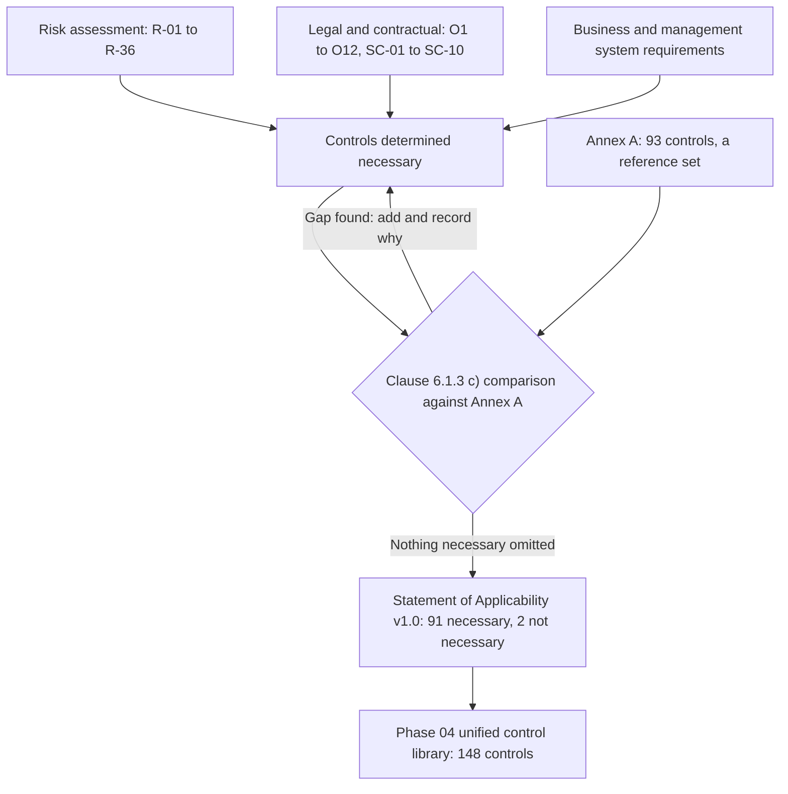

# 03.08 — Statement of Applicability: Methodology

| Field | Value |
|---|---|
| Document ID | `CNB-TRUST-2026-308` |
| Version | 1.0 |
| Date | 2026-08-11 |
| Owner | Karim Haddad, VP Security &amp; Trust |
| Approver | Elise Fontaine, Chief Executive Officer |
| Classification | Confidential — Trust &amp; Assurance Programme // Illustrative Portfolio Sample |

---

## 1. What clause 6.1.3 actually asks for

ISO/IEC 27001:2022 clause 6.1.3 requires the organisation to define and apply an information security risk
treatment process. Two of its sub-clauses govern this document and the two that follow it.

**Clause 6.1.3 c)** requires that the controls determined necessary be **compared with those in Annex A**,
to verify that no necessary control has been omitted.

**Clause 6.1.3 d)** requires a **Statement of Applicability** that contains four things, and only an
instrument containing all four is a Statement of Applicability:

| # | Required content | Where it appears |
|---|---|---|
| 1 | The **necessary controls** | The `Control` and `Necessary` columns of 03.09 and 03.10 |
| 2 | The **justification for their inclusion** | The `Justification` column |
| 3 | Whether the necessary controls **are implemented** | The `Implementation` column |
| 4 | The **justification for excluding** any Annex A control | The `Justification` cell of A.7.11 and A.7.12, and 03.11 §2 |

The requirement is deliberately plain, and it is worth noticing what it does not say. It does not say the
organisation must implement Annex A. It does not say the necessary controls must be drawn from Annex A. It
does not say every Annex A control must be either implemented or excluded with a reason of a prescribed
form. It says: state what you determined necessary, why, whether it is in place, and why anything in
Annex A is not on your list.

## 2. Annex A is a reference set, not the requirements

**Conformity with ISO/IEC 27001:2022 is assessed against clauses 4 to 10.** Those clauses are the
requirements: context, leadership, planning, support, operation, performance evaluation, improvement.
Annex A is a **normative reference set of 93 controls in four themes**, provided so that an organisation
determining its own controls has something authoritative to check itself against, and ISO/IEC 27002:2022
supplies the implementation guidance and the five attribute sets that go with it.

The practical consequence is the one most often stated backwards. **A control can be excluded from the
Statement of Applicability and the ISMS can still conform**, provided the exclusion is justified. Northgate
Certification Services will not withhold a recommendation because CloudNimbus determined two of the 93
controls unnecessary; it will examine whether the justification holds. An organisation that implements all
93 and cannot demonstrate a functioning clause 9.2 internal audit programme **invites a major
nonconformity** — the grading is the certification body's judgement and not the organisation's to announce.
An organisation that implements 91 with two properly justified exclusions and runs its management system
invites nothing of the kind.

**This is the structural asymmetry with SOC 2, and the whole integrated operating model turns on it.** In a
SOC 2 examination, every applicable trust services criterion in every category in scope must be addressed
by controls. There is no equivalent of an exclusion. CloudNimbus has selected all five categories, so all
**61** criteria apply, and there is no mechanism by which CloudNimbus can determine that CC6.7 does not
suit its circumstances and record a justification for leaving it out. The service auditor evaluates whether
the controls stated in the description meet each criterion. A criterion unaddressed is a criterion unmet.

So the two frameworks treat their catalogues in opposite ways. Annex A is a list to be reasoned against;
the trust services criteria are a set to be satisfied. A programme that treats Annex A as mandatory
over-builds, and a programme that treats the criteria as negotiable fails. Both errors come from the same
habit — reading a published list and assuming it behaves the same way in both documents.

## 3. The comparison runs in one direction and the derivation in the other

This is the point on which a Statement of Applicability is either an artefact of a management system or a
form somebody filled in, and it is worth being exact about the sequence.

Controls were determined necessary **from three sources**, none of which is Annex A:

| Source | What it produced | Justification category |
|---|---|---|
| The information security risk assessment — R-01 to R-36, and the treatment decisions in 03.06 | Controls required to modify a rated risk | `Risk`, citing the R-nn entries the control addresses |
| Legal and contractual requirements — obligations **O1 to O12**, the commitments **SC-01 to SC-10**, and the requirements of interested parties determined under clause 4.2 | Controls required because CloudNimbus has undertaken something, whatever its risk rating | `Contractual/legal` |
| Business requirements and good practice — the operating needs of a 187-person remote-first company and the way the ISMS itself has to run | Controls required to operate the business and the management system | `Business requirement` |

**Only then was Annex A opened.** The list of necessary controls was compared, one at a time, against the
93 controls in the reference set, and the comparison asked a single question of each: *is there a control
in Annex A that addresses something we have not addressed?* Where the answer was yes, the necessary-control
list was extended and the reason recorded. Where the answer was no — twice — the determination of
non-necessity was recorded with its justification.

The arrows matter. **Derivation flows left to right into the determination; the comparison is a check
applied to the result.** An organisation that starts at Annex A and works backwards — taking each of the 93
in turn and inventing a risk that justifies it — has produced a checklist and then written a risk register
to explain the checklist. Clause 6.1.3 c) is explicit that the comparison is a **verification step**: its
stated purpose is to verify that no necessary control has been omitted, which is a statement about
completeness of the organisation's own determination, not an instruction to adopt the catalogue.

The test of which direction was actually travelled is easy to apply and hard to fake, and a Stage 1 auditor
applies it. Ask why a specific control is on the list. A derived Statement of Applicability answers with a
risk, an obligation or an operating need. A reverse-engineered one answers with the control's own title.

CloudNimbus's answer is in the tables: **74 of the 91 necessary controls cite at least one R-nn identifier**
from the register published in 03.04, and every one of the 36 register entries is reached by at least one
Annex A control. The traceability is set out in 03.12, and it is bidirectional by construction rather than
asserted after the fact.

## 4. The three justifications, and why there are three rather than one

Some organisations justify every included control with the word "risk". It is defensible and it is less
useful than it looks, because it conceals the controls that would still be necessary if the risk rating
fell to nothing.

**`Contractual/legal` — 11 controls.** These exist because CloudNimbus has undertaken something. A.5.20
addressing information security within supplier agreements is on the list because O5 requires a current
sub-processor list and 30 days' notice; A.5.33 protection of records and A.5.34 privacy and protection of
PII are on it because of the data processing addendum and the residency addendum behind O6, O7 and O8;
A.8.24 use of cryptography is on it because encryption is committed in the MSA. If every associated risk
were rated Low tomorrow, these controls would remain necessary, because an obligation does not vary with a
likelihood score. Recording them as risk-justified would have hidden that property.

**`Business requirement` — 6 controls.** A.5.4 management responsibilities, A.5.8 information security in
project management, A.5.37 documented operating procedures, A.6.4 disciplinary process, A.8.17 clock
synchronization and A.5.6 contact with special interest groups are necessary because the organisation and
the management system have to function. A.8.17 is the cleanest illustration: no register entry is about
clock drift, and every log correlation, every incident timeline and every access review sample depends on
synchronised time.

**`Risk` — 74 controls.** Each cites the register entries it addresses. The citation is the audit trail
between clause 6.1.2 and clause 6.1.3, and it is the field a Stage 1 auditor uses to test whether section 3
of this document is true.

## 5. "Is implemented" is a status field

Clause 6.1.3 d) requires the Statement of Applicability to state **whether the necessary controls are
implemented**. That is a status, and reporting a status accurately is the correct use of the field.

This Statement of Applicability is **version 1.0, approved 2026-04-24** under **DEC-311**. The control
build runs to June. At v1.0 the position is:

| Implementation status | Count |
|---|---|
| Implemented | **62** |
| Partially implemented | **21** |
| Planned | **8** |
| **Necessary controls** | **91** |

62 + 21 + 8 = 91.

**Twenty-nine of the ninety-one necessary controls are not fully in place on the date this document was
approved, and the document says so on its face.** That is not an admission and it is not a finding waiting
to happen. Nothing in clause 6.1.3 requires the status to read "implemented", and a first-issue Statement
of Applicability that shows every control complete two months before the ISMS is declared operational is
describing a build that did not occur. The temptation to write "implemented" and mean "designed" is the
single most common way this field is misused, and it is expensive later: the auditor tests the assertion,
not the intention, and a control asserted as implemented in April and evidenced from June is a discrepancy
the organisation created for itself.

The status is also the reason the document is useful internally. The 8 planned and 21 partial controls are
the control build backlog, they map to the treatment items TP-01 to TP-34 in 03.06, and **31 of those 34
items are due before 2026-07-01** because a control that is not operating on the morning the observation
window opens cannot be tested across the full period.

## 6. The determination at v1.0

| Figure | Value |
|---|---|
| Annex A controls | **93** |
| Determined **necessary** | **91** |
| Determined **not necessary** | **2** — A.7.11 supporting utilities, A.7.12 cabling security |
| Proposed for exclusion and **refused** | **4** — A.7.4, A.7.8, A.7.10, A.7.13 |
| Justified by the **risk assessment** | **74** |
| Justified by a **contractual or legal requirement** | **11** |
| Justified by **business requirement or good practice** | **6** |
| **Implemented** | **62** |
| **Partially implemented** | **21** |
| **Planned** | **8** |

74 + 11 + 6 = 91. 62 + 21 + 8 = 91. 91 + 2 = 93.

| Theme | Controls | Necessary | Implemented | Partial | Planned |
|---|---|---|---|---|---|
| A.5 Organizational | 37 | 37 | 28 | 7 | 2 |
| A.6 People | 8 | 8 | 7 | 1 | 0 |
| A.7 Physical | 14 | 12 | 10 | 2 | 0 |
| A.8 Technological | 34 | 34 | 17 | 11 | 6 |
| **Total** | **93** | **91** | **62** | **21** | **8** |

The distribution is a description of the company. A.5 is nearly complete because organisational controls
are policy, role and process work that a 4.6-FTE programme can do in a quarter. A.8 is half built because
technological controls require engineering time competing with a product roadmap, and because six of the
eight planned controls are technological. A.7 is small and almost entirely implemented because there is
very little physical estate — which is exactly the condition that produced the two exclusions and the four
refusals in 03.11.

**All eleven controls new in :2022 were determined necessary**, and four of them sit in the Partial or
Planned columns. 03.10 §6 sets out why: an organisation certifying for the first time against :2022 meets
those eleven with no legacy implementation to inherit.

## 7. The Statement of Applicability is a living document

Three consequences follow, and each is a commitment rather than an observation.

**It will be reissued when the ISMS is declared operational on 2026-06-15.** The reissue restates the
implementation status against the same 91 controls. The necessary/not-necessary determination is not
expected to change; if it does, the change and its reason are recorded.

**Any change after certification is notifiable.** Obligation **O10** requires CloudNimbus to notify
Northgate of significant changes to the ISMS, its scope or the organisation within 30 days. A change to the
Statement of Applicability that alters which controls are necessary is such a change. Adding a control is
ordinary maintenance; **removing one after certification means asserting an exclusion the certification
body has not seen**, and that is the version of this document that gets read line by line at the next
surveillance audit.

**It is not the control library.** The Statement of Applicability records *which Annex A controls are
necessary and whether they are implemented*. Phase 04 builds the **148-control unified library** that says
*how*. One Annex A control is frequently satisfied by several library controls, and one library control
frequently satisfies several Annex A controls and several trust services criteria at once. Collapsing the
two documents into one is how organisations end up with a Statement of Applicability nobody can maintain
and a control library nobody can trace.

## Cross-References

| Document | Relationship |
|---|---|
| [03.04 Risk Register Baseline](03.04-risk-register-baseline.md) | R-01 to R-36, the identifiers the `Risk` justifications cite |
| [03.06 Risk Treatment Plan](03.06-risk-treatment-plan.md) | TP-01 to TP-34; the build behind the Partial and Planned statuses |
| [03.09 Statement of Applicability — Organizational Controls](03.09-statement-of-applicability-organizational-controls.md) | The A.5 table, 37 rows |
| [03.10 Statement of Applicability — People, Physical, Technological](03.10-statement-of-applicability-people-physical-technological.md) | The A.6, A.7 and A.8 tables, 56 rows |
| [03.11 Controls Argued and Refused](03.11-controls-argued-and-refused.md) | The two exclusions and the four refusals |
| [03.12 Risk to Criteria and Annex A Traceability](03.12-risk-to-criteria-and-annex-a-traceability.md) | The three mappings and their standing |
| [02.08 ISMS Scope Statement — Clause 4.3](../02-system-scope-isms-boundary-and-description/02.08-isms-scope-statement-clause-4-3.md) | The boundary the determination applies across |
| [01.03 ISO/IEC 27001:2022 Landscape and Certification Route](../01-program-foundation-dual-framework-governance/01.03-iso-iec-27001-2022-landscape-and-certification-route.md) | Clauses 4–10 as the requirements; Annex A as a reference set |
| [01.11 Assurance Calendar and Obligations](../01-program-foundation-dual-framework-governance/01.11-assurance-calendar-and-obligations.md) | O1 to O12, behind the 11 contractual/legal justifications |
| `adr/ADR-0013` | Ninety-one of ninety-three determined necessary; two excluded; four argued and refused |
| `logs/decision-log.md` | DEC-309, DEC-310, DEC-311 |

---

← [03.07 Risk Acceptance and Residual Risk](03.07-risk-acceptance-and-residual-risk.md) · [Phase 03 README](03.00-README.md) · [03.09 Statement of Applicability — Organizational Controls](03.09-statement-of-applicability-organizational-controls.md) →
