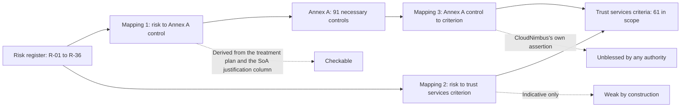

# 03.12 — Risk to Criteria and Annex A Traceability

| Field | Value |
|---|---|
| Document ID | `CNB-TRUST-2026-312` |
| Version | 1.0 |
| Date | 2026-08-11 |
| Owner | Rahul Bhargava, Compliance Manager |
| Approver | Karim Haddad, VP Security &amp; Trust |
| Classification | Confidential — Trust &amp; Assurance Programme // Illustrative Portfolio Sample |

---

## 1. Three mappings, and they are not of equal quality

Phase 03 produces three traceability relationships. They are frequently presented together in a single
matrix, as though they were three columns of one artefact of uniform reliability. They are not. One is
derived and checkable, one is indicative, and one is an assertion CloudNimbus makes on its own authority
and nobody else's.

This document states what each mapping is worth before it states what it contains, because a traceability
matrix presented without that framing is the most confidently wrong document a compliance programme
produces.

## 2. Mapping 1 — risk to Annex A control

**This is the strongest of the three, because it was not built as a mapping.** It fell out of the
determination. Every control determined necessary on the strength of the risk assessment carries, in the
`Justification` column of 03.09 and 03.10, the register identifiers it addresses. The mapping is the
justification column read sideways.

| Measure | Value |
|---|---|
| Necessary Annex A controls | **91** |
| Of which justified by `Risk` and citing at least one R-nn | **74** |
| Of which justified by `Contractual/legal` or `Business requirement` | **17** |
| Distinct register entries cited | **36 of 36** |
| Total control-to-risk citations | **146** |
| Mean Annex A controls per register entry | **4.1** |

**Every one of the 36 register entries is reached by at least one Annex A control**, which is a stronger
result than the one required. The requirement was that each of the **31 risks treated by modification**
reach at least one control; the four retained risks (R-19, R-20, R-24, R-28) and the one shared risk (R-04)
also reach controls, because retention and sharing are treatment decisions about residual exposure and not
decisions to leave a risk uncontrolled.

### 2.1 The distribution, and what the thin entries mean

| Annex A controls citing the entry | Number of register entries |
|---|---|
| 10 or more | **3** — R-26, R-07, R-13 |
| 5 to 9 | **12** |
| 3 to 4 | **5** |
| 2 | **8** — R-04, R-06, R-10, R-16, R-19, R-20, R-29, R-31 |
| 1 | **8** — R-14, R-15, R-17, R-23, R-24, R-32, R-33, R-36 |
| **Total** | **36** |

The two ends of that distribution both need explaining, and the explanation is the same in both directions:
**footprint measures how much of Annex A a risk touches, not how well the risk is treated.**

**R-26** — an endpoint lost or stolen with customer data cached on it — is cited by **11 controls** and is
rated **2 × 3 = 6 Low**, and the number was **15** before the citations were re-examined. That is the more
useful fact about it. A Low entry accumulating the largest control surface in the register is not a finding
about the depth of endpoint protection; **it is usually a sign that the citations were doing the wrong
job** — that where a control needed a plausible register identifier, the entry about a laptop was reached
for because a laptop can be made to appear in almost any narrative. Malware protection was cited to a
stolen-laptop risk. So was web filtering, which does nothing whatever about a device that has left the
building, and equipment maintenance, which is about the device being patched rather than about it being
lost. Those four citations were removed and re-made against entries the controls actually address.

**What is left is eleven rows in which the loss of a device really is the risk**: acceptable use and return
of assets, responsibilities after termination, remote working, physical and environmental protection, clear
desk and clear screen, equipment siting, security of assets off-premises, storage media, secure disposal,
and user endpoint devices. Eleven is still the largest surface in the register and it is now defensible one
row at a time, which is the only test a citation has to pass. The general lesson is worth keeping: **a
citation count is evidence about the derivation, not a score**, and an entry whose count looks impressive
for its band deserves to be read as a symptom before it is read as a strength.

**R-06** — a scheduled retention or deletion job fails silently and data is kept past its rule, **4 × 4 = 16
High** — is cited by **two** controls: A.8.15 logging and A.8.16 monitoring activities. That reads wrong for
a High entry, and the reason is recorded rather than smoothed over. The control that addresses R-06 most
directly is **A.8.10 information deletion**, and A.8.10 takes a `Contractual/legal` justification because
obligation **O7** makes it necessary independently of any risk rating. A control can carry only one
justification, so R-06 loses a citation to O7. **This is a property of the justification taxonomy and not a
gap in treatment** — R-06's treatment items are in 03.06, and A.8.10 is `Partial` precisely because of it.

The same effect explains most of the other single-citation entries. R-23 (data subject request assistance)
reaches only A.5.9, because A.5.34 privacy and protection of PII is contractual/legal. R-24 (geolocation
used beyond its stated purpose) reaches only A.5.12, for the same reason. **The taxonomy that makes the
Statement of Applicability honest about obligations makes the risk footprint read thin in exactly the
places where an obligation is doing the work**, and reading the footprint without that correction produces
the wrong conclusion about the register's most consequential entries.

Eight controls cite exactly one register entry — A.7.1, A.7.2, A.7.3, A.7.4, A.7.6, A.8.6, A.8.23 and
A.8.34 — and five of those eight cite R-28, the single entry about the Denver office. Sixty controls cite
two, and six cite three. 8 + 60 + 6 = 74, and 8 + 120 + 18 = **146**. A row citing one entry is not a weaker
row than a row citing two: A.8.23 web filtering answers to R-13 and to nothing else in this register, and
saying so is more useful than finding it a second identifier.

### 2.2 The seven High ratings

| Entry | Rating | Annex A controls citing it |
|---|---|---|
| R-01 | 4 × 5 = 20 | **7** |
| R-02 | 3 × 5 = 15 | **6** |
| R-03 | 3 × 5 = 15 | **8** |
| R-04 | 4 × 4 = 16 | **2** |
| R-05 | 4 × 4 = 16 | **4** |
| R-06 | 4 × 4 = 16 | **2** |
| R-07 | 3 × 5 = 15 | **10** |

**R-04 — Halcyon Identity becomes unavailable and no end user can authenticate — reaches two controls,
A.5.22 and A.5.23, and that is the correct answer rather than a thin one.** R-04 is the register's single
**shared** risk under clause 6.1.3 a): part of it is transferred to Halcyon Identity through the service
availability commitment added at the **2026-03-18** master agreement renewal, and it is disclosed to user
entities as **CSOC-14**. Annex A has supplier-relationship
controls and no control that makes another organisation's service available. A risk shared with a
subservice organisation is *expected* to have a small Annex A footprint, and an organisation that manufactured
a larger one would be claiming controls over a service it does not operate.

## 3. Mapping 2 — risk to trust services criterion, and why it is weak

The second mapping relates register entries to the 61 applicable trust services criteria. It is published
as **indicative**, and the reason has to be stated rather than buried in a caveat.

**The criteria are not organised by risk.** The Common Criteria are organised against the **17 COSO
principles** for CC1 to CC5 and by control domain thereafter; the category-specific criteria are organised
by the commitment they concern. Nothing in TSP section 100 asks what an entity's risks are, other than
CC3.1 to CC3.4, which ask whether the entity performs risk assessment at all. Mapping a register entry onto
a criterion therefore asks a question the criteria were not written to answer.

Two structural consequences follow.

**A criterion is met by controls addressing several unrelated risks.** CC6.1 is satisfied by controls that
between them address tenant isolation (R-01), privileged account compromise (R-03), provisioning ahead of
approval (R-09) and credential compromise through phishing (R-13). Those four risks share no threat source
and no owner. Reading the mapping backwards — "CC6.1 is about R-01" — is wrong in a way that matters,
because it invites a reader to think a criterion has been discharged when the risk driving one of its
controls has moved.

**A risk reaches several criteria across several categories.** R-05 — EU personal data leaving
`eu-central-1` — touches Confidentiality, Privacy and the Common Criteria at once, and it is not
principally *about* any of them; it is about a residency commitment recorded as obligation **O8**.

The mapping is therefore useful for one purpose and one only: **evidence planning.** When a control fails
or a risk is re-rated, the mapping shows which criteria a service auditor may ask about. It is not a
demonstration that the criteria are met, and it is not used as one anywhere in this programme. The
demonstration that a criterion is met is the control, the evidence that it operated, and the auditor's
test.

## 4. Mapping 3 — Annex A control to trust services criterion

**This mapping is CloudNimbus's own assertion and nobody else's.**

No standards body, regulator or accreditation authority publishes or blesses a crosswalk between Annex A of
ISO/IEC 27001:2022 and the trust services criteria. The AICPA does not publish one that binds anyone. ISO
does not. ANAB does not. Northgate Certification Services has no view on it, and Ashcombe &amp; Doyle LLP is
not obliged to accept it. Every crosswalk in circulation — vendor mappings, consultancy mappings, the ones
built into compliance automation platforms, and CloudNimbus's — is **an assertion by whoever made it**, and
its authority is exactly the quality of the reasoning behind it and nothing more. 01.06 §5 established
this; it is repeated here because this is the document where the mapping is actually used.

### 4.1 The consequence, stated plainly

**Where the mapping is wrong, both deliverables inherit the error. This is the single largest risk the
integrated operating model creates.**

The mechanism is worth spelling out, because it is not the same as an ordinary control failure. A control
that fails, fails visibly: evidence is missing, a test produces a deviation, a nonconformity is raised. A
mapping that is wrong fails silently and in two documents at once. Suppose a library control is asserted to
satisfy both **A.8.20 networks security** and **CC6.6**, and the control as designed addresses the network
perimeter but not the encryption of data in transit that CC6.6 also concerns. The Statement of Applicability
records A.8.20 as implemented and may be right. The SOC 2 description offers the same control against
CC6.6 and is wrong. **Nobody discovers this by looking at the control**, because the control is operating
exactly as described. It is discovered when a service auditor evaluates whether CC6.6 is met and finds a
gap the organisation believed was covered — during fieldwork, after the observation window has closed, when
the remedy is no longer available.

The failure is asymmetric in a second way. The integration dividend runs through **112 dual-purpose
controls** in the 148-control library. Every one of those 112 rests on a mapping assertion, so an error in
the mapping layer propagates to both deliverables by design. The efficiency and the exposure are the same
mechanism viewed from two sides, and a programme that claims the first and does not name the second has
not understood its own operating model.

Three defences are in place, and they are defences rather than solutions:

1. **The reasoning is documented per mapped pair**, not per framework. Each dual-purpose control carries a
   statement of why it satisfies the specific criterion and the specific Annex A control it claims, and
   where it only partially does so, what else is needed. A matrix of two identifier columns and no
   reasoning is a claim nobody can check, including its author.
2. **A mapping is never a substitute for a test.** It indicates which questions a piece of evidence might
   help answer; it does not answer them.
3. **Neither auditor is asked to rely on it.** The service auditor evaluates whether the controls meet the
   criteria. The certification body evaluates conformity with clauses 4 to 10 and the Statement of
   Applicability. Answering a question about CC6.6 with "we mapped it to A.8.20" is a reference, not an
   answer, and this programme does not offer it as one.

## 5. Coverage summary

Ninety-one rows of control-by-criterion detail would be less informative than the four numbers that
actually describe the shape of the overlap. Those numbers are given here; the per-pair reasoning belongs
with the library in Phase 04.

### 5.1 From the Annex A side

| Measure | Count |
|---|---|
| Necessary Annex A controls | **91** |
| Mapping to **at least one** of the 61 criteria | **82** |
| Mapping to **no** criterion | **9** |

The nine with no criterion are **A.5.6** contact with special interest groups, **A.5.7** threat
intelligence, **A.5.30** ICT readiness for business continuity, **A.5.32** intellectual property rights,
**A.7.13** equipment maintenance, **A.8.17** clock synchronization, **A.8.23** web filtering, **A.8.30**
outsourced development and **A.8.34** protection of information systems during audit testing.

They are not a residue, and they did not arrive by one route. Sorting them by how they got here is more
useful than the list.

**Three are on the list because CloudNimbus kept controls the criteria do not ask for** — **A.5.6** contact
with special interest groups, **A.5.7** threat intelligence and **A.8.23** web filtering. Phase 01 stated
that position with a qualification, and the qualification is worth restoring rather than flattening.
`01.06 §4` says of A.5.7 that nothing in the trust services criteria asks for it **though a mature CC7.1 or
CC7.2 implementation might well use it** — which is the right shape of claim: a criterion does not require
threat intelligence, and an entity that has it will find it feeding the criteria that concern anomaly
identification and evaluation. The same qualification applies to A.8.23: no criterion requires management of
access to external websites, and filtering will nonetheless show up inside a CC6.8 or CC7.1 answer at some
organisations. Special interest group membership appears nowhere in TSP section 100 in any form. **Two of
these three were never argued for exclusion at all** — 03.11 §5 records A.8.23 and A.5.6 as kept without
reaching a formal proposal — so their presence here is the opposite of a refusal.

**Exactly one of the nine came from the refusals: A.7.13 equipment maintenance.** That is the only overlap
between this list and the four controls 03.11 records as proposed for exclusion and refused, and it is worth
stating because the available shorthand — *these are the controls the refusals left behind* — is wrong by
eight and wrong in direction. The two most conspicuous members of the nine were kept **without** an argument
ever being made against them, which is the opposite of having survived one.

**The remaining five arrive individually.** **A.5.32** intellectual property rights and **A.8.17** clock
synchronization are not risk-justified in the Statement of Applicability at all — contractual/legal and
business requirement respectively — and no criterion asks about licence obligations or about clock drift.
**A.8.30** outsourced development is unmapped because the criteria approach third-party code through vendor
management rather than through development practice. **A.8.34** protection of information systems during
audit testing has no counterpart because the criteria do not concern themselves with the disruption an audit
causes. And **A.5.30** ICT readiness for business continuity is the contestable one.

**A.5.30 is the member of the nine most open to challenge, and the basis for keeping it here is stated
rather than assumed.** Phase 02 mapped **CSOC-14** — Halcyon Identity's availability, capacity and
continuity of the identity service — to **A1.1, A1.2 and A1.3**, and a reader who has that in front of them
will reasonably ask why continuity content maps to the A1 series there and not here. The answer is that the
two mappings are not the same operation. CSOC-14 is a **complementary subservice organisation control**
disclosed under DC7: it names the criteria the *carve-out* engages, which is a statement about what the
description leaves out and where a user entity should look. This mapping asks a narrower question — does a
criterion require what the Annex A control requires? A.5.30's requirement is that **ICT readiness be planned
and tested against business continuity objectives determined by a business impact analysis**, which is a
management-system activity; A1.2 and A1.3 ask whether recovery infrastructure and environmental protections
exist and whether recovery procedures are tested. `01.06 §4` put it exactly right: A.5.30 **sits alongside
but does not coincide with** A1.2's availability and recovery focus. Sitting alongside is not mapping, and
the programme records A.5.30 as unmapped on that basis while naming it as the one a certification body or a
reviewer might argue about.

**A control kept because Annex A asks for it, when no criterion asks for it, is a control the SOC 2 side of
the programme gets no credit for**, and three of the nine — A.5.7, A.5.30 and A.8.23 — are among the eleven
new in :2022.

### 5.2 From the criteria side

| Measure | Count |
|---|---|
| Applicable trust services criteria | **61** |
| Served by **at least one** Annex A control | **44** |
| With **no Annex A analogue at all** | **17** |

The 17 cluster in six places, and each cluster is a statement about what the two frameworks are for.

| Cluster | Criteria | Why Annex A has nothing |
|---|---|---|
| COSO control environment | CC1.1, CC1.2 | Commitment to integrity and ethical values, and board independence and oversight of internal control, are COSO constructs. ISO/IEC 27001 requires leadership commitment at clause 5.1 and role assignment at clause 5.3, and Annex A carries neither as a control |
| Information and communication | CC2.1 | The quality of information supporting the functioning of internal control is broader than clause 7.4 communication and broader than A.6.3 awareness |
| Entity risk assessment | CC3.1, CC3.2, CC3.3, CC3.4 | **Risk assessment is clause 6.1 in ISO/IEC 27001, not Annex A.** There is no Annex A control for identifying, analysing or evaluating risk, and this is the clearest structural demonstration that Annex A is a reference set of controls rather than the requirements |
| Monitoring and control activities | CC4.2, CC5.1 | Evaluating and communicating control deficiencies, and selecting control activities to mitigate risk, are clause 9 and clause 6 activities |
| Processing integrity | PI1.1, PI1.3, PI1.5 | **No Annex A control asks whether a derived amount is arithmetically correct.** A.8.26 application security requirements covers input and output validation, which serves PI1.2 and PI1.4 in part; accuracy of derivation, and the reconciliation that would detect an error in it, has no counterpart |
| Privacy notice and choice | P1.1, P2.1, P3.2, P7.1, P8.1 | A.5.34 privacy and protection of PII is one control facing 18 Privacy criteria. Notice, choice and consent, explicit consent for sensitive information, data quality and complaint handling are commitments to individuals, and Annex A treats PII protection as a security matter |

2 + 1 + 4 + 2 + 3 + 5 = **17**, and 61 − 17 = **44**.

### 5.3 How this reconciles with the 148-control library

Phase 01 asserted a unified control library of **148 controls — 112 serving both frameworks, 21 serving
SOC 2 only, 15 serving ISO/IEC 27001 only**. The coverage numbers above are where the two exclusive
populations come from.

**One assumption does the work in the two exclusive columns, and it is stated here rather than left to be
inferred from the arithmetic.** For the exclusive populations only, the programme has assumed **one library
control per unserved criterion and one per unmapped Annex A control**, and has then adjusted for the cases
where that assumption fails. The **+4** and the **+6** in the table below are exactly those adjustments —
they are where one-to-one does not hold and the derivation says so out loud. **A reconciliation that rests
on a stated assumption is worth more than one that appears to fall out of the arithmetic**, because the
second kind cannot be argued with: a reader who disagrees has nothing to disagree with, and a reader who
agrees has agreed to nothing. The assumption is a modelling convenience adopted before Phase 04 builds the
library, and Phase 04 is where it will be tested against controls that actually exist.

| Library population | Count | Derivation |
|---|---|---|
| **SOC 2 only** | **21** | The **17** criteria with no Annex A analogue, plus **4** further controls where a single criterion requires more than one — CC3.2, PI1.3, P1.1 and P8.1 each need more than one control. 17 + 4 = 21 |
| **ISO only** | **15** | The **9** necessary Annex A controls that map to no criterion, plus **6** controls that exist because the management system itself has to operate — the clause 9.2 internal audit programme, the clause 9.3 management review, Statement of Applicability maintenance under clause 6.1.3, the clause 6.1.2 risk assessment process, clause 7.5 documented information control, and the clause 10.2 corrective action process. 9 + 6 = 15 |
| **Both** | **112** | Controls implementing one or more of the **82** mapped Annex A controls while serving one or more of the **44** covered criteria |
| **Total** | **148** | 112 + 21 + 15 = 148 |

**The one-to-one assumption is confined to the two exclusive columns and does not survive contact with the
112**, and that is the honest statement of its limits. **The relationship between Annex A controls and
library controls is many-to-many, not one-to-one**, which is why 82 mapped Annex A controls are implemented
by 112 library controls rather than by 82. One Annex A
control is frequently satisfied by several library controls with different owners and frequencies; one
library control — the quarterly access review is the standing example — satisfies part of A.5.15, A.5.16
and A.5.18 and part of CC6.2 and CC6.3 at the same time. Any presentation of the 148 as a partition of
Annex A is wrong in the same way the vendor arithmetic in 02.10 §6 is wrong when the 84 are presented as a
three-way partition.

**Six of the fifteen ISO-only controls correspond to no Annex A control at all**, and that is worth one
more sentence, because it is the point of this whole document. Those six exist because clauses 4 to 10 are
the requirements. An organisation that built its library from Annex A alone would have all 93 controls, no
internal audit programme, no management review and no corrective action process — and no certificate.

### 5.4 Reading this against what Phase 01 said about the 21

`01.06 §4` says of the twenty-one SOC 2-only controls that **"the largest cluster is the COSO material in
CC1."** Read as a claim about the criteria numbered CC1, the derivation above appears to contradict it: CC1
contributes only **CC1.1 and CC1.2**, two of the twenty-one, while the Privacy criteria contribute
**seven** — P1.1, P2.1, P3.2, P7.1 and P8.1 from the seventeen, plus the further controls P1.1 and P8.1 each
require. On that reading Privacy is the largest cluster by a wide margin.

**That is not the reading Phase 01 intended, and this document says so rather than contradicting an issued
phase in silence.** The paragraph in 01.06 is about **the COSO control environment as a body of material**,
and the sentence that follows it makes the scope explicit: the Common Criteria are organised against the
**17 COSO principles**, and CC2's communication criteria are described in the same passage as being of the
same kind. **"COSO material" therefore means CC1 through CC5 collectively**, which is how the trust services
criteria are organised and how Appendix A of the TSC presents the mapping. On that reading the cluster is
**CC1.1, CC1.2, CC2.1, CC3.1, CC3.2, CC3.3, CC3.4, CC4.2 and CC5.1 — nine of the seventeen — plus the second
control CC3.2 requires, giving ten of the twenty-one.** Ten is larger than seven, and Phase 01's claim
stands.

The correction worth making is to the wording rather than to the count: **"the COSO material in CC1" should
be read as "the COSO material in CC1 to CC5"**, and a reader who takes it literally will arrive at a
contradiction that does not exist. Recording that here is cheaper than leaving two issued phases to be
compared by somebody with no way of telling which is wrong.

## Cross-References

| Document | Relationship |
|---|---|
| [03.04 Risk Register Baseline](03.04-risk-register-baseline.md) | R-01 to R-36, the left-hand side of mappings 1 and 2 |
| [03.06 Risk Treatment Plan](03.06-risk-treatment-plan.md) | TP-01 to TP-34; the treatment decisions mapping 1 is derived from |
| [03.09 Statement of Applicability — Organizational Controls](03.09-statement-of-applicability-organizational-controls.md) | The A.5 justification column, read sideways as mapping 1 |
| [03.10 Statement of Applicability — People, Physical, Technological](03.10-statement-of-applicability-people-physical-technological.md) | The A.6, A.7 and A.8 justification columns; A.8.10 and R-06 |
| [03.11 Controls Argued and Refused](03.11-controls-argued-and-refused.md) | Why several of the nine unmapped controls are on the list at all |
| [01.06 Dual-Framework Strategy and Integration Model](../01-program-foundation-dual-framework-governance/01.06-dual-framework-strategy-and-integration-model.md) | The 148-control library and the mapping-is-an-assertion rule |
| [01.02 SOC 2 Landscape and Trust Services Criteria](../01-program-foundation-dual-framework-governance/01.02-soc-2-landscape-and-trust-services-criteria.md) | The 61 criteria and the COSO organisation of CC1 to CC5 |
| [02.10 Subservice Organisations and the Carve-Out](../02-system-scope-isms-boundary-and-description/02.10-subservice-organisations-and-carve-out.md) | CSOC-14, behind R-04's small Annex A footprint |
| `trackers/03-traceability-matrix.xlsx` | The generated traceability workbook |
| `04-unified-control-framework-and-policy-architecture` | Where the per-pair mapping reasoning is recorded |

---

← [03.11 Controls Argued and Refused](03.11-controls-argued-and-refused.md) · [Phase 03 README](03.00-README.md) · [03.13 Phase Summary and Transition](03.13-phase-summary-and-transition.md) →
