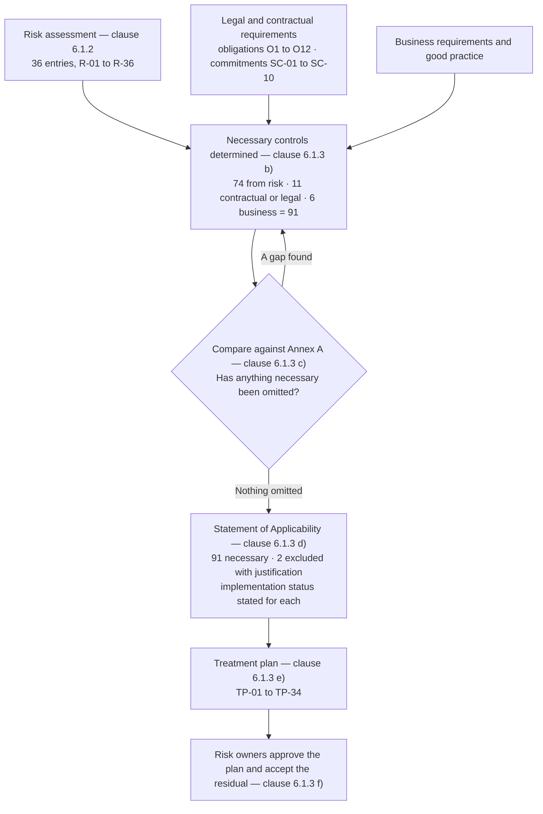

# Diagram — How the Statement of Applicability Was Derived

| Field | Value |
|---|---|
| Document ID | CNB-TRUST-2026-D12 |
| Version | 1.0 |
| Date | 2026-08-11 |
| Owner | Karim Haddad |
| Approver | Elise Fontaine |
| Classification | Confidential — Trust &amp; Assurance Programme // Illustrative Portfolio Sample |

**The arrows only run this way.** Controls are determined necessary by the risk assessment and by legal and
contractual requirements; Annex A is then used to **check** that nothing necessary was missed. Clause
6.1.3 c) is explicit that the comparison is a verification step.

An organisation that starts at Annex A and works backwards has produced a checklist and called it a
management system. It will also, reliably, implement a control it does not need and miss one it does,
because the reference set was written for every organisation and none of them is this one.

## Cross-References

| Document | Relationship |
|---|---|
| [03.08 Statement of Applicability Methodology](../03.08-statement-of-applicability-methodology.md) | The argument |
| [03.09](../03.09-statement-of-applicability-organizational-controls.md) · [03.10](../03.10-statement-of-applicability-people-physical-technological.md) | The 93 rows |
