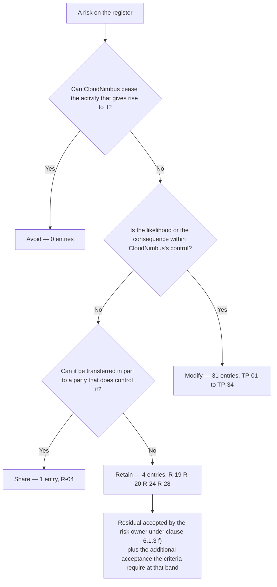

# Diagram — Treatment Decision Flow

| Field | Value |
|---|---|
| Document ID | CNB-TRUST-2026-D11 |
| Version | 1.0 |
| Date | 2026-08-11 |
| Owner | Rahul Bhargava |
| Approver | Karim Haddad |
| Classification | Confidential — Trust &amp; Assurance Programme // Illustrative Portfolio Sample |

**Avoid has no entries, and the zero is stated rather than hidden.** Avoidance means ceasing an activity.
CloudNimbus did not withdraw geolocation, did not stop holding leave type, did not exit the European Union.
A treatment plan that records an avoidance it did not perform is a plan that has learned to fill in a form.

**Each entry takes exactly one disposition**, which is why modification is terminal here and retention is
reached only when neither modification nor sharing is available. The four retained entries carry no
treatment item, and that is the visible consequence of the choice rather than an omission.

Retention terminates in **two signatures, not one**. Clause 6.1.3 f) names the **risk owner** and nobody
else, so the owner accepts the residual; CloudNimbus's own acceptance criteria then add a second signature
at the level the band and the impact rider require. An executive acceptance recorded *instead of* the
owner's would be a clause 6.1.3 f) nonconformity waiting to be raised.

## Cross-References

| Document | Relationship |
|---|---|
| [03.06 Risk Treatment Plan](../03.06-risk-treatment-plan.md) | TP-01 to TP-34 |
| [03.07 Risk Acceptance and Residual Risk](../03.07-risk-acceptance-and-residual-risk.md) | The four retained |
