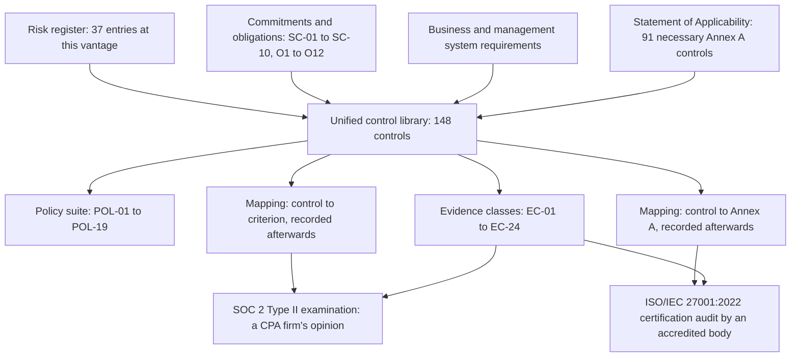

# 04.01 — Control Framework Architecture

| Field | Value |
|---|---|
| Document ID | `CNB-TRUST-2026-401` |
| Version | 1.0 |
| Date | 2026-08-11 |
| Owner | Karim Haddad, VP Security &amp; Trust |
| Approver | Nathan Oyelaran, Chief Technology Officer |
| Classification | Confidential — Trust &amp; Assurance Programme // Illustrative Portfolio Sample |

---

## 1. Why there is a layer here at all

A programme could, in principle, run without a control library. The risk register says what could go wrong.
The Statement of Applicability says which Annex A controls are necessary. The trust services criteria say
what a service organisation's system must achieve. Between them, those three documents appear to describe a
control environment already.

They do not, and the reason is worth stating precisely, because the missing thing is not detail.

**The risk register describes exposure, not response.** A register entry rated 3 × 4 tells you a
consequence and a likelihood. It does not tell you what runs on Tuesday.

**The Statement of Applicability describes necessity, not operation.** Clause 6.1.3 d) asks for the
necessary controls, the justification for including them, whether they are implemented, and the
justification for excluding anything in Annex A. "A.5.18 Access rights — necessary — implemented" is a true
and complete Statement of Applicability entry that tells nobody who reviews access, against what
population, how often, or where the record lives.

**The trust services criteria describe outcomes, and contain no controls at all.** This is the point most
often got wrong. TSP section 100 sets out criteria; the points of focus beneath them are considerations that
may assist in evaluating whether a criterion is met, and are explicitly **not requirements** and not a
checklist. **Management designs and describes the controls; the service auditor evaluates whether those
controls, as designed and as operating, meet the criteria.** There is no published list of "SOC 2 controls"
to adopt, and an organisation that believes there is has already outsourced the only judgement the standard
asks it to make.

So the library is the layer where exposure, necessity and outcome are converted into **something a person
does, on a schedule, leaving a record**. Everything upstream of it is analysis. Everything downstream of it —
the examination, the certification audit, the evidence store — consumes what it produces.

Two features of that diagram are load-bearing. The **mapping arrows leave the library**, they do not enter
it: the library was not assembled by walking the criteria. And the **evidence arrow reaches both
deliverables from one place**, which is the whole of ADR-0001's integrated operating model expressed in a
single line.

## 2. The three properties an examinable control must have

A control statement can be true, well written, technically accurate and completely untestable. The
difference is not in the sentence; it is in what is recorded alongside it. **DEC-401** fixed the library's
schema on 2026-05-04, and no control was admitted without all three properties.

Two of the three are columns of the published tables in 04.04 to 04.07: `Owner` and `Cadence`. **The third
is not a column, and this document says so rather than implying a tenth.** The control-to-evidence
relationship is held in the GRC platform at control level and is published in the other direction — per
evidence class, in 04.12's table, whose `Produced by` column names the controls each class serves. That is
a presentational choice with a consequence worth naming, and §2.3 names it.

### 2.1 A named owner

Not a team. Not a rota. Not "Security". **A person, by name, from the twelve individuals the library draws
on** — and **ADR-0020** records why.

The argument against naming individuals is always the same: people leave, and a library that names them
goes stale. The argument is true and it is the wrong trade. A control owned by "the SRE team" has, in
practice, an owner who is whoever picks it up, and when a sampler asks who performed the March review, the
answer is reconstructed from a calendar. A control owned by Wes Delacroix has an answer to that question
before it is asked. The staleness problem is real and is solved by maintaining the library when a role
changes holder — which is itself `CNB-C-006`, and is the reason that control exists.

There is a second reason, which matters more in a 187-person company than in a large one. **Accountability
that is diffuse is accountability that is negotiable.** CC1.5 asks whether the entity holds individuals
accountable for their internal control responsibilities. An organisation that cannot name the individual
holding a responsibility is answering that criterion with an organisation chart.

### 2.2 A defined cadence

Exactly one of **Continuous, Daily, Weekly, Monthly, Quarterly, Semi-annual, Annual**. Not "regularly", not
"periodically", not "as required".

The cadence is not a description of habit. **It is the declaration from which the auditor derives the
population**, and the population is what tests of operating effectiveness are performed against. A control
declared Monthly has six occurrences in a six-month window; one missed occurrence is a deviation rate of
one in six. A control declared Quarterly has two; one missed occurrence is fifty per cent. A control
declared Annual has one occurrence in the window, or none, and **a control with a population of zero cannot
be tested for operating effectiveness at all, whatever its design**. 04.11 works that arithmetic through
and discloses what CloudNimbus is doing about the ten annual controls whose natural operation falls
outside the window.

The temptation the cadence field resists is the vague word. "Access is reviewed periodically" survives
design review and fails a Type II, because the auditor must first establish what the entity committed to
before it can establish whether the entity did it. An entity that never committed to a frequency has not
designed a control; it has described an activity.

### 2.3 A declared evidence artefact

Every control's evidence class is settled from EC-01 to EC-24 **before the control is built**, and
**ADR-0018** and **DEC-406** make that sequence mandatory rather than customary.

**Where that mapping is recorded matters, and it is not on the row.** The nine columns in 04.04 to 04.07
carry no evidence class; adding a tenth would have put a second many-to-many relationship in a table that
already carries two, and would have made the row the place a reader looks for a sampling unit. The mapping
is recorded **per evidence class** instead: 04.12's table names, in its `Produced by` column, the controls
each of the twenty-four classes serves, and every one of the 148 appears in at least one of those cells.
Underneath both, the GRC platform holds the relationship at control level, which is what an operator and a
sampler actually query.

The cost is real and is stated rather than hidden. **This relationship is not one of the properties the
build harness checks.** The harness parses the nine columns and re-derives the family counts, the type and
cadence distributions, the split and the two coverage claims; it cannot re-derive a mapping that is not in
the columns it parses. Completeness of the control-to-evidence mapping rests on 04.12's table being read
against the library, and on the GRC platform's own record — which is a weaker assurance than the harness
gives the rest of the schema, and is the reason `CNB-C-028` reconciles treatment items against the library
each month with the declared evidence class named in its statement.

This is the direct corrective to **ML-1**. The 2025 Type I management letter recorded that access review
evidence was retained as email threads and screenshots — a form that would not support a Type II sample.
Read carefully, ML-1 is not a finding about access reviews. The reviews happened. It is a finding about
**what the control left behind**, and the lesson the portfolio takes from it is that remediating a control
is not the same as remediating the evidence trail it leaves.

Retention policy does not fix that. Storing an email thread for seven years produces a seven-year-old email
thread. What fixes it is designing the artefact at the same time as the mechanism, and asking a question
that has an uncomfortable answer surprisingly often: **what does one unit of this evidence look like?** A
sampler does not draw "the access review". It draws one system owner's certification of one entitlement
extract on one date, and if that unit does not exist as a discrete, dated, attributable object, the control
cannot be sampled however diligently it was performed. 04.12 defines all twenty-four classes and requires
each to state the artefact, the store, the retention and the sampling unit.

### 2.4 The three together

| Property | The question it answers | What its absence produces |
|---|---|---|
| Named owner | *Who performed it?* | An activity nobody is accountable for |
| Defined cadence | *How many times should it have happened?* | A population the auditor cannot establish |
| Declared evidence artefact | *What may I sample?* | A control that worked and cannot be shown to have worked |

A row missing one of the three is not a weak control. It is a control that will be found suitably designed
and then fail on operating effectiveness for a reason that has nothing to do with security — which is the
most expensive way to fail, because the remediation is not technical and cannot be done retrospectively.

## 3. What the library is not

Three things get folded into control libraries and should not be.

### 3.1 It is not a policy

A policy states a requirement and an intent; it is approved, it applies to people, and it is the instrument
by which management directs. **A control is the mechanism that carries the policy into effect.** POL-03, the
Access Control Policy, says that access is granted on least privilege and reviewed. `CNB-C-040` says that
each quarter every system owner certifies the entitlement extract for the systems they own in the GRC
platform and that the revocations arising are applied and evidenced before the review closes.

The distinction is not pedantry, and **DEC-404** turns it into a check: **every control cites exactly one
policy, and every policy is cited by at least one control.** A control with no policy behind it is a habit
somebody adopted. A policy with no control under it is a wish. Both conditions are common and both are
invisible until the harness looks for them.

### 3.2 It is not a procedure

A procedure is the step-by-step of how the work is done — which console, which query, which button, in what
order. It changes when the tooling changes and it should. **The control is the invariant**; the procedure is
the current implementation of it.

Collapsing the two produces a library that must be re-approved every time a vendor changes a menu, and an
organisation that stops maintaining it within a quarter. The library therefore names the mechanism at the
level of *what enforces this* — "branch protection refuses the merge", "the just-in-time access broker
issues a time-boxed role" — and refers the keystrokes to the operating procedures, which are documented
information under clause 7.5 and are inventoried in 04.10.

### 3.3 It is not a criterion restated

This is the most common defect in a control library and it is worth being blunt about, because it is
usually produced by a diligent person working carefully.

> "Logical access to the system is restricted to authorised users."

That sentence is a paraphrase of CC6.1. It contains no mechanism, no actor, no frequency and nothing to
sample. A service auditor reading it learns that CloudNimbus has read the criterion. It cannot be tested,
because there is no operation to observe: it describes a state that either obtains or does not.

> "Multi-factor authentication is enforced at the identity provider for every internal user and every tenant
> administrator, and conditional access refuses any sign-in from a device the mobile device management
> platform does not report as compliant."

That is `CNB-C-032`. It names the mechanism, the enforcement point, the population and the failure
behaviour. It can be tested by configuration inspection and by re-performance against a sample of sign-ins.
Whether it *meets* CC6.1 is the auditor's judgement, not CloudNimbus's assertion — but there is something
there to judge.

**The test applied to every one of the 148 rows was: strike out the criterion reference and read the
sentence. If it still tells you what happens and who makes it happen, it is a control. If it becomes empty,
it was a restatement.** Rows that failed were rewritten, and the ones that could not be rewritten were
deleted, because a library padded with restatements is a library whose real controls are harder to find.

## 4. One library, two deliverables

The architecture rests on an asymmetry Phase 03 established and this phase inherits. **In ISO/IEC
27001:2022, Annex A is a reference set and a control may be excluded with justification while the ISMS
still conforms**, because conformity is assessed against clauses 4 to 10. **In a SOC 2 examination there is
no equivalent of an exclusion within the categories selected.** Which categories are examined is
management's decision, made at scoping — 01.05 is entirely about that decision, and ADR-0002 records the
proposal to exclude Privacy and its refusal. **CloudNimbus selected all five, so all 61 criteria apply**,
and within them a criterion left unaddressed is a criterion unmet. There is no clause 6.1.3 d) for the
trust services criteria: nothing lets an entity keep a category and set aside a criterion inside it with a
justification.

A single library serves both because the asymmetry is in the *catalogues*, not in the controls. The same
quarterly access review certification serves CC6.2, CC6.3, A.5.18 and A.8.2 at once; it is performed once,
evidenced once, and read twice. What differs is the reading — and that reading, the mapping, is the subject
of 04.03 and is the least reliable artefact this phase produces. It is stated there rather than assumed
here.

## Cross-References

| Document | Relationship |
|---|---|
| [04.02 The Unified Control Library](04.02-the-unified-control-library.md) | The 148 controls this architecture describes |
| [04.03 Mapping Methodology and Its Limits](04.03-mapping-methodology-and-its-limits.md) | The mapping arrows leaving the library, and what they are worth |
| [04.08 Policy Architecture](04.08-policy-architecture.md) | POL-01 to POL-19 and the one-policy-per-control check |
| [04.11 Control Ownership and Operating Cadence](04.11-control-ownership-and-operating-cadence.md) | Owner distribution and the cadence-to-population arithmetic |
| [04.12 Evidence Architecture](04.12-evidence-architecture.md) | EC-01 to EC-24 and the sampling unit rule |
| [03.08 Statement of Applicability — Methodology](../03-risk-assessment-treatment-and-statement-of-applicability/03.08-statement-of-applicability-methodology.md) | Necessity as distinct from operation |
| [01.04 Prior Type I Baseline and Carried Matters](../01-program-foundation-dual-framework-governance/01.04-prior-type-i-baseline-and-carried-matters.md) | ML-1, the finding the evidence property answers |
| [01.02 SOC 2 Landscape and Trust Services Criteria](../01-program-foundation-dual-framework-governance/01.02-soc-2-landscape-and-trust-services-criteria.md) | Points of focus are not requirements; the criteria contain no controls |
| `adr/ADR-0016` | One control library keyed to controls, not to frameworks |
| `adr/ADR-0018` | Every control declares its evidence before it is built |
| `adr/ADR-0020` | No control is owned by a team |

---

← [04.00 Phase README](04.00-README.md) · [Phase 04 README](04.00-README.md) · [04.02 The Unified Control Library](04.02-the-unified-control-library.md) →
