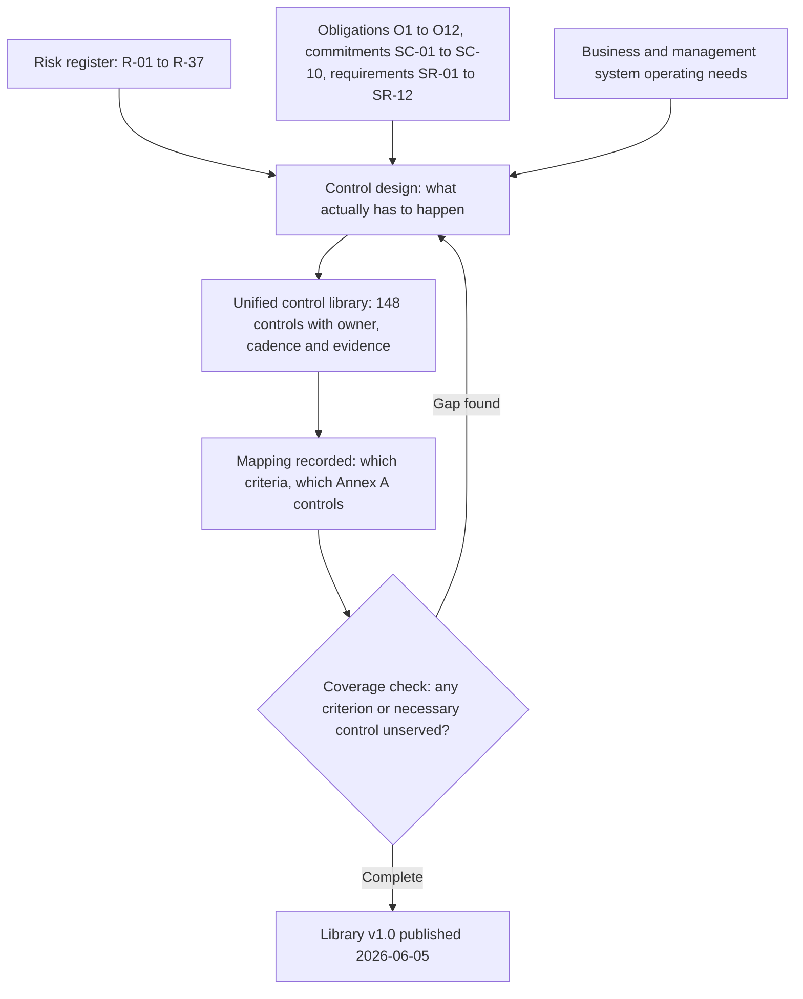

# 04.03 — Mapping Methodology and Its Limits

| Field | Value |
|---|---|
| Document ID | `CNB-TRUST-2026-403` |
| Version | 1.0 |
| Date | 2026-08-11 |
| Owner | Rahul Bhargava, Compliance Manager |
| Approver | Karim Haddad, VP Security &amp; Trust |
| Classification | Confidential — Trust &amp; Assurance Programme // Illustrative Portfolio Sample |

---

## 1. The claim this document makes, and the claim it refuses to make

The last two columns of every row in 04.04 to 04.07 assert a relationship: *this control serves these trust
services criteria, and implements these Annex A controls.* Several hundred such assertions, one cell at a
time, make up CloudNimbus's crosswalk, and the crosswalk is what allows one control library to feed two
assurance products.

**The claim this document makes is that the crosswalk is complete and internally consistent.** Every one of
the 61 criteria is served. Every one of the 91 necessary Annex A controls is implemented. No control cites
a criterion outside the 61 or an Annex A control outside the 91, and the two controls determined not
necessary — **A.7.11 supporting utilities** and **A.7.12 cabling security** — appear nowhere in the library.
Those are checkable properties and the build harness checks them on every run.

**The claim this document refuses to make is that the crosswalk is authoritative.** It is not. No regulator,
no standards body and no professional body publishes, endorses, reviews or blesses a mapping between the
2017 trust services criteria and Annex A of ISO/IEC 27001:2022. The AICPA publishes criteria; ISO publishes
a management system standard with a normative reference set of controls; neither publishes a translation
between them, and neither has any obligation to accept one. **A framework mapping is an assertion by the
mapper.** This mapping is CloudNimbus's, made by CloudNimbus, defensible or indefensible on CloudNimbus's
own reasoning — and this position is carried unchanged from 01.06 and 03.12, where it was first stated.

The practical consequence is precise. Meredith Vance's engagement team will evaluate whether the controls
CloudNimbus describes meet each criterion, reading the controls and the evidence, **not the mapping**.
Ingrid Halvorsen's team will assess conformity against clauses 4 to 10 and examine the Statement of
Applicability, **not the mapping**. Neither party is bound by a cell in the `Criteria` column, and neither
will treat a citation as an argument. The crosswalk is an internal navigation instrument that lets one
evidence programme answer two questions. It is not evidence of anything.

## 2. The direction of derivation

**DEC-402**, taken on 2026-05-04, states the rule in one line: **controls are designed from risks and
commitments; the mapping is recorded afterwards.** It exists to prevent a specific and very common failure,
and the failure is worth describing because it does not look like a failure while it is happening.

A programme under time pressure opens TSP section 100, reads CC6.1, and writes a control that will satisfy
CC6.1. Then CC6.2, then CC6.3. In six weeks it has a library with perfect coverage, every criterion
addressed, no gaps, and a coverage matrix that is a solid rectangle of green. The library is also, in a way
that is difficult to see from inside, **a set of controls designed to be auditable rather than designed to
work.**

The symptoms are consistent. Controls cluster tightly around the wording of the criteria and thin out
wherever the criteria are silent, even though the risk register is not silent there. Every control maps to
exactly one criterion, because each was written to answer one. The library contains nothing the criteria
did not prompt — no control for the thing that actually keeps the Director of Infrastructure awake, unless
a criterion happened to mention it. And the register-to-control traceability, when anyone builds it, is
sparse: the controls were derived from a catalogue, so they trace to a catalogue.

CloudNimbus derived in the other direction, from the same three sources Phase 03 used to determine
necessity:

The loop back from the coverage check is the honest part of the diagram, and it is where the two directions
touch. **The check is allowed to send work back into design; it is not allowed to write a control itself.**
When the check found that no library control served CC1.2 — board oversight of the control environment —
the answer was not to draft a control that recites CC1.2. It was to ask what the Audit &amp; Risk Committee
actually does, and to write `CNB-C-004`: the Committee receives a written trust and security report each
quarter and minutes the challenges it puts and the actions it directs. That control would exist if CC1.2
did not.

**The test of which direction was travelled is easy to apply and hard to fake.** Ask why a specific control
is in the library. A derived library answers with a risk, an obligation or an operating need. A
reverse-engineered one answers with a criterion reference — which is the control's own mapping cited as its
own justification.

## 3. The mapping is many-to-many in both directions

A crosswalk drawn as a table with one row per criterion invites the reading that each criterion has *a*
control. It does not.

| Relationship | Shape | Example |
|---|---|---|
| One control → many criteria | Common | `CNB-C-040`, the quarterly entitlement certification, serves **CC6.2 and CC6.3** |
| One criterion → many controls | The norm | **CC6.1** is served by thirteen controls in 04.05 alone |
| One control → many Annex A controls | Common | `CNB-C-048` implements **A.7.3, A.7.5, A.7.6 and A.7.7** |
| One Annex A control → many controls | The norm | **A.8.32** is implemented by five separate change-management controls |
| One control → criteria in more than one family | Deliberate | `CNB-C-021` sits in the CC3 family and serves **CC3.4 and CC8.1** |

The last row matters more than it looks. The `Family` column is a navigation label, so a control's family
does not constrain which criteria it may serve. Significant-change assessment is filed under CC3 because
that is where a reader looks for it, and it is also part of how CloudNimbus meets CC8.1. Forcing every
control to serve only criteria within its own family would either duplicate the control or falsify the
mapping, and both are worse than a slightly untidy table.

The cardinality also disposes of a tempting metric. **Counting controls per criterion measures how finely
the control statements were cut, not how well the criterion is met.** Thirteen controls against CC6.1 does
not make logical access thirteen times better than one control would; it means access control at
CloudNimbus is expressed as thirteen separately-owned, separately-evidenced mechanisms. The number to look
at is not the count but the concentration — which is §5.

## 4. The coverage claim

| Claim | Position |
|---|---|
| Trust services criteria in scope | **61** — CC 33, A1 3, PI1 5, C1 2, P 18 |
| Criteria served by at least one library control | **61 of 61** |
| Annex A controls determined necessary | **91** |
| Necessary Annex A controls implemented by at least one library control | **91 of 91** |
| Annex A controls determined **not** necessary | **2** — A.7.11, A.7.12 — cited by **no** control |
| Controls citing a criterion outside the 61 | **0** |
| Controls citing an Annex A control outside the 91 | **0** |

Two clarifications keep this table honest.

**Coverage is a completeness property, not a sufficiency property.** "Every criterion is served by at least
one control" says the library has an answer for each criterion. It does not say the answer is adequate, and
CloudNimbus is not in a position to say so — that determination belongs to the service auditor, criterion
by criterion, on evidence, after a period of operation. A coverage matrix with no blank cells is the
beginning of the argument and not the end of it.

**Coverage of Annex A is a different kind of statement again.** The Statement of Applicability already
determined the 91 necessary and recorded whether each was implemented; clause 6.1.3 c) requires only the
comparison that verifies nothing necessary was omitted. The library's Annex A column adds the *how*. It
does not re-open the determination, and if a library control's Annex A citation is wrong, the Statement of
Applicability is unaffected — which is why the two documents are kept apart.

### 4.1 Where this library diverges from 03.12, and the shape of the divergence

Phase 03 published a forecast of the overlap before the library existed. Phase 04 has now built the
library. The two do not agree, and the disagreement is one-sided in a way that has to be reported rather
than absorbed.

| Measure | 03.12 §5.2, published 2026-04-30 | This library, at 2026-06-30 |
|---|---|---|
| Applicable trust services criteria | 61 | 61 |
| Served by at least one control that cites an Annex A control | **44** | **55** |
| Served exclusively by controls with no Annex A citation | **17** | **6** |

The six are **CC1.2**, **CC3.1**, **CC3.2**, **CC3.3**, **P1.1** and **P3.2**. Eleven of Phase 03's
seventeen are now served by at least one Annex A-citing control, and each of the eleven has a named row
behind it rather than a rounding.

| Criterion | 03.12's reasoning | The control that now carries an Annex A citation |
|---|---|---|
| CC1.1 | Commitment to integrity and ethical values is a COSO construct | `CNB-C-001` cites A.5.4, A.6.2 and A.6.6; `CNB-C-002` cites A.6.1 — management responsibilities, terms of employment and screening |
| CC2.1 | Quality of information is broader than clause 7.4 and A.6.3 | `CNB-C-014` cites A.5.31 — the obligations register and the applicable requirements list are the quality-information source CC2.1 asks about |
| CC3.4 | Risk assessment is clause 6.1, not Annex A | `CNB-C-021` cites A.5.8 and A.8.27; `CNB-C-022` cites A.5.9 and A.5.22; `CNB-C-086` cites A.8.25 and A.8.27 — significant change is assessed by security-in-project-management controls |
| CC4.2 | Evaluating and communicating deficiencies is clause 9 | `CNB-C-023` cites A.5.36 and `CNB-C-075` cites A.5.27 — compliance monitoring and learning from incidents |
| CC5.1 | Selecting control activities is clause 6 | `CNB-C-007` and `CNB-C-029` cite A.5.3 — segregation of duties is a selected control activity |
| PI1.1 | No Annex A control asks about a derivation | `CNB-C-104` cites A.8.26 for rule-set schema validation only; `CNB-C-103` still cites nothing |
| PI1.3 | As PI1.1 | `CNB-C-109` cites A.5.33 for the immutability of the run record; `CNB-C-107` and `CNB-C-108` still cite nothing |
| PI1.5 | As PI1.1 | `CNB-C-113` cites A.8.26 for the constraint-set conformance check; `CNB-C-112` still cites nothing |
| P2.1 | A.5.34 is one control facing eighteen criteria | `CNB-C-123` cites A.5.34 — purpose recorded per optional collection |
| P7.1 | As P2.1 | `CNB-C-125` and `CNB-C-130` cite A.5.34 — data quality maintained through inventory reconciliation and end-user correction |
| P8.1 | As P2.1 | `CNB-C-133` cites A.5.34 and A.5.36 |

**04.06 is now the authoritative statement, and 03.12 §5.2 is superseded on this point.** The reason is not
that Phase 04 is later. It is that 03.12 §5.2 asked a question about catalogues — *does a criterion require
what an Annex A control requires?* — and answered it before any control existed, while this library answers
a question about rows: *does a control that serves this criterion also implement an Annex A control?* A
criterion can have no Annex A analogue in the first sense and still be served by a control that legitimately
cites one, because a control is usually broader than either catalogue's entry for it. Phase 03 said as much
about its own assumption: the one-to-one model was "a modelling convenience adopted before Phase 04 builds
the library, and Phase 04 is where it will be tested against controls that actually exist."

**And that explanation, which is true, is not sufficient — because of what happened on the other side.**

The Annex A side of this library reproduces 03.12 §5.1 **exactly**. The same nine controls map to no
criterion: A.5.6, A.5.7, A.5.30, A.5.32, A.7.13, A.8.17, A.8.23, A.8.30, A.8.34. Not eight, not ten. Nine,
and the same nine.

A model that was a convenience should have been wrong in both directions and by a similar order. Diverging
by eleven on one side and by zero on the other is the signature of **one column having been fitted to a
forecast**, and it is worth saying which column that would be: the ISO-only population is 15, of which nine
are the unmapped Annex A controls, and 04.07's chapter structure is built on the nine. A library assembled
with 03.12 §5.1 open on the desk would produce exactly nine, and would produce it whether or not nine was
the right answer.

**This is a direct stress-test failure for DEC-402**, the direction-of-derivation rule this phase calls its
centre of gravity. §2 above sets out the test — ask why a specific control is in the library, and a derived
library answers with a risk, an obligation or an operating need. Applied to `CNB-C-134` through
`CNB-C-142`, the honest answer for at least some of them is *because 03.12 §5.1 named nine and this chapter
needed nine rows.* That is derivation from a catalogue, which is the failure DEC-402 exists to prevent, and
it survived because it was hidden inside a chapter organised around an inherited list rather than inside a
single suspicious row.

Three things follow, and none of them is a defence.

**The nine may nonetheless be right.** A.5.6, A.5.7 and A.8.23 are controls CloudNimbus kept without any
criterion asking for them; A.5.32 and A.8.17 are not risk-justified at all; A.8.34 has no counterpart in
the criteria. Each has an argument that does not depend on the number. But an argument produced after the
number was fixed is not the same as an argument that produced it.

**One of the nine is now demonstrably weaker than the list implies.** A.5.30 is cited by `CNB-C-136` and, as
of the correction in 04.07 §2, also by `CNB-C-100` — a criteria-bearing control. It is the member 03.12
itself named as most open to challenge, and it is now the member with the least claim to being unmapped.

**A.8.30 is the pair that will not hold.** 04.03 §6 records it as a known-weak pairing rather than leaving
it inside a count.

**The remedy is disclosure and re-derivation, in that order.** This subsection is the disclosure. The
re-derivation — testing each of the nine against the question *would this control exist if 03.12 had not
named it?* — is an input to Phase 05, and it is recorded in the RAID log rather than promised here.
**03.12 §5.4 set the standard when it found itself apparently contradicting 01.06**, and the sentence it
used applies unchanged: recording it is cheaper than leaving two issued phases to be compared by somebody
with no way of telling which is wrong.

## 5. The three criteria served by exactly one control

Every criterion in the library is served by two or more controls, with three exceptions:

| Criterion | What it asks | Controls serving it | Where |
|---|---|---|---|
| **CC5.3** | Control activities are deployed through policies that establish what is expected and procedures that put those policies into action | **`CNB-C-031`** — each policy names the procedures that carry it into effect, and the Compliance Manager confirms each year that every named procedure exists, has an owner and has been reviewed within twelve months | 04.04 |
| **C1.2** | Confidential information is disposed of to meet the entity's objectives related to confidentiality | **one control** | 04.06 |
| **P3.2** | Explicit consent for sensitive personal information is obtained and documented, where required | **one control** | 04.06 |

**This is a concentration and it is named here rather than left to be found.**

The consequence is arithmetically simple and worth stating without softening. A criterion served by one
control has, in a Type II examination, a single point of support. **If that control has a test exception,
there is nothing to fall back on.** For a criterion served by four controls, a deviation in one is evaluated
in the context of the other three, and the auditor's question is whether the criterion was nonetheless met.
For a criterion served by one, the same deviation is the whole of the evidence about that criterion, and
the question becomes much narrower.

**The concentration is worst for CC5.3, and cadence is why.** `CNB-C-031` operates annually, and on its
natural anniversary it would not have operated inside the window at all. The procedure inventory was
completed with the policy suite on **2026-06-12**, which put the next occurrence in June 2027 — so CC5.3,
already served by one control, would have had **no testable occurrence in the period**. `CNB-C-031` is one
of the ten annual controls re-scheduled under DEC-409, and its new occurrence falls in **2026-09**. That
re-scheduling is load-bearing rather than tidy, and 04.11 §4.3 says so at length: it is the difference
between CC5.3 being supported by one occurrence and CC5.3 being supported by none. Even after it, the
population is one — one occurrence performed correctly is a clean result, while one occurrence performed
late is a hundred per cent deviation rate on a population of one. The other two single-control criteria are
better placed rather than worse: `CNB-C-118`, the sole
control serving C1.2, operates monthly and therefore offers six occurrences, and `CNB-C-121`, the sole
control serving P3.2, operates continuously and is sampled from system records. Thin support with a thick
population is survivable. Thin support with a population of one is not. **A single-control criterion with a low-frequency control is the sharpest exposure a
control library can create**, because it combines the thinnest possible support with the thinnest possible
population.

**What would fix it, and why it has not been done yet.** The fix is not to write a second control that
restates the first — that produces two rows and one mechanism, and a sampler testing both will find the
same failure twice. The fix is to identify a *genuinely distinct* mechanism that also serves the criterion:
for CC5.3, a procedure-currency check operating at a higher frequency against a different population, for
instance a monthly confirmation that each procedure referenced by a change deployed in the period was
current at the time of deployment. That control does not exist today because the procedure inventory was
only completed with the policy suite on 2026-06-12, and adding an untested second control four days before
this vantage would have produced a row with no operating history and no evidence — which is the appearance
of coverage rather than coverage.

**So CloudNimbus is carrying the concentration knowingly into the observation window and disclosing it
here.** It is recorded in the RAID log, it is an input to the Phase 05 and Phase 06 control build, and it is
the kind of thing that is much easier to defend when it was written down in advance than when it is
explained afterwards.

## 6. What could still be wrong with this mapping

Four things, stated plainly.

**A citation can be too generous.** A control that touches the edge of an Annex A control's subject matter
can be cited as implementing it. The discipline applied was to ask whether the control would satisfy a
reasonable auditor asking *how do you do A.5.18*, and citations that only survived by paraphrase were
removed. That discipline is a judgement, exercised by two people, and it is not infallible.

**The known-weak pairs, named rather than counted.** One pairing in this library does not survive the test
in the paragraph above and is kept anyway, and the honest thing is to say which and why.

**A.8.30 Outsourced development, cited by `CNB-C-141`.** A.8.30 requires the organisation to **direct,
monitor and review** the activities of outsourced system development. `CNB-C-141` is a curated internal
registry: third-party dependencies, base images, infrastructure modules and vendor client libraries enter
only through it, approved sources are re-approved annually, and a source not re-approved is removed and its
artefacts rebuilt. That is supply-chain control over acquired components. **Consuming an open-source
library is not outsourcing development**, and no reasonable auditor asking *how do you direct, monitor and
review your outsourced development* would be satisfied by a registry of dependencies.

The citation is kept because removing it would leave A.8.30 implemented by nothing, and Phase 03 determined
A.8.30 necessary. But that is a reason to keep a cell populated, not a reason to believe it. The strain
resolves in one of two directions and CloudNimbus has not yet established which: **either CloudNimbus
outsources some development — contract engineering, an offshored component, a vendor building to
specification — and no control in this library says so, in which case there is a control missing and an
asset the risk assessment has not seen; or A.8.30 should have been argued for exclusion in Phase 03 on the
basis that CloudNimbus outsources no development, and it was not argued.** 03.11 records four controls
proposed for exclusion and refused; A.8.30 was not among the proposals. The determination it received was
therefore necessity by default rather than by argument.

This is recorded here, carried into the RAID log, and is an input to Phase 05. It is not resolved by
writing a better sentence in the `Control` column, because the question is about what CloudNimbus does, not
about how the row is worded.

**A citation can be too thin.** The opposite error is a control that genuinely serves a criterion and does
not cite it, which produces an artificially low count against that criterion and — worse — hides a real
piece of support from the reader. The build harness cannot detect this at all: it can only check that every
criterion has at least one control, never that every control lists every criterion it serves.

**The whole crosswalk rests on a reading of two documents that were not written to be read together.** The
trust services criteria are organised around a service organisation's system and, for CC1 to CC5, around
the seventeen COSO principles. Annex A is organised around four themes of information security control.
Where they align, the mapping is obvious and uncontroversial. Where they do not — the ISMS machinery in
04.07 is the clearest case — CloudNimbus records `—` rather than manufacturing a correspondence. **A blank
cell in this library is a finding about the frameworks, not a gap in the controls**, and 04.07 makes that
argument in full for the six controls that implement clause requirements Annex A does not contain.

## 7. DC5 and DC8, which 02.02 assigned to this phase

02.02 allocated the nine description criteria across the portfolio and left two for Phase 04. Neither
string has appeared in this phase until now, which is how an assigned obligation goes quietly missing, so
both are answered here in the document that governs the mapping they depend on.

**DC5 — the applicable trust services criteria and the controls related to them — is answered by the
`Criteria` column across 04.04 to 04.07.** Every one of the 61 applicable criteria is named against at
least one control, and every control that serves a criterion names which. That is the raw material of
Section IV of the examination report: the criterion, the controls management asserts meet it, and — later,
and not here — the tests the service auditor performed and the results. What this phase supplies is the
first two. The `Annex A` column beside it answers nothing in DC5 and is present for the other deliverable.

**DC8 — the specific criteria not relevant to the system, and why — is answered "none".** All 61 apply, and
the reason is a decision rather than an accident: **management selected all five trust services categories
at scoping**, which 01.05 records in full and ADR-0002 argues, including the refusal of the proposal to
exclude Privacy. Once a category is selected, every criterion within it is in scope; there is no mechanism
in the trust services criteria for setting one aside the way clause 6.1.3 lets an Annex A control be
excluded with justification. So DC8's answer is short, and its shortness is the consequence of the earlier
decision rather than of nothing having been considered.

Two things follow that are worth stating so that DC8's "none" is not read as complacency. **A criterion can
be in scope and thinly served**, which is what §5 above is about — and DC8 is not the place that
disclosure belongs. And **DC8 is not a place to record a criterion the entity found inconvenient**: had
Privacy been excluded, DC8 would have carried eighteen criteria and the reasoning would have had to survive
a reader who knows the mobile application captures geolocation at clock-in.

## Cross-References

| Document | Relationship |
|---|---|
| [04.02 The Unified Control Library](04.02-the-unified-control-library.md) | The 112/21/15 split derived from the columns this document governs |
| [02.02 Service Description and System Components](../02-system-scope-isms-boundary-and-description/02.02-service-description-and-system-components.md) | The DC1 to DC9 allocation that assigned DC5 and DC8 to this phase |
| [01.05 Trust Services Category Selection](../01-program-foundation-dual-framework-governance/01.05-trust-services-category-selection.md) | The five-category selection behind DC8's answer of "none" |
| [04.04 Controls for CC1–CC5](04.04-controls-for-the-common-criteria-cc1-to-cc5.md) | `CNB-C-031`, the single control serving CC5.3 |
| [04.06 Controls for A1, PI1, C1 and P](04.06-controls-for-availability-processing-integrity-confidentiality-and-privacy.md) | The single controls serving C1.2 and P3.2 |
| [04.07 ISO-Only Controls and ISMS Machinery](04.07-iso-only-controls-and-isms-machinery.md) | Why six controls carry `—` in both mapping columns |
| [03.12 Risk to Criteria and Annex A Traceability](../03-risk-assessment-treatment-and-statement-of-applicability/03.12-risk-to-criteria-and-annex-a-traceability.md) | The three Phase 03 mappings and their unequal standing |
| [03.11 Controls Argued and Refused](../03-risk-assessment-treatment-and-statement-of-applicability/03.11-controls-argued-and-refused.md) | A.7.11 and A.7.12, which appear nowhere in the library |
| [01.06 Dual-Framework Strategy and Integration Model](../01-program-foundation-dual-framework-governance/01.06-dual-framework-strategy-and-integration-model.md) | Where the "a mapping is an assertion by the mapper" position originates |
| `adr/ADR-0016` | One library keyed to controls, not to frameworks |
| `logs/decision-log.md` | DEC-402 — design from risks and commitments; record the mapping afterwards |

---

← [04.02 The Unified Control Library](04.02-the-unified-control-library.md) · [Phase 04 README](04.00-README.md) · [04.04 Controls for the Common Criteria CC1–CC5](04.04-controls-for-the-common-criteria-cc1-to-cc5.md) →
