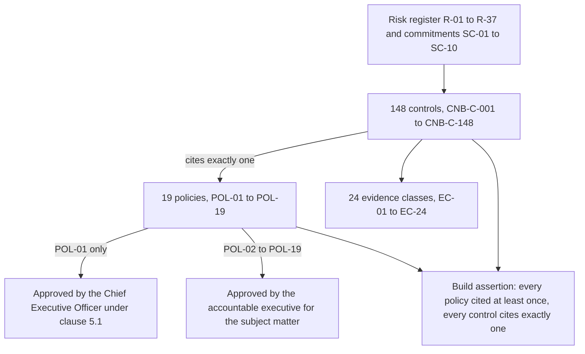

# 04.08 — Policy Architecture

| Field | Value |
|---|---|
| Document ID | `CNB-TRUST-2026-408` |
| Version | 1.0 |
| Date | 2026-08-11 |
| Owner | Rahul Bhargava, Compliance Manager |
| Approver | Karim Haddad, VP Security &amp; Trust |
| Classification | Confidential — Trust &amp; Assurance Programme // Illustrative Portfolio Sample |

---

## 1. Nineteen policies, approved 2026-06-12

The policy suite was approved on **2026-06-12** (MS-08) under **DEC-411**, seven days after the control
library was published at v1.0. **That order is deliberate and it is the opposite of the usual one.** Most
programmes write policies first, because policies are the artefact a buyer asks for and the artefact a
template vendor sells. CloudNimbus wrote the controls first, from the risk register and the commitments,
and then wrote the policies the controls needed to rest on. **DEC-402** records the general form of that
rule for controls; **DEC-403** and **DEC-404** apply it to policies.

| ID | Policy | Owner | Approver | What it authorises |
|---|---|---|---|---|
| POL-01 | Information Security Policy | Karim Haddad | Elise Fontaine | The clause 5.2 policy; the framework for objectives and the commitment to requirements and improvement |
| POL-02 | Acceptable Use Policy | Karim Haddad | Elise Fontaine | Use of CloudNimbus systems, data and devices by 187 staff; the removable-media prohibition; web filtering |
| POL-03 | Access Control Policy | Wes Delacroix | Karim Haddad | Identity, authorisation, privileged access, joiner-mover-leaver, the quarterly review |
| POL-04 | Asset Management Policy | Wes Delacroix | Karim Haddad | The 1,046-asset inventory, ownership, acceptable handling by class |
| POL-05 | Cryptography and Key Management Policy | Wes Delacroix | Karim Haddad | Algorithms, customer-managed keys, region scoping, rotation |
| POL-06 | Data Classification and Handling Policy | Devon Ashby | Karim Haddad | The four-tier scheme, labelling, export and masking rules |
| POL-07 | Data Retention and Deletion Policy | Devon Ashby | Tobias Lund | RT-01 to RT-08, the deletion orchestrator and the offboarding certificate |
| POL-08 | Privacy Policy | Tobias Lund | Elise Fontaine | Notice, choice, purpose, data subject requests, complaints, disclosures |
| POL-09 | Secure Development Policy | Junia Okonkwo | Nathan Oyelaran | Design review, secure coding, testing, environment separation, third-party code |
| POL-10 | Change Management Policy | Junia Okonkwo | Nathan Oyelaran | Peer review, branch protection, promotion, emergency change |
| POL-11 | Vulnerability and Patch Management Policy | Wes Delacroix | Karim Haddad | Scanning, severity SLAs, penetration testing, remediation tracking |
| POL-12 | Logging and Monitoring Policy | Karim Haddad | Nathan Oyelaran | What is logged, the `cnb-security` archive, alerting, threat intelligence |
| POL-13 | Incident Response Policy | Karim Haddad | Elise Fontaine | Severity, triage, the 48-hour notification path, post-incident review |
| POL-14 | Business Continuity and Disaster Recovery Policy | Wes Delacroix | Elise Fontaine | RTO/RPO, backup, capacity, exercises, ICT continuity requirements |
| POL-15 | Supplier and Third-Party Security Policy | Tobias Lund | Marisol Vega | Vendor assessment, DPAs, sub-processor notice, subservice organisation monitoring |
| POL-16 | Human Resources Security Policy | Hannah Brill | Karim Haddad | Screening, terms, awareness training, disciplinary process, offboarding |
| POL-17 | Remote Working and Endpoint Policy | Hannah Brill | Karim Haddad | The 231 managed devices, home-working siting, MDM baseline and maintenance |
| POL-18 | Physical and Environmental Security Policy | Hannah Brill | Karim Haddad | The Denver suite: entry control, visitor log, clear desk, equipment disposal |
| POL-19 | Compliance and Documented Information Policy | Rahul Bhargava | Karim Haddad | Clause 7.5 control of documents, records, licence compliance, audit conduct |

## 2. Why nineteen, and not one, and not fifty

Two failure modes bracket this decision, and both are common enough to have a recognisable shape.

**One document.** A single "Information Security Manual" of 120 pages covering everything from key rotation
to background screening. It satisfies clause 5.2 in the sense that a policy exists, and it fails everything
else. It has one owner, so the person accountable for background screening is the person accountable for
TLS cipher suites; it has one approval, so a change to the endpoint baseline requires re-approval of the
entire manual by whoever approved it; and it has one review cycle, so the whole document ages at the speed
of its slowest section. Its real defect is at the point of use: **nobody reads a 120-page manual to find
out whether they may plug in a USB drive**, and a policy nobody consults is not a control environment, it
is a compliance artefact.

**One document per control.** The opposite failure, and the one an automated GRC tool encourages, because
it can generate them. A hundred and forty-eight policy documents, each restating its control in the
imperative, each with a version history, each requiring annual review. The suite becomes unmaintainable
within a year, the documents drift apart on shared subject matter — three of them will define "privileged
access" differently — and the distinction between a policy and a procedure collapses entirely. **A policy
states what must be true and who decides; a procedure states how it is done.** A document that exists to
describe one control's mechanism is a procedure wearing a policy's cover sheet.

Nineteen is the number that falls out of asking a different question: **what are the distinct subject
matters over which a distinct person can reasonably be accountable?** Each of the nineteen has an owner who
could be asked, in an audit interview, to explain its content and defend its decisions without referring
the question elsewhere. Devon Ashby can answer for retention; Hannah Brill can answer for the endpoint
baseline; Grete Lindqvist does not own a policy at all, because calculation correctness is governed by
POL-09's development requirements rather than by a policy of its own — and inventing a "Calculation
Integrity Policy" so that the Processing Integrity family had one to cite would have been exactly the
inflation this suite avoided.

## 3. Every control cites exactly one policy

**DEC-404**, taken by Rahul Bhargava on 2026-05-11 and recorded in **ADR-0017**, requires that every one of
the 148 controls cite **exactly one** policy, and that every one of the nineteen policies be cited by at
least one control. The build harness asserts both and fails the build on either.

The reason for the check is a single sentence, and it is the argument this chapter exists to make.

> **A control with no policy behind it is a habit, and a policy with no control under it is a wish.**

Neither half of that is rhetorical.

**A control with no policy behind it is a habit.** It may be a good habit — a well-run engineering
organisation is full of practices that work and that nobody has ever written down as a rule. The problem is
what happens when the person who holds the habit leaves, or when two teams hold slightly different versions
of it, or when someone senior asks for an exception. A habit has no authority to point at, so the exception
is granted by whoever is in the room. A control that cites POL-10 can be argued about in terms of what
POL-10 says and who approves a departure from it. **ML-2 in the 2025 Type I management letter is precisely
this failure**: change-management peer review was enforced by team convention rather than by branch
protection, and the auditor's finding was not that the practice was bad but that its enforcement rested on
nothing anyone could produce.

**A policy with no control under it is a wish.** This half is the one that produces the more embarrassing
audit conversation. A policy that requires quarterly review of privileged access, with no control operating
quarterly, no owner and no artefact, is a written commitment the organisation is failing to meet — and it
is failing to meet it in a document it wrote itself, published internally, and handed to the auditor on
day one. **An unimplemented policy is worse than a missing one**, because it converts an absence into a
documented departure from a stated rule. This is the check's real value: it is not a completeness check on
the library, it is a truthfulness check on the policy suite.

The **exactly one** part is a separate decision and it is about maintenance rather than about principle. A
control could honestly cite two or three policies — `CNB-C-118`, the offboarding deletion certificate,
touches retention, classification and supplier obligations. Permitting multiple citations makes the reverse
question unanswerable: when POL-07 changes, which controls have to be re-assessed? With exactly one
citation the answer is a lookup. With several it is a judgement, and judgements at that volume are made
inconsistently and then not revisited. The cost is that the citation records the **governing** policy
rather than every relevant one, and 04.03's warning applies here as it does to the framework mapping: the
column is an assertion by the mapper, and it is a simplification made knowingly.

## 4. One policy is approved by the Chief Executive Officer, and eighteen are not

**POL-01 is the clause 5.2 information security policy**, and Elise Fontaine approves it as top management
under clause 5.1. She approves four of the other eighteen as well — POL-02, POL-08, POL-13 and POL-14 —
because acceptable use, privacy, incident response and continuity each carry organisation-wide obligations
that cross every function and commit the company externally. The remaining fourteen are approved by the
accountable executive for the subject matter: Karim Haddad for nine, Nathan Oyelaran for three, Tobias Lund
for one, Marisol Vega for one.

This is a decision that looks like a shortcut and is not, and **DEC-411** records it as taken rather than
assumed.

The temptation is to have the Chief Executive Officer approve all nineteen, on the reasoning that
leadership commitment is a clause 5.1 requirement and a signature is cheap. The reasoning is wrong in two
directions at once.

**First, clause 5.1 has eight limbs, and approving documents is not one of them.** Top management shall
demonstrate leadership and commitment with respect to the ISMS by:

| Limb | What it asks of top management |
|---|---|
| a) | Ensuring the information security policy and the objectives are established and are **compatible with the strategic direction** of the organisation |
| b) | Ensuring the **integration of the ISMS requirements into the organisation's processes** |
| c) | Ensuring the **resources** needed for the ISMS are available |
| d) | **Communicating the importance** of effective information security management and of conforming to the ISMS requirements |
| e) | Ensuring the ISMS **achieves its intended outcomes** |
| f) | **Directing and supporting persons** to contribute to the effectiveness of the ISMS |
| g) | **Promoting continual improvement** |
| h) | **Supporting other relevant management roles to demonstrate their leadership** as it applies to their areas of responsibility |

Signing nineteen documents is not evidence of any of the eight, and an auditor who asks Elise Fontaine to
explain the cryptographic key rotation standard she approved is asking a question the approval made
available.

**Limb h) is where the delegated-approval argument is strongest, and it is the limb the "sign everything"
instinct actively works against.** h) asks top management to *support other management roles in
demonstrating leadership in their own areas*. A Chief Executive Officer who approves the Access Control
Policy has not supported the Director of Infrastructure &amp; SRE in demonstrating leadership over access
control; she has taken the demonstration away from him and performed a weaker version of it herself. The
arrangement CloudNimbus operates is the one h) describes: Wes Delacroix owns POL-03 and Karim Haddad
approves it, Devon Ashby owns POL-07 and Tobias Lund approves it, and each of those approvals is a
management role demonstrating leadership in an area it actually governs — with POL-01 above them stating
that a subordinate policy may not authorise what POL-01 forbids. **Reading clause 5.1 as a requirement for
top-management signatures satisfies none of the eight limbs and defeats one of them outright.**

**Second, an approval that the approver cannot defend devalues the approvals they can.** The signature on
POL-01 means the Chief Executive Officer has read a document about the organisation's purpose, its
commitments and its improvement obligations, and has agreed to it. If the same signature appears on the
endpoint baseline, the vulnerability severity table and the visitor log procedure, its meaning erodes to
"this document reached the executive assistant's queue". CloudNimbus has **no CISO title** — a fact that
made clause 5.3 role assignment explicit rather than inferred — and in an organisation with that shape the
integrity of who approves what is doing more work than usual.

What makes the delegation correct rather than a shortcut is that **it is recorded and bounded**. POL-01
states that the subordinate policies exist, names them, states who owns and approves each, and states that
a subordinate policy may not authorise anything POL-01 forbids. The hierarchy is a hierarchy of authority
and not merely of filing. A change to POL-05 that contradicted POL-01 would be out of order, and the
person who would catch it is the owner of POL-01 — who is also, by design, not its approver.

## 5. Structure, review and the exception route

Each of the nineteen carries the same eight sections: purpose, scope, the rules themselves, roles and
responsibilities, the controls that implement it, the exception route, the review cycle, and the version
history. Two of those eight are worth naming.

**The controls section is generated, not written.** Each policy lists the library controls citing it, and
the list is produced by the build harness from the control tables rather than maintained by hand. A policy
whose control list is written prose goes stale the first time a control is retired, and then reads as a
statement about controls that no longer exist.

**The exception route is stated in every policy**, because a policy with no exception route does not get
fewer exceptions; it gets undocumented ones. An exception is requested against a named clause, granted by
the policy's approver for a stated period with a compensating measure, recorded in the exception register,
and expires rather than lapsing quietly. The register is documented information under POL-19 and is
reviewed at the Trust Committee monthly.

**All nineteen are reviewed annually under CAL-13**, and out of cycle when a change to the risk register,
the Statement of Applicability, an obligation or a control makes a clause wrong. The annual review is one
of the controls whose cadence gives it a population of one inside a six-month window, and
[04.11](04.11-control-ownership-and-operating-cadence.md) deals with what that means.

## 6. What the suite does not do

It does not make CloudNimbus compliant with anything. **A policy is a statement of what the organisation
requires of itself**, and neither the examination nor the certification assesses whether that statement
satisfies a law. Tobias Lund owns POL-08 as General Counsel and Data Protection Officer, and the privacy
obligations that bear on CloudNimbus are his to advise on; POL-08 records the commitments CloudNimbus has
made and the controls that keep them, which is a narrower thing and the only thing this programme can
evidence.

It also does not replace procedures. Nineteen policies sit above a much larger set of runbooks, standards
and operating procedures that live with the teams that use them. The library cites policies because a
policy is the authority a control rests on; a runbook is how the control is performed, and it changes far
more often than the authority does.

## Cross-References

| Document | Relationship |
|---|---|
| [04.01 Control Framework Architecture](04.01-control-framework-architecture.md) | Why the library sits between the risk assessment and the deliverables |
| [04.02 The Unified Control Library](04.02-the-unified-control-library.md) | The 148 controls that cite these nineteen policies |
| [04.09 The Information Security Policy (Clause 5.2)](04.09-the-information-security-policy-clause-5-2.md) | POL-01 itself, limb by limb |
| [04.10 Documented Information (Clause 7.5)](04.10-documented-information-clause-7-5.md) | The policies as documented information, and control of changes |
| [04.12 Evidence Architecture](04.12-evidence-architecture.md) | EC-24, the document control record |
| [01.04 Prior Type I Baseline and Carried Matters](../01-program-foundation-dual-framework-governance/01.04-prior-type-i-baseline-and-carried-matters.md) | ML-2, enforcement by convention rather than by control |
| [01.11 Assurance Calendar and Obligations](../01-program-foundation-dual-framework-governance/01.11-assurance-calendar-and-obligations.md) | CAL-13, the annual policy review |
| `adr/ADR-0017` | Nineteen policies, and every control cites exactly one |
| `logs/decision-log.md` | DEC-403, DEC-404, DEC-411 |

---

← [04.07 ISO-Only Controls and ISMS Machinery](04.07-iso-only-controls-and-isms-machinery.md) · [Phase 04 README](04.00-README.md) · [04.09 The Information Security Policy (Clause 5.2)](04.09-the-information-security-policy-clause-5-2.md) →
