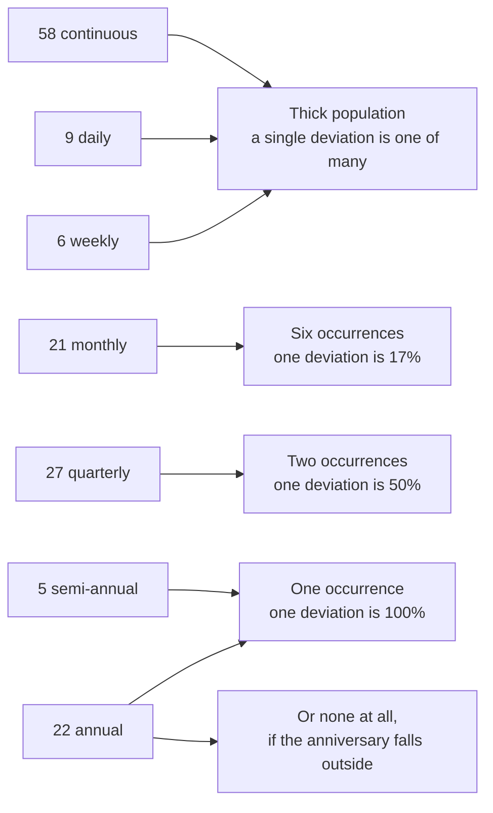

# Diagram — Cadence Against a Six-Month Window

| Field | Value |
|---|---|
| Document ID | CNB-TRUST-2026-D14 |
| Version | 1.0 |
| Date | 2026-08-11 |
| Owner | Karim Haddad |
| Approver | Marisol Vega |
| Classification | Confidential — Trust &amp; Assurance Programme // Illustrative Portfolio Sample |

The observation window is **2026-07-01 to 2026-12-31**. What a control's cadence gives a sampler inside it:

| Cadence | Controls | Population in the window |
|---|---|---|
| Continuous | 58 | Sampled from system records over the whole period |
| Daily | 9 | About 184 occurrences |
| Weekly | 6 | About 26 occurrences |
| Monthly | 21 | 6 occurrences |
| Quarterly | 27 | **2 occurrences** — one late is a 50% deviation rate |
| Semi-annual | 5 | **1 occurrence** — one late is 100% |
| Annual | 22 | **1 occurrence, or none** if the anniversary falls outside the window |
| **Total** | **148** | |

**22 controls operate annually against a six-month window. Twelve fall naturally inside it.
Ten do not.**

Five of the ten were built between April and June 2026 and inherited a build date as their first operation,
giving them an anniversary in the first half of 2027. **The other five were missed on the first pass**, and
finding them mattered: their anniversaries derive from Phase 01's own assurance calendar — CAL-11
penetration testing in May, CAL-12 awareness training and CAL-13 policy review in June, and the objectives
set at kickoff in January — every one of which lands outside 2026-07-01 to 2026-12-31.

**One of the five is `CNB-C-031`, the sole control serving CC5.3.** Without the re-scheduling it would have
had no occurrence in the window at all, which is not a thin population but an absent one, and CC5.3 would
have had nothing testable behind it. The difference between one occurrence and none is the difference
between a criterion supported thinly and a criterion unsupported.

All ten are re-scheduled to operate inside the window. **Re-performing an annual control so that it has
a population is a legitimate thing to do and a dishonest thing to hide.** It is legitimate because the
control genuinely operates and genuinely produces evidence. It becomes dishonest the moment the
re-scheduling is not disclosed, because the reader then infers a natural cadence that does not exist.

## Cross-References

| Document | Relationship |
|---|---|
| [04.11 Control Ownership and Operating Cadence](../04.11-control-ownership-and-operating-cadence.md) | The argument in full |
| [ADR-0019](../adr/ADR-0019-annual-controls-rescheduled-and-disclosed.md) | The decision |
