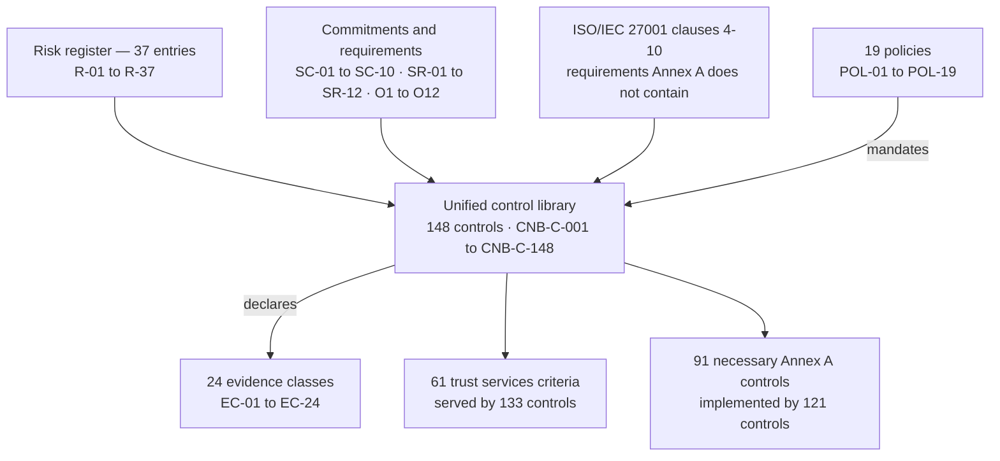

# Diagram — Where the Control Library Sits

| Field | Value |
|---|---|
| Document ID | CNB-TRUST-2026-D13 |
| Version | 1.0 |
| Date | 2026-08-11 |
| Owner | Karim Haddad |
| Approver | Nathan Oyelaran |
| Classification | Confidential — Trust &amp; Assurance Programme // Illustrative Portfolio Sample |

Three inputs, one library, two coverage claims. **The arrows into the library are the derivation and the
arrows out are the assertion**, and keeping them apart is the whole of DEC-402: a control designed *from* a
criterion is a control designed to be auditable rather than to work.

112 controls carry both arrows out — and with the nine ISO-only controls that cite Annex A, **121**
implement a necessary Annex A control. 21 serve a criterion alone.
15 implement Annex A controls or clause requirements that no criterion asks for — and **six of
those fifteen implement requirements that have no Annex A control at all**, which is the plainest available
demonstration that Annex A is not the requirements.

## Cross-References

| Document | Relationship |
|---|---|
| [04.01 Control Framework Architecture](../04.01-control-framework-architecture.md) | The argument |
| [04.03 Mapping Methodology and Its Limits](../04.03-mapping-methodology-and-its-limits.md) | The assertion and its limits |
| [04.07 ISO-Only Controls and ISMS Machinery](../04.07-iso-only-controls-and-isms-machinery.md) | The fifteen |
