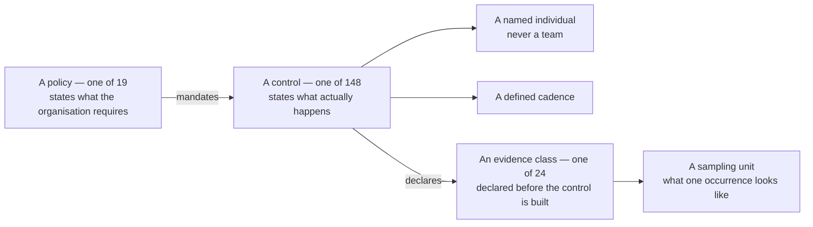

# Diagram — Policy, Control, Evidence

| Field | Value |
|---|---|
| Document ID | CNB-TRUST-2026-D15 |
| Version | 1.0 |
| Date | 2026-08-11 |
| Owner | Rahul Bhargava |
| Approver | Karim Haddad |
| Classification | Confidential — Trust &amp; Assurance Programme // Illustrative Portfolio Sample |

**A control with no policy behind it is a habit. A policy with no control under it is a wish.** Every one
of the 148 controls cites exactly one policy, and every one of the 19 policies is cited by at least one
control — a check the build performs rather than a claim the document makes.

The chain does not end at the evidence class. It ends at the **sampling unit**, because that is what the
service auditor actually asks for, and an evidence class whose sampling unit is undefined cannot be
sampled. ML-1 in the 2025 Type I management letter was exactly this failure: a control that worked and left
behind email threads and screenshots, which is evidence of a kind and not evidence a sampler can use.

## Cross-References

| Document | Relationship |
|---|---|
| [04.08 Policy Architecture](../04.08-policy-architecture.md) | POL-01 to POL-19 |
| [04.12 Evidence Architecture](../04.12-evidence-architecture.md) | EC-01 to EC-24 |
| [ADR-0018](../adr/ADR-0018-evidence-declared-before-the-control-is-built.md) | The rule |
