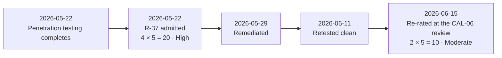

# Working — R-37, the First Addition to the Register

| Field | Value |
|---|---|
| Document ID | CNB-TRUST-2026-D16 |
| Version | 1.0 |
| Date | 2026-08-11 |
| Owner | Karim Haddad |
| Approver | Elise Fontaine |
| Classification | Confidential — Trust &amp; Assurance Programme // Illustrative Portfolio Sample |

Phase 03 recorded at **DEC-306** that the register was open to additions on evidence, and its published
forecast provided for two. The first arrived six weeks later.

| | High | Moderate | Low | Total |
|---|---|---|---|---|
| Baseline, 2026-04-10 | 7 | 17 | 12 | 36 |
| R-37 admitted, 2026-05-22 | 8 | 17 | 12 | 37 |
| R-37 re-rated, 2026-06-15 | **7** | **18** | **12** | **37** |

**The other thirty-six were confirmed without change at the same review**, and the reason is worth stating
rather than being asked: a treatment implemented in June has no operating history in June. Thirty-one of
the thirty-four treatment items landed between 2026-05-15 and 2026-06-30. Re-rating on the strength of
implementation rather than operation is the commonest way a register becomes fiction, and it is comfortable
precisely because the work is real.

**The technical substance of the finding belongs to Phase 05**, which owns the penetration test. This
working records the register arithmetic and nothing more.

## Cross-References

| Document | Relationship |
|---|---|
| [04.00 Phase README](../04.00-README.md) | Where the addition is reported |
| `03-risk-assessment-treatment-and-statement-of-applicability` | DEC-306 and the forecast that provided for it |
| `05-security-criteria-and-technical-controls` | The finding itself |
