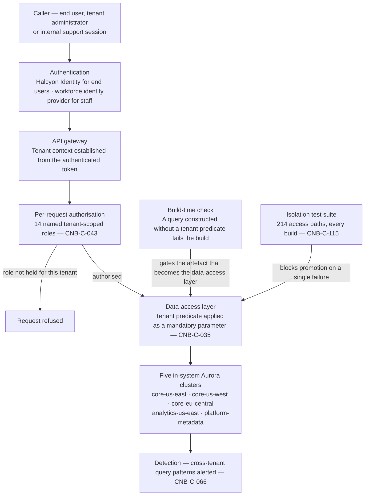

# 05.04 — Tenant Isolation and the Authorisation Model

| Field | Value |
|---|---|
| Document ID | `CNB-TRUST-2026-504` |
| Version | 1.0 |
| Date | 2026-08-11 |
| Owner | Junia Okonkwo, Director of Engineering (Platform) |
| Approver | Nathan Oyelaran, Co-founder and Chief Technology Officer |
| Classification | Confidential — Trust &amp; Assurance Programme // Illustrative Portfolio Sample |

---

## 1. Purpose and scope of this chapter

CloudNimbus serves **640 customer organisations and around 1.24 million end users from one multi-tenant
platform**. Customer compensation data is confidential under the master services agreement, and
**multi-tenant isolation is the confidentiality control that matters** — the one whose failure is not a
degradation of the service but a failure of the promise the service is sold on. **SR-01** states the
requirement: multi-tenant isolation enforced at the data layer on every access path. **R-01** is the risk,
the highest-rated entry in the register at 4 × 5 = 20, and its exit conditions in 03.05 name three things —
isolation enforced in one shared data-access layer rather than in sixty-three independent implementations, a
build-time check that no query path can be constructed which bypasses the predicate, and independent
verification by somebody who is not the team that wrote it.

**All three of those conditions are now delivered**, and the third was independently verified on
**2026-06-11**. **R-01 nonetheless remains at 4 × 5 = 20, confirmed without change at the 2026-06-15
review, and this chapter has to say why rather than leave the reader to notice.**

The reason is **DEC-408**, and it is the reason Phase 04 gave for the other thirty-five entries: a register
is not re-rated on the strength of a treatment having been implemented. R-01's exit conditions describe a
**design**, and the design is in place; what the register scores is **likelihood**, which is a claim about
how often the class of defect recurs in an estate where a path is created every time an engineer writes a
query. Six weeks of a shipped architecture is not evidence about that. **R-37** is not a counter-example:
it described a specific defect on a specific path, and that condition was closed and verified closed by a
retest that re-ran the original attack and failed to reproduce the result. A condition demonstrated closed
is a different kind of fact from a control demonstrated built, and only the first moves a rating.

**When R-01 could move has an answer.** The earliest defensible point is a **CAL-06** quarterly review
after the October re-run of `TS-05` under **ADR-0025**, where the claim would rest on two independent tests
separated by five months of the build check and the isolation suite running on every build, rather than on
one test and a deployment. **Impact remains 5 either way**, so the best rating R-01 can reach is 2 × 5 = 10
— 03.05 says so, and R-01 will never be a Low risk at CloudNimbus.

**This chapter describes the architecture as it stands after remediation.** It states what changed and why
the new mechanism has the property the old one lacked. It does **not** give the account of the May 2026
finding: what was found, in which environment, what the search of the retained query logs did and did not
establish, what was decided about notifying customers and what was recorded in dissent. All of that is
**05.12**, which owns it in full, and a reader who wants the finding rather than the architecture should
read 05.12 first and return here for the mechanism.

## 2. The authorisation path

Every request follows the same path, and there are no privileged shortcuts through it — an internal support
session and a customer's own API call traverse the same stages.

**Tenant context is established at the API gateway from the authenticated token.** It is not read from a
request parameter, a header the caller controls, or a path segment. A caller can ask for a resource; a
caller cannot assert which tenant it belongs to.

**Authorisation is evaluated per request against tenant-scoped roles.** Platform entitlements are expressed
as **fourteen named roles** (`CNB-C-043`); an entitlement outside the role model requires an exception
approved by the system owner, expires automatically after ninety days and appears on the monthly exception
report. A role is meaningful only inside a tenant, so "administrator" is never a global capability.

**The tenant predicate is applied as a mandatory parameter at the data-access layer.** Every query path to
the five in-system Aurora clusters passes through that layer, which applies the tenant scoping predicate
before the statement reaches the database; a service cannot construct a database session that bypasses it
(`CNB-C-035`).

**A build-time check fails any statically-constructed query built without it.** The check runs in the
pipeline, and a query built without a tenant predicate is not a runtime error to be caught in production —
it is a build that does not complete. The qualifier is the control's own: `CNB-C-035` says
*statically-constructed*, and §8 sets out what falls outside that.

Two things about the diagram are deliberate. The build-time check and the isolation suite are drawn as
inputs to the data-access layer rather than as steps in the request, because **they act on the code before
the request exists**. And detection sits after the data store rather than in the path, because it is a
detective control: it tells CloudNimbus that something is happening, it does not stop it.

## 3. What changed, and the property the change bought

The predicate was previously enforced by a **row-level security policy in the database keyed on a session
variable, which a hook on the connection pool's wrapper set when the wrapper handed out a connection** —
and which was therefore never set for code that obtained a connection any other way. **ADR-0021**, taken by
Nathan Oyelaran on
**2026-05-26**, moved it out of the connection session and into the data-access layer as an explicit,
mandatory parameter on every query. **DEC-503** records the move; **DEC-504**, taken by Junia Okonkwo the
same day, records the build-time check that fails any query constructed without it. The change was
**deployed on 2026-05-29**.

The property being bought is worth stating precisely, because "we moved the check" sounds like a
refactoring.

**A connection session variable is ambient state.** It is not visible at the place the query is written. A
call site that is entirely correct — the right table, the right filter, the right role — can still execute
against a connection whose variable was never set, and nothing in the call site's own text is wrong. The
correctness of the query therefore depends on an invisible property of the connection it happens to be
handed, and that dependency is not expressible in the code review of the query.

**A mandatory parameter is not ambient.** The tenant scope is an argument at the call site. It is present or
the code does not compile, and the build-time check is what turns "present" from a convention into a
condition of shipping. This is the same argument Phase 04 made about the enforcement point when it described
`CNB-C-035` as architectural rather than conventional: **a service is not trusted to remember to scope its
own queries.** A prohibition that depends on memory is a preference; a parameter that must be supplied is a
control.

It is also the difference between a defect that can be found by reading a diff and a defect that can only be
found by exercising the path. The first is catchable by `CNB-C-086`, the secure design review gate that
stops any change touching authentication, the tenant isolation model or the calculation engine from merging
without a recorded review. The second is catchable only by testing — which is what happened in May, and why
the register admitted **R-37** on evidence rather than on argument.

**`CNB-C-035`'s wording in the Phase 04 library is the post-remediation wording.** The library was published
on 2026-06-05, a week after the deployment. A reader comparing the library to a description of the earlier
mechanism should not conclude that the library is wrong; it describes what exists.

## 4. The isolation suite

The suite is `CNB-C-115`: tenant isolation enforced by **the scoping predicate the data-access layer
applies**, with an automated isolation suite exercising every documented access path running on every
deployment and **blocking promotion on a single failure**. The control's wording names the data-access layer
rather than a database row-level policy, and that is the post-remediation wording for the same reason
`CNB-C-035`'s is: the enforcement point moved, and a control that still described a database policy would
be describing the mechanism that failed.

**It runs on every build and covers 214 access paths.** An access path here is a documented route by which
data can be read — an API operation, a report resolver, an export, a support console view, a background job
reading on behalf of a tenant — and the number is a count of the documented set, not an estimate of the
possible set. That distinction is the suite's principal limitation and is stated rather than smoothed: a
path nobody documented is a path the suite does not exercise, and the mechanism that keeps the documented
set complete is the design review gate at `CNB-C-086` plus the schema and inventory checks that sit around
it. The suite verifies isolation; it does not discover paths.

**A single failure blocks promotion.** There is no threshold, no advisory mode and no override recorded in
the control. A suite that reports failures without stopping the pipeline is a dashboard.

The suite is also the mechanism through which independent verification lands back in the estate. When
Ironwood Security Labs retested on **2026-06-11**, the retest re-ran the suite together with **fourteen new
cases derived from the finding**, and those cases now form part of the standing suite rather than a one-off
test report. 05.11 records the testing programme and 05.12 the retest in its context.

## 5. The layers around the predicate

Isolation at CloudNimbus is not one control, and Phase 04 said so explicitly when it declined to name a
single row as "the control R-37 concerns". An assumption disproved about isolation is an assumption about a
set.

| Layer | Control | What it contributes |
|---|---|---|
| Data-access predicate | `CNB-C-035` | The enforcement point: no statement reaches the five in-system Aurora clusters unscoped |
| Automated verification | `CNB-C-115` | 214 access paths exercised on every build; promotion blocked on a single failure |
| Design gate | `CNB-C-086` | A change touching authentication, the isolation model or the calculation engine cannot merge without a recorded secure design review |
| Role model | `CNB-C-043` | Fourteen named tenant-scoped roles; out-of-model entitlements expire at ninety days |
| Account and network separation | `CNB-C-055` | Production, staging and corporate workloads in separate AWS accounts with no transitive routing between them; cross-account access by assumed role only, with the trust policies reviewed quarterly |
| Classification at provisioning | `CNB-C-114` | The Terraform policy gate fails any plan creating an S3 bucket, Aurora cluster or Kafka topic without a classification tag |
| Bulk movement review | `CNB-C-117` | Quarterly review of export and bulk-download events above the 5,000-row threshold against the requesting role and the tenant's support case history |
| Detection | `CNB-C-066` | Alerting on cross-tenant query patterns, among other conditions |
| Cryptographic separation by region | `CNB-C-116`, `CNB-C-057` | Region-scoped customer-managed keys, so copying an EU snapshot out of region requires a destination-region key named at the time of the copy — an act that fails without one and is a reviewed change with one. 05.05 §2 sets out the mechanism |

The reporting path deserves a specific mention because it is where the question is sharpest.
`analytics-us-east` is the read replica the reporting API queries, and reporting is the workload that
composes across a tenant's whole population at the query layer rather than fetching one record at a time. It
relies on the same predicate the transactional path relies on, which is the design intent — one enforcement
point, not two implementations that must agree.

## 6. Identifiers are not authorisation

Tenant identifiers at CloudNimbus are sequential integers. That was raised as a low-severity finding in the
May test (**PT-15**) and it was **accepted**, with the reasoning recorded in **ADR-0022** and **DEC-507** and
the acceptance revisited at the next test.

The short form of the reasoning belongs here because it is an architectural position and not only a finding
disposition: **the isolation control is the predicate, not the opacity of the identifier.** A guessable
identifier assists enumeration. It does not authorise anything, because a request carrying another tenant's
identifier is refused by the same predicate that refuses a request carrying no identifier at all. The full
argument, including why the alternative would have bought the appearance of security at the cost of a
migration touching every tenant-scoped table, is made in 05.11.

## 7. What this leaves behind

| Control | Artefact | Evidence class | Sampling unit |
|---|---|---|---|
| `CNB-C-035` | Build gate result: the tenant-predicate check pass or fail per build | EC-04 | One plan or configuration evaluation |
| `CNB-C-115` | Isolation suite run attached to the pipeline execution, with the access-path count and the result | EC-03 | One merged pull request and the pipeline run that promoted it |
| `CNB-C-086` | Recorded secure design review on the change | EC-03 | One change touching isolation |
| `CNB-C-043` | Monthly out-of-model entitlement exception report | EC-02 | One exception, with approver and expiry |
| `CNB-C-117` | Quarterly bulk-export review | EC-05 | One review cycle, with each event's disposition |
| `CNB-C-066` | Cross-tenant query pattern alerts | EC-05 | One alert, with triage disposition |

The most useful of these to a sampler is the pipeline record, because it makes isolation a property of every
build rather than of an annual assurance activity. A tester can select a merged change from any week of the
window and ask what the suite did on it.

## 8. Limits, stated

**The strongest enforcement binds the relational path.** The mandatory parameter and the build-time check
govern the data-access layer named in `CNB-C-035`, which is the path to the five in-system Aurora clusters.
The platform also runs Redis for session and cache, OpenSearch for search indices over tenant data, and
DynamoDB for high-write low-relational state — **17 of 19 non-Aurora data stores are in the system**. Those
stores are reached by services rather than by that layer, and the isolation guarantee for them rests on the
suite's coverage of the documented paths and on the design review gate, not on a compile-time obligation.
The difference is real and is recorded here rather than left for a tester to discover.

**The check binds statically-constructible query paths, and it checks presence rather than value.** Two
limits follow and neither is hidden. A call site that supplies the **wrong** tenant compiles cleanly: a
static check can see that an argument is there and cannot know whether it is right, and what covers that
case is the isolation suite rather than the build. And a query **composed at runtime** is not decidable by
static analysis — which is the awkward half, because the original defect lived in a query builder.
Dynamically-composed queries rest on the suite's coverage of the documented paths, exactly as the
non-relational stores do. **Moving the failure from runtime to build time is a real change in kind and it
is not a total one**, and 05.12 §5 says the same thing from the remediation's side.

**Documented is not the same as complete.** The suite covers 214 documented access paths. Completeness of
that set is a process property, maintained by the design gate and the inventory reconciliations, and it is
the assumption most worth testing at the second penetration test scheduled for October 2026 under
**ADR-0025**.

**Nothing here is an effectiveness claim.** The suite ran on every build in July 2026. That is one month.

## Cross-References

| Document | Relationship |
|---|---|
| [05.12 R-37 — Tenant Isolation Finding and Remediation](05.12-r37-tenant-isolation-finding-and-remediation.md) | The finding, the forensic account, the notification judgement and the dissent — all of it |
| [05.11 Penetration Testing Programme and Findings](05.11-penetration-testing-programme-and-findings.md) | The five streams, PT-01 to PT-16, and the PT-15 argument in full |
| [05.09 Secure Development and Change Management](05.09-secure-development-and-change-management.md) | The pipeline gates the build-time check and the isolation suite run inside |
| [04.05 Controls for the Common Criteria CC6–CC9](../04-unified-control-framework-and-policy-architecture/04.05-controls-for-the-common-criteria-cc6-to-cc9.md) | `CNB-C-035`, `CNB-C-043`, `CNB-C-055`, `CNB-C-086` |
| [04.06 Controls for Availability, Processing Integrity, Confidentiality and Privacy](../04-unified-control-framework-and-policy-architecture/04.06-controls-for-availability-processing-integrity-confidentiality-and-privacy.md) | `CNB-C-114` to `CNB-C-118`, the confidentiality rows |
| [03.05 Risk Analysis and the Seven High Ratings](../03-risk-assessment-treatment-and-statement-of-applicability/03.05-risk-analysis-and-the-seven-high-ratings.md) | R-01 and its three exit conditions |
| [02.03 Infrastructure and Cloud Architecture](../02-system-scope-isms-boundary-and-description/02.03-infrastructure-and-cloud-architecture.md) | The five in-system Aurora clusters and `analytics-us-east` |
| [02.12 Principal Service Commitments and System Requirements](../02-system-scope-isms-boundary-and-description/02.12-principal-service-commitments-and-system-requirements.md) | SR-01, and AS-02 becoming a testable requirement |

---

← [05.03 Privileged Access and Production Entry](05.03-privileged-access-and-production-entry.md) · [Phase 05 README](05.00-README.md) · [05.05 Cryptography and Key Management](05.05-cryptography-and-key-management.md) →
