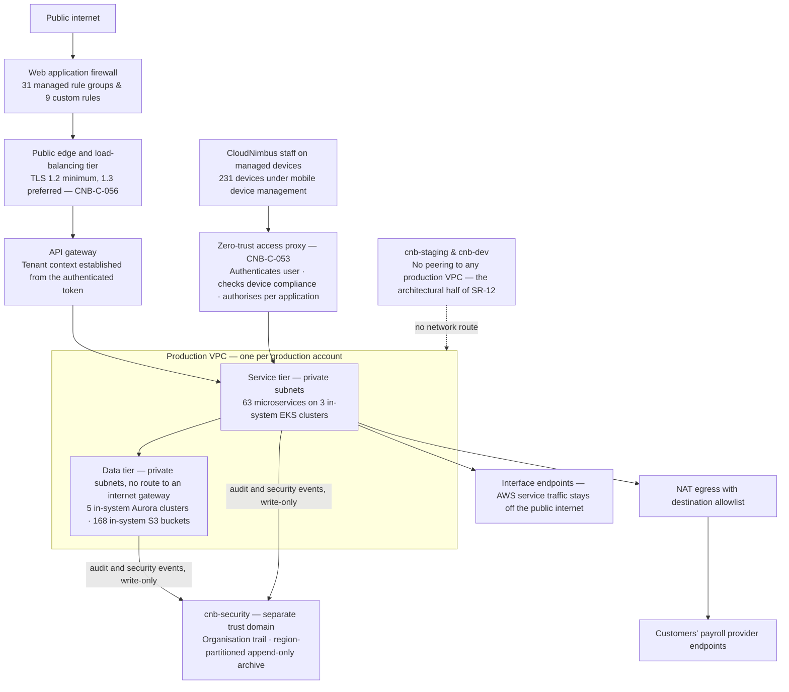

# 05.06 — Network Architecture and Boundary Protection

| Field | Value |
|---|---|
| Document ID | `CNB-TRUST-2026-506` |
| Version | 1.0 |
| Date | 2026-08-11 |
| Owner | Wes Delacroix, Director of Infrastructure &amp; SRE |
| Approver | Nathan Oyelaran, Co-founder and Chief Technology Officer |
| Classification | Confidential — Trust &amp; Assurance Programme // Illustrative Portfolio Sample |

---

## 1. Purpose, and the premise a remote-first company has to start from

**CC6.6** asks for logical access measures against threats from sources outside the system boundaries. The
honest starting position for CloudNimbus is that there is no inside. There is no corporate network, no data
centre, no campus and no trusted subnet where a person is presumed legitimate because of where they are
sitting. **187 staff across 31 US states and 4 countries** work from home networks CloudNimbus does not
administer, and the Denver suite's internet service is the landlord's building service. The network is not a
perimeter; it is a transport.

What follows from that is the design in this chapter. Boundaries are drawn where they can be enforced — at
the **account**, at the **subnet route table**, at the **security group**, at the **proxy** and at the
**request** — and never at an address range that is supposed to be trustworthy. The controls are
`CNB-C-053`, `CNB-C-054`, `CNB-C-055`, `CNB-C-056` and `CNB-C-060`, serving **A.8.20 network security**,
**A.8.21 security of network services**, **A.8.22 segregation of networks** and **A.8.9 configuration
management**.

## 2. The account is the first boundary

CloudNimbus runs **seven AWS accounts in one AWS Organization; five are inside the SOC 2 system**.
Production, staging and corporate workloads run in separate accounts with **no transitive routing between
them**, cross-account access is by assumed role only, and the trust policies are reviewed each quarter
(`CNB-C-055`).

**One VPC per account, and no VPC peering between production and non-production.**

That second clause is **the architectural half of SR-12**, and the phrasing is deliberate. SR-12 —
non-production environments hold no production customer data — is the requirement the exclusion of
`cnb-staging` and `cnb-dev` from the SOC 2 system rests on entirely, and 02.03 states plainly that if SR-12
fails then the boundary was drawn wrongly rather than tested unsuccessfully. SR-12 has two halves and needs
both. The **architectural half** is here: there is no network route by which a workload in `cnb-staging`
could reach a production data store, so an accidental copy cannot happen over the wire. The **control half**
is `CNB-C-083`: production data is not copied into non-production, a non-production dataset that must
resemble production is generated synthetically or masked, and a quarterly check confirms it. A route can be
absent while a snapshot is still restored by hand into the wrong account, which is why neither half is
sufficient on its own.

| Account | Role | In the SOC 2 system | Network position |
|---|---|---|---|
| `cnb-prod-us-east-1` | Primary production | Yes | Own VPC; public edge; private compute and data subnets |
| `cnb-prod-us-west-2` | Warm standby and disaster recovery | Yes | Own VPC; same shape as primary |
| `cnb-prod-eu-central-1` | EU residency for 41 customers | Yes | Own VPC; own region, own keys |
| `cnb-security` | Organisation trail, region-partitioned append-only archive, security tooling | Yes | Own VPC; receives log flow, originates nothing into production |
| `cnb-shared-services` | DNS, artifact registry, Terraform state | Yes | Own VPC; serves signed images and state to production |
| `cnb-staging` | Pre-production | No | Own VPC; **no peering to any production VPC** |
| `cnb-dev` | Development | No | Own VPC; **no peering to any production VPC** |

## 3. Inside a production VPC

**Data tiers sit in private subnets with no route to an internet gateway.** There is no public subnet
containing a workload. An Aurora cluster in `cnb-prod-us-east-1` has no path to the internet in either
direction that is not deliberately constructed, and the deliberate constructions are enumerated: egress to
customers' payroll providers and to the small number of external services the platform calls is routed
through NAT with an **allowlist**, so an outbound destination is a configuration decision rather than a
default; and interface endpoints keep traffic to AWS services off the public internet entirely.

Egress allowlisting is the half of network design most often skipped, and it is the half that matters after
a compromise rather than before one. A workload that can reach any address on the internet is a workload
that can be told to send data somewhere; a workload that can reach four named destinations is not.

**Security groups reference security groups, not CIDR ranges — except at the public edge.** This is the
identity-based version of a firewall rule. "The reporting service may reach the analytics replica" survives
a re-address, a scale-out, a new availability zone and a rebuild; "10.x.y.z/20 may reach the analytics
replica" survives all of those too, which is the problem, because the range keeps meaning something after
the reason for it has gone. The exception at the public edge is unavoidable and bounded: the edge is where
the internet arrives, and the internet has no security group.

The May test found the exact failure this rule exists to prevent. **PT-10** — a security group on the
analytics replica permitting ingress from the whole VPC range rather than from the reporting service — was a
Medium finding, closed on 2026-06-24 and retested on 2026-07-24. It is worth naming here rather than leaving
to 05.11 because it demonstrates that the standard was not universally applied at the time of the test, and
because a chapter that stated the rule without the counter-example would be describing an intention.

## 4. The ingress path

Ingress arrives at the edge and load-balancing tier and reaches the API gateway; **nothing else is reachable
from the internet**. In front of the public load balancer sits a **web application firewall with 31 managed
rule groups and 9 custom rules**.

The split between the two numbers is the useful part. The managed rule groups are vendor-maintained
coverage of generic classes — injection, traversal, known-bad reputation, protocol abuse — and their value
is that somebody else updates them. The nine custom rules are CloudNimbus's own and encode facts about this
application that no vendor knows: the shapes of its API, the rate profiles of its integration tier, and the
paths that must never be reachable from outside a tenant session. A web application firewall consisting only
of managed groups is a subscription; the custom rules are the part that is a control.

What the firewall is **not** is the tenant isolation control. A rule set in front of the application cannot
know whether a well-formed, authenticated request should return this tenant's data, and 05.04 is explicit
that the isolation control is the predicate at the data-access layer. The firewall reduces the volume of
hostile traffic reaching the application. It does not make an authorisation decision, and any description
that let it appear to would be misdescribing where the control sits.

Staff reach production by a separate path and not by this one. Production is reachable only through the
**zero-trust access proxy**, which authenticates the user, checks device compliance and authorises per
application; **there is no VPN concentrator and no administrative interface exposed to the public internet**
(`CNB-C-053`). The absence of the concentrator is a positive design property rather than an omission: a VPN
that terminates into a network segment grants reachability to everything in that segment, which is the
model this architecture is built to avoid.

## 5. Topology

The dashed line is the only edge in the diagram that describes an absence, and it is drawn because an
absence is exactly what a reader has to be able to test.

## 6. Everything above is declared as code, and drift is reverted

A network design is a claim about a configuration, and configurations change. Two controls keep the claim
true.

**`CNB-C-054`** requires ingress rules for the production VPCs to be declared as code; a rule permitting
public ingress requires an approved exception, and **a rule created outside the pipeline is reverted
automatically within fifteen minutes and reported**. The automatic revert is the design choice worth
defending: an alert on an out-of-band rule produces a ticket that somebody triages, and in the interval the
rule is live. A revert closes the exposure and still produces the report.

**`CNB-C-060`** evaluates baseline configuration standards for EKS nodes, Aurora clusters and S3 buckets
across **all seven AWS accounts daily**, opening a ticket for each resource that departs from the baseline.
Seven accounts and not five: the two non-production accounts are outside the SOC 2 system and inside the
ISMS, and a posture scanner that skipped them would leave the ISMS boundary unmonitored to make a system
boundary tidier.

## 7. What this leaves behind

| Control | Artefact | Evidence class | Sampling unit |
|---|---|---|---|
| `CNB-C-054` | Terraform plan and policy evaluation per change; the revert event and its report for any out-of-band rule | EC-04 | One plan evaluation; one revert event |
| `CNB-C-055` | Quarterly cross-account trust policy review | EC-01 | One quarterly review |
| `CNB-C-060` | Daily posture evaluation across seven accounts, with a ticket per departure | EC-04 | One daily evaluation for one account; one ticket |
| `CNB-C-056` | Weekly external transport scan | EC-05 | One scan; one non-conforming endpoint ticket |
| `CNB-C-053` | Per-application authorisation decision with user and device posture | EC-04 | One access decision |
| Web application firewall | Rule set version in the infrastructure repository; blocked-request telemetry into the archive | EC-04, EC-05 | One rule set change; one blocked-request pattern under triage |

`CNB-C-060` feeds **EC-04** and not EC-05, and the row says so deliberately: 04.12 places the daily posture
evaluation in the configuration gate class, and the ticket it opens is the evaluation's output rather than a
separate alert record. The EC-05 material in this chapter comes from `CNB-C-056` and from blocked-request
telemetry, both of which 04.12 does place there.

The revert event in the first row is the most informative artefact in the chapter, because it is the one
that only exists when something went wrong. A window with no revert events is either a well-behaved estate
or a broken detector, and the daily posture evaluation is the independent check that distinguishes the two.

## 8. Limits, stated

**AWS operates the network fabric.** AWS is a subservice organisation and is **carved out**. The claims here
are about CloudNimbus's VPC design, route tables, security groups, endpoint policies and firewall rule sets
— all of which are CloudNimbus's configuration — and not about the physical or virtual network AWS operates
beneath them.

**Rule counts are configuration facts, not efficacy claims.** Thirty-one managed rule groups and nine custom
rules describe what is deployed. Whether that rule set stops a given attack is a question for testing, and
the testing programme is 05.11, with a second test scheduled for October 2026 under ADR-0025.

**The public edge is where the address-based exception lives**, and it is the part of the estate most likely
to accumulate drift, as PT-05 and PT-10 both showed. The weekly scan and the daily posture evaluation are
the compensating cadence, and their records are the evidence.

**One month is one month.** July 2026 produced four weekly transport scans and thirty-one daily posture
evaluations per account. The service auditor will test CC6.6 across six months, and nothing in this chapter
speaks to that period.

## Cross-References

| Document | Relationship |
|---|---|
| [05.03 Privileged Access and Production Entry](05.03-privileged-access-and-production-entry.md) | The proxy, the account boundary and the single interactive path into production |
| [05.05 Cryptography and Key Management](05.05-cryptography-and-key-management.md) | What terminates TLS at the edge, and the region-scoped keys behind the data tier |
| [05.10 Detection, Logging and Response](05.10-detection-logging-and-response.md) | Flow logs, the archive, and the alerting on what the boundary reports |
| [05.11 Penetration Testing Programme and Findings](05.11-penetration-testing-programme-and-findings.md) | PT-05 and PT-10, the two boundary findings, and the retest dates |
| [04.05 Controls for the Common Criteria CC6–CC9](../04-unified-control-framework-and-policy-architecture/04.05-controls-for-the-common-criteria-cc6-to-cc9.md) | `CNB-C-053` to `CNB-C-056` and `CNB-C-060` |
| [02.03 Infrastructure and Cloud Architecture](../02-system-scope-isms-boundary-and-description/02.03-infrastructure-and-cloud-architecture.md) | The seven accounts, the VPC design and the SR-12 argument |
| [02.12 Principal Service Commitments and System Requirements](../02-system-scope-isms-boundary-and-description/02.12-principal-service-commitments-and-system-requirements.md) | SR-12, and what the exclusion of non-production rests on |
| [05.09 Secure Development and Change Management](05.09-secure-development-and-change-management.md) | `CNB-C-083`, the control half of SR-12 that this chapter's architecture does not supply |

---

← [05.05 Cryptography and Key Management](05.05-cryptography-and-key-management.md) · [Phase 05 README](05.00-README.md) · [05.07 Endpoint and Workstation Security](05.07-endpoint-and-workstation-security.md) →
