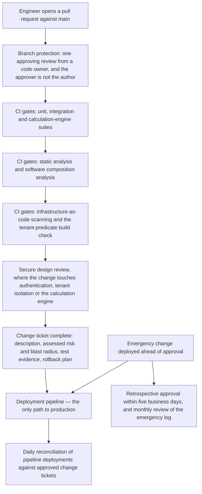

# 05.09 — Secure Development and Change Management

| Field | Value |
|---|---|
| Document ID | `CNB-TRUST-2026-509` |
| Version | 1.0 |
| Date | 2026-08-11 |
| Owner | Junia Okonkwo, Director of Engineering (Platform) |
| Approver | Nathan Oyelaran, Chief Technology Officer |
| Classification | Confidential — Trust &amp; Assurance Programme // Illustrative Portfolio Sample |

---

## 1. The family with one criterion and nine controls

CC8.1 is a single criterion: the entity authorises, designs, develops or acquires, configures, documents,
tests, approves and implements changes to infrastructure, data, software and procedures to meet its
objectives. Nine controls serve it — the highest ratio in the library — and 04.05 says why in one sentence.
**The 2025 Type I management letter recorded at ML-2 that change-management peer review was enforced by
team convention rather than by branch protection: the design was adequate, the enforcement was not.**

That distinction is the whole subject of this chapter. A change process that depends on engineers
remembering to ask for a review works, in the sense that reviews happen, right up until the week somebody
is on call at two in the morning. It also produces no population: a convention leaves no artefact that says
*this merge was refused until a second person approved it*, only artefacts that say a second person
approved. **The first is a control. The second is a habit that has been photographed.**

This chapter describes the enforcement points as they stand at the vantage, **2026-07-31**, and what
happened in July.

## 2. The path a change takes

**No direct pushes to `main` are possible.** Branch protection refuses them, and it refuses a merge without
one approving review from a code owner who is not the author — `CNB-C-079`. The code-owner requirement is
the part that does work beyond a bare review count: it routes the tenant isolation model, the calculation
engine and the authentication path to the engineers who own those areas rather than to whoever is
available. A review by somebody with no context is a review that satisfies a rule.

**Approval and deployment are different identities.** `CNB-C-029` excludes the approving identity from the
deploy role in the pipeline's role bindings, which is segregation of duties expressed as a permission
boundary rather than as a sentence in a policy.

**The pipeline is the only path.** `CNB-C-080` denies direct console mutation of production infrastructure
and denies software installation on production hosts outside the pipeline. This is what makes the change
population knowable: if the pipeline is the only route, then the pipeline's run history is the complete
list of changes, and a deployment that appears in production without a pipeline run is by construction an
anomaly rather than an unrecorded normality.

**Four automated gate families run before a merge can complete.**

| Gate | Control | What it stops |
|---|---|---|
| Unit, integration and calculation-engine regression suites | `CNB-C-084` | A failing suite stops the pipeline before the artefact can be promoted |
| Static application security testing and software composition analysis | `CNB-C-085` | A Critical or High finding blocks the merge until resolved or an exception is recorded |
| Infrastructure-as-code scanning, and the Terraform policy gate on every plan | `CNB-C-030`, `CNB-C-114` | A plan creating an untagged or non-compliant resource fails |
| The tenant-predicate build check, and the isolation suite across the 214 documented access paths | `CNB-C-035`, `CNB-C-115` | A query constructed without a tenant predicate; a regression on any isolation path |

**`CNB-C-084` is owned by Grete Lindqvist, who owns Processing Integrity, rather than by an engineering
director.** 04.05 calls that deliberate and it is: the calculation-engine regression pack is the gate
between a code change and a wrong number in somebody's pay, and the person accountable for the output owns
the gate that protects it. Phase 06 takes the calculation engine itself.

**The tenant-predicate build check is new, and it is R-37's remediation.** It fails any query constructed
without an explicit tenant parameter, which converts a property that was previously maintained by
convention at the connection layer into a property the build refuses to produce without. 05.12 sets out the
defect, the remediation and its limits in full; what belongs here is that the fix took the form of a
**build gate rather than a code review instruction**, which is the same lesson ML-2 taught in a different
family.

**Design review is a gate, not a meeting.** `CNB-C-086` refuses the merge of a change touching
authentication, the tenant isolation model or the calculation engine until a secure design review against
the documented engineering principles has been recorded on the change. Above it sits `CNB-C-021`, which
triggers a documented security impact assessment for a change meeting the significant-change definition — a
new region, a new subservice organisation, a new category of personal data, or an architectural change to
the calculation engine or the isolation model — and requires it **before the design is approved**, not
before deployment. The two are different instruments at different points, and the earlier one is the one
that can still change a design cheaply.

**Environments are separate accounts, and that is architecture rather than assertion.** `CNB-C-083` runs
development, test and production in separate AWS accounts with separate identity boundaries, prohibits
copying production data into non-production, and requires that a non-production dataset resembling
production be generated synthetically or masked — confirmed by a quarterly check. That control is the
operational half of **SR-12**, on which scope exclusions EX-01 to EX-04 rest, and 05.06 carries the
architectural half: no VPC peering between production and non-production. It is also the reason the
penetration test could be run against a production-equivalent environment seeded with synthetic tenants
without exposing customer data, which 05.12 treats as the first fact a reader needs.

## 3. Emergency change, which is where change management is actually tested

`CNB-C-082` permits an emergency change to be deployed ahead of approval and requires **retrospective
approval by the Director of Engineering (Platform) within five business days**, with the emergency change
log reviewed monthly and unapproved entries escalated to the Chief Technology Officer. It is typed
Corrective, because that is what it is.

Three things about the escape hatch are worth stating rather than assuming.

**It is necessary.** A change process with no emergency route does not prevent emergency changes; it
prevents them from being recorded. The organisation that claims every production change went through a
full approval cycle during a Severity-1 incident is either describing a very slow incident response or
describing something that did not happen.

**Its risk is not the deployment — it is the paperwork afterwards.** The change is already in production by
the time the control operates. What `CNB-C-082` protects is the record: a named person confirming, within a
defined period, that the change that was made was the change that should have been made. **An emergency
change never retrospectively approved is indistinguishable, in the evidence, from an unauthorised
deployment**, and that is precisely why the five-day clock is the tested attribute.

**Five business days is a small population and an unforgiving denominator.** Two emergency changes in a
month means roughly a dozen across the window. One approval recorded on day six is a deviation rate in the
region of eight per cent on a population that small, and there is no volume to absorb it. This is the same
arithmetic 04.11 sets out for quarterly and semi-annual controls, applied to a control whose population is
determined by how often production breaks.

**`CNB-C-087` is the detective backstop and it runs daily.** It reconciles deployments recorded by the
pipeline against approved change tickets and investigates any deployment with no matching ticket, reporting
to the Chief Technology Officer. It runs daily rather than monthly for the reason 04.05 gives: a
convention-based failure is invisible until somebody counts.

## 4. July 2026

| Measure | July 2026 |
|---|---|
| Changes deployed | **47** |
| Changes with recorded peer review | **47** |
| Emergency changes | **2** |
| Emergency changes retrospectively approved within five business days | **2** |
| Deployments with no matching approved change ticket | **0** |

Forty-seven changes in a month across 63 microservices and an engineering organisation of 78 is a modest
rate, and it is a rate that produces a workable population: if July is representative, the six-month window
will hold a few hundred merged changes, which is enough for a sampler to select from without the deviation
arithmetic turning brutal.

**Four of the forty-seven are penetration test remediations, and a reader reconciling this table against
05.11 should not double-count them.** `PT-06`, `PT-08`, `PT-12` and `PT-16` were remediated on 2026-07-08
and 2026-07-15 and are inside this population; they are changes like any other and went through these
gates. The other five findings 05.11 shows against July dates — `PT-05`, `PT-07`, `PT-10`, `PT-11` and
`PT-13` — were remediated in June and only **retested** on 2026-07-24, and a retest by Ironwood is an
attestation rather than a deployment. Nine findings touched July; four of them are changes.

**What the table does not say is more important than what it says.** It does not say the controls operated
effectively. It says that in the first of six months, every deployment had a recorded peer review, both
emergency changes were retrospectively approved inside the period, and the daily reconciliation found
nothing unmatched. A clean month is a clean month. The exposure ML-2 identified was never that peer review
failed often; it was that it was enforced by convention, and a convention holds until the week it does not.

**And the enforcement point is now technical, which changes the shape of the residual risk rather than
removing it.** Branch protection cannot be forgotten. It can be configured with an exemption, changed by
somebody with repository administrator rights, or satisfied by an approval from an engineer who read
nothing. `CNB-C-036` limits repository administrator rights to three named engineers recorded in the
privileged access register and reissued each quarter, which is the control on the first two. **There is no
control on the third**, and no control library should pretend otherwise: review quality is a cultural
property, and the honest claim is that the mechanism guarantees a second named human took responsibility,
not that the human was diligent.

## 5. What these controls leave behind

**EC-03, the change record**, is the class Phase 08 will sample hardest, and its unit is defined in 04.12
as **one merged pull request: the diff, the recorded peer review, the automated check results, and the
pipeline run that promoted it**. Four artefacts, one unit, one identifier joining them.

That definition is ML-1's lesson applied to ML-2's subject. The 2025 management letter recorded that access
review evidence existed as email threads and screenshots — a control that worked and left nothing a sampler
could use. **Remediating a control is not the same as remediating the evidence trail it leaves behind**,
and the change record is the place that lesson is easiest to fail: the peer review lives in the repository,
the check results live in the CI system, the ticket lives in the ticketing system and the deployment lives
in the pipeline. If the identifier that joins them is absent on one merge, that merge cannot be evidenced
as complete even though every gate fired.

Two other classes attach here. **EC-04**, the configuration gate record, carries one plan or configuration
evaluation with the policy version, the pass or fail per rule and the approver of any waiver — which is
where an infrastructure change is evidenced. **EC-06**, the incident record, is where an emergency change
usually originates, and linking the emergency change to the incident that prompted it is what turns "we
deployed at 03:10 without approval" into a defensible sequence.

## 6. What this chapter cannot say

It cannot say the change controls operated effectively across a period, because one month is not a period
and 05.13 makes that argument in full.

It cannot say that a peer review was a good peer review.

And it cannot say that the population is complete on the strength of the pipeline alone. The claim that
every production change is a pipeline deployment is enforced by `CNB-C-080` and checked by `CNB-C-087`, and
those two together are strong — but they are strong in the way a closed loop is strong, which is to say
they would not detect a change made through a path nobody has thought of. That is one of the things a
penetration test is for, and it is why `CNB-C-026` sits in CC4 rather than in CC8.

## Cross-References

| Document | Relationship |
|---|---|
| [05.04 Tenant Isolation and the Authorisation Model](05.04-tenant-isolation-and-the-authorisation-model.md) | The isolation suite, the 214 access paths and the model the build check protects |
| [05.06 Network Architecture and Boundary Protection](05.06-network-architecture-and-boundary-protection.md) | The architectural half of SR-12: no peering between production and non-production |
| [05.08 Vulnerability and Patch Management](05.08-vulnerability-and-patch-management.md) | Why dependency patching is a change rather than a patch process |
| [05.10 Detection, Logging and Response](05.10-detection-logging-and-response.md) | Where an emergency change's originating incident is recorded |
| [05.12 R-37 Tenant Isolation Finding and Remediation](05.12-r37-tenant-isolation-finding-and-remediation.md) | The defect behind the tenant-predicate build check |
| [04.05 Controls for the Common Criteria CC6 to CC9](../04-unified-control-framework-and-policy-architecture/04.05-controls-for-the-common-criteria-cc6-to-cc9.md) | `CNB-C-079` to `CNB-C-087` as published, and the ML-2 argument |
| [04.12 Evidence Architecture](../04-unified-control-framework-and-policy-architecture/04.12-evidence-architecture.md) | EC-03, EC-04 and EC-06 |
| [01.04 Prior Type I Baseline and Carried Matters](../01-program-foundation-dual-framework-governance/01.04-prior-type-i-baseline-and-carried-matters.md) | ML-2 as it was written in 2025 |
| `trackers/05-july-operating-record.xlsx` | The July change and emergency-change counts |

---

← [05.08 Vulnerability and Patch Management](05.08-vulnerability-and-patch-management.md) · [Phase 05 README](05.00-README.md) · [05.10 Detection, Logging and Response](05.10-detection-logging-and-response.md) →
