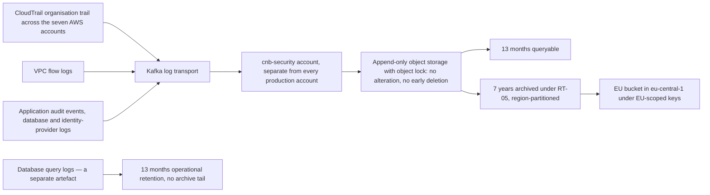

# 05.10 — Detection, Logging and Response

| Field | Value |
|---|---|
| Document ID | `CNB-TRUST-2026-510` |
| Version | 1.0 |
| Date | 2026-08-11 |
| Owner | Karim Haddad, VP Security &amp; Trust |
| Approver | Nathan Oyelaran, Chief Technology Officer |
| Classification | Confidential — Trust &amp; Assurance Programme // Illustrative Portfolio Sample |

---

## 1. The family that assumes prevention has already failed

CC7 carries nineteen controls and **one of them is preventive**. 04.05 states the reason and it is worth
repeating at the top of this chapter: system operations is the family that exists to notice and respond to
what the preventive controls did not stop. A library whose CC7 family were mostly preventive would have
misunderstood what CC7 is for.

Everything in this chapter therefore runs on the assumption that something has got through. The shape
follows the lifecycle — collect the record, detect the condition, decide what it is, respond, recover — and
each step has a control with an artefact attached, because a detection capability that cannot show what it
decided is a capability that cannot be examined.

The vantage is **2026-07-31**, one month into the observation window.

## 2. The record: what is collected, where it goes, and how long it lasts

**The organisation trail is the spine.** A CloudTrail trail configured per account can be disabled per
account by whoever holds the account; an organisation trail cannot be turned off from inside a member
account, which is the property that matters when the scenario being defended against is an attacker with
credentials rather than an engineer with a typo. VPC flow logs supply the network layer and application
audit events supply the layer no cloud provider can see — who read which tenant's data, and under which
role.

**The destination is a different account.** Logs are shipped to `cnb-security` within five minutes of
generation under `CNB-C-065` and written under an immutability policy that prevents alteration or early
deletion. The separation is the control, not the storage: an operator with production administrative rights
has no path to the record of what they did, because the record is not in the estate they administer. That
is also what makes `CNB-C-065` the load-bearing control for **SR-09** — audit logging of security-relevant
events shipped to an append-only archive in a separate account — which serves **SC-02**, the 48-hour
notification commitment, because a notification obligation that runs from determination depends entirely on
the organisation's ability to determine anything.

**Retention is thirteen months queryable, then seven years archived, under RT-05.** The archive is
region-partitioned with an EU bucket in `eu-central-1` under EU-scoped keys, confirmed as a decision at
**DEC-512** on 2026-07-20: 41 customers require EU data residency under obligation **O8**, and only
pseudonymised or non-personal telemetry crosses regions. A single global archive would have been simpler,
cheaper and inconsistent with the obligation.

**Database query logging is a separate artefact from all of that, and the distinction decides what a
backward-looking question can reach.** RT-05 governs the authentication and audit events described above:
thirteen months queryable, then seven years archived, pseudonymised beyond thirteen months. The
**application-level query log** — the record of which statement shape the database was asked to execute,
with what response — is held under a separate **operational retention of thirteen months with no archive
tail**, because statement logging at this volume is expensive to keep and was never scoped for seven years.
The seven-year archive therefore records who authenticated and which resource was accessed; it does not
record statement shapes or response cardinalities, and no length of archive would make it able to answer a
question about them.

**That has a consequence this phase does not soften.** When the penetration test raised a defect that had
existed for longer than thirteen months, the search that followed could only cover the period the query
logs covered, and the remainder is not recoverable by effort or by reaching into the archive, which holds a
different thing. **05.12 sets out that arithmetic in full**, and `DEC-508` and `ADR-0024` record that the
query-log retention was reviewed on 2026-06-22 as a direct consequence of it. What belongs here is the
design fact: two retentions, both thirteen months at the queryable horizon, only one of them with an
archive behind it, and both stated rather than assumed.

**Log delivery is itself monitored.** `CNB-C-066` alerts on any interruption to log delivery, which closes
the loop that otherwise defeats the whole architecture — an archive that silently stops receiving looks
exactly like an estate in which nothing is happening.

## 3. Detection: 38 rules, and what they are pointed at

**Thirty-eight detection rules** run in the security information and event management platform, routing
each alert to the on-call analyst under `CNB-C-066`. The four classes the control names are the four the
threat model puts first.

| Rule class | Why it is in the first tier |
|---|---|
| Privileged role assumption | There is no standing production access. Every elevation is an event, which makes elevation a signal rather than background noise — 05.03 |
| Authentication failure bursts | Credential attack against staff or tenant administrators; R-13 sits at 4 × 3 = 12 with 187 remote staff |
| Cross-tenant query patterns | The confidentiality control that matters is tenant isolation, and this is the detective half of it — 05.04, and R-37 in 05.12 |
| Interruption to log delivery | Everything else in this chapter depends on the record arriving |

Around them sit the operational detections: configuration departures from baseline via `CNB-C-060`, data
loss prevention events triaged daily by the Data Platform owner under `CNB-C-058`, endpoint detection and
response alerts from `CNB-C-059`, and synthetic transactions exercising sign-in, clock-in and report
generation in each production region every minute under `CNB-C-068`, where two consecutive failures page
the on-call site reliability engineer.

**Thirty-eight is a number that should be read with suspicion in both directions.** A programme reporting
four hundred rules is usually reporting a vendor's default content pack that nobody has tuned; a programme
reporting six is reporting a gap. Thirty-eight rules maintained by a security function of eight people, with
a weekly review under `CNB-C-070` of alert volume, false-positive rate and unactioned events feeding a
detection backlog, is a claim about maintenance rather than coverage — and maintenance is the honest thing
to claim. **No rule set detects what it was not written to look for**, which is the standing argument for
`CNB-C-026` and the penetration test in 05.11.

## 4. Triage: the service level, and the decision that has to be recorded

**High-severity alerts are triaged within thirty minutes**, measured from delivery, with automatic
escalation to the VP Security &amp; Trust where the service level is not met.

Then `CNB-C-069` does the thing organisations most often omit: **the on-call analyst assesses the triaged
event against the documented event severity matrix and records, on the ticket, whether it is an incident
and at what severity**, publishing a daily triage summary. 04.05 calls this and the service level the two
hinges of the family, and the second is the harder one. **An alert closed without a recorded decision is an
alert that cannot be shown to have been evaluated.** It is indistinguishable, in evidence, from an alert
nobody looked at, and the difference between those two things is the whole of CC7.3.

### 4.1 A wording difference found here and reconciled at source

Drafting this chapter surfaced a divergence between the operating standard described above and `CNB-C-067`
as it then stood, which attached a single thirty-minute service level to a population and an attribute that
did not match what the team measures. **It was reported and reconciled in the library**: `CNB-C-067` now
requires that every alert is acknowledged and dispositioned, and that a high-severity alert is triaged to a
disposition within thirty minutes. Phase 04 was re-issued accordingly, and the wording now separates the
two claims that the single sentence had run together.

The reconciliation belongs in the control library and in **POL-12**, which is where it was made. As in
05.08 §3.1, a chapter that had recorded the divergence and left it standing would have preserved the
exposure rather than closing it: a service auditor tests the control as management described it, so a
description the operation does not match is an unforced deviation, and the fix is to amend one document and
record which.

## 5. Response, and the parts of it that are rehearsed rather than exercised

A Severity-1 or Severity-2 event invokes the incident response plan under `CNB-C-071`, names an incident
commander, and opens a timestamped incident record capturing decisions, actions and communications until
closure. `CNB-C-077` requires the incident commander and the on-call site reliability engineer both to
confirm service health against the restoration runbook's acceptance checks before closure, and `CNB-C-075`
requires a post-incident review within ten business days with corrective actions entered in the tracker and
followed monthly.

Two controls in this family sit outside the incident path and both are worth naming.

**`CNB-C-072` is the customer notification control**, and it is the operational expression of SC-02 and
obligation O4: Customer Success notifies affected tenants of a confirmed security incident within the
notification period stated in the master services agreement, using the approved advisory template, and
records the despatch in the CRM. The commitment runs from **determination**, not occurrence, which is why
`CNB-C-069`'s recorded decision is the control that starts the clock. 05.12 examines what happened when a
finding was assessed against that commitment and determined not to engage it.

**`CNB-C-073` and `CNB-C-076` are the only two semi-annual controls in the entire 93-control Common Criteria
set** — the authority and counsel contact list, and the tabletop exercise. 04.11 draws the consequence and
this chapter repeats it because it is the sharpest sampling fact in the family: **a semi-annual control has
a population of exactly one in a six-month window, and one late occurrence is a hundred per cent deviation
rate.**

## 6. July 2026

| Measure | July 2026 |
|---|---|
| Alerts triaged | **1,412** |
| Alerts escalated for investigation | **11** |
| Incidents | **0** |

**Zero incidents is an ambiguous number and this chapter will not present it as a good one.** A month with
no incidents is either a month in which nothing happened or a month in which something happened and was not
detected, and a detection programme cannot distinguish those two from the inside. What can be said is
narrower and more useful: 1,412 alerts were triaged and each carries a recorded disposition; 11 were
escalated for investigation; none of the eleven was assessed as an incident under the severity matrix; and
the daily triage summaries and the weekly review under `CNB-C-070` exist so that the false-positive rate and
the unactioned tail are examined by somebody rather than accumulating.

Eleven escalations from 1,412 alerts is an escalation rate a little under one per cent. That figure is not a
target and should not become one. A programme that manages its escalation rate downward is a programme
optimising the number it publishes rather than the decisions its analysts make.

**One month of alert volume is one month of alert volume.** The Type II population is every alert across six
months, and on July's rate that will be a five-figure number from which a sample will be drawn and tested
against the recorded service level, item by item.

## 7. What these controls leave behind

| Class | Unit a sampler selects | Produced by |
|---|---|---|
| **EC-05** Alert and triage record | One alert or finding: raised timestamp, assignee, triage disposition, closure timestamp | `CNB-C-058`, `CNB-C-063`, `CNB-C-065` to `CNB-C-070`, `CNB-C-117` |
| **EC-06** Incident record | One incident: severity, timeline, notification decisions, post-incident review, actions with owners and closure dates | `CNB-C-071` to `CNB-C-075`, `CNB-C-077`, `CNB-C-078` |
| **EC-11** Continuity exercise record | One exercise: scenario, participants, timeline, findings and actions | `CNB-C-076` |

EC-05's retention line carries the constraint this chapter began with: **the evidence-store record is held
seven years, while the source events beneath it are queryable for thirteen months and then archived
pseudonymised under RT-05** — and the query log beneath *those* is queryable for thirteen months and then
gone. The triage record therefore outlives the raw material that produced it, and outlives some of it
permanently. That is a defensible design — the decision, not the packet, is what the criterion asks about —
and it is also exactly the limit that made the R-37 forensic search finite.

**EC-06 has a known weakness and Phase 04 recorded it.** `A.5.28`, collection of evidence, remains
**Partial** in the Statement of Applicability, carried forward from 03.13 as one of the gaps Phase 05
inherits. `CNB-C-074` describes chain-of-custody collection, hashing on collection and a separate incident
evidence store; what is not yet complete is the demonstrated practice, and with **zero incidents in July**
there has been no occurrence to demonstrate it against. A control with a population of zero cannot be shown
to work, and saying so is better than waiting for the first incident to find out.

## 8. What this chapter does not claim

It does not claim that everything relevant is logged. It claims a stated set of sources reaches an
append-only archive in a separate account within five minutes, and that interruptions to that flow alert.

It does not claim the 38 rules are sufficient. It claims they are maintained, reviewed weekly, and pointed
at the four conditions the threat model puts first.

It does not claim that zero incidents means zero events of consequence.

And it does not claim operating effectiveness, because that is a conclusion about a period and one month is
not a period — the argument 05.13 makes in full.

## Cross-References

| Document | Relationship |
|---|---|
| [05.03 Privileged Access and Production Entry](05.03-privileged-access-and-production-entry.md) | Elevation as a detection signal, and the break-glass alert |
| [05.04 Tenant Isolation and the Authorisation Model](05.04-tenant-isolation-and-the-authorisation-model.md) | The preventive half of the cross-tenant detection rule |
| [05.08 Vulnerability and Patch Management](05.08-vulnerability-and-patch-management.md) | Scanner findings entering the same triage record |
| [05.12 R-37 Tenant Isolation Finding and Remediation](05.12-r37-tenant-isolation-finding-and-remediation.md) | The thirteen-month query horizon, the forensic search and its limit |
| [04.05 Controls for the Common Criteria CC6 to CC9](../04-unified-control-framework-and-policy-architecture/04.05-controls-for-the-common-criteria-cc6-to-cc9.md) | `CNB-C-065` to `CNB-C-078` as published, and the two hinges |
| [04.12 Evidence Architecture](../04-unified-control-framework-and-policy-architecture/04.12-evidence-architecture.md) | EC-05, EC-06 and EC-11, and the RT-05 retention line |
| [02.12 Principal Service Commitments and System Requirements](../02-system-scope-isms-boundary-and-description/02.12-principal-service-commitments-and-system-requirements.md) | SC-02 running from determination, and SR-09 |
| [01.11 Assurance Calendar and Obligations](../01-program-foundation-dual-framework-governance/01.11-assurance-calendar-and-obligations.md) | O4 and O8 |
| `trackers/05-july-operating-record.xlsx` | July's alert, escalation and incident counts |

---

← [05.09 Secure Development and Change Management](05.09-secure-development-and-change-management.md) · [Phase 05 README](05.00-README.md) · [05.11 Penetration Testing Programme and Findings](05.11-penetration-testing-programme-and-findings.md) →
