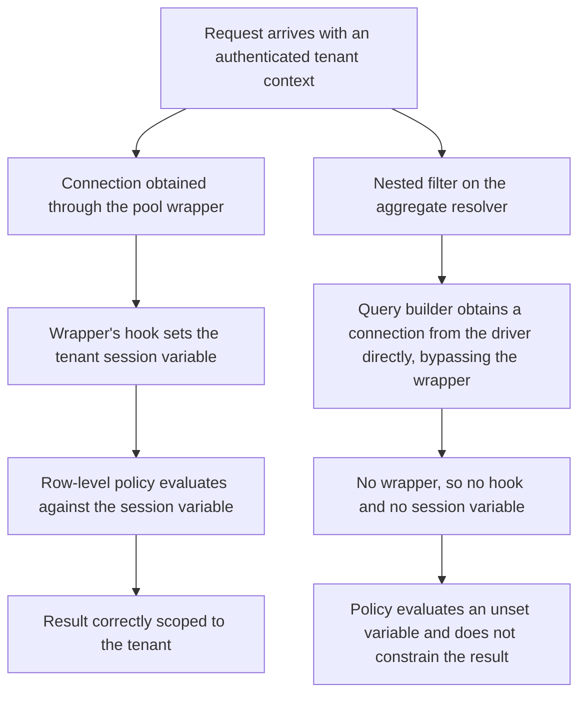

# 05.12 — R-37: Tenant Isolation Finding and Remediation

| Field | Value |
|---|---|
| Document ID | `CNB-TRUST-2026-512` |
| Version | 1.0 |
| Date | 2026-08-11 |
| Owner | Junia Okonkwo, Director of Engineering (Platform) |
| Approver | Elise Fontaine, Chief Executive Officer |
| Classification | Confidential — Trust &amp; Assurance Programme // Illustrative Portfolio Sample |

---

## 1. The first question, answered first

On 2026-05-22, Ironwood Security Labs reported a Critical finding against the multi-tenancy isolation
stream: the reporting API's aggregate endpoint returned another tenant's aggregate compensation totals when
a nested filter was supplied. It is `PT-01` in 05.11, and it is the evidence on which **R-37** was admitted
to the risk register the same day, at **4 × 5 = 20, High**, under **DEC-407**.

The first question any reader asks is whether customer data was exposed, so it is answered before anything
else.

**The test ran against a production-equivalent pre-production environment seeded with synthetic tenants. No
real customer data was exposed at any point in the test.** The tenants Ironwood crossed between were
fabricated for the engagement, the compensation totals returned belonged to nobody, and the environment
held no production customer records to return. That is not a happy accident: `CNB-C-083` prohibits copying
production data into non-production and requires a non-production dataset resembling production to be
generated synthetically or masked, checked quarterly, and **SR-12** — non-production holds no production
customer data — is the system requirement on which scope exclusions EX-01 to EX-04 rest. The isolation test
was one of the first serious tests of that requirement, and the requirement held.

**That answer is complete about the test and silent about production**, and the rest of this document is
about the difference. The same code path existed in the production service, so what mattered after
2026-05-22 was not what Ironwood had done in pre-production but whether anybody had ever done it in
production.

## 2. The defect

The reporting API composes aggregates across a department dimension. Row-level security was enforced by a
database policy keyed on a **session variable set when a connection was taken from the connection pool** —
a hook that ran on checkout, wrote the authenticated tenant into the session, and left the policy to
evaluate every statement on that connection against it. For almost every path in the service that design
worked and had worked since it was written.

One path defeated it, and the mechanism is worth stating with precision because a loose description of it
defeats itself. The hook lives on the **pool wrapper**: it runs when the wrapper hands out a connection,
and it is the wrapper — not the driver, and not the database — that knows which tenant the request belongs
to. **The nested filter on the aggregate resolver built its statement through a query builder that obtained
a connection from the driver directly rather than through the pool wrapper that carries the hook.** No
wrapper, no hook; no hook, no session variable. On that path the row-level policy evaluated against an
**unset** variable — and a policy evaluating an unset variable did not constrain the result. The statement
ran with no tenant scope at all.

**Exposure on the path was limited to aggregate totals.** The endpoint returns sums across a department
dimension; it has no shape in which an individual row can be projected, and Ironwood confirmed that **no
row-level record could be returned by the path**.

**On its own that limit would bound volume and not sensitivity, and this document says so before a reader
says it back.** A department-dimension aggregate over a department of one discloses that person's
compensation exactly, and two aggregates differenced across a changed filter disclose an individual
anywhere. Inference disclosure through aggregates is elementary and an aggregate-only endpoint is not
self-evidently safe. What makes the limit hold here is a second property of the reporting API:
**minimum-group-size suppression on the department dimension, which suppresses any group of fewer than
five**. Ironwood tested the suppression as part of TS-05 and found it operating. **With it, the
aggregate-only limit bounds both the volume and the granularity of what the path could return. Without it,
the limit would have bounded volume alone**, and the honest way to record that is to say it rather than to
let "only aggregates" carry a weight it cannot carry by itself.

Even so, the limit is a limit on the consequence and not a mitigation and not a defence: an aggregate
compensation total for another employer's department is confidential information under the master services
agreement, and a customer told that only their totals had been readable would not be reassured by the
distinction.

**What the finding disproved is the assumption, not the control.** `AS-02` held that row-level security was
uniformly enforced across every data access path. It was not: it was enforced on every path that took a
connection the ordinary way, and the uniformity was a property of how the services happened to be written
rather than a property the architecture guaranteed. 04.05 makes the same point from the control side — an
assumption disproved about isolation is an assumption about the set of isolation controls, not about one
member of it.

## 3. What the test established, and what it could not

| Proposition | Status | What supports it |
|---|---|---|
| No real customer data was exposed during the test | **Established** | The test ran in pre-production against synthetic tenants; SR-12 and `CNB-C-083` |
| The defect existed on a code path that was also deployed in production | **Established** | The same service and the same resolver were running in production |
| Exposure on that path was confined to aggregate totals, with no row-level record returnable | **Established** | Ironwood's testing of the path's projection behaviour |
| Minimum-group-size suppression on the department dimension was operating, suppressing any group smaller than five | **Established** | Ironwood's testing of the same endpoint under TS-05 |
| 117 invocations of the path across thirteen months of retained query logs, from 9 customers, every one returning a response cardinality consistent with a single-tenant result | **Established** | The forensic search described in §4 |
| The defect was never exercised in production | **Not established, and cannot now be established** | — |

The last row is the one this document exists to state plainly. It is not a gap in the work that was done.
It is a limit on what the available evidence can support, and the limit is arithmetic.

## 4. The forensic step, and the nine months it could not reach

### 4.1 What could be searched for, and what could not

The question everybody asks first is whether the query logs show an unscoped result. **They cannot, and the
reason is the first thing this section has to state.** The statement the database received was
**byte-identical** whether or not the session variable had been set. A row-level policy is evaluated by the
database against the session the statement runs in; that evaluation leaves no trace in the statement text.
A query log therefore cannot distinguish a scoped execution of this path from an unscoped one, and a search
framed as "find the unscoped queries" would have returned nothing for a reason that has nothing whatever to
do with whether the path was exercised.

So the search was framed against something the log does record. CloudNimbus searched the retained query
logs for **invocations of the nested-filter aggregate path itself** — identified by the resolver name and
by the statement shape that path emits — which captures every execution of the path, correctly scoped or
not.

**It found 117 invocations across the thirteen months, from 9 customers.**

Each of the 117 was then examined against the one logged property that does differ between a scoped and an
unscoped execution: **response cardinality**, the number of aggregate groups the statement returned. A
scoped execution returns at most one group per department in the invoking tenant. An unscoped execution
returns groups across the whole estate — the departments of 640 customers — and is larger by orders of
magnitude rather than by a margin. For every one of the 117 the logged cardinality was compared against the
number of departments configured in the invoking tenant at the time of the call.

**In every one of the 117 the cardinality was consistent with a single-tenant result.**

That is what "no evidence of exploitation" means in this document, and its shape matters. It is a
**measurement rather than an absence**: one hundred and seventeen invocations were examined and one hundred
and seventeen were consistent with correct scoping. No reader is being asked to draw comfort from an empty
result set.

### 4.2 Then the arithmetic

| | |
|---|---|
| The retained query logs reach back | **13 months** |
| The code path was introduced before the test | **22 months** |
| Period the search could examine | **13 months** |
| **Period the search could not examine** | **22 − 13 = 9 months** |

**Nine months are unexamined, and no amount of searching will change that.** The code path was introduced
around the middle of 2024; the retained query logs begin around April 2025. Between those two points the
defect existed in production and the record of what was asked of the database no longer exists.

**The seven-year archive is not a second copy of this material, and it is worth being exact about why.**
RT-05 governs **authentication and audit events** — thirteen months queryable, then seven years archived,
pseudonymised after thirteen months. **Database query logging is a different artefact under a separate
operational retention of thirteen months**, with no archive tail: application-level statement logging at
this volume is expensive to keep and was never scoped to be kept for seven years. The seven-year archive
therefore holds a record of who authenticated and which resource was accessed. It does not hold database
statement shapes, response cardinalities or the parameters a query carried, because those were never
written into it. It is not a place where this question can be asked again with a longer horizon; it is a
record of a different thing. **The queryable logs are not incomplete; they are complete and they start
after the defect did.**

### 4.3 Three temptations, refused

**This document does not describe the search as conclusive.** One hundred and seventeen invocations
examined across thirteen months is a real result produced by real work, and it is the strongest evidence
available. It is evidence within its own coverage and nothing beyond it. It is also only as good as the
fidelity of the pattern the search matched on: an invocation that reached the path through some variant the
resolver-and-shape pattern did not capture would not be among the 117, and the cardinality comparison would
never have been run against it.

**It does not describe nine months as a small residual.** Nine months is forty-one per cent of the
twenty-two months the defect existed. It is not a rounding, it is not a tail, and calling it either would be
a rhetorical choice dressed as a technical one. For four of every ten days on which this defect was live in
production, CloudNimbus cannot say what was asked of the reporting API.

**And it does not omit the arithmetic.** 22 − 13 = 9 appears in this document in a table and in prose, and
the nine months appear in the heading above them, because the single most effective way to make this
finding look better than it is would have been to write "the query logs were searched and 117 invocations
were all consistent with correct scoping" and stop. That sentence is true. Standing alone it is also
misleading, because it invites the reader to supply a coverage period it never claimed.

### 4.4 The measurement makes the gap worse, not better

The 117 invocations are the reason the nine months are harder to live with rather than easier, and this
document states the consequence rather than leaving it to be worked out.

**The path was in ordinary use.** Nine customers reached it over thirteen months, at a rate of
approximately nine invocations a month. It was not a dormant code path that nobody had found; it was a
shipped feature being used.

**At that rate the unexamined period contains on the order of eighty invocations nobody can check.** That
number is an **estimate projected from the observed rate, not a count** — there is no record from which a
count could be taken, which is the whole of the problem. It could have been fewer, and it could have been
more, since a feature's usage in its first nine months is not reliably its usage later. What the estimate
establishes is that the unexamined period is not plausibly empty. Before the search, "nine unexamined
months" was an interval. After it, it is an interval in which something on the order of eighty executions
of the defective path almost certainly occurred, each of which either was or was not correctly scoped, and
none of which can now be told apart.

**The measurement in 4.1 is evidence about 117 invocations and about no others.** It says nothing at all
about the nine months that precede the logs, and the better the coverage inside thirteen months looks, the
more sharply it draws the edge of what is outside them.

The gap is the reason **the query-log retention was reviewed** on 2026-06-22 under **DEC-508** and
**ADR-0024**. A retention period is normally set by what the organisation is obliged to keep and what it can
afford to store; this is the case that shows the third input — the length of the backward-looking question
the organisation might one day need to ask — which nobody costs until they need it and cannot have it.

## 5. The remediation

**The tenant predicate was moved out of the connection session variable and into the data-access layer as
an explicit, mandatory parameter on every query, with a build-time check that fails any query constructed
without it.** That is `CNB-C-035` in the control library, and the wording published in Phase 04 is the
post-remediation wording. It was deployed on **2026-05-29**, seven days after the finding was reported.

The design decision is **ADR-0021**, taken by Nathan Oyelaran on 2026-05-26 (**DEC-503**), with the
build-time check recorded separately as **DEC-504** by Junia Okonkwo on the same day. Two decisions rather
than one, because they are different claims: the first says where the predicate lives, the second says what
happens to code that ignores it.

**The change of enforcement point is the whole of the remediation, and it is worth being precise about what
changed.** The old design made correct behaviour the default and incorrect behaviour possible: a connection
carried the tenant, and any code that obtained a connection some other way inherited nothing. The new
design moves the failure from runtime to build time — **a statically-constructible query path has no valid
form without a tenant parameter, and the build refuses code that produces one.** **The defect was not that
an engineer forgot to scope a query. It was that the architecture permitted a query to exist unscoped**,
and a remediation that had added a code review instruction, a linter warning or a second hook on the pool
wrapper would have left that property in place — which is the same lesson ML-2 taught about peer review
enforced by convention, arriving in a different family.

**Two things the check does not do, stated here rather than left for a reader to find.** It verifies that a
tenant parameter is **present**, not that its **value is right**: a call site that supplies the wrong
tenant compiles cleanly, and what covers that case is the isolation suite under `CNB-C-115`, not the build
check. And it is a **static** check, while the original defect lived in a query builder — dynamic
composition is precisely the thing static analysis cannot decide. A query assembled at runtime is not bound
by the check and rests on the suite's coverage of the documented paths, which is the same limit §8 of 05.04
already concedes for the non-relational stores. **Moving the failure from runtime to build time is the
point, and it is a real change in kind; it is not a total one, and calling it one would have re-created the
overstatement the finding exists to correct.**

Ironwood retested on **2026-06-11**, re-running the full isolation suite across the documented access paths
and **14 new cases derived from the finding** — the second-connection scenario, transaction boundaries,
pool recycling under load, and the resolver's filter surface. **All passed.** The 14 cases were added
permanently to the isolation suite under `CNB-C-115`, which runs on every build and blocks promotion on a
single failure. A retest that leaves no regression test behind protects against the finding once.

**R-37 was re-rated at the ISMS operational review on 2026-06-15, from 4 × 5 = 20 (High) to 2 × 5 = 10
(Moderate).**

The movement follows the register's own rule and it is worth showing rather than asserting. **The rating
moved on likelihood, because the consequence did not change**: a cross-tenant disclosure of customer
compensation data remains an impact of 5 for this business, and it would remain 5 whatever mechanism
produced it. Likelihood moved from 4 to 2 because the mechanism was removed rather than mitigated — the
path cannot be constructed, and the build refuses code that would construct it. **It did not move to 1.**
Likelihood 1 is reserved for the not-reasonably-foreseeable, and a defect of this class in a system where
tenant isolation is enforced in software is exactly the kind of thing that remains reasonably foreseeable.
R-37 therefore sits at 10 alongside **R-19** and **R-20**, and under the register's own rules it has
**nowhere further to travel**: the impact is 5 and does not change, the next likelihood step is 1 and is
reserved, and 2 × 5 = 10 is the floor. That is the stronger statement and it is the one the phase has
earned — R-37 is not a risk that will decay quietly out of the register, and any later proposal to move it
would have to argue that a cross-tenant disclosure of compensation data had stopped being a 5, which for
this business it will not.

## 6. The notification judgement

**Tobias Lund, as General Counsel and Data Protection Officer, assessed the finding against `SC-02` and
obligation `O4`** — notification of a security incident affecting customer data within 48 hours of
determination. Two facts carried the assessment: **no customer data was exposed**, the test having run
against synthetic tenants in pre-production; and **no evidence of production exploitation was found** in
the search described in §4. On that basis the conclusion recorded was that **no notification obligation
under SC-02 was engaged**.

Two properties of SC-02's wording bear on that conclusion and 02.12 sets both out. The commitment runs from
**determination**, not from occurrence, and the determination is itself an act with a control behind it —
`CNB-C-069`, under which the analyst records on the ticket whether an event is an incident and at what
severity. And the commitment attaches to **a security incident affecting customer data**, not to the
discovery of a vulnerability. A programme that notified every customer of every Critical finding in a
penetration test would exhaust the notification channel it needs for the day something actually happens.

That is the contractual assessment. It is not the end of the matter, because a contractual assessment
answers what CloudNimbus is obliged to do and says nothing about what it ought to do.

## 7. Voluntary disclosure: put to the committee, and refused

The question of **voluntary** disclosure — telling affected customers about a defect that engaged no
notification obligation — was put to the **Audit &amp; Risk Committee on 2026-06-03**, chaired by Lorraine
Kessler, and **refused**. The decision is **DEC-505**, the architectural record is **ADR-0023**, and the
minute is **GOV-19**.

**The ground of refusal, as minuted:** a disclosure describing a vulnerability with no exposed data and no
evidence of exploitation would alarm without informing. A customer receiving it could take no action in
response; there would be no credential to rotate, no record to review, no configuration to change and no
population to notify onward. It would communicate that something had gone wrong without giving the reader
any means to establish whether anything had gone wrong for them.

### 7.1 The dissent

**Lorraine Kessler recorded a dissent**, and it is reproduced here in substance rather than noted as having
occurred, because a minuted dissent summarised as "a director dissented" has been recorded in form and
suppressed in effect.

**The first element of the dissent goes to the nine months.** The committee's reasoning rests on there being
nothing a customer could act on, and that rests in turn on there being no evidence of exploitation. But the
period in which CloudNimbus can say it looked is thirteen months, and the period in which the defect was
live is twenty-two. **The nine unexamined months are precisely the reason a customer might reasonably want
to know**, because they are the period for which CloudNimbus has no assurance to offer. The dissent's
formulation, as GOV-19 records it, does not rest on any claim about what records a customer holds: **a
customer told the whole of it could decide for itself whether it wanted to look at its own access records;
a customer told nothing cannot.** The decision withheld is not a fact about the customer's estate but the
choice of whether to examine it at all, and that choice was made on the customer's behalf.

**The second element goes to the strength of the words being relied on.** *"No evidence of exploitation"*
is a statement whose force depends entirely on the coverage of the search that produced it. **When the
period the search covers is shorter than the period the defect existed, the statement is weaker than it
sounds** — and it is weaker in a way that is invisible to anybody who is told the conclusion without the
coverage. The dissent's position was that a reassurance whose strength cannot be assessed without a fact the
recipient is not being given is not a reassurance that should be relied on to justify not giving it.

**The decision stands.** The committee did not accept the dissent; it recorded it, and it is minuted in
GOV-19 as part of the decision rather than as an appendix to it. **The committee also agreed to revisit the
decision if the second penetration test or any subsequent evidence changes the picture** — which makes the
refusal conditional in the same way the `PT-15` acceptance in 05.11 is conditional, and gives the October
engagement a governance consequence as well as a technical one.

This document takes no position on which side of that disagreement was right. What it does is record both
with equal weight, because the alternative — a portfolio in which the committee's reasoning is set out over
a paragraph and the dissent is compressed into a clause — would be making the argument by formatting.

### 7.2 What this document does not decide

**Whether any statutory notification regime applies to these facts is a question for counsel, and not a
question for this document.** No conclusion is reached here about any breach notification law, in any
jurisdiction, whether general or sectoral, and nothing in §6 or §7 should be read as one. The assessment
recorded above is an assessment **against the contractual commitment SC-02 and the registered obligation
O4**, which are instruments CloudNimbus wrote and can read.

The reasons for the restraint are the portfolio's standing ones and they apply with unusual force here.
Neither the SOC 2 examination nor the ISO/IEC 27001 certification is a determination of compliance with any
law. A compliance document that reaches a legal conclusion has not saved anybody the cost of legal advice;
it has created a record of an untrained conclusion that will be read later by somebody who does have that
training. **Obligation O1 is handled the same way throughout this portfolio** — an open contractual gap,
never characterised as a breach — for exactly the same reason.

## 8. Disclosure to the service auditor and the certification body

**The finding was proactively disclosed to Ashcombe &amp; Doyle LLP and to Northgate Certification Services,
Ltd.** under **DEC-506**, taken by Karim Haddad on 2026-06-03 — the same day the committee refused
voluntary customer disclosure, and the two decisions should be read together. Neither firm had asked.

The reasoning recorded is unsentimental. **A finding of this shape discovered by an auditor rather than
disclosed by the entity costs more than it is worth to conceal.** The defect, its remediation and its retest
are documented across the risk register, the change record, the penetration test report and the isolation
suite's test history; the finding produced a new control wording, two decisions, an architectural record and
a re-rating. It is not concealable by any competent search, and an entity discovered to have withheld it
would have handed both firms a reason to doubt everything it did disclose. The service auditor's evaluation
of contradictory evidence under CC4.1 and CC4.2 is not something an entity wants to trigger by omission.

The disclosure also has a technical consequence worth naming: the defect and the fix both sit **before** the
observation window opened on 2026-07-01. The control operating inside the window is the remediated control.
Disclosing the finding is what lets the service auditor know that `CNB-C-035`'s wording is post-remediation
wording, rather than discovering it from a commit history in January.

## 9. The consequences recorded

| Consequence | Where |
|---|---|
| The tenant predicate moved to the data-access layer with a build-time check | ADR-0021, `CNB-C-035` |
| Sequential tenant identifiers retained, with reasoning | ADR-0022, PT-15 |
| No customer notification; the dissent minuted | ADR-0023, GOV-19 |
| Query log retention reviewed after the nine-month gap | ADR-0024 |
| A second penetration test scheduled inside the observation window, 2026-10 | ADR-0025, discharging the obligation Phase 04 created when `CNB-C-026` was re-scheduled |

Five consequences from one finding, and only the first is a code change. The other four are a decision about
what not to change, a decision about what not to say, a decision about how long to keep a record, and a
decision to be tested again — which is a reasonable description of what a control environment does with
evidence when it is working.

## 10. What this document claims

**It claims that no real customer data was exposed in the test**, and that this is established by where the
test ran rather than by what the tester chose not to do.

**It claims the defect was remediated at the architectural level on 2026-05-29 and independently retested
clean on 2026-06-11**, across the isolation suite and 14 new cases that now run on every build.

**It claims that thirteen months of retained query logs contain 117 invocations of the defective path, from
9 customers, and that every one of the 117 returned a response cardinality consistent with a single-tenant
result** — and that this covers thirteen of the twenty-two months during which the defect existed.

**It claims that the aggregate-only limit on the path bounds granularity as well as volume**, because the
reporting API suppresses any department group smaller than five, and that without that suppression the
limit would have bounded volume alone.

**It does not claim the defect was never exercised in production.** Nine months are unexamined, and at the
observed rate they contain on the order of eighty invocations that cannot be checked. That claim was
available to nobody on 2026-05-22 and it is available to nobody now, and every sentence in this document
has been written so that no reader can come away believing otherwise.

## Cross-References

| Document | Relationship |
|---|---|
| [05.11 Penetration Testing Programme and Findings](05.11-penetration-testing-programme-and-findings.md) | `PT-01` in the table of sixteen, and the `PT-15` argument this finding makes credible |
| [05.04 Tenant Isolation and the Authorisation Model](05.04-tenant-isolation-and-the-authorisation-model.md) | The isolation architecture as it stands after this remediation |
| [05.09 Secure Development and Change Management](05.09-secure-development-and-change-management.md) | The build-time check as a merge gate, and `CNB-C-086` design review |
| [05.10 Detection, Logging and Response](05.10-detection-logging-and-response.md) | RT-05, the thirteen-month query horizon and the cross-tenant detection rule |
| [04.05 Controls for the Common Criteria CC6 to CC9](../04-unified-control-framework-and-policy-architecture/04.05-controls-for-the-common-criteria-cc6-to-cc9.md) | `CNB-C-035` as published — the post-remediation wording — and what Phase 04 declined to say |
| [03.04 Risk Register — Baseline](../03-risk-assessment-treatment-and-statement-of-applicability/03.04-risk-register-baseline.md) | The baseline, the movement rule and the impact dimension behind 2 × 5 = 10 |
| [02.12 Principal Service Commitments and System Requirements](../02-system-scope-isms-boundary-and-description/02.12-principal-service-commitments-and-system-requirements.md) | SC-02, running from determination, and SR-12 |
| [01.11 Assurance Calendar and Obligations](../01-program-foundation-dual-framework-governance/01.11-assurance-calendar-and-obligations.md) | O4, and the treatment of O1 as an open gap rather than a breach |
| `governance/GOV-19` | The Audit &amp; Risk Committee minute of 2026-06-03, including the dissent |
| `adr/ADR-0021`, `adr/ADR-0023`, `adr/ADR-0024` | The predicate, the notification decision and the retention review |

---

← [05.11 Penetration Testing Programme and Findings](05.11-penetration-testing-programme-and-findings.md) · [Phase 05 README](05.00-README.md) · [05.13 Phase Summary and Transition](05.13-phase-summary-and-transition.md) →
