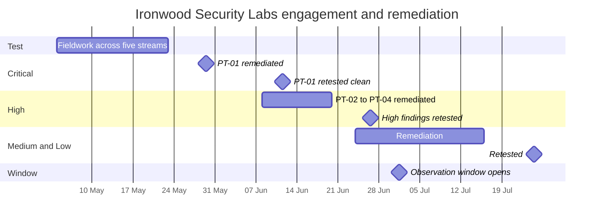

# Diagram — Penetration Test and Remediation Timeline

| Field | Value |
|---|---|
| Document ID | CNB-TRUST-2026-D17 |
| Version | 1.0 |
| Date | 2026-08-11 |
| Owner | Karim Haddad |
| Approver | Marisol Vega |
| Classification | Confidential — Trust &amp; Assurance Programme // Illustrative Portfolio Sample |

**Every closed finding was remediated and retested before this phase's vantage**, and thirteen of the
sixteen were closed before the observation window had run a month. Two ride the mobile release on
2026-08-14 rather than being shipped out of cycle, and one — PT-15 — is accepted with its reasoning
recorded.

Note where the window opens relative to the remediation. **Nine of the sixteen findings were remediated or retested
inside July — but only four were *remediated* there**, PT-06, PT-08, PT-12 and PT-16. The other five were
remediated in June and retested on 2026-07-24, and a retest performed by Ironwood is not a CloudNimbus
change. So the July change population and this timeline overlap by **four**, and 05.09 §4 and 05.13 §2 both
say so where the figures appear.

## Cross-References

| Document | Relationship |
|---|---|
| [05.11 Penetration Testing Programme and Findings](../05.11-penetration-testing-programme-and-findings.md) | PT-01 to PT-16 |
| [05.12 R-37 Tenant Isolation Finding and Remediation](../05.12-r37-tenant-isolation-finding-and-remediation.md) | PT-01 in full |
