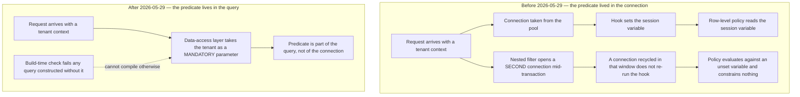

# Diagram — Why the Predicate Failed, and What Replaced It

| Field | Value |
|---|---|
| Document ID | CNB-TRUST-2026-D18 |
| Version | 1.0 |
| Date | 2026-08-11 |
| Owner | Junia Okonkwo |
| Approver | Nathan Oyelaran |
| Classification | Confidential — Trust &amp; Assurance Programme // Illustrative Portfolio Sample |

The defect was not that the control was wrong. It was that **the control lived somewhere a code path could
get around without meaning to** — the enforcement was a property of the connection, and one path acquired a
connection the enforcement had not been applied to.

Moving the predicate into the query makes the failure mode visible at build time rather than at runtime.
That is the whole of the change, and it is why `CNB-C-035` is worded as it is: a control that cannot be
bypassed by accident is a different control from one that is merely correct when used correctly.

## Cross-References

| Document | Relationship |
|---|---|
| [05.04 Tenant Isolation and the Authorisation Model](../05.04-tenant-isolation-and-the-authorisation-model.md) | The architecture as it now stands |
| [05.12 R-37 Tenant Isolation Finding and Remediation](../05.12-r37-tenant-isolation-finding-and-remediation.md) | The finding, the forensics and the judgement |
| [ADR-0021](../adr/ADR-0021-tenant-predicate-at-the-data-access-layer.md) | The decision |
