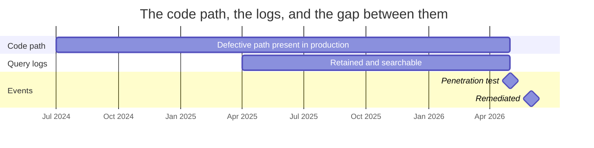

# Working — The Nine Months Nobody Can Examine

| Field | Value |
|---|---|
| Document ID | CNB-TRUST-2026-D19 |
| Version | 1.0 |
| Date | 2026-08-11 |
| Owner | Devon Ashby |
| Approver | Elise Fontaine |
| Classification | Confidential — Trust &amp; Assurance Programme // Illustrative Portfolio Sample |

**The arithmetic, stated rather than implied.**

| | Months |
|---|---|
| The defective code path existed in production for | **22** |
| The retained query logs reach back | **13** |
| **Unexamined** | **9** |

**Nine of the twenty-two months — 41% of the period the defect existed — cannot be searched**, and no
amount of further searching will change that. The seven-year archive does not close the gap, and the reason
is that it holds a different artefact: **RT-05 governs authentication and audit events**, which record who
authenticated and what resource was reached. Database query logging is a separate operational retention of
thirteen months, because keeping statement-level logs for seven years is not something anybody does.

What the search actually established is stronger than an absence. The emitted statement is byte-identical
whether or not the scoping predicate was applied, so a query log cannot distinguish a scoped result from an
unscoped one. The search was therefore for **invocations of the path**, by resolver name and statement
shape — and it found **117 of them, from 9 customers, across the thirteen months**. For each, the logged
**response cardinality** was compared against the number of departments in the invoking tenant, and **in all
117 the cardinality was consistent with a single-tenant result**. An unscoped response would have returned
groups across the whole estate and would have been visibly larger.

**That is a measurement, not an absence — and it makes the gap concrete rather than abstract.** At the
observed rate of roughly nine invocations a month, the nine unexamined months contain **on the order of
eighty invocations nobody can check**. That figure is a projection from the observed rate and not a count,
which is the only honest way to give it.

The gap is the reason RT-05's retention was reviewed — ADR-0024 — and it is the substance of the dissent
Lorraine Kessler recorded when voluntary customer disclosure was refused: "no evidence of exploitation" is
a weaker statement when the period it covers is shorter than the period the defect existed.

## Cross-References

| Document | Relationship |
|---|---|
| [05.12 R-37 Tenant Isolation Finding and Remediation](../05.12-r37-tenant-isolation-finding-and-remediation.md) | The full account |
| [ADR-0024](../adr/ADR-0024-query-log-retention-reviewed.md) | The retention review |
| [governance/GOV-19](../governance/GOV-19-disclosure-decision-and-dissent.md) | The decision and the dissent |
