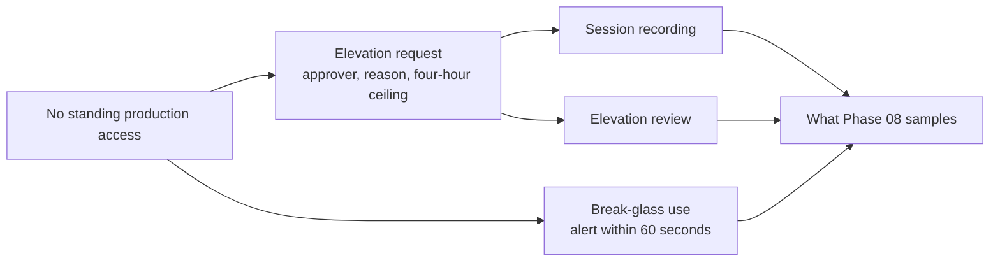

# Diagram — What Each Control Leaves Behind

| Field | Value |
|---|---|
| Document ID | CNB-TRUST-2026-D20 |
| Version | 1.0 |
| Date | 2026-08-11 |
| Owner | Wes Delacroix |
| Approver | Karim Haddad |
| Classification | Confidential — Trust &amp; Assurance Programme // Illustrative Portfolio Sample |

**No standing production access is the control that makes the others testable.** A privileged action that
requires elevation leaves an elevation record with an approver, a reason and a ceiling. The same action
performed by somebody who already had the access leaves nothing but its effect — and an effect is not
evidence of authorisation.

That is the whole argument for the design, and it is an argument about **evidence** rather than about
prevention. Standing access can be perfectly well governed and still be untestable, and untestable is the
condition ML-1 recorded in the 2025 management letter.

## Cross-References

| Document | Relationship |
|---|---|
| [05.03 Privileged Access and Production Entry](../05.03-privileged-access-and-production-entry.md) | The argument in full |
| `04-unified-control-framework-and-policy-architecture` | ADR-0018 — evidence declared before the control is built |
