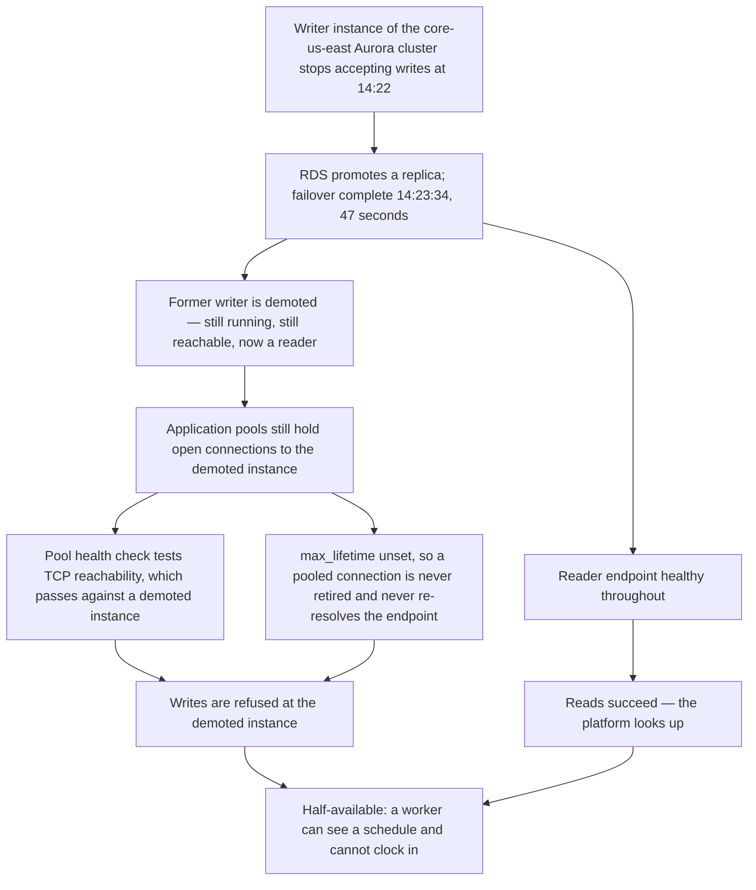

# 06.05 — The Severity-1 Incident of 2026-09-08

| Field | Value |
|---|---|
| Document ID | `CNB-TRUST-2026-605` |
| Version | 1.0 |
| Date | 2026-09-30 |
| Owner | Wes Delacroix, Director of Infrastructure &amp; SRE |
| Approver | Elise Fontaine, Co-founder &amp; Chief Executive Officer |
| Classification | Confidential — Trust &amp; Assurance Programme // Illustrative Portfolio Sample |

---

## 1. What happened

**On 2026-09-08 the CloudNimbus Workforce Platform accepted no writes in `us-east-1` for seventy-one
minutes.** Reads worked throughout. A worker could open the application, sign in, see their schedule, see
their accrued leave balance — and could not clock in.

The incident is `INC-2026-031`. Customer impact ran from **14:22 to 15:33 UTC**. It is the only Severity-1
of the quarter, it is the reason **SC-01 was not met in September 2026 for the customers served from
`us-east-1`**, and it is the identified system incident that engages **DC4** in the description of the
system.

**The region matters and is stated before anything else.** The failure took the **writer instance of the
`core-us-east` Aurora cluster**. **599 of the 640 customers are served from `us-east-1`.** The **41
EU-residency customers are served from `core-eu-central` in `eu-central-1`** and were **unaffected** — their
writes succeeded throughout. `EC-09`'s sampling unit is one calendar month for one region, and September
closed at **99.84% in `us-east-1` and 100% in `eu-central-1`**. **SC-01 was met for 41 customers and missed
for 599.** A blended platform number would have concealed that, which is why none is published.

All times below are UTC.

## 2. Timeline

| Time | Event |
|---|---|
| 14:22 | The writer instance of the `core-us-east` Aurora cluster stops accepting writes |
| 14:22:47 | RDS initiates automated failover |
| 14:23:34 | **Failover complete at the data layer — 47 seconds, inside design** |
| 14:24 | **`CNB-C-068`'s synthetic clock-in fails twice consecutively and pages the on-call SRE — two minutes after onset** |
| 14:26 | First customer report — a tenant at a shift boundary in the US Central time zone |
| 14:29 | The `CNB-C-067` error-rate path corroborates: the write error rate crosses its threshold |
| 14:31 | **Severity-1 declared** under `CNB-C-071`; Wes Delacroix named incident commander |
| 14:47 | Break-glass elevation used to inspect connection state on the production cluster |
| 14:52 | Cause identified |
| 15:04 | Rolling restart of the 11 services on the core write path begins |
| 15:05 | September's SC-01 allowance is exhausted |
| 15:33 | **Writes restored; last service healthy. Customer impact 71 minutes (14:22–15:33)** |
| 15:41 | Incident closed after the `CNB-C-077` acceptance checks, confirmed by the incident commander and the on-call SRE |

Two entries in that table deserve to be read against each other before anything else, and this is the one
place in the phase where the contrast is set out in full. **The data layer recovered in forty-seven seconds,
at 14:23:34. The platform recovered in seventy-one minutes, at 15:33.** Everything in this document is about
the **sixty-nine minutes and twenty-six seconds** in between — the interval between a completed failover and
a platform that could accept a clock-in again. Every other appearance of that contrast in this phase is a
clause pointing back here.

## 3. The mechanism

The application connection pools held open connections to the demoted instance.

That sentence is the whole of it, and it needs three properties of the system to be true at once.

**First: a demoted Aurora instance stays up.** Failover in Aurora promotes a replica and demotes the former
writer; the demoted instance does not disappear, does not close its listener and does not refuse
connections. It remains a healthy, reachable, connectable PostgreSQL instance that has become a reader. It
will accept your connection and it will accept your `SELECT`. It will refuse your `INSERT`.

**Second: the pool health check tested TCP reachability, not writability.** The pools' liveness check
established that a socket could be opened to the endpoint the connection was bound to. Against a demoted
instance that check passes, every time, correctly, for as long as the instance is running. The pool
therefore had no reason to discard the connections it held, and did not.

**Third: `max_lifetime` was unset.** A connection pool with a maximum connection lifetime retires pooled
connections after a fixed interval and opens replacements, and a replacement re-resolves the cluster
endpoint — which, after a failover, resolves to the new writer. With `max_lifetime` unset, **a pooled
connection was never retired and therefore never re-resolved the cluster endpoint.** The pools would have
held those connections indefinitely.

Put together: the write path was bound to an instance that had stopped being the writer, and nothing in the
application's own machinery was capable of noticing. **Reads succeeded throughout** — the reader endpoint
was healthy and the readers were serving normally — **and writes failed.**

**The platform looked up.** That is the property that makes this incident worth a chapter rather than a
paragraph. Every surface a customer or an operator normally uses to decide whether a system is working — the
application loads, the dashboard renders, the reports run, the status endpoints answer — was answering
correctly, because all of them read.

### 3.1 Why a rolling restart rather than a second failover

At 14:52 the cause was identified and the incident commander had two options. **DEC-604** records the choice
and the reasoning.

A second failover was available and would have been faster to initiate. It was rejected because **it does
not address the condition**. Failing over again promotes another replica and demotes the current writer; the
pools would then hold connections to a newly demoted instance instead of the previously demoted one, the
health check would pass against that one too, and `max_lifetime` would still be unset. The most likely
outcome of a second failover was the same failure with a different instance name in it, plus another
forty-seven seconds of data-layer transition and a longer incident.

**The rolling restart addressed the condition directly**, because a restarted service builds a new pool and
a new pool resolves the cluster endpoint. It began at 15:04 across the **11 services on the core write
path**, sequenced rather than simultaneous so that capacity was not withdrawn from an already degraded
platform, and the last service returned healthy at 15:33.

## 4. Impact

| Measure | Value |
|---|---|
| Duration of customer impact | **71 minutes**, 14:22 to 15:33 |
| Region affected | **`us-east-1`** — `eu-central-1` unaffected, `us-west-2` carries no production traffic |
| Customers served from `us-east-1` | **599** of 640 |
| Customers served from `core-eu-central` and unaffected | **41** |
| Failed write requests | **41,208** |
| Customers with at least one failed write | **318** |
| Mean failed writes per affected customer | **130** |
| Largest single tenant | **2,847** |
| Customers in `us-east-1` that attempted no write in the window | **281** |
| Data lost | **None** |
| Recovery point objective engaged | **No** |

318 + 281 = **599**, and 599 + 41 = **640**.

**No data was lost and the recovery point objective was never engaged.** The failover was clean at the data
layer, so nothing that had been committed was at risk; and the writes that failed were **rejected at the
application, not accepted and then lost**. A clock-in that returned an error was a clock-in that did not
happen and had to be made again. **A rejected write is not a lost write, and that difference is the whole of
the durability claim.** It is why SR-10's fifteen-minute recovery point objective is not engaged by this
incident, and why 06.03 can report the quarter's durability position without an asterisk.

That claim was tested after it was made, and it survived. On **2026-09-21** the `CNB-C-112` quarterly
reconciliation found **two calculation runs with no stored output**, both inside the 71 minutes, and the
finding is recorded against `INC-2026-031`. **Both runs were re-executed and their results stored on
2026-09-22, and no export had been issued from either**, so nothing left the platform derived from an
incomplete run. 06.07 §6 carries the detail and ADR-0028 carries what it cost the disclosure.

**The 281 customers that attempted no write were equally unavailable. They did not try.** The write path was
down for every customer served from `us-east-1`; 318 of them happened to have somebody at a shift boundary,
a timesheet submission or an expense capture inside those seventy-one minutes, and 281 did not. Nothing
about the service was working better for the second group.

That distinction is made here because the temptation to read 318 as the blast radius is strong and the
arithmetic that follows from it is wrong. **SC-01 is not measured by who complained.** The commitment is to
the availability of the platform, and the platform was half available to all **599** customers in
`us-east-1`. The 318 is a count of who noticed; the impact figure is a count of what was refused; neither is
a count of who was affected, which in that region is everybody.

**The 41 EU-residency customers are the other half of the same discipline.** They are served from
`core-eu-central`, their writes succeeded, and SC-01 was met for them in September at 100%. Counting them
among the affected would overstate the incident exactly as counting the 281 as unaffected would understate
it, and both errors come from treating "the platform" as one measured object when `EC-09` measures one
region for one month.

**Service credits were applied under the master services agreement** to affected tenants on request, under
**DEC-610** of 2026-09-18. No amount is stated in this or any other document in this programme.

### 4.1 15:05, and why the month was decided while the restart was still running

**This is the chapter that states the 15:05 arithmetic in full; every other appearance in the phase is a
clause and a pointer to here.**

SC-01 commits CloudNimbus to **99.9% monthly availability**. In a 30-day month that allowance is **43.2
minutes** — 43,200 minutes in the month, one tenth of one per cent of them. September's cumulative
unavailability in `us-east-1` passed 43.2 minutes at **15:05**, forty-three minutes into an outage that ran
seventy-one. **Twenty-eight minutes of the incident remained, and twenty-two days of the month remained, and
neither could change the answer.** The 99.84% published at month end — (43,200 − 71) ÷ 43,200 — confirmed an
outcome that was already arithmetically certain while the incident commander was working the restart.

**A monthly allowance is spent, not managed.** There is no recovery from an exhausted one inside the month
it belongs to, and an availability programme that discovers the fact at month end has learned it three weeks
after it stopped being actionable.

## 5. Detection worked. Measurement did not.

**Two continuous controls watched the platform through 8 September, and they disagreed with each other.**

`CNB-C-068` requires synthetic transactions exercising sign-in, **clock-in** and report generation in each
production region every minute, with two consecutive failures paging the on-call site reliability engineer.
A clock-in is a write. The synthetic clock-in failed at 14:23 and again at 14:24; the page went out at
**14:24, two minutes after onset and two minutes before the first customer report.** That control did what
it was written to do.

`CNB-C-096` requires synthetic probes against each of the three regions every 60 seconds, with error-budget
burn against the 99.9% commitment paging the on-call engineer when the one-hour burn rate crosses the alert
threshold. **It is the control the availability figure comes from.** Through all seventy-one minutes its
probes ran on schedule and returned healthy, no burn was recorded against the error budget, and on that
control's arithmetic September was a clean month — **because its probe performs a read**, and the read path
was fine.

So the platform was detected in two minutes and measured as available for the whole outage, by two controls
running at the same cadence, paging the same engineer, across the same three regions. Nobody had noticed the
gap between them, because **nobody had asked what a probe must exercise.** `CNB-C-068` answers that question
— sign-in, clock-in, report generation. `CNB-C-096` does not answer it at all: it fixes frequency, regions
and a paging condition, and is silent on the transaction. **Every word of it was satisfied on 8 September.**

**That silence is `D-06-02`, and it is a design deficiency rather than an operating failure.** The phrasing
is precise rather than generous. An operating failure is corrected by running the control; a design
deficiency can only be corrected by rewriting it, which is what **DEC-609** did on 2026-09-15 and
`ACT-06-02` deployed on 2026-09-19.

**The criteria the deviation is recorded against are the ones `CNB-C-096` cites: `A1.1`, `A1.2` and
`A.8.16`.** That is the whole of the recorded position, and it is worded identically wherever the deviation
appears. Whether the deficiency also bears on **CC4.2** — whether an entity that could not measure its own
availability was evaluating its controls — is **management's separate consideration**, and it is stated here
as a consideration rather than as a fact, because a control's mapping is what the library says it is and
extending it in a deviation record would be amending the library by narrative.

**One uncomfortable thing about the two-minute page should be said rather than enjoyed.** A page at 14:24
and a Severity-1 declaration at 14:31 leave seven minutes of triage, and the first customer report arrived
inside them. Detection was not the weak link.

What `CNB-C-071` expects in that interval is **nothing**. The published statement requires the incident
response plan to be invoked and an incident commander named on a Severity-1 or Severity-2 event, and it
**sets no interval between detection and declaration.** That is the finding, and it is why GOV-22 recorded
the seven minutes rather than measuring them: there is no standard in the library to measure them against,
so a number would have been a number with nothing behind it. The question of whether an interval should be
set is carried as **`IS-21`** and is **decided at the December CAL-06 review**, which is the first occasion
on which a full quarter's incident record exists to set one from.

There is a second-order consequence that 06.01 records and this chapter should not leave implicit. Because
the measurement control saw nothing, **September's 99.84% for `us-east-1` was reconstructed after the fact
from the error-rate record** rather than produced by `CNB-C-096`. The figure is sound and its derivation is
disclosed. But **the incident broke the measurement as well as the service**, and an availability programme
that discovers its service-level number is computed from a different artefact than the one its control
declares has learned something about its evidence architecture as well as about its platform.

## 6. The post-incident review and the five actions

The post-incident review was held on **2026-09-11**, **three business days** after closure. It satisfies
both windows the library carries for this artefact — `CNB-C-102`'s five business days under A1 and
`CNB-C-075`'s ten business days under CC7 — and **the divergence between those two windows is recorded
rather than resolved here**: 06.11 states it and refers it to the clause 9.2 internal audit. The tighter
window governs in practice. Phase 04 is not amended for it, because a library carrying two windows for the
same artefact is a finding about the library and quietly harmonising it would delete the finding.

The review is **GOV-22**, and the five actions were accepted at it under **DEC-606**.

| ID | Action | Owner | Status at vantage |
|---|---|---|---|
| `ACT-06-01` | Pool health check executes a write probe; `max_lifetime` set to 900 seconds | Junia Okonkwo | **Deployed 2026-09-12** |
| `ACT-06-02` | `CNB-C-096` amended — the synthetic probe performs a write, the read probe retained as a separate signal | Wes Delacroix | **Deployed 2026-09-19** |
| `ACT-06-03` | Availability defined in writing as **both a read and a write succeeding** in the measured minute | Nathan Oyelaran | **Recorded 2026-09-11** |
| `ACT-06-04` | A quarterly in-region failover game day added from Q4, distinct from CAL-10 | Wes Delacroix | Scheduled 2026-11-05, **not performed** |
| `ACT-06-05` | Status page vocabulary revised — "degraded" was displayed and the write path was not degraded, it was down | Ana-Sofia Cruz | **Deployed 2026-09-22** |

**`ACT-06-01` fixes the platform. `ACT-06-02` fixes the instrument. `ACT-06-03` fixes the definition, and it
is the one that would have prevented the other two from being needed.** A programme that had written down
what it meant by "available" before it built a probe would have built a probe that tested both halves of it.
That definition is **ADR-0027** and **DEC-607**.

**`ACT-06-05` is the smallest and the least technical and it is not a footnote.** The status page said
"degraded" while clock-ins were being refused. The write path was not degraded; it was down. A customer
reading "degraded" makes a different operational decision — wait and retry — from the one they make reading
"writes unavailable", and a vocabulary that understates is a vocabulary that transfers the cost of the
incident to the customer's judgement.

**`ACT-06-02` amends a published control statement, so Phase 04 was re-issued.** That is recorded at
**DEC-609** on 2026-09-15 and stated again in 06.13, because a phase that changes a document another phase
published has to say so where both readers will see it.

### 6.1 How far the fix reaches

`ACT-06-01` was deployed against **the eleven services on the core write path**, which is the population the
incident was found on and not the population the defect could exist in. A fix whose scope is the set of
things that happened to break is a fix of unestablished scope, and 05.12 applied exactly that discipline to
R-37 rather than accepting the eleven paths the finding arrived through.

So the scope was established rather than assumed. On **2026-09-15** an **estate-wide configuration search
across all 63 microservices** in the boundary looked for the two conditions in the mechanism — a pool health
check testing reachability only, and an unset `max_lifetime`. It found **nine further services** carrying a
reachability-only pool health check. **None of the nine was on a write path**, so none could have produced
the 8 September failure mode, and **all nine were corrected in the same release** as the eleven rather than
scheduled behind them. The same search was run against **`us-west-2` and `eu-central-1`** as well as
`us-east-1`, because a configuration defect that is absent from the region that failed and present in the
region that did not is the version of this finding nobody would have looked for.

**Twenty of the sixty-three services carried the condition; eleven of the twenty sat on a write path and
were the eleven the incident found.** That is the sentence the search exists to make available. Without it
the honest position would have been that eleven services were fixed and fifty-two were unexamined, which is
not a remediated defect but a remediated symptom.

## 7. What this chapter claims, and what it does not

**It claims the data layer performed to design.** Forty-seven seconds is inside anything SR-10
contemplates, and no part of this incident is a criticism of the Aurora failover or of the subservice
organisation that provides it.

**It claims the failure was an application-tier assumption about the data layer**, expressed in three
configuration facts: a reachability-only health check, an unset `max_lifetime`, and a pool that consequently
never re-resolved its endpoint.

**It claims no data was lost and the recovery point objective was not engaged**, because the failed writes
were refused rather than accepted — and it claims it on the strength of the 2026-09-21 `CNB-C-112` finding
having been resolved and checked for an export, not on the strength of the position as it stood on
2026-09-09.

**It claims SC-01 was not met for September 2026 in `us-east-1`**, for the 599 customers served from that
region, and that the outcome became arithmetically certain at 15:05 as §4.1 sets out.

**It claims SC-01 was met for the 41 customers served from `eu-central-1`**, which is a different statement
from the platform having been available.

**It does not claim the platform was available to the 281 customers that attempted no write.** They did not
try.

**It does not offer any conclusion about the service auditor's opinion.** An identified system incident is
disclosed in the description under DC4 and any related control deviation is disclosed in Section IV with the
auditor's evaluation of it. The evaluation is the auditor's, it has not been performed, and nothing in this
phase anticipates it.

## Cross-References

| Document | Relationship |
|---|---|
| [06.01 Availability Architecture and Commitments](06.01-availability-architecture-and-commitments.md) | The reader and writer endpoints, the 43.2-minute allowance, and 15:05 |
| [06.04 Disaster Recovery and the August Exercise](06.04-disaster-recovery-and-the-august-exercise.md) | Why the exercise twenty days earlier could not have found this |
| [06.06 Incident Management and the DC4 Disclosure](06.06-incident-management-and-the-dc4-disclosure.md) | DC4, and the draft disclosure written at the vantage |
| [06.07 The Calculation Engine and Processing Integrity](06.07-the-calculation-engine-and-processing-integrity.md) | The two runs with no stored output, found on 2026-09-21 and stored on 2026-09-22 |
| [06.08 Input Validation and Completeness](06.08-input-validation-and-completeness.md) | What happened to the 41,208 refused writes, and the 278 that were never resubmitted |
| [06.12 Quarter Three Operating Record](06.12-quarter-three-operating-record.md) | `D-06-02`, the SC-01 commitment failure and the quarter's figures |
| [governance/GOV-22](governance/GOV-22-post-incident-review-inc-2026-031.md) | The post-incident review of 2026-09-11 |
| [diagrams/06-the-incident-timeline](diagrams/06-the-incident-timeline.md) | The seventy-one minutes, minute by minute |
| [ADR-0027 Availability Means Read and Write](adr/ADR-0027-availability-means-read-and-write.md) | `ACT-06-03`, and the definition that came too late |
| [04.05 Controls for the Common Criteria CC6 to CC9](../04-unified-control-framework-and-policy-architecture/04.05-controls-for-the-common-criteria-cc6-to-cc9.md) | `CNB-C-067`, `CNB-C-071`, `CNB-C-075` and `CNB-C-077` as published |
| [04.06 Controls for Availability, Processing Integrity, Confidentiality and Privacy](../04-unified-control-framework-and-policy-architecture/04.06-controls-for-availability-processing-integrity-confidentiality-and-privacy.md) | `CNB-C-096` and `CNB-C-102` as published |
| [02.12 Principal Service Commitments and System Requirements](../02-system-scope-isms-boundary-and-description/02.12-principal-service-commitments-and-system-requirements.md) | SC-01 and SR-10 |

---

← [06.04 Disaster Recovery and the August Exercise](06.04-disaster-recovery-and-the-august-exercise.md) · [Phase 06 README](06.00-README.md) · [06.06 Incident Management and the DC4 Disclosure](06.06-incident-management-and-the-dc4-disclosure.md) →
