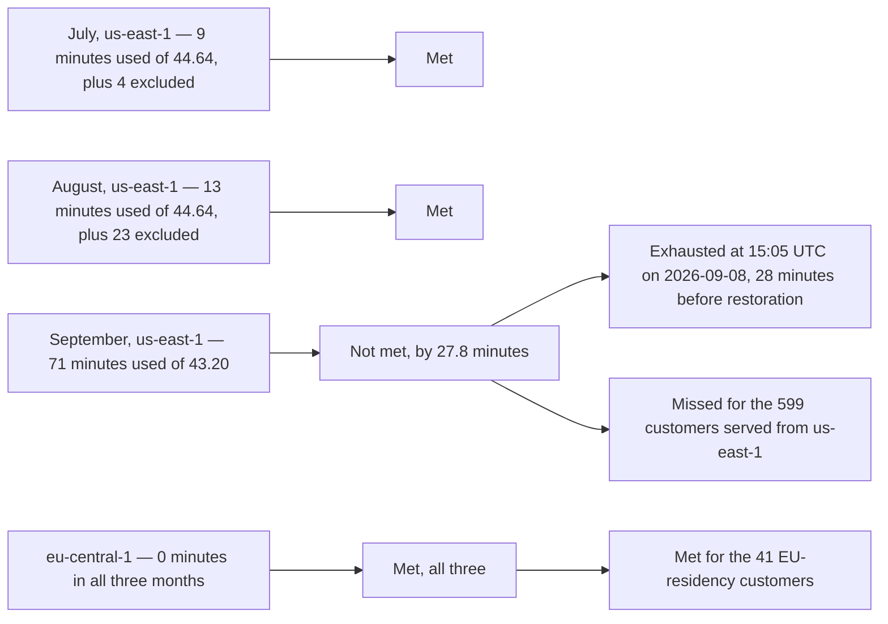

# Diagram — Three Months Against the Line, Region by Region

| Field | Value |
|---|---|
| Document ID | CNB-TRUST-2026-D21 |
| Version | 1.0 |
| Date | 2026-09-30 |
| Owner | Wes Delacroix |
| Approver | Nathan Oyelaran |
| Classification | Confidential — Trust &amp; Assurance Programme // Illustrative Portfolio Sample |

**SC-01 is a monthly commitment measured per region. There are six tests here, not one.**

| Month | Days | Region | Minutes in the month | Allowance at 99.9% | Minutes excluded | Downtime | Allowance remaining | Availability | Met |
|---|---|---|---|---|---|---|---|---|---|
| July 2026 | 31 | `us-east-1` | 44,640 | 44.64 min | **4** | 9 min | 35.64 min | **99.98%** | Yes |
| July 2026 | 31 | `eu-central-1` | 44,640 | 44.64 min | 0 | 0 min | 44.64 min | **100%** | Yes |
| August 2026 | 31 | `us-east-1` | 44,640 | 44.64 min | **23** | 13 min | 31.64 min | **99.97%** | Yes |
| August 2026 | 31 | `eu-central-1` | 44,640 | 44.64 min | 0 | 0 min | 44.64 min | **100%** | Yes |
| September 2026 | 30 | `us-east-1` | 43,200 | 43.20 min | 0 | **71 min** | **−27.80 min** | **99.84%** | **No** |
| September 2026 | 30 | `eu-central-1` | 43,200 | 43.20 min | 0 | 0 min | 43.20 min | **100%** | Yes |

`us-west-2` carries no production traffic and is not measured against SC-01. **The excluded minutes are the
customer-visible minutes lost inside an announced maintenance window, not the length of the window.**
August's 23 fall inside the CAL-10 window of **06:00 to 10:00 UTC on 2026-08-19 — four hours, notified
2026-08-05** — in which the exercise ran 171 minutes and the platform served production traffic from
`us-west-2` for 148 of them; the 23 are two cutover intervals, 14 at the failover and 9 at the read-path
re-point on failback. July's 4 fall inside the **`TP-20` delivery window of 2026-07-15, notified
2026-07-01**. Both windows were notified fourteen days ahead and both are excluded under the master services
agreement. The measured denominators are **44,636**, **44,617** and **43,200**.

## What 99.9% costs

**Forty-three minutes is one incident.** A monthly allowance of 43.2 minutes in a 30-day month and 44.64 in
a 31-day month is not a budget that absorbs a month of small degradations; it is roughly the length of a
single unplanned event handled competently from detection to restoration. An organisation committing to
99.9% monthly has committed to **at most one bad three-quarters of an hour per calendar month**.

## The mean, and who the commitment was actually missed for

The three `us-east-1` months average **99.93%**, and **the mean is not the test** — SC-01 is monthly and has
no quarterly form to average into. 06.01 §3.2 owns that argument and states it in full.

**SC-01 was met for 41 customers and missed for 599.** The 41 EU-residency customers are served from
`core-eu-central` in `eu-central-1` and lost nothing on 8 September; the 599 served from `us-east-1` lost
seventy-one minutes of the write path. A blended platform figure would have averaged the region that failed
against the region that did not, which is the same move the quarterly mean makes across time rather than
across geography, and it would have concealed the miss rather than disclosed it.

## The minute the month was decided

September's allowance ran out at **15:05 UTC on 2026-09-08**, twenty-eight minutes before writes were
restored, which is why the month-end figure confirms rather than discovers. **06.05 §4.1 owns that
arithmetic and states it in full.**

## And the figure was not produced by the control that exists to produce it

`CNB-C-096` is the availability measurement control and it feeds **EC-09**, whose sampling unit is one
calendar month for one region with the achieved percentage against the commitment. Through all seventy-one
minutes its probes ran on schedule and reported healthy, **because the probe performs a read** and the
reader endpoint was fine.

**The 99.84% in the first table was therefore reconstructed after the fact from the error-rate record.** So
were July's and August's figures: under `ACT-06-03`'s definition, **all three months were re-derived from
the error-rate record on 2026-09-24** so that the quarter rests on one basis, and the re-derivation raised
July from 4 minutes to 9 and August from 6 to 13. The old instrument understated two months as well as
missing one. A service-level figure computed from a different artefact than the one its control declares is
a figure whose provenance has to travel with it — **the incident broke the measurement as well as the
service** — and that is `D-06-02`.

## Cross-References

| Document | Relationship |
|---|---|
| [06.01 Availability Architecture and Commitments](../06.01-availability-architecture-and-commitments.md) | SC-01, SR-10, the architecture and the three availability points in full |
| [06.05 The Severity-1 Incident of 2026-09-08](../06.05-the-severity-1-incident-of-2026-09-08.md) | The seventy-one minutes, the detection failure, and §4.1 which owns the 15:05 arithmetic |
| [diagrams/06-the-incident-timeline](06-the-incident-timeline.md) | 15:05 in its place in the timeline |
| [ADR-0027](../adr/ADR-0027-availability-means-read-and-write.md) | The definition that would have prevented the measurement failure |
