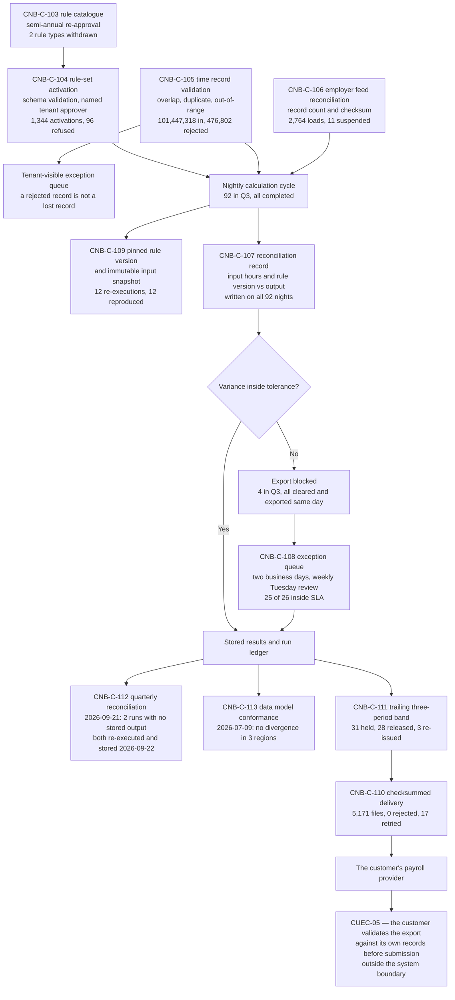

# Diagram — The Calculation Pipeline and Its Checks

| Field | Value |
|---|---|
| Document ID | CNB-TRUST-2026-D22 |
| Version | 1.0 |
| Date | 2026-09-30 |
| Owner | Grete Lindqvist |
| Approver | Karim Haddad |
| Classification | Confidential — Trust &amp; Assurance Programme // Illustrative Portfolio Sample |

**Every box on this path is a refusal, and that is the design.** The rule schema refuses an invalid rule
set, the API refuses a malformed time record, the feed reconciliation refuses a truncated load, the nightly
reconciliation refuses to release an export it cannot balance, the band check refuses to deliver a total it
cannot recognise, and the delivery control refuses to treat an unacknowledged file as delivered. **A
processing integrity control that only observes is a metric.** What makes each of these a control is that
something stops when it fires, and that the stop leaves a timestamp.

Two features of the picture are worth naming because they are the ones a reader would otherwise supply
wrongly.

**Nothing that is refused disappears.** A rejected time record goes to a tenant-visible exception queue; a
suspended feed goes back to the tenant's Customer Success manager; a held export goes to the tenant's named
payroll contact. The completeness limb of **PI1.2** is satisfied not by processing everything but by losing
nothing, and a pipeline that discarded its refusals would look cleaner at every stage and be less complete
at all of them.

**The last box is not CloudNimbus's.** `CNB-C-110` ends at the payroll provider's endpoint. **CUEC-05** —
the customer validating the export against its own records before submitting it — sits beyond the system
boundary, is performed by the user entity, is not evidenced by CloudNimbus and is not tested by the service
auditor. It is drawn here because the chain does not stop where the controls do, and the last point at
which a person who knows what the numbers ought to look like sees them is on the other side of that
boundary.

The single arrow the incident travelled is worth locating too. On 8 September, two off-cycle recalculations
begun before 14:22 reached the arrow between `RUN` and `STORE` while the write path in `us-east-1` was
refusing writes. The runs existed and the outputs did not, and the control that found them — `CNB-C-112` —
operates quarterly and found them thirteen days later, on **2026-09-21**. **Both were re-executed and
stored on 2026-09-22, and no export had been issued from either**, so nothing crossed the `SEND` box on an
incomplete result.

## Cross-References

| Document | Relationship |
|---|---|
| [06.07 The Calculation Engine and Processing Integrity](../06.07-the-calculation-engine-and-processing-integrity.md) | PI1.1 to PI1.5 across the engine, and the two unstored runs |
| [06.08 Input Validation and Completeness](../06.08-input-validation-and-completeness.md) | The three doors on the left of the diagram |
| [06.09 Output Accuracy, Reconciliation and the Export](../06.09-output-accuracy-reconciliation-and-the-export.md) | Everything downstream of the reconciliation record |
| [04.06 Controls for Availability, Processing Integrity, Confidentiality and Privacy](../../04-unified-control-framework-and-policy-architecture/04.06-controls-for-availability-processing-integrity-confidentiality-and-privacy.md) | `CNB-C-103` to `CNB-C-113` as published |
| [02.11 Complementary User Entity Controls](../../02-system-scope-isms-boundary-and-description/02.11-complementary-user-entity-controls.md) | CUEC-04, CUEC-05 and CUEC-09 |
