# Diagram — Seventy-One Minutes, and the Two Before It Paged

| Field | Value |
|---|---|
| Document ID | CNB-TRUST-2026-D23 |
| Version | 1.0 |
| Date | 2026-09-30 |
| Owner | Wes Delacroix |
| Approver | Elise Fontaine |
| Classification | Confidential — Trust &amp; Assurance Programme // Illustrative Portfolio Sample |

```mermaid
gantt
    title INC-2026-031 on 2026-09-08, all times UTC
    dateFormat HH:mm
    axisFormat %H:%M
    section Customer impact
    Writes failing for every customer served from us-east-1 :crit, imp, 14:22, 71m
    section Data layer
    Automated failover, complete in 47 seconds :fov, 14:22, 2m
    section Detection
    Undetected by CloudNimbus :und, 14:22, 2m
    CNB-C-068 synthetic clock-in pages the on-call SRE :milestone, page, 14:24, 0m
    First customer report :milestone, cust, 14:26, 0m
    CNB-C-067 error-rate path corroborates :milestone, alrt, 14:29, 0m
    section Response
    Severity-1 declared, incident commander named :milestone, sev, 14:31, 0m
    Diagnosis, including break-glass at 14.47 :diag, 14:31, 21m
    Rolling restart of the 11 core write services :rest, 15:04, 29m
    section Commitment
    September SC-01 allowance exhausted :milestone, alw, 15:05, 0m
    Writes restored, last service healthy :milestone, rec, 15:33, 0m
    Incident closed after acceptance checks :milestone, clo, 15:41, 0m
```

**Four intervals in that picture carry the whole argument.**

| Interval | Duration | What it means |
|---|---|---|
| 14:22:47 → 14:23:34 | **47 seconds** | The data layer recovered. Inside design, and no part of this incident is a criticism of it |
| 14:22 → 14:24 | **2 minutes** | `CNB-C-068`'s synthetic clock-in failed twice consecutively and paged. **Detection worked**, because that control names the transactions it exercises and one of them is a write |
| 14:22 → 15:33 | **71 minutes** | `CNB-C-096`'s probes ran every 60 seconds throughout and reported healthy, because that probe performs a read. **No burn was recorded against the error budget for any of it**, and September's 99.84% for `us-east-1` had to be derived from the error-rate record. This interval is `D-06-02` |
| 14:24 → 14:31 | **7 minutes** | Page to declaration. **No control in the library measures this interval**, and the first customer report arrived inside it |

The forty-seven seconds against the seventy-one minutes is the contrast the phase turns on, and
[06.05 §2](../06.05-the-severity-1-incident-of-2026-09-08.md) states it in full; what the picture adds is
that the sixty-nine minutes and twenty-six seconds between them are an application tier holding open
connections to an instance that had stopped being the writer, behind a pool health check that tested whether
a socket could be opened rather than whether a row could be written.

**15:05 is the timestamp that decided September in `us-east-1`**, and
[06.05 §4.1](../06.05-the-severity-1-incident-of-2026-09-08.md) sets out the arithmetic in full: the month's
allowance was spent forty-three minutes into an outage that ran seventy-one, twenty-eight minutes before
restoration and twenty-two days before the month ended.

**`D-06-02` is the seventy-one minutes, not the seven.** For every one of those seventy-one minutes
`CNB-C-096` — the control the availability figure and evidence class `EC-09` come from — ran on schedule,
returned healthy, and recorded no burn against the error budget, while the platform refused every write in
the region. **Seventy-one minutes of measurement blindness on the instrument the service-level number is
produced from** is the deficiency, and it is a **design deficiency** rather than an operating failure
because the published statement fixed cadence, regions and a paging condition and never fixed what a probe
must exercise. The control did what it said. What it said was not enough.

**The seven minutes are the observation GOV-22 declined to promote.** They are page to declaration, they
contain the first customer report, and `CNB-C-071` sets **no interval** between the two — which is why the
review recorded them and did not measure them, and why the question is carried as `IS-21` to the December
CAL-06 review. An observation about an absent standard is worth recording. It is not the finding, and the
row above it is.

## Cross-References

| Document | Relationship |
|---|---|
| [06.05 The Severity-1 Incident of 2026-09-08](../06.05-the-severity-1-incident-of-2026-09-08.md) | The full account, the mechanism and the five actions |
| [06.01 Availability Architecture and Commitments](../06.01-availability-architecture-and-commitments.md) | The 43.2-minute allowance and the September figure |
| [governance/GOV-22](../governance/GOV-22-post-incident-review-inc-2026-031.md) | The post-incident review of 2026-09-11 |
| [diagrams/06-availability-against-the-commitment](06-availability-against-the-commitment.md) | The three months against the line |
