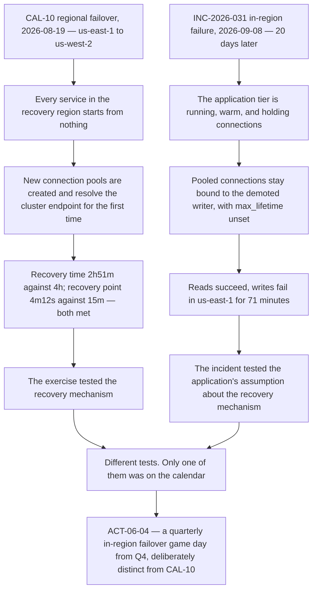

# Diagram — What the Exercise Tested, and What It Could Not

| Field | Value |
|---|---|
| Document ID | CNB-TRUST-2026-D24 |
| Version | 1.0 |
| Date | 2026-09-30 |
| Owner | Wes Delacroix |
| Approver | Nathan Oyelaran |
| Classification | Confidential — Trust &amp; Assurance Programme // Illustrative Portfolio Sample |

**A regional failover destroys the precondition of the failure it is imagined to cover.** When CloudNimbus
fails a region, every service in the target region *starts*: pods are scheduled, processes initialise, and
connection pools are built from nothing and resolve the cluster endpoint for the first time. There is no
pool of long-lived connections held open to a previous writer, because there is no previous writer in that
region and no process that was running before the cutover.

The 8 September incident was the opposite condition. Nothing was restarted and nothing moved. A single
Aurora writer was demoted and a replica promoted beneath an application tier that was **already running**,
and the question was whether a live process would notice that the socket it held no longer led to anything
that would accept a write. It did not, and no variant of CAL-10 would have asked it.

| | CAL-10 regional failover | The in-region failure of 8 September |
|---|---|---|
| Application tier at the moment of failover | Cold — starting in the recovery region | **Warm — running and holding connections** |
| Connection pools | Created new, resolving the endpoint for the first time | **Pre-existing, bound to the instance that was demoted** |
| What is being tested | Can we run the platform somewhere else, fast enough, with a small enough gap | **Does a running platform notice the ground moving under it** |
| Measured by | Recovery time and recovery point | Nothing, until an error rate rose |
| Outcome | **Both objectives met with margin** | **71 minutes; SC-01 missed for September in `us-east-1`, met in `eu-central-1`** |

**This is not a criticism of the exercise.** CAL-10 tested what it is designed to test and passed with an
hour and nine minutes of margin on recovery time and nearly eleven on recovery point. It is a statement
about **coverage**: an annual regional failover leaves the in-region, beneath-a-live-tier class of failure
entirely untested, and until 8 September nobody had written that down.

It is also the deliberate echo of **R-37**. There, the isolation architecture was sound and what failed was
a belief about it — that every path took a connection the ordinary way. Here, the recovery mechanism was
sound and what failed was a belief about it — that a completed failover reaches the application. **The
mechanism worked and the assumption about it did not**, twice, in two different families, five months apart.

## Cross-References

| Document | Relationship |
|---|---|
| [06.04 Disaster Recovery and the August Exercise](../06.04-disaster-recovery-and-the-august-exercise.md) | The exercise, the six findings and the coverage argument in full |
| [06.05 The Severity-1 Incident of 2026-09-08](../06.05-the-severity-1-incident-of-2026-09-08.md) | The mechanism, and why a rolling restart was chosen |
| [governance/GOV-21](../governance/GOV-21-disaster-recovery-exercise-report.md) | The exercise report accepted 2026-08-24 |
| [05.12 R-37 Tenant Isolation Finding and Remediation](../../05-security-criteria-and-technical-controls/05.12-r37-tenant-isolation-finding-and-remediation.md) | The earlier case of a sound mechanism and a wrong assumption |
