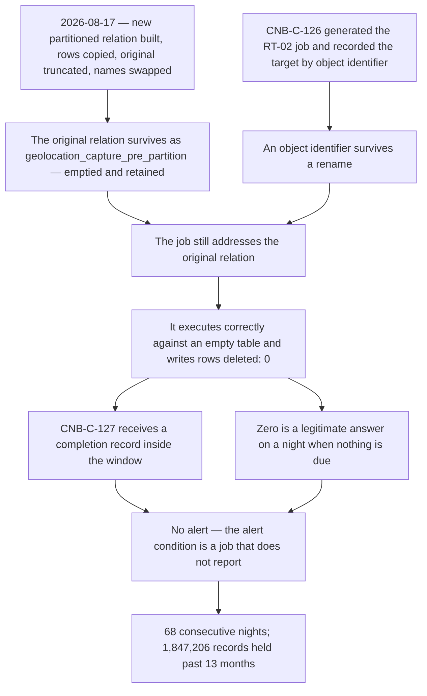

# 07.03 — The RT-02 Retention Failure

| Field | Value |
|---|---|
| Document ID | `CNB-TRUST-2026-703` |
| Version | 1.0 |
| Date | 2026-11-27 |
| Owner | Devon Ashby, Staff Engineer, Data Platform |
| Approver | Elise Fontaine, Co-founder &amp; Chief Executive Officer |
| Classification | Confidential — Trust &amp; Assurance Programme // Illustrative Portfolio Sample |

---

## 1. Sixty-eight nights of a job that worked

**RT-02 says that geolocation captured at clock-in is held for thirteen months and then deleted,
irrespective of contract term.** It is the only rule in the retention schedule that expires a category of
customer data while the customer relationship it came from is still running, and Phase 02 chose it
deliberately: geolocation was argued for removal from the platform, refused, and paid for in retention.

**§3's table carries the figures and this section does not restate them.** This chapter owns the mechanism,
the notification decision and the DC4 determination, and every other appearance of any of them in this phase
is a clause and a pointer back to here.

## 2. The mechanism

On **2026-08-17** a schema migration partitioned the geolocation capture table in `eu-central-1` by month.
The reason was ordinary and good: a rolling thirteen-month window over a table that gains tens of thousands
of rows a night becomes expensive to query and expensive to delete from, and monthly partitions make both
cheap. The migration was applied region by region and **`eu-central-1` went first**, because it is the
smallest of the three populations and the safest place to learn something.

**The migration could not partition the table in place.** It created a new partitioned relation, copied
thirteen months of rows into it, **truncated the original**, and swapped the names: `geolocation_capture`
became `geolocation_capture_pre_partition`, and the new relation took its place under the old name.

**`CNB-C-126` generates the job set from the retention schedule, and the generator resolves each rule to a
physical relation by object identifier, recorded when the job was generated.** An object identifier survives
a rename. **After the swap the RT-02 job still addressed the original relation — which the migration had
emptied and retained.** It executed correctly against an empty table every night for sixty-eight nights and
reported what it found: rows deleted, zero.

**The job was not wrong. It was pointed at the wrong object, and nothing in the library compares a job's
target to the rule's.**

That much is a migration consequence and it is not the finding. The finding is what happened next.

**It reported. That is the whole of the defect.** `CNB-C-127` requires each scheduled deletion job to write
a completion record stating rows deleted per store, and alerts the data platform on-call engineer when **a
job does not report inside its window**. The generated RT-02 job reported inside its window every night. A
job that reports "rows deleted: 0" has reported, and zero is a legitimate answer: on a night when nothing
crosses the thirteen-month boundary, zero is the right number and an alert on it would be a false one.

**Nothing in the library could tell the difference between a rule with nothing to delete and a rule that
could no longer see what was due.** The alert condition is about the arrival of a record. The failure was in
the content of a record that arrived on time.

`diagrams/07-the-rt02-failure-and-why-nothing-alerted.md` sets the same sequence against what would have had
to be true for anything to fire.

**And the largest population in the estate has not yet been through the change that broke the smallest.** At
this vantage the migration **has not been applied to `us-east-1` or `us-west-2`**. It is scheduled for
**2027-01**, behind the retention rule change record `CA-07-02` introduced, and `CA-07-02`'s first output is
the check that will run against it.

## 3. The figures

| Item | Value |
|---|---|
| Migration deployed | **2026-08-17** |
| First affected run | **2026-08-17** |
| Last affected run | **2026-10-23**, the night the condition was found |
| Nights the job ran, reported success and deleted nothing | **68** — 2026-08-17 to 2026-10-23 **inclusive of both ends**, which is **67 elapsed days** |
| What each of those nights produced | A completion record inside the window naming the store and the rule and stating **rows deleted: 0**. No error, no exception, no missed window, no retry and no page |
| Discovered | **2026-10-23** |
| Rules affected | **1 of 8** — RT-02 only, and only in `eu-central-1`. RT-01 and RT-03 to RT-08 ran correctly throughout, in all three regions |
| Records retained past RT-02's thirteen months | **1,847,206** geolocation capture points |
| Individuals whose records were affected | **58,412** |
| Of those, individuals who left their employer during the sixty-eight nights | **2,106** — their location history was retained past the promise after they stopped being workers |
| Nightly distribution | A mean of just over **27,000** a night, from **4,118** to **41,902** |
| Oldest record at discovery | **13 months and 67 days** — over its rule by **67 days** |
| Customers whose tenants held affected records | **34** of the 41 EU-residency customers |
| EU-residency customers holding none | **7** — geolocation capture is disabled in those tenants. **34 + 7 = 41** |
| Job target corrected and redeployed | **2026-10-24** |
| Catch-up deletion run | **2026-10-25**, removing all 1,847,206 |
| Completion record verified | **2026-10-27**, under `CNB-C-127`'s catch-up path |
| Backup residue window under `CNB-C-128` | **35 days from 2026-10-25 — expires 2026-11-29** |

**The counting convention is stated because two numbers in that table look inconsistent and are not.** The
count of nights is inclusive of both ends and is 68; the elapsed interval between the first affected run and
the last is 67 days, and that is why the oldest record was over its rule by 67 days and not by 68. A phase
that reported "68 nights" and "68 days over" would have used one number for two measurements.

**The nightly figures are not the shape of the night the job ran.** A thirteen-month rule deletes rows
**captured thirteen months earlier**, so the range from 4,118 to 41,902 is the capture-day range of the
corresponding days in the autumn of 2025. No weekday attribution is available from the run date and none is
offered. What the range does establish is that nobody could have spotted the condition from a single night's
zero.

**The catch-up count is corroborated rather than asserted.** 1,847,206 comes from the same class of
completion record that had been wrong for sixty-eight nights, so **pre-deletion row counts were taken per
partition on 2026-10-25 before the run** and **reconciled to the completion record on 2026-10-27, agreeing
exactly**. The reconciliation is filed with **EC-17** under `EV-703`, and it is the reason the figure is not
carried under **`AS-36`**, which remains an assumption about the seven rules the reconciliation says nothing
about.

And **the residue window expires two days after this vantage.** The catch-up cleared the primary stores on
2026-10-25; the backups taken up to and including that date still hold the rows, and RT-07 ages them out
over thirty-five days, so **on 2026-11-27 the correction is not yet complete**. That is **DEC-705** and
**ADR-0033**.

## 4. How it was found, which is the uncomfortable part

**The examination found it, not the control.**

On **2026-10-23** Rahul Bhargava was assembling the Q4 retention evidence sample for Ashcombe &amp; Doyle
and pulled `CNB-C-127`'s completion records for the period from EC-17. The sample was a routine one: a
sampler takes job runs, and the field a sampler reads first is the one stating rows deleted per store.

**Sixty-eight consecutive nights of "rows deleted: 0" on one rule in one region, in a table with a rolling
thirteen-month window, is not a pattern that occurs.** It was visible in the first screen of the extract. It
had been visible in the first screen of the extract every night since 17 August.

Say plainly what that means. **The control produced the evidence that disproved it, and nobody looked at
that evidence until an auditor asked for it.** `CNB-C-127` wrote a truthful, complete, timestamped record of
its own failure sixty-eight times, filed it in the evidence store, and nothing in the library required any
person or any machine to read it. **A completion record nobody reads is a log, not a control.**

That sentence is the finding, and it generalises past this rule. The library holds controls whose operating
evidence is a record written to a store — job records, reconciliation outputs, review minutes — and the
design question the episode raises for all of them is whether the control's condition is *that the record
exists* or *what the record says*. `CNB-C-127`'s condition was the first, and the difference between the two
is invisible until the content is wrong in a way that arrives on time.

**The generalisation is given an owner rather than left as a remark.** It is **`IS-33`**, owner **Rahul
Bhargava**, referred to the next library issue: enumerate the controls in the library whose operating
condition is that a record was written rather than what the record says, and decide for each whether the
condition is right. **The count cannot be stated at this vantage** — the library's published statements do
not distinguish the two conditions in a form that can be counted mechanically, and the enumeration is
manual work against 149 statements that has not been done. Saying so is the point: **a claim about "a
number of controls" with no number and no owner is the thing this portfolio exists to refuse**, and a
referral with an owner and an admitted unknown is the smallest honest version of it.

Alongside it sits a smaller and no less uncomfortable observation. **An evidence request is not a control.**
It happens once a quarter at most and it is performed by a compliance manager rather than by the engineer
who owns the data, and the programme found a two-month retention failure through the slowest detective
mechanism it has.

## 5. What was engaged and what was not, and why the precision matters here

**SR-08 was engaged, and it is the instrument this phase almost failed to name.** `02.12` §3 publishes it:
*retention enforced by scheduled deletion jobs whose failure is alerted*. **Its first clause was not
achieved in `eu-central-1` for sixty-eight nights** — retention was not *enforced*, whatever the second
clause did. And `02.12` §4, written in March, glossed the requirement in terms that describe October
exactly: *"a deletion job that runs is worth nothing if a job that silently stops running produces the same
observable state — an absence of errors — as a job that succeeded."* Phase 06 handed this phase the task of
testing SR-08 rather than asserting it. The test was run by the event, and SR-08 failed it. §8 carries what
that does to DC4.

**The nearest incident machinery does not fit, and `GOV-26` §5 disposes of each piece in the terms the
commitments are written in.** One sentence each here, and the working is there. **SC-02 and O4 are not
engaged**: the 48-hour clock runs from CloudNimbus's determination of a security incident affecting customer
data, no such determination was made, nothing left `eu-central-1`, the region pinning required by SC-04 and
SR-02 held throughout, no access outside the normal processing path occurred, and the disclosure register
`CNB-C-132` maintains holds no entry arising from the condition. **SC-03 and O7 are not engaged**: that is
the termination-deletion commitment, implemented by RT-08 and `CNB-C-118`, and **RT-02 is an in-life
retention rule failing while the contract is live** — no tenant was terminating and no certificate was due.
**O6 is not engaged**: no data subject request had been made about any of these records.

What went wrong is that data which should have ceased to exist continued to exist. That is a retention
failure, and it is a different thing from a security incident affecting customer data.

**`CNB-C-118` operated correctly throughout the period**, and **C1.2 is not evidenced by this failure**;
07.01 §4 sets out why the two look alike and are not.

## 6. The notification decision, and the dissent

**All 41 EU-residency customers were notified on 2026-10-26**, three days after discovery — the 34 whose
tenants held affected records, and the 7 told plainly that they held none. **GOV-26** is the record and
**DEC-704** the decision, taken by Tobias Lund as General Counsel and Data Protection Officer.

**No commitment required it.** SC-02, O4 and O6 did not run, for the reasons in §5, and **the master
services agreement is silent** on over-retention of a category inside its own rule. The company notified
forty-one customers of a thing it had not promised to tell them about.

Two reasons are recorded. The first is stated as a matter of contract rather than of status. **The data
processing addendum allocates the determination of purposes to the employer and obliges CloudNimbus to
process on the employer's documented instructions; whether that allocation is correct in law is for each
customer's own advisers.** A customer asked six months later whether its geolocation records had been held
to the stated period has to be able to answer, and only CloudNimbus holds the answer.

**The second reason is the one this chapter carries in full. The retention promise in the privacy notice was
made to the worker, not to the employer.** CloudNimbus's in-product notice tells individuals that clock-in
location is kept for thirteen months; for sixty-eight nights it kept some of them longer; and **CloudNimbus
has no channel to those individuals** — CUEC-07 puts notice of the employer's own processing in the
employer's hands, the in-product notice reaches only a worker who opens the app, and there is no address
list, no mailing, no relationship and no contract. **The company cannot tell the people it made the promise
to. Notifying the employer is the nearest available thing to keeping it.** 07.04 §5 owns the structural
version of that problem.

**The rejected alternative was to notify nobody**, and it was refused because **a retention commitment is
not discharged by the data having been safe**: the promise was that the record would not exist, and it
existed. **GOV-26 §6** states that argument at its strongest before refusing it.

**The dissent is Ana-Sofia Cruz's**, minuted: a notification with **no action for the customer to take**
converts a four-day internal correction into a permanent entry in forty-one procurement files, re-read at
every renewal and read by some recipients as an incident of a kind it is not. No attendee disputed any part
of it, and she was **overruled by Tobias Lund** on the ground that the cost she identified is the cost of
having told the truth. **GOV-26 §7** minutes it in full and **ADR-0032** carries the decision, the
alternative and the reason for writing down a notification made in the absence of any obligation to notify.

**The position at the vantage, because a prediction that is never tested is an opinion.** Of the forty-one
recipients, **6 acknowledged**, **2 asked a follow-up question** — both answered inside two business days —
and **1 requested the deletion evidence**. **None opened a case, raised a claim, or treated the notification
as an incident**, and thirty-two do not appear to have replied at all. That neither refutes the dissent,
whose cost lands at renewal and in questionnaires rather than in the month after, nor vindicates the
decision; a nil return would have been evidence too, and the discipline is to take the reading.

## 7. R-38, and why it is not R-06

**R-38 was admitted to the risk register on 2026-10-23**, the day the condition was found, on evidence,
**between quarterly reviews under DEC-306** — which admitted the thirty-six baseline entries and expressly
kept the register open to additions on evidence. **No CAL-06 review falls inside this period** and the Q4
review is 2026-12-29.

> **R-38 — A retention or deletion job reports success while its predicate matches nothing, so the absence
> of deletion is indistinguishable from nothing being due.**

Owner **Devon Ashby**. Entering rating **3 × 4 = 12, Moderate** — likelihood 3, expected within the
certification cycle, on one occurrence in one region on one rule. **Impact 4 does not rest on exposure.**
`03.02` §2's table anchors impact 4 at *exposure of personal information for one tenant, or a wrong amount
reaching an individual*, and neither limb is satisfied here: this phase's position is that **no exposure
occurred**, and thirty-four tenants were touched rather than one. The reading that fits is the one `03.02`
§3 gives when it explains the same score for **R-24** — **personal information used outside its notice** —
and that is the right anchor here. Accepted by the risk owner under
clause 6.1.3 f), and, the band being Moderate, by **Karim Haddad** alongside, per `03.02` §6. The register
enters the period at **37 — 8 High · 17 Moderate · 12 Low** and leaves it at **38 — 8 High · 18 Moderate ·
12 Low. 8 + 18 + 12 = 38.**

**R-38 is not R-06, and the argument turns on the register's own wording.** R-06 reads: *a scheduled
retention or deletion job **fails silently** and data is kept past its rule*, at 4 × 4 = 16, High, owned by
Devon Ashby since the baseline. **The job did not fail.** It succeeded, on time, with a complete record.
R-06 describes **an absent alert on a failure** — the alert it contemplates is exactly `CNB-C-127`'s, which
did not miss it, because there was no failure for it to miss. R-38 describes something the baseline did not
contemplate: **an alert condition that cannot see a success.** Admitting a second entry rather than claiming
the first is what **DEC-306** permits and what **ADR-0029**'s doctrine requires: **the register grows on an
assumption disproved.** It has now grown twice and only twice — **R-37** in May, when the tenant isolation
flaw disproved AS-02, and **R-38** in October.

**AS-01 was disproved in the terms `02.12` §4 stated it.** That gloss left no gap between a job that fails
and a job that stops deleting: a non-deleting job produced the same observable state as a succeeding one,
which is precisely what SR-08 exists to prevent.

**R-06 is therefore held at 4 × 4 = 16 and tested upward: its described event did not occur** — **DEC-708**,
2026-10-28. Holding a High entry because the thing it describes did not happen is a less comfortable
position than reporting it as realised and remediated, and it is the accurate one. **GOV-26 §8** and
**GOV-27 §4.2** carry the test as it was put.

### 7.1 R-24, the entry whose event did occur

The same test applied to R-06 has to be applied to the entry where the answer is yes, and the phase names it
rather than leaving the reader to find it.

`03.04` holds **R-24 — *geolocation is retained or used beyond the purpose the individual was told about*** —
owner **Tobias Lund**, at **2 × 4 = 8, Moderate** since the baseline `03.04` published at **MS-04 on
2026-04-10**. **That is the October event, described in the register six and a half months before it
happened.**

> **At GOV-27 on 2026-10-28, R-24 moves from 2 × 4 = 8 to 3 × 4 = 12.** It moves on **likelihood**; the
> consequence is unchanged. Likelihood 2 is *"foreseeable but not expected within the cycle"* and the event
> occurred within the cycle, so the anchor is contradicted by what happened. Risk owner **Tobias Lund**
> accepts under clause 6.1.3 f); the band is Moderate, so **Karim Haddad** accepts alongside per `03.02` §6.

**Both ratings are Moderate, so the band counts do not change: 38 — 8 High · 18 Moderate · 12 Low.** **A
movement that does not change a band is still a movement, and a register that only records band changes is a
register that has stopped measuring.** R-24's score rose by four and nothing in the summary arithmetic moved.
**The entry, not the total, is where the change is visible.**

**`03.07`'s entry-level forecast for R-24 is superseded, and the phase says so rather than leaving a
published forecast standing against a fact.** `03.07` §5.1 names R-24 among the twelve entries forecast not
to move at all and puts it at 2 × 4 = 8 at close; the movement falsifies that forecast at entry level. **The
band-level forecast is unaffected, because 8 and 12 are both Moderate.**

And there is a subtlety the methodology set up in March. **R-24 was named as an entry sitting at the eight
floor and unable to move** — `03.02` §5.2 counts it among the twelve of the thirty-six forecast not to move
at all, and §5.3 counts it among the twelve carrying an impact of 4 or 5 that can never be rated Low. Both
statements are about movement **down**: the next likelihood step is 1, which is reserved, and the
consequence has not changed. **Nothing stopped it moving up, and until October nobody had asked.** A floor
is a floor in one direction only, and a register that reads its own immovability rules as immovability in
both is a register that will decline the only movement its evidence supports.

The movement was made **between quarterly reviews**, on the same **DEC-306** footing as R-38's admission and
for the same reason — the evidence arrived between reviews — and it is tabled for the Q4 CAL-06 review of
**2026-12-29**, which has not been held.

**Two entries changed in this period: R-24 re-rated and R-38 admitted.** GOV-27 carries the R-24
determination; `07.13` carries both against the period's summary.

## 8. DC4 — and this engages both limbs

**DC4** requires the description of the system to disclose relevant details of identified system incidents
that **resulted from controls that were not suitably designed or did not operate effectively**, or that
**resulted in a significant failure in the achievement of one or more service commitments and system
requirements**, during the period.

Phase 06 disclosed the September availability incident under the **second** limb — SC-01 was not met — and
said in terms that the **first** limb was not engaged, because `CNB-C-096` did not cause the outage; it
failed to measure it, and the configuration that caused it was governed by no control at all, which is
`IS-25`.

**The first limb is engaged.** An identified system incident that was the result of a control that was **not
suitably designed**: `CNB-C-127`'s alert condition could not detect the failure mode that occurred. The
control operated on every one of the sixty-eight nights and every word of it was satisfied — as with
`CNB-C-096`, the words were the problem. Unlike `CNB-C-096`, the control here sits directly on the path of
the thing that went wrong: `CNB-C-127` exists to catch a deletion that did not happen, and a deletion did
not happen.

**The second limb is engaged too, and the phase nearly missed it.** DC4's second limb reads "service
commitments **and system requirements**". No principal service commitment was missed by this condition —
SC-02, SC-03 and O6 are all disposed of in §5. But **SR-08 is a system requirement, and SR-08 was not
achieved**: retention was not enforced by the scheduled deletion job in `eu-central-1` for sixty-eight
nights. **And SR-08's mapping to SC-03 in `02.12` §3 is narrower than SR-08 itself** — SR-08 spans all eight
retention rules, while SC-03 is the termination-deletion commitment alone — **so a failure to achieve SR-08
is not derivative of an SC-03 failure**, and §5's disposal of SC-03 leaves the second limb standing rather
than removing it. Phase 06 engaged the second limb alone and said the first was not. **This engages both** — and the
phase nearly missed the second, because a system requirement is the half of that sentence nobody reads.
**"Service commitments and system requirements" is one phrase with two nouns in it, and a description that
only ever checks the first will disclose only the incidents its customers already complained about.**

### 8.1 The significance determination on the second limb

The second limb turns on the word **significant**, and DC section 200 does not define it as a threshold
anybody can compute. Somebody has to decide, and the determination is recorded in the form ADR-0034 uses.

> **Management determined that the failure in the achievement of SR-08 in `eu-central-1` between 2026-08-17
> and 2026-10-23 was a significant failure for the purposes of DC4** — sixty-eight consecutive nights, the
> whole of one region, and a rule whose subject is the most sensitive category the platform holds. The
> disclosure at §8.2 covers it. **The determination is management's, it is written down rather than left
> implicit, and the service auditor may reach a different view.**

**That determination goes the other way from ADR-0034's, and having one of each is the point.** ADR-0034
determined that the SC-09 miss was **not** significant: one request in thirty-one, two business days, a
complete record set. This one is significant on every dimension that one was not. **A programme that
answered the question the same way every time would not be applying a test, it would be applying a habit** —
and the value of either determination depends on both being on the record with their reasoning.

**Say the symmetry once, here.** DC4's two limbs ask different questions. The second asks whether what was
promised — in the contract or in the system requirements — was achieved; the first asks whether the entity's
own control design was equal to the event. Phase 06 had the second alone. This has both. **A description
that had only ever seen the second limb would be a description written by somebody who thought DC4 was about
outages.**

### 8.2 The bounded draft, for Phase 09 to lift unchanged

Written at this vantage on the same terms as **ADR-0028**: drafted while the facts are fresh, and **to be
re-confirmed at period end** against anything the period's later controls find — including, in this case,
the expiry of the backup residue window on 2026-11-29, which has not happened.

> **Identified system incident — over-retention of geolocation capture data in `eu-central-1`.** On
> 2026-08-17 a schema migration partitioned the geolocation capture table in `eu-central-1` by month. The
> migration could not partition in place: it created a new partitioned relation, copied thirteen months of
> rows into it, truncated the original, and swapped the names. The scheduled deletion job generated for
> retention rule RT-02 — geolocation captured at clock-in, retained thirteen months and then deleted
> irrespective of contract term — resolved its target by an object identifier recorded when the job was
> generated, and an object identifier survives a rename; the job therefore continued to address the
> original relation, which the migration had emptied and retained. It executed correctly against an empty
> table and reported a deletion of zero rows on each of the sixty-eight nights from 2026-08-17 to
> 2026-10-23. The control governing deletion-job completion alerts the data platform on-call engineer where
> a job does not report inside its window; it carried no condition for a job reporting a deletion of zero
> rows, and could not distinguish a rule with nothing due from a rule that could no longer see what was due.
> The control was not suitably designed for this failure mode. The condition also resulted in a significant
> failure in the achievement of the system requirement that retention be enforced by scheduled deletion
> jobs, in one of three regions, for the duration stated. The condition was identified on 2026-10-23 during
> assembly of the quarter's retention evidence. The job's target was corrected and redeployed on 2026-10-24;
> a catch-up deletion on 2026-10-25 removed 1,847,206 geolocation capture points held beyond thirteen
> months, concerning 58,412 individuals across 34 tenants, the oldest record over its rule by sixty-seven
> days; and the completion record was verified on 2026-10-27, reconciled against pre-deletion partition row
> counts taken before the run. The 35-day backup residue window expires 2026-11-29. No other retention rule
> and no other region was affected, and management admitted a new control to the control library on
> 2026-10-28 addressing the detection gap.

## 9. The deviation, and what it is in each framework

The condition is **`D-07-01`**, recorded against `CNB-C-126` and `CNB-C-127` together, with the population
stated as **68 of 68 nights on 1 of 8 rules in 1 of 3 regions**. 07.12 §5 prints the deviation table once in
full and this chapter does not repeat it.

It carries clause **10.2 corrective action `CA-07-02`**, and the test Phase 06 applied to `D-06-02` is
applied here rather than assumed. **`D-06-02` was not a nonconformity in the ISO sense** because the control
was corrected by amending its statement — a correction, not a corrective action, with no requirement of the
ISMS left unfulfilled while it stood. **`D-07-01` fails that test in both halves.** A documented requirement
of the ISMS was not fulfilled: RT-02 is a rule in POL-07, and for sixty-eight nights it was not enforced.
And the correction was not an amendment — it was a correction of the job's target and its redeployment, a
catch-up deletion of 1,847,206 records, a verification, a residue window that has not yet expired, and a new
control. **`D-07-01` is a nonconformity**, handled under clause 10.2 by CloudNimbus, and raised by nobody
outside it.

**Nothing in this chapter is a conclusion about the service auditor's opinion.** A deviation **will be
presented for disclosure in Section IV** with the auditor's evaluation of it, and that evaluation has not
been performed.

### 9.1 The corrected job is still the wrong shape, and that was decided rather than overlooked

**The corrected job of 2026-10-24 is still a row-wise delete, and it should not be.** Monthly partitioning
of a rolling thirteen-month window buys **`DETACH PARTITION` and `DROP TABLE`** — that is the whole reason
to partition. The partitioned schema makes RT-02 a monthly partition drop, which is faster, cheaper, and
leaves nothing to a predicate at all.

**The rewrite was deliberately deferred to 2027-01.** A partition drop changes the shape of `CNB-C-127`'s
completion record from *rows deleted per store* to *partitions dropped and the rows they held*, and
**changing the shape of an evidence artefact inside an observation window is a cost the programme declined
to pay.** **DEC-713**, 2026-10-24, Devon Ashby. A control that is inefficient and evidenced beats a control
that is efficient and whose evidence changes shape in November.

The deferral is scheduled alongside the migration of `us-east-1` and `us-west-2` in the same month, and both
run behind the retention rule change record.

## Cross-References

| Document | Relationship |
|---|---|
| [07.02 The Retention Schedule and the Deletion Machinery](07.02-the-retention-schedule-and-the-deletion-machinery.md) | The machinery this chapter describes the failure of, and `CNB-C-149` |
| [07.01 The Confidentiality Criteria and the Single Control](07.01-the-confidentiality-criteria-and-the-single-control.md) | `CNB-C-118`, C1.2, and why the two deletions look alike and are not |
| [07.04 Notice, Choice and the Limits of Consent](07.04-notice-choice-and-the-limits-of-consent.md) | The promise made to a person CloudNimbus cannot reach |
| [07.12 Quarter Four to Date — Operating Record](07.12-quarter-four-to-date-operating-record.md) | `D-07-01` and the deviation table printed once in full |
| [07.13 Phase Summary and Transition](07.13-phase-summary-and-transition.md) | R-38 admitted, R-24 re-rated, and the register at 38 |
| [governance/GOV-26](governance/GOV-26-rt02-over-retention-investigation-and-notification.md) | The investigation, the notification decision and the minuted dissent |
| [governance/GOV-27](governance/GOV-27-q4-privacy-review-and-the-admission-of-cnb-c-149.md) | The review of 2026-10-28: `CNB-C-149` admitted, DEC-708, and R-24 moved to 3 × 4 = 12 |
| [ADR-0034 The SC-09 Significance Determination](adr/ADR-0034-the-sc-09-significance-determination.md) | The other significance determination, decided the other way, and the form both use |
| [ADR-0032 Notification With No Obligation to Notify](adr/ADR-0032-notification-with-no-obligation-to-notify.md) | DEC-704, the rejected alternative and the dissent |
| [ADR-0033 Deletion Is Not Complete Until the Residue Expires](adr/ADR-0033-deletion-is-not-complete-until-the-residue-expires.md) | DEC-705 and the window that closes on 2026-11-29 |
| [diagrams/07-the-rt02-failure-and-why-nothing-alerted](diagrams/07-the-rt02-failure-and-why-nothing-alerted.md) | The sequence, and what would have had to be true for anything to fire |
| [04.06 Controls for Availability, Processing Integrity, Confidentiality and Privacy](../04-unified-control-framework-and-policy-architecture/04.06-controls-for-availability-processing-integrity-confidentiality-and-privacy.md) | `CNB-C-126`, `CNB-C-127` and `CNB-C-128` as published |
| [02.07 Personal Information Inventory and Data Subjects](../02-system-scope-isms-boundary-and-description/02.07-personal-information-inventory-and-data-subjects.md) | PD-05, RT-02 and the thirteen-month decision |
| [02.12 Principal Service Commitments and System Requirements](../02-system-scope-isms-boundary-and-description/02.12-principal-service-commitments-and-system-requirements.md) | SC-02, SC-03, SC-04, SR-02 and SR-08 |
| [03.04 Risk Register — Baseline](../03-risk-assessment-treatment-and-statement-of-applicability/03.04-risk-register-baseline.md) | R-06 as written, and DEC-306's second limb |
| [06.06 Incident Management and the DC4 Disclosure](../06-availability-processing-integrity-and-operations/06.06-incident-management-and-the-dc4-disclosure.md) | DC4's second limb, and ADR-0028's terms for a draft written at a vantage |

---

← [07.02 The Retention Schedule and the Deletion Machinery](07.02-the-retention-schedule-and-the-deletion-machinery.md) · [Phase 07 README](07.00-README.md) · [07.04 Notice, Choice and the Limits of Consent](07.04-notice-choice-and-the-limits-of-consent.md) →
