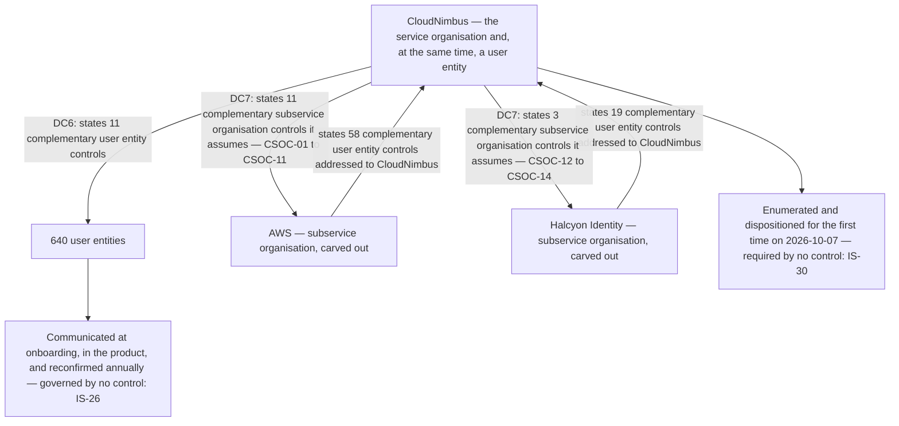

# 07.10 — Reading the Other Side's Complementary Controls

| Field | Value |
|---|---|
| Document ID | `CNB-TRUST-2026-710` |
| Version | 1.0 |
| Date | 2026-11-27 |
| Owner | Rahul Bhargava, Compliance Manager |
| Approver | Karim Haddad, VP Security &amp; Trust |
| Classification | Confidential — Trust &amp; Assurance Programme // Illustrative Portfolio Sample |

---

## 1. Complementary controls point in two directions and only one of them gets written down

Every service organisation that writes a description of its system states **complementary user entity
controls**: the things it assumes its customers do, without which the applicable trust services criteria are
not met. CloudNimbus states **eleven**, disclosed under **DC6** at 02.11, each naming the criteria that
would not be met if the customer did not perform it, and 02.11 spends most of its length arguing that the
list should be short and honest rather than long and flattering.

CloudNimbus is also, itself, a user entity. It consumes two subservice organisations' services, both carved
out, and **both of those organisations state complementary user entity controls in their own reports —
addressed to CloudNimbus.** They are obligations arriving from the opposite direction to the ones
CloudNimbus states, they are stated in exactly the same instrument for exactly the same reason, and they are
the part of an assurance artefact that a reader skips.

**AWS's report states 58. Halcyon Identity's states 19.**

This chapter is the record of reading them. It exists because nothing in the library required anybody to,
and because the thing that turned up when somebody finally did is the finding.

## 2. Where the obligation to read came from

`CNB-C-092` requires the current assurance artefact for every Tier 1 vendor — its service auditor's report
or its certificate — to be refreshed each quarter **together with a reading of what that document does and
does not cover**, with the conclusion recorded in the vendor register. The reading clause was written with a
particular defect in mind, described at 04.05 §5: a subservice organisation's own report covers that
organisation's controls, not CloudNimbus's configuration of them, and a register recording "AWS: clean
report" has recorded the existence of a document rather than its content.

At the CAL-08 review of **2026-10-07** that clause was taken further than it had been taken before. The
complementary user entity controls a report states are, on any plain reading, part of what that document
**does not cover**: they are the report's own statement of the conditions under which its conclusions hold,
and the auditor tested none of them. **A reader who takes the opinion and leaves the conditions has read
half the document.**

So the two artefacts were read for their complementary controls, each stated control was put against
CloudNimbus's library, and each was given one of three dispositions. The result is the table in §3, and it
took two people less than a week.

## 3. Seventy-seven obligations, and two with nobody's name against them

| | AWS | Halcyon Identity |
|---|---|---|
| Complementary user entity controls stated in its report | **58** | **19** |
| Already performed by a control in CloudNimbus's library | **49** | **17** |
| Not applicable to the services in use | **7** | **2** |
| **With no owner at CloudNimbus** | **2** | **0** |
| | 49 + 7 + 2 = **58** | 17 + 2 = **19** |

**The two with no owner are these.**

The first is a **scheduled review of pending customer-managed key deletions**. A key scheduled for deletion
enters a waiting period before the material is destroyed, and the report's complementary control asks the
customer to review what is pending inside that window. CloudNimbus operates customer-managed keys in three
regions, including EU-scoped keys in `eu-central-1` under the residency addendum, and `CNB-C-116` rotates
them annually with the rotation and re-encryption recorded. **Nothing in the library looks at what is
scheduled for deletion.**

The second is a **review of service health notifications for the services in use**. The provider publishes
notifications about the services a customer consumes — deprecations, forced upgrades, changes to a managed
service's behaviour — and the complementary control asks the customer to read them. CloudNimbus consumes
seven AWS accounts, four EKS clusters, six Aurora clusters and 214 S3 buckets across three regions.
**Nothing in the library reads the notifications**, and 02.10's CSOC-07 makes the exposure specific: version
selection and patch acceptance on the managed service planes are **CloudNimbus's actions**, taken from
information the provider publishes in exactly this channel.

**Neither is exotic.** Neither requires a tool, a budget line or a new capability. Both are half an hour of
somebody's month. **Both had simply never been read off the page and given to anybody**, which is the whole
of the finding and is worse than a hard problem left unsolved, because a hard problem at least has a reason
for still being there.

Corrective action **`CA-07-01`**, owner **Wes Delacroix**, opened under clause 10.2 on **2026-10-23**,
assigns both. **DEC-703** records the decision to assign them rather than to deem them covered — which was
the available alternative and the tempting one, because for both obligations there is an adjacent control
that nearly reaches. `CNB-C-116` touches key material; `CNB-C-060`'s daily posture scanning touches
configuration drift. Deeming them covered would have closed the gap in the register in an afternoon and
would have left both activities exactly as unperformed as they were.

## 4. This is deliberately not recorded as a deviation

**No control in CloudNimbus's library required anybody to own the other side's complementary user entity
controls. So no control failed, and there is no deviation.**

The temptation to record one is strong, and it should be named before it is refused. A finding without a
deviation looks like a finding somebody softened. Recording a deviation against `CNB-C-092` would have made
the record look more rigorous, would have produced a fourth row in the deviation table, and would have been
wrong — because `CNB-C-092` did what it says. It requires a reading of what the artefact does and does not
cover, refreshed quarterly, with the conclusion recorded in the vendor register. That reading was performed
and its conclusion is this chapter. **Attaching a deviation to it would attach a failure to a control that
never made the promise**, and a deviation log that does that is a log a reader cannot trust in the other
direction either: if a control can be marked as having failed at something it never said it would do, then
the controls with no deviations against them have not been shown to have operated — they have been shown to
have escaped attention.

**The absence is the finding**, and the absence is recorded as an issue rather than as a deviation:

> **`IS-30` — No control in the library requires the complementary user entity controls stated in a
> subservice organisation's report to be enumerated, dispositioned and owned. `CNB-C-092`'s "reading of what
> that document does and does not cover" is the closest the library comes and is not the same requirement:
> a reading produces a conclusion in a register, and an obligation produces an owner and a cadence.**
> Referred; owner Rahul Bhargava.

The distinction in that last clause is the useful part. **A reading is an act of comprehension and an
obligation is an act of allocation.** One person can perform the first perfectly and leave nothing behind
that anybody has to do next quarter. `IS-30` is carried in the RAID log and to the next issue of the control
library rather than closed by writing a row in the chapter that found the gap — the treatment Phase 06 gave
`IS-24`, `IS-25`, `IS-26` and `IS-27`, and for the same reason: **a library that corrects itself silently
cannot demonstrate that it was ever wrong.**

**The doctrine in this section is general, and the phase had to apply it against itself once.** The stale
sub-processor list at [07.07 §5](07.07-disclosure-and-the-sub-processor-notice.md) was drafted as a
deviation against `CNB-C-120` — a control that operated on time and **found** the divergence. On the test
above that is the same shape as `CA-07-01`: no control required the published list to be updated at the
change, so no control failed. It is recorded as **`IS-34`**, referred, with `CA-07-04` attached, and
**the phase's deviation count fell from four to three as a consequence**. A doctrine applied to one finding
and not to another is a preference, not a doctrine.

## 5. The same instrument, drafted and received

> **A service organisation that states eleven complementary user entity controls in its own description and
> has never read the fifty-eight stated in its subservice organisation's is asking of its customers
> something it has not done itself.**

02.11 makes a careful and slightly severe argument about CUEC inflation: that every item added to the list
subtracts a criterion from the set the report can speak to on the strength of tested controls, that the
party named is not in the room when the list is drafted, and that a long list reads as rigour and functions
as a reduction in what has been examined. The argument is right. It is also an argument made by a party who,
until 2026-10-07, had never been on the receiving end of the same instrument and looked.

**Being on the receiving end is instructive in a way the drafting side is not.** Fifty-eight obligations
arrive as a section of a long document, without owners, without cadences, and without any mechanism that
brings them to anybody's attention again. Forty-nine of them turned out to be things CloudNimbus already
does — which is the outcome a well-run consumer should expect and is not evidence that the reading was
unnecessary, because the only way to know which forty-nine is to read all fifty-eight. Two were not done at
all. **Whatever two out of fifty-eight is worth, it was arrived at by luck rather than by design**, since
nothing had ever checked.

The recursion is worth naming once and leaving alone. CloudNimbus's 640 customers are, with respect to
CloudNimbus's eleven, in exactly the position CloudNimbus was in with respect to AWS's fifty-eight. 02.11 §6
already records that a CUEC disclosed only inside a restricted-use report has been disclosed to the wrong
person, and that CloudNimbus therefore communicates the eleven through onboarding, administrator
documentation and an annual reconfirmation with each customer's named contact. That is the right design.
06.09 §6 also records that **no control and no cadence govern the outreach or the reconfirmation** —
`IS-26`, still open. The two issues are the same issue seen from the two ends of the same relationship, and
this phase carries both without pretending either is closed.

## 6. What the mapping proves, and the two categories that are weaker than they look

The diagram carries the shape and the table in §3 carries the numbers. Three limits on what either of them
proves belong on the face of the chapter.

**"Already performed by a control in the library" is CloudNimbus's assertion, not a test.** Forty-nine
matches were made by reading a sentence written by another organisation against a row written by this one
and judging that the second discharges the first. That is the same kind of claim 04.03 makes about the
`Criteria` and `Annex A` columns: **a mapping is an assertion by the mapper.** No auditor, certification
body or subservice organisation has blessed these forty-nine, and a match that is generous by one row is
indistinguishable, in the register, from a match that is exact.

**"Not applicable to the services in use" is the weakest of the three dispositions and the one to watch.**
Nine obligations — seven at AWS and two at Halcyon Identity — were dispositioned as not applicable because
CloudNimbus does not use the service they concern. That is true on 2026-10-07 and it is a judgement with a
shelf life: it becomes wrong on the day an engineer adopts the service, and nothing about adopting a service
prompts anybody to re-read a complementary control list. `CNB-C-093` is the nearest thing to a trigger — a
cloud service new to CloudNimbus is registered and reviewed against the baseline before customer data is
placed in it — and it asks about the baseline, not about a subservice organisation's complementary
controls. That connection is one of the things `CA-07-01` has to leave better than it found it.

**And the reading is bounded by the artefacts in hand.** The dispositions above were made against the
reports [07.11](07.11-subservice-organisations-and-the-uncovered-months.md) analyses, whose periods end
before this window does. A complementary control list can change between one report and the next, and the
next reading is due at the Q1 refresh, against artefacts that do not yet exist.

## Cross-References

| Document | Relationship |
|---|---|
| [07.00 Phase 07 README](07.00-README.md) | Phase index, vantage and what this phase excludes |
| [07.09 The Vendor Register, Tiering and Assurance](07.09-the-vendor-register-tiering-and-assurance.md) | `CNB-C-092`, the Tier 1 refresh and the reading obligation this chapter extends |
| [07.07 Disclosure and the Sub-Processor Notice](07.07-disclosure-and-the-sub-processor-notice.md) | `IS-34`, the other finding §4's doctrine was applied to |
| [07.11 Subservice Organisations and the Uncovered Months](07.11-subservice-organisations-and-the-uncovered-months.md) | The two artefacts read here, their periods, and the carve-out point |
| [diagrams/07-the-two-directions-of-complementary-controls](diagrams/07-the-two-directions-of-complementary-controls.md) | The same shape, with the disposition arithmetic alongside |
| [governance/GOV-25](governance/GOV-25-cal-08-q4-vendor-and-sub-processor-review.md) | The CAL-08 review of 2026-10-07 at which the reading was performed |
| [logs/raid-log.md](logs/raid-log.md) | `IS-30`, and `IS-26` at the other end of the same relationship |
| [logs/decision-log.md](logs/decision-log.md) | DEC-703 |
| [templates/vendor-assurance-reading-template.md](templates/vendor-assurance-reading-template.md) | The form the reading is recorded on, and the section it now demands |
| [02.11 Complementary User Entity Controls](../02-system-scope-isms-boundary-and-description/02.11-complementary-user-entity-controls.md) | The eleven CloudNimbus states, the four refused, and the inflation argument |
| [02.10 Subservice Organisations and the Carve-Out](../02-system-scope-isms-boundary-and-description/02.10-subservice-organisations-and-carve-out.md) | CSOC-01 to CSOC-14, CSOC-07's version-selection boundary, and the carve-out |
| [04.05 Controls for the Common Criteria CC6 to CC9](../04-unified-control-framework-and-policy-architecture/04.05-controls-for-the-common-criteria-cc6-to-cc9.md) | `CNB-C-092` and `CNB-C-093` as published |
| [04.03 Mapping Methodology and Its Limits](../04-unified-control-framework-and-policy-architecture/04.03-mapping-methodology-and-its-limits.md) | Why a mapping is an assertion by the mapper |

---

← [07.09 The Vendor Register, Tiering and Assurance](07.09-the-vendor-register-tiering-and-assurance.md) · [Phase 07 README](07.00-README.md) · [07.11 Subservice Organisations and the Uncovered Months](07.11-subservice-organisations-and-the-uncovered-months.md) →
