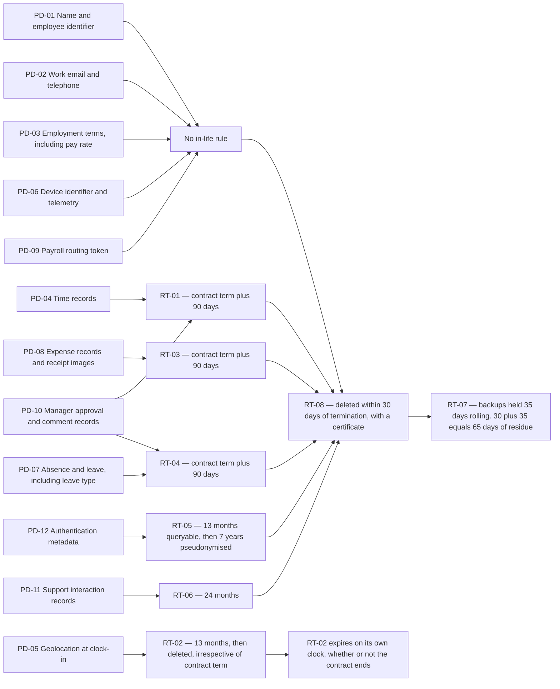

# Diagram — The Retention Schedule Against the Inventory

| Field | Value |
|---|---|
| Document ID | CNB-TRUST-2026-D27 |
| Version | 1.0 |
| Date | 2026-11-27 |
| Owner | Devon Ashby |
| Approver | Tobias Lund |
| Classification | Confidential — Trust &amp; Assurance Programme // Illustrative Portfolio Sample |

**Read the diagram from the right-hand side and the shape of the schedule appears.** Almost everything ends
at RT-08: five categories reach it with nothing shorter ever applying, and five more reach it after a
contract-term rule that is itself measured from the end of the relationship. **RT-02 is the one arrow that
leaves the pattern.** It is the only rule whose clock runs independently of the commercial relationship, the
only one that can expire a record while the customer is still a customer, and — for exactly that reason —
the only one whose enforcement is a nightly event on a rolling boundary rather than a one-off at termination.

That is not a coincidence with what happened. **A rule that must delete something almost every night is a
rule whose silence is informative, and it was the only rule in the schedule for which sixty-eight
consecutive zeros meant anything.** 07.03 carries what followed.

## The mapping, stated as Phase 02 stated it

| Position | Count | Detail |
|---|---|---|
| Rules governing a **named category** | **6** | RT-01 → PD-04 · RT-02 → PD-05 · RT-03 → PD-08 · RT-04 → PD-07 · RT-05 → PD-12 · RT-06 → PD-11 |
| Rules governing **the estate** | **2** | RT-07 backups and snapshots · RT-08 deletion on termination |
| Categories held with the records they belong to | **1** | PD-10 expires with the records it approves, under RT-01 and RT-04 |
| Categories with **no in-life rule** | **5** | PD-01 · PD-02 · **PD-03** · PD-06 · PD-09 — contract term and RT-08 alone |
| | **6 + 2 = 8 rules · 6 + 1 + 5 = 12 categories** | |

**Eight rules do not cover twelve categories, and the untidy version is the true one.** Phase 02 published it
that way rather than presenting a covering set, and 07.02 §2 restates it because the privacy control design
has to be built against the real mapping.

**PD-03 is the one that most deserves a rule and still does not have one.** Role, department, FTE, cost
centre and **pay rate**, for every employee of every customer, held for the life of a commercial relationship
that may run for years and covering individuals who left those employers long ago. The other four uncovered
categories are identifiers, contact details, device telemetry and a routing token. Both designable candidates
— expiry of historical rate records after they cease to be current, and expiry of the whole record after an
individual ceases to be active in a tenant — run into **SR-06**, which requires a calculation run to be
reproducible from its inputs and rule version. The gap is carried, with an owner and a forum, and it is not
closed in this phase.

## The three controls that operate the schedule

| Control | What it does to the diagram | Criteria |
|---|---|---|
| `CNB-C-126` | Turns every arrow on the left into a nightly job, **generated from the schedule rather than maintained by hand** | P4.2 |
| `CNB-C-127` | Writes the completion record for each job and alerts where **a job does not report** inside its window | P4.2, P4.3 |
| `CNB-C-128` | Tracks the box on the far right — the 35-day residue — and confirms its expiry monthly | P4.3 |
| **`CNB-C-149`** | Added **2026-10-28**. Alerts where a job **reports success having deleted zero rows** on a rule whose eligible population is non-zero | P4.2, P4.3 |

**The residue box is the one that cannot be removed.** RT-08's thirty days and RT-07's thirty-five give
**30 + 35 = 65 days** in which a record deleted from the live stores still exists in a backup that has not
aged out, and the deletion certificate is issued in the middle of that window. A backup that could be
surgically edited to remove one tenant's rows would not be a backup, and SR-10's fifteen-minute recovery
point objective depends on it not being one. Phase 02 disclosed the arithmetic rather than engineering it
away; **R-15** carries it at **4 × 2 = 8, Moderate** — likelihood 4, impact 2, **not at a floor and not
fixed**, since `03.02` §5.3's eight floor pins the twelve entries carrying impact 4 or 5 and R-15 is not one
of them, and `03.07` forecasts it at **2 × 2 = 4, Low** at close; and the same window governs the RT-02
catch-up deletion of 2026-10-25, whose residue expires **2026-11-29**.

## Cross-References

| Document | Relationship |
|---|---|
| [07.02 The Retention Schedule and the Deletion Machinery](../07.02-the-retention-schedule-and-the-deletion-machinery.md) | The rules, the three controls, the PD-03 gap and `CNB-C-149` |
| [07.03 The RT-02 Retention Failure](../07.03-the-rt-02-retention-failure.md) | What happened to the one arrow that leaves the pattern |
| [07.01 The Confidentiality Criteria and the Single Control](../07.01-the-confidentiality-criteria-and-the-single-control.md) | RT-08, `CNB-C-118` and the certificate the residue window is printed on |
| [07.05 Collection, Use and the Inference Problem](../07.05-collection-use-and-the-inference-problem.md) | PD-07's leave type, and the coverage question RT-04 does not answer |
| [02.07 Personal Information Inventory and Data Subjects](../../02-system-scope-isms-boundary-and-description/02.07-personal-information-inventory-and-data-subjects.md) | PD-01 to PD-12, RT-01 to RT-08, and §6.1's honest mapping |
| [04.06 Controls for Availability, Processing Integrity, Confidentiality and Privacy](../../04-unified-control-framework-and-policy-architecture/04.06-controls-for-availability-processing-integrity-confidentiality-and-privacy.md) | `CNB-C-126` to `CNB-C-128` as published, and §5.2 on the residue |
| [03.04 Risk Register — Baseline](../../03-risk-assessment-treatment-and-statement-of-applicability/03.04-risk-register-baseline.md) | R-15 and R-33 |
| [03.07 Risk Acceptance and Residual Risk](../../03-risk-assessment-treatment-and-statement-of-applicability/03.07-risk-acceptance-and-residual-risk.md) | R-15's forecast of 2 × 2 = 4, Low, at close |
