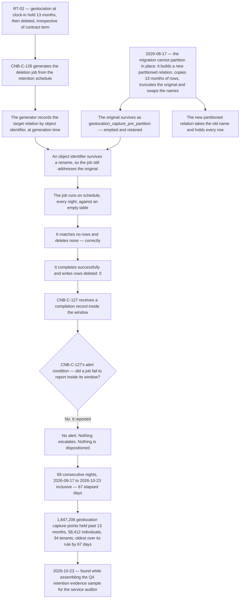
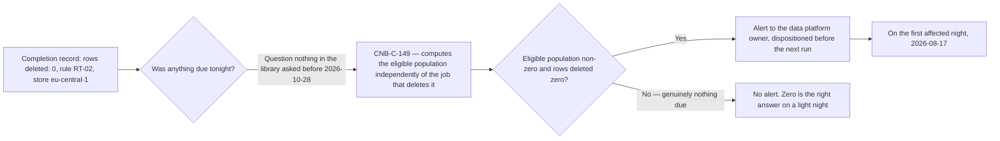

# Diagram — The RT-02 Failure, and Why Nothing Alerted

| Field | Value |
|---|---|
| Document ID | CNB-TRUST-2026-D25 |
| Version | 1.0 |
| Date | 2026-11-27 |
| Owner | Devon Ashby |
| Approver | Karim Haddad |
| Classification | Confidential — Trust &amp; Assurance Programme // Illustrative Portfolio Sample |

**Every box on that path is a control operating correctly.** The rule is right, the generation step is right,
the migration is right, the job runs on schedule and executes correctly against the object it addresses, the
completion record is truthful and complete and arrives inside its window, and the alert condition evaluates
correctly and returns *no alert*. There is no step at which something failed to do what it was written to
do. **The job was not wrong; it was pointed at the wrong object, and nothing in the library compares a job's
target to the rule's.** That is why the condition survived sixty-eight nights and why the counterfactual
below is the only place a change could have been made.

## What would have had to be true for anything to fire

**Zero is a legitimate answer.** RT-02's nightly delete volume ran from **4,118 to 41,902** — the shape of a
workforce, not of a constant. Those are the capture volumes of the days **thirteen months earlier**, because
a thirteen-month rule deletes what was captured thirteen months back; the volume on any given night says
nothing about the day the job ran. A control that alerted on every zero would have
alerted on the light nights of every rule in the schedule and would have been muted inside a month. **The
question that distinguishes the two cases is not "was the number zero" but "was anything due", and nothing in
the library asked it.**

Answering it costs something, and ADR-0031 records the cost rather than pretending the new control is free.
`CNB-C-149` has to compute what was due **independently of the job that deletes it** — because deriving the
expected count from the same predicate would ask the broken thing how much it had broken, and be told zero.
That means **two implementations of one retention rule**, maintained separately, expected to agree, and
capable of a different failure when they drift.

## The two conditions, side by side

| | `CNB-C-127` | `CNB-C-149` |
|---|---|---|
| Admitted | Phase 04, 2026-06-05 | **2026-10-28**, DEC-706 |
| Trigger | A job **does not report** inside its window | A job **reports success having deleted zero rows** on a rule whose eligible population is non-zero |
| What it is checking | **That the record arrived** | **What the record says** |
| Failure mode it catches | A job that crashed, hung or was never scheduled | A job that ran perfectly against the wrong object |
| Position on 2026-08-17, the first affected night | Satisfied. No alert warranted | Did not exist |
| Population in the observation window | 184 nights | **65 nights**, of which **31 run at this vantage, 0 alerts** |

**The difference between the two rows in the middle is the whole of `D-07-01`.** A completeness check on the
arrival of evidence and a content check on what the evidence says are different controls, and a library that
holds only the first will not notice a truthful record of nothing happening.

## What the diagram is not

**It is not a criticism of the migration.** Partitioning a table that gains tens of thousands of rows a night
is correct engineering, it was reviewed and deployed through the ordinary change path, and applying it to the
smallest region first is the cautious order. Building a new relation and swapping the names is the ordinary
way to partition a table that cannot be partitioned in place. The migration moved the rows to a new object;
the generation step binds a job to a **rule** and records its target **by an identifier a rename does not
invalidate**; and no control required anybody to check that the object a generated job resolves to is still
the object the rule means. That is what `CA-07-02`'s change-record half is for.

**It is not the DC4 disclosure.** 07.03 §8.2 carries the bounded draft, and the incident engages both of
DC4's limbs.

**It is not a conclusion about the opinion.** `D-07-01` **will be presented for disclosure in Section IV**
with the service auditor's evaluation of it, and the disclosure of the incident itself sits in the
description under **both** of DC4's limbs. Neither evaluation has been performed.

## Cross-References

| Document | Relationship |
|---|---|
| [07.03 The RT-02 Retention Failure](../07.03-the-rt-02-retention-failure.md) | The mechanism, the figures, the notification and DC4 on both limbs |
| [07.02 The Retention Schedule and the Deletion Machinery](../07.02-the-retention-schedule-and-the-deletion-machinery.md) | The three controls, and `CNB-C-149` with its cost |
| [governance/GOV-26](../governance/GOV-26-rt02-over-retention-investigation-and-notification.md) | The investigation and the notification decision |
| [ADR-0031](../adr/ADR-0031-a-new-control-admitted-mid-window.md) | Why the answer was a new control rather than an amendment |
| [04.06 Controls for Availability, Processing Integrity, Confidentiality and Privacy](../../04-unified-control-framework-and-policy-architecture/04.06-controls-for-availability-processing-integrity-confidentiality-and-privacy.md) | `CNB-C-126` and `CNB-C-127` as published |
| [06.05 The Severity-1 Incident of 2026-09-08](../../06-availability-processing-integrity-and-operations/06.05-the-severity-1-incident-of-2026-09-08.md) | The other control whose every word was satisfied while the thing it watched failed |
