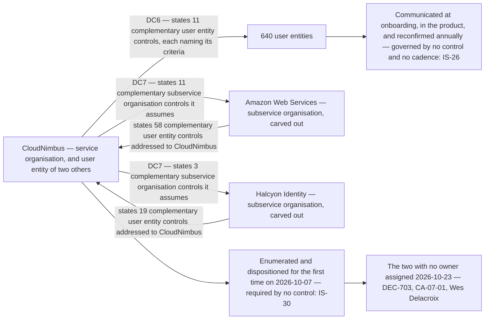

# Diagram — The Two Directions of Complementary Controls

| Field | Value |
|---|---|
| Document ID | CNB-TRUST-2026-D26 |
| Version | 1.0 |
| Date | 2026-11-27 |
| Owner | Rahul Bhargava |
| Approver | Karim Haddad |
| Classification | Confidential — Trust &amp; Assurance Programme // Illustrative Portfolio Sample |

**Two instruments with the same name point in opposite directions across the same organisation, and only one
of them had ever been worked.** CloudNimbus's own eleven were drafted in Phase 02, argued over, four
proposals were refused, and each names the criteria that would not be met without it. The seventy-seven
addressed **to** CloudNimbus had been received, filed and never enumerated.

The complementary subservice organisation controls are a third instrument and are not the mirror image of
either. **CSOC-01 to CSOC-14 are what CloudNimbus assumes AWS and Halcyon Identity do**, stated under DC7
because their controls are carved out of the description; the 58 and the 19 are what **those organisations
assume CloudNimbus does**. A reader who treats the CSOCs as the answer to the other side's complementary
controls has matched two lists that face the same way.

## The disposition of the seventy-seven

| | AWS | Halcyon Identity |
|---|---|---|
| Complementary user entity controls stated in its report | **58** | **19** |
| Already performed by a control in CloudNimbus's library | **49** | **17** |
| Not applicable to the services in use | **7** | **2** |
| **With no owner at CloudNimbus** | **2** | **0** |
| | 49 + 7 + 2 = **58** | 17 + 2 = **19** |

The two with no owner are **a scheduled review of pending customer-managed key deletions** and **a review of
service health notifications for the services in use**.

**Two dates, and the diagram keeps them apart.** The seventy-seven were **enumerated and dispositioned on
2026-10-07**, at the CAL-08 review. The two with no owner were **assigned on 2026-10-23**, sixteen days
later, under **DEC-703** to Wes Delacroix with clause 10.2 corrective action **`CA-07-01`**. Enumeration and
ownership are the two halves `IS-30` is about — *a reading produces a conclusion in a register, an
obligation produces an owner and a cadence* — and a single date for both would have collapsed the
distinction the issue exists to make.

**Whatever two of fifty-eight is worth, it was arrived at by luck rather than by design**, because nothing
had ever checked.
It is not evidence that the reading was unnecessary; the only way to know which forty-nine were already
covered was to read all fifty-eight.

## The three dispositions are not equally strong

| Disposition | What it rests on | How it fails |
|---|---|---|
| **Already performed by a library control** — 49 and 17 | A judgement that a named row discharges a sentence written by another organisation | **A mapping is an assertion by the mapper.** A match that is generous by one row looks exactly like an exact one in the register |
| **Not applicable to the services in use** — 7 and 2 | The estate as it stood on 2026-10-07 | It becomes wrong on the day a service is adopted, and nothing prompts a re-read. `CNB-C-093` reviews a new cloud service against the baseline and does not ask this question — PR-46 |
| **No owner** — 2 and 0 | Nothing. This is the finding | It does not fail; it was already failing, silently, for as long as the reports have been on file |

## Why the finding is an issue and not a deviation

**No control in the library required anybody to own the other side's complementary controls, so no control
failed.** `CNB-C-092` requires a reading of what an artefact does and does not cover, and that reading is
what produced this table. Recording a deviation against it would attach a failure to a control that did what
it says, and a deviation log that does that cannot be trusted in the other direction either.

**The absence is the finding** — `IS-30`, referred, and carried to the next issue of the control library
rather than closed by writing a row in the chapter that found the gap. **The same test moved `IS-34` out of
the deviation table**, on the stale published sub-processor list that no control required to be updated at
the change.

> **A service organisation that states eleven complementary user entity controls in its own description and
> has never read the fifty-eight stated in its subservice organisation's is asking of its customers
> something it has not done itself.**

## Cross-References

| Document | Relationship |
|---|---|
| [07.10 Reading the Other Side's Complementary Controls](../07.10-reading-the-other-sides-complementary-controls.md) | The chapter this diagram belongs to |
| [07.11 Subservice Organisations and the Uncovered Months](../07.11-subservice-organisations-and-the-uncovered-months.md) | The two artefacts these lists were read out of |
| [07.09 The Vendor Register, Tiering and Assurance](../07.09-the-vendor-register-tiering-and-assurance.md) | `CNB-C-092` and the Tier 1 refresh |
| [governance/GOV-25](../governance/GOV-25-cal-08-q4-vendor-and-sub-processor-review.md) | The review of 2026-10-07 |
| [logs/raid-log.md](../logs/raid-log.md) | `IS-30`, `IS-26` and PR-46 |
| [02.11 Complementary User Entity Controls](../../02-system-scope-isms-boundary-and-description/02.11-complementary-user-entity-controls.md) | The eleven CloudNimbus states under DC6 |
| [02.10 Subservice Organisations and the Carve-Out](../../02-system-scope-isms-boundary-and-description/02.10-subservice-organisations-and-carve-out.md) | CSOC-01 to CSOC-14 under DC7, and the carve-out |
