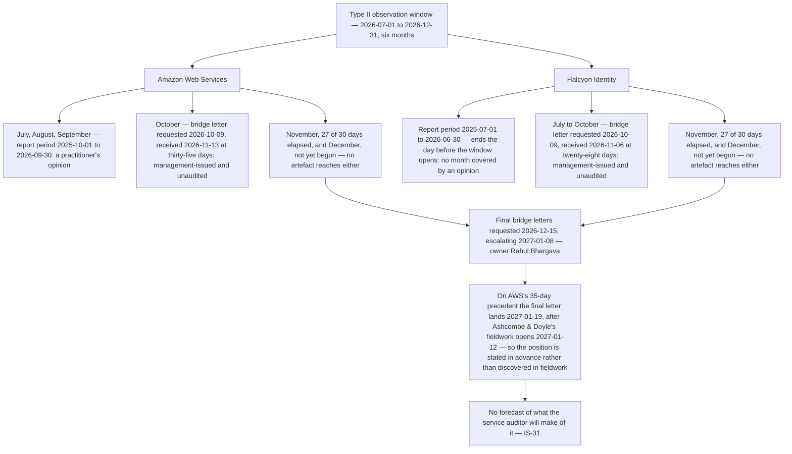

# Diagram — What the Window Is Covered By

| Field | Value |
|---|---|
| Document ID | CNB-TRUST-2026-D28 |
| Version | 1.0 |
| Date | 2026-11-27 |
| Owner | Rahul Bhargava |
| Approver | Marisol Vega |
| Classification | Confidential — Trust &amp; Assurance Programme // Illustrative Portfolio Sample |

## The arithmetic

| | AWS | Halcyon Identity |
|---|---|---|
| Report period | **2025-10-01 to 2026-09-30** | **2025-07-01 to 2026-06-30** |
| Months of the window covered by a practitioner's opinion | **3** | **0** |
| Bridge letter requested, received, interval | 2026-10-09 · 2026-11-13 · **35 days** | 2026-10-09 · 2026-11-06 · **28 days** |
| Months covered by an unaudited bridge letter | **1** | **4** |
| **Months reached by no artefact at this vantage** † | **2** | **2** |
| | 3 + 1 + 2 = **6** | 0 + 4 + 2 = **6** |

† **The two are not two elapsed months.** At 2026-11-27, **November is 27 of its 30 days elapsed and
uncovered** and **December has not happened**. The phase refuses to publish a November availability figure
because a partial month is not a month, and it must not then count an unelapsed month in a deficit. Two is
the number of window months the artefacts in hand do not reach — which is what the row measures, and is not
the same claim as two months of exposure realised.

## What the three bands mean, and they are not three shades of the same thing

**A practitioner's opinion** on the subservice organisation's controls, throughout a period, with the tests
performed and the results in Section IV of that organisation's own report. It is the only band in the table
where somebody independent examined anything.

**A bridge letter** is issued by the subservice organisation's **own management**, is **unaudited**, and
carries **no auditor opinion**. It says in substance that management is not aware of material changes to the
control environment since the period end. 01.11 §4 records CloudNimbus's position on the instrument from the
issuing side, where **O3** obliges CloudNimbus to provide one on request: a party that treats a bridge
letter as an extension of the examination has misread it.

> **A bridge letter covers a gap. It does not close one.**

**Nothing** is nothing, and it is stated as such rather than as "coverage pending". Two months of the window
are reached by no artefact from either party at this vantage, and the artefacts that will reach them are
requested on **2026-12-15** from organisations under no obligation to be quick, escalating **2027-01-08**
against fieldwork that opens **2027-01-12**. AWS's October letter took **thirty-five days** to arrive and
Halcyon's twenty-eight, which is why the request date is December and not January — and **thirty-five days
from 2026-12-15 is 2027-01-19**, so **on AWS's own precedent the final letter is expected after fieldwork
opens**. That is why the position is stated to Ashcombe &amp; Doyle in advance rather than discovered in
fieldwork.

## Halcyon Identity's row

**Halcyon Identity's report period ends on 2026-06-30 — the day before the observation window opens.** Not
one day of the window is covered by a practitioner's opinion on Halcyon Identity's controls, and four of the
six months rest entirely on its management's own statement.

Halcyon Identity authenticates **every end user of the platform**. **CSOC-12 to CSOC-14** state what
CloudNimbus assumes it does — authentication in accordance with the policy CloudNimbus configures,
protection of credential and identity records, and the availability and continuity of the identity service —
and **SR-04** and the availability commitment both depend on it. That is the dependency with the largest
consequence in the description and the one with the least assurance behind it inside the period.

**`IS-31`** records the position, with the plan and **without a forecast** of how the service auditor will
treat it. **DEC-710** accepts the bridge letter and records the two uncovered months **rather than waiving
them**: acceptance puts the letter on the record with the gap beside it, and a waiver would be a decision
nobody at CloudNimbus is in a position to take on the service auditor's behalf.

## And the carve-out, which the table does not show

Every band above is about the **subservice organisation's** controls. **None of them is about CloudNimbus's
configuration of the services those organisations provide.** A clean report for every month of the window
would say nothing about whether a bucket policy was scoped correctly, a role was over-permissive or a
snapshot was unencrypted — those are CloudNimbus's controls in an environment the provider operated
correctly, and they are tested by the service auditor in Section IV of CloudNimbus's own report.

**The coverage gap in this diagram and the shared responsibility line are two different subjects**, and a
reader who closes one by pointing at the other has answered neither.

## Cross-References

| Document | Relationship |
|---|---|
| [07.11 Subservice Organisations and the Uncovered Months](../07.11-subservice-organisations-and-the-uncovered-months.md) | The chapter this diagram belongs to; the arithmetic is derived once at §3 |
| [07.10 Reading the Other Side's Complementary Controls](../07.10-reading-the-other-sides-complementary-controls.md) | What else was read out of the same two artefacts |
| [governance/GOV-25](../governance/GOV-25-cal-08-q4-vendor-and-sub-processor-review.md) | The review at which both were read and both letters were requested |
| [logs/raid-log.md](../logs/raid-log.md) | `IS-31` and PR-44 |
| [logs/decision-log.md](../logs/decision-log.md) | DEC-710 |
| [02.10 Subservice Organisations and the Carve-Out](../../02-system-scope-isms-boundary-and-description/02.10-subservice-organisations-and-carve-out.md) | CSOC-01 to CSOC-14, the carve-out method and the AWS point |
| [01.11 Assurance Calendar and Obligations](../../01-program-foundation-dual-framework-governance/01.11-assurance-calendar-and-obligations.md) | O3, and what a bridge letter is |
