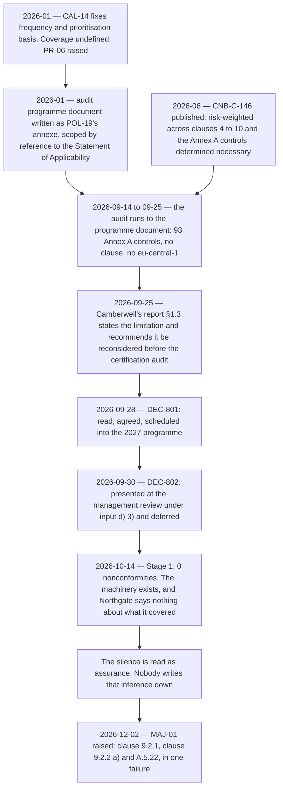

# 08.05 — Stage 2 and the Major Nonconformity

| Field | Value |
|---|---|
| Document ID | `CNB-TRUST-2027-805` |
| Version | 1.0 |
| Date | 2027-02-05 |
| Owner | Karim Haddad, VP Security &amp; Trust |
| Approver | Elise Fontaine, Co-founder &amp; Chief Executive Officer |
| Classification | Confidential — Trust &amp; Assurance Programme // Illustrative Portfolio Sample |

---

## 1. The audit

**Northgate Certification Services conducted Stage 2 from 2026-11-30 to 2026-12-04** — five days, two
auditors, **ten auditor-days**. Lead auditor **Ingrid Halvorsen**; auditor **Tomás Ferreira**. It is
**MS-15**, and it sits inside the Type II observation window, which **ADR-0005** accepted knowingly in
January 2026 and which **08.12** owns in full.

**The audit criteria were ISO/IEC 27001:2022 clauses 4 to 10 and the Statement of Applicability.** That
sentence is the difference between this audit and the one CloudNimbus ran itself in September, and it is
the whole of the finding that follows. Conformity is assessed against the requirements — clauses 4 to 10 —
with **Annex A reached through clause 6.1.3 c)** as a comparison verifying that no necessary control has
been omitted, and the Statement of Applicability as the record of which controls are necessary, why, and
whether each is implemented. **Annex A is not the requirements**, and a Stage 2 conducted against it alone
would be auditing the wrong document.

**Stage 2 is the implementation and effectiveness audit.** Stage 1 reviewed the documented information and
evaluated whether internal audits and management review were being planned and performed; Stage 2 samples
what the management system produced and asks whether it works. Seven weeks separated them, and 118 evidence
requests were answered across the Stage 2 and supplementary phases, drawn from the same shared store the
examination draws from.

**Result: 1 major nonconformity, 4 minor nonconformities, 7 opportunities for improvement.**

The four minors and the seven opportunities are **08.06**'s. The closing meeting record is **GOV-30** and
the finding statements are held at **EV-811** as Northgate wrote them, not as CloudNimbus paraphrased them.

## 2. `MAJ-01`, as the certification body stated it

Raised **2026-12-02**, the third day of the audit, against **clause 9.2**.

> **Requirement.** ISO/IEC 27001:2022 clause 9.2.1 requires internal audits at planned intervals to provide
> information on whether the information security management system conforms **to the organization's own
> requirements** *and* **to the requirements of this document**, and is effectively implemented and
> maintained. Clause 9.2.2 a) requires the audit criteria and scope to be defined **for each audit**.
>
> **Evidence.** The internal audit conducted 2026-09-14 to 2026-09-25 covered the 93 Annex A controls in the
> Statement of Applicability — the 91 determined necessary against their implementation status and the 2
> excluded against their justification. It did not cover clauses 4 to 10. It did not cover
> operations in `eu-central-1`, one of the three regions in the ISMS scope. The organisation's own control
> **`CNB-C-146`** states that the programme is risk-weighted **across clauses 4 to 10 and the Annex A
> controls determined necessary**; the programme as defined and executed did not meet the organisation's own
> statement of it. The limitation was recorded in the auditor's report at §1.3, presented to the management
> review of 2026-09-30 under input d) 3), and deferred.
>
> **The same failure engages A.5.22.** The internal audit is a supplier service. A.5.22 — monitoring, review
> and change management of supplier services — requires the organisation to regularly monitor, review,
> evaluate and manage change in supplier **information security practices and** service delivery.
> CloudNimbus defined the scope it gave Camberwell Risk Partners and never reviewed whether that scope was
> adequate to the requirement it existed to satisfy. **This is recorded as one nonconformity, not two,
> because it is one failure: outsourcing the work did not outsource the accountability.**

**The two limbs of the Annex A coverage are not the same test and the statement keeps them apart.** The 91
controls determined necessary were audited against the implementation status the Statement of Applicability
records for each; the 2 determined not necessary — **A.7.11 supporting utilities and A.7.12 cabling
security** — were audited against the justification for exclusion clause 6.1.3 d) requires. Ninety-three
rows, two different questions, and neither of them a question about clauses 4 to 10.

**Three properties of that statement are worth naming before the grade is argued.**

**It is a failure against the organisation's own control statement, not against an auditor's preference for
a wider scope.** Clause 9.2.1 has two limbs — conformity to the organisation's own requirements and
conformity to the requirements of the standard — and the finding engages both. `CNB-C-146` is a requirement
CloudNimbus wrote for itself, published in June, and did not meet. **A programme that fell short of a
standard's expectation is arguable. A programme that fell short of its own published statement of itself is
a different kind of document.**

**It rests on evidence CloudNimbus produced.** Camberwell's report at §1.3, the audit plan, the programme
document as it stood, the decision record and the management review minute. Northgate found nothing
CloudNimbus did not already hold; it read what CloudNimbus held and drew the conclusion CloudNimbus had
declined to draw.

**And the A.5.22 limb is one failure with two aspects rather than two failures.** Recording it as two — a
clause 9.2 nonconformity and an A.5.22 nonconformity — would have doubled the count and halved the meaning.
The scope was inadequate; the scope was a supplier instruction; the instruction was never reviewed. That is
one thing that did not happen.

## 3. Where it was already written down

**One clause and a pointer, because 08.01 §5 owns this sequence in full.** The limitation was foreseen in
writing by Camberwell, read by the person who set the scope, agreed under DEC-801, minuted at the clause 9.3
management review of 2026-09-30 under input d) 3) and deferred under DEC-802 — and CAL-14's coverage was
recorded as undefined in **`01.11` §7** in January 2026, carried as **PR-06**, with the definition deferred
to an internal audit charter that did not exist when the audit ran.

`diagrams/08-the-major-and-where-it-was-already-written-down.md` sets the same sequence against what would
have had to happen at each point for the finding not to arrive.

## 4. Why major and not minor

**Under ISO/IEC 17021-1 a major nonconformity is one that affects the capability of the management system to
achieve intended results, or a number of minor nonconformities against one requirement that together
demonstrate a systemic failure.** The second branch does not apply: this is one finding against one clause.
The first does, and the argument is worth making in the phase's own words rather than by citing the
definition and moving on.

> **Clause 9.2 is not a control. It is one of the mechanisms by which a management system checks itself** —
> with 9.1, 9.3 and 10.2 — and an internal audit programme that cannot report on conformity to the clauses
> conformity is assessed against has not narrowly underperformed. It has not been an internal audit
> programme for the requirements clause. That is a capability finding, and the grade follows from what the
> mechanism is for rather than from how much of it was missing.

**The tempting way to weigh this is by proportion, and proportion is the wrong instrument.** Ninety-three of
ninety-three Annex A controls were audited. Seven clauses were not. Counted that way the coverage looks like
93 of 100 and the finding looks like a rounding error — which is exactly the arithmetic a Statement of
Applicability invites, because it is a list of ninety-three things and clauses 4 to 10 are seven headings.
**The two populations are not commensurable.** Clause 5 is leadership: policy, roles, commitment. Clause 6
is planning: the risk assessment process, the treatment process, the Statement of Applicability itself and
the objectives. Clause 7 is support: resources, competence, awareness, communication and the whole of
documented information. Clause 9 is the performance evaluation the audit is part of. **Auditing the controls
determined necessary while auditing none of the process that determines what is necessary is not
seven-per-cent short of a programme; it is a programme with no view of the machinery that produced its own
scope.**

**The second reason the grade is right is the location gap, and it is the one that would survive even if the
clause gap were argued away.** The ISMS scope is the whole organisation across all locations, and
`eu-central-1` is where the 41 EU-residency customers' personal data is required by **O8** to stay at rest,
where recovery is intra-region only, and where — as it happens — the retention failure `07.03` describes ran
for sixty-eight nights. An internal audit programme covering two of three regions has not sampled a region;
it has excluded one, and clause 9.2.2 a) requires the scope of each audit to be **defined**, which means
defined against something.

**And the third is that the organisation's own control said otherwise.** A minor nonconformity is
characteristically a single lapse in an otherwise conforming process — a record not retained, an occurrence
late, a competence file incomplete. **What was wrong here was the definition of the process**, held for a
full annual cycle, against a control statement that described the process correctly. The auditor did not
have to establish what good looked like; CloudNimbus had published it.

**A version of this could have been put as a minor**, and §6 says why it was not put.

## 5. What the finding is not

**It is not a finding about Camberwell.** Camberwell audited what it was asked to audit, said in writing
that the scope was too narrow, and recommended reconsideration. **08.01 §6** owns that.

**It is not a finding about the Annex A work.** The coverage of the 93 was genuine, sampled and evidenced,
and two of its own findings survived into Northgate's December register as `MIN-01` and `MIN-03` because
they were correct.

**It is not a test exception.** Clause 9.2 has no trust services criterion, `CNB-C-146` cites a dash in its
`Criteria` column, and there is no Section IV row for a deviation to be recorded in. **08.12** argues the
consequence, which is that the fact reaches the report — if at all — as information provided by management
in Section V, which is not covered by the service auditor's opinion.

**And it is not a statement about the security of the platform.** Nothing in `MAJ-01` says a control failed,
data was exposed, or a customer was affected. It says the mechanism by which the organisation checks itself
did not reach the thing it exists to check.

## 6. Nobody argued, and that is the correct response

**Karim Haddad accepted `MAJ-01` at the closing meeting on 2026-12-04 without contest. DEC-806.** The
acceptance is recorded in GOV-30 in one line, and the twenty-day clock for a correction and a corrective
action plan started that day.

> A major nonconformity is arguable in the way most findings are arguable — the Annex A coverage was
> genuine, the programme was resourced, the auditor was independent, and a version of this could have been
> put as a minor. **The organisation did not put it.** An auditee that argues a major down spends the only
> currency it has with a certification body, and spends it on the finding its own control statement, its own
> auditor's report and its own management review minutes already support. **The correct response to a
> finding you cannot honestly dispute is to accept it on the day and start the clock.**

**Two things follow, and both are practical rather than moral.**

**The first is arithmetic about time.** **The twenty-day limit is Northgate's**, set as ISO/IEC 17021-1
requires a certification body to define the time for correction and corrective action rather than as a
period the standard itself fixes: a correction and a corrective action plan **within twenty days of the
closing meeting — by 2026-12-24** — with evidence of implementation and effectiveness before a
certification decision. Contesting the grade would have consumed
some part of those twenty days in correspondence, and the correction CloudNimbus in fact submitted on
2026-12-19 was not a documentation exercise: it was a full internal audit of clauses 4 to 10 and of
`eu-central-1`, which had to be scoped, commissioned and scheduled. **The days spent arguing are days taken
from the remedy**, and an organisation arguing a grade down to a minor would have arrived at the same
remedy later with less credit for it.

**The second is what acceptance bought at the supplementary audit.** The correction was accepted on its
substance and verified on 2027-01-15 after a single remote auditor-day. An auditee that had spent December
contesting the finding would have arrived in January asking the same auditor to accept the corrective action
for a nonconformity it had argued did not exist at that grade.

**There is no dissent recorded in this phase, and the absence is the record.** Phases 05 and 07 carry
minuted dissents because reasonable people disagreed — about voluntary disclosure of the isolation finding,
and about notifying forty-one customers where no commitment required it. **Nobody disagreed about `MAJ-01`.**
Manufacturing a disagreement here to match a pattern would have been the dishonest move, and a reader who
notices that this phase has no dissent where the last two did has noticed the right thing about it.
**ADR-0037** records the decision, the alternative and the reason the alternative was not taken.

## 7. What the closing meeting settled, and what it did not

**It settled the findings and their grades**: one major, four minors, seven opportunities, with Northgate's
statements as written. It settled the clock, the form of the correction required, and the fact that a
certification decision could not be taken until implementation and effectiveness were evidenced.

**It settled nothing about the certificate.** A closing meeting is not a certification decision; the auditor
makes a recommendation and an independent decision-maker at the certification body takes the decision, which
in this case fell on **2027-01-20**. **08.07** carries the sequence.

**It settled nothing about the examination.** The observation window had twenty-seven days left to run, the
service auditor was not in the room, and what an engagement team would make of a major nonconformity raised
against the entity's own monitoring machinery inside the period is **08.12**'s subject and, at this vantage,
still nobody's conclusion.

## Cross-References

| Document | Relationship |
|---|---|
| [08.00 Phase 08 README](08.00-README.md) | Phase index and the vantage |
| [08.01 The Clause 9.2 Internal Audit](08.01-the-clause-9-2-internal-audit.md) | §5 in full, and §6 on what the outsourcing does and does not carry |
| [08.02 The Clause 9.3 Management Review](08.02-the-clause-9-3-management-review.md) | Input d) 3), and DEC-802 |
| [08.03 ISO Stage 1 and What a Readiness Review Does Not Do](08.03-iso-stage-1-and-what-a-readiness-review-does-not-do.md) | §5, and what Stage 2 asked that Stage 1 did not |
| [08.06 The Minor Nonconformities and the Opportunities](08.06-the-minor-nonconformities-and-the-opportunities.md) | `MIN-01` to `MIN-04` and `OFI-01` to `OFI-07` |
| [08.07 Correction, Corrective Action and the Certificate](08.07-correction-corrective-action-and-the-certificate.md) | Clause 10.2 applied, §3's root cause and the certification sequence |
| [08.12 The Scheduling Collision](08.12-the-scheduling-collision.md) | Contradictory evidence, CC4.1 and CC4.2, and Section V |
| [adr/ADR-0037](adr/ADR-0037-the-major-is-accepted-not-argued.md) | DEC-806, the alternative and the absence of a dissent |
| [governance/GOV-30](governance/GOV-30-stage-2-closing-meeting.md) | The closing meeting record |
| [diagrams/08-the-major-and-where-it-was-already-written-down.md](diagrams/08-the-major-and-where-it-was-already-written-down.md) | The same sequence, against what would have had to happen |
| [logs/finding-log.md](logs/finding-log.md) | `MAJ-01` with its requirement, status and classification |
| [logs/decision-log.md](logs/decision-log.md) | DEC-806 |
| [logs/evidence-index.md](logs/evidence-index.md) | EV-811 |
| [04.07 ISO-Only Controls and ISMS Machinery](../04-unified-control-framework-and-policy-architecture/04.07-iso-only-controls-and-isms-machinery.md) | `CNB-C-146` as published, and why clause 9.2 has no Annex A control |
| [01.11 Assurance Calendar and Obligations](../01-program-foundation-dual-framework-governance/01.11-assurance-calendar-and-obligations.md) | §7, CAL-14's undefined coverage and `PR-06` |
| [02.08 ISMS Scope Statement (Clause 4.3)](../02-system-scope-isms-boundary-and-description/02.08-isms-scope-statement-clause-4-3.md) | The whole-organisation scope `eu-central-1` sits inside |

---

← [08.04 The Second Penetration Test](08.04-the-second-penetration-test.md) · [Phase 08 README](08.00-README.md) · [08.06 The Minor Nonconformities and the Opportunities](08.06-the-minor-nonconformities-and-the-opportunities.md) →
