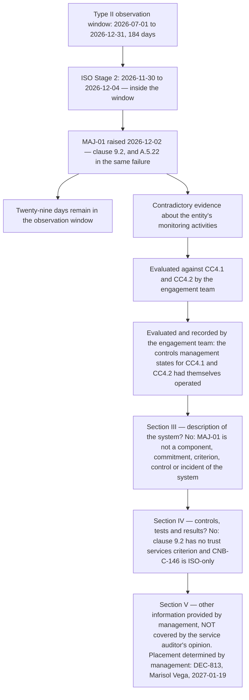

# 08.12 — The Scheduling Collision

| Field | Value |
|---|---|
| Document ID | `CNB-TRUST-2027-812` |
| Version | 1.0 |
| Date | 2027-02-05 |
| Owner | Karim Haddad, VP Security &amp; Trust |
| Approver | Elise Fontaine, Chief Executive Officer |
| Classification | Confidential — Trust &amp; Assurance Programme // Illustrative Portfolio Sample |

---

## 1. The facts, and the date they were accepted

The Type II observation window ran **2026-07-01 to 2026-12-31**. Stage 2 ran **2026-11-30 to 2026-12-04** —
**inside it**. The major nonconformity was raised on **2026-12-02**, **twenty-nine days before the window
closed**.

**ADR-0005 accepted this collision knowingly in January 2026. It did not discover it.** The decision was
taken at chartering, alongside the four other Phase 01 architectural decisions, on the reasoning that the
alternative — moving Stage 2 outside the window — meant either certifying before the ISMS had a year of
operation behind it or delaying the certificate past the commercial deadline the programme existed to meet.
The risk accepted was named in the decision: **that the certification body would raise a finding inside the
period, and that the finding would become evidence in the examination.**

That is precisely what happened, and this chapter is what the portfolio owes for having written the risk
down **thirteen months before this vantage** — ADR-0005 in January 2026, read forward to 2027-02-05. On the
finding's own clock it is shorter still: January 2026 to `MAJ-01` on 2026-12-02 is **eleven months**. **A risk accepted in advance and realised on schedule is not a surprise, and
the only thing that would make it one is if nobody had done anything about it when it arrived.**

## 2. Why it is a problem at all

A reader who has followed the two workstreams separately might reasonably ask why a certification body's
finding is any business of a CPA firm examining a different set of criteria against a different object.

**Because a major nonconformity raised by an accredited certification body against clause 9.2 is
contradictory evidence about the entity's monitoring activities, and monitoring is what CC4.1 and CC4.2
are about.**

**CC4.1** requires that the entity selects, develops and performs **ongoing and/or separate evaluations** to
ascertain whether the components of internal control are present and functioning. **CC4.2**
requires that the entity evaluates and communicates internal control deficiencies in a timely manner to
those parties responsible for taking corrective action, including senior management and the board where
appropriate.

`MAJ-01` says, in the register of an independent body accredited under ISO/IEC 17021-1, that the entity's
principal **separate evaluation** could not report on conformity to the requirements against which conformity
is assessed, and did not reach one of the three regions inside its own scope. **A service auditor who read
that and set it aside would be setting aside evidence** — and would be doing so about the one criterion
family whose subject matter is whether the entity notices things.

The engagement team knew about it because CloudNimbus told them, on the second day of fieldwork, before it
appeared in any request response. There was no version of this in which it stayed quiet: Stage 2's dates
are in the assurance calendar, the certificate is dated 2027-01-22, and an entity that had allowed the
service auditor to find the certification body's major finding by accident would have surrendered the only
thing it had to say about it.

## 3. How it was treated

The engagement team evaluated `MAJ-01` as contradictory evidence and **recorded** something narrower than it
first appears: **that the controls CloudNimbus states for CC4.1 and CC4.2 had themselves operated.** What was
recorded is an evaluation performed, not a conclusion reached about the opinion — §6 holds that line — and
the placement that follows from it was **management's determination and not the engagement team's**.

The library states seven rows against those two criteria and they were tested as a set.

| Control | Criteria cited | What the window shows |
|---|---|---|
| `CNB-C-023` | CC4.1, CC4.2 | The weekly overdue-control exception report to the Compliance Manager, across the whole library |
| `CNB-C-024` | CC4.1 | The annual independent review of information security, tabled at the Audit &amp; Risk Committee with a management response |
| `CNB-C-025` | CC4.2 | Every deficiency from a monitoring activity in the corrective action tracker with owner, root cause and due date, reported monthly to the Trust Committee |
| `CNB-C-026` | CC4.1, CC7.1 | The annual penetration test, re-scheduled to 2026-10 and performed 2026-10-05 to 2026-10-16 |
| `CNB-C-027` | CC4.1, CC4.2 | Quarterly control-owner attestation, with a negative attestation opening a corrective action inside five business days |
| `CNB-C-075` | CC4.2, CC7.5 | The post-incident review path, exercised once in the window on `INC-2026-031` |
| `CNB-C-087` | CC4.1, CC8.1 | The daily reconciliation of pipeline deployments against approved change tickets, 184 runs, 0 unmatched |

**Two monitoring activities a reader would expect to see in that table are not in it, and the omission is
deliberate.** `CNB-C-070`'s weekly review of alert volume, false-positive rate and unactioned events cites
**CC7.2 and CC7.3**. `CNB-C-102`'s five-business-day availability post-incident review cites **A1.2 and
A1.3**. Both are monitoring in the ordinary sense of the word, both operated, and **neither is a control
management states for CC4.1 or CC4.2** — so neither can be offered as support for those criteria. This is
06.10 §2's rule applied to a criterion instead of an Annex A control: **a criterion is answered by the rows
that cite it, and a chapter that reaches for a nearby row to fill a gap has written a mapping the library
does not contain.** The rows exist and are evidence about the entity. They are not evidence about CC4.1.

**The governance layer sits behind the seven and is not a substitute for them.** The Trust Committee met
monthly, the Audit &amp; Risk Committee quarterly, the Trust Working Group weekly, and the CAL-06 register
review quarterly. Those cadences produce the artefacts the seven controls are evidenced by; they are not
themselves rows in Section IV.

**And the fact that carried the most weight is uncomfortable.** The programme's own records already
contained **four of the five matters Northgate raised**: `MIN-01` was Camberwell's `NC-INT-01` from
September, `MIN-02` was Phase 06's `IS-24`, `MIN-03` was Camberwell's `NC-INT-02` partially closed, and
`MIN-04` was Phase 07's `D-07-02`, found by CloudNimbus in July and again in October. A monitoring
apparatus that has already written down four of the five things an external auditor finds is a monitoring
apparatus that is working.

**The one they did not contain as a finding is the major — and the programme's records contained it as a
decision.** Camberwell's report §1.3 stated the scope limitation on its face, Karim Haddad read it and
agreed with it, it was minuted at the clause 9.3 management review of 2026-09-30 under input d) 3), and it
was deferred twice. The engagement team read that record. **It does not help.** An entity that failed to
notice a gap has a detection problem. An entity that noticed it, wrote it down, took it to its highest
governance body and decided to leave it has a different problem, and the second one is not the kind that
CC4.1 evidence answers.

## 4. And the disclosure

The collision goes in **Section V — other information provided by management**. **DEC-813**, taken by
Marisol Vega on 2027-01-19; **ADR-0038** records the reasoning. The elimination has to be done in the
standard's own structure, because the wrong section is a plausible answer in two directions.

**It is not part of the description of the system.** Section III describes the system: its infrastructure,
software, people, procedures and data; the service commitments and system requirements; the applicable
criteria; the controls; the complementary user entity and subservice organisation controls; and, under
DC4, any identified system incident. **`MAJ-01` is none of those.** It is not a component, it is not a
commitment, it is not a criterion, it is not a control, and it is not an incident of the system — nothing
was disrupted, no service commitment was missed, and no data was affected. Putting it in Section III would
require calling the ISMS's internal audit programme part of the described system, which it is not: the ISMS
boundary is the whole organisation and the system is the CloudNimbus Workforce Platform, and **neither
contains the other**.

**It is not a control or a test result.** Section IV carries, for each applicable criterion, the controls
management states meet it, the tests the service auditor performed, and the results. **Clause 9.2 has no
trust services criterion**, and `CNB-C-146` — the control that governs the internal audit programme — is
**ISO-only** and cites a dash in its `Criteria` column. 04.07 §3.3 refused in advance to map it: *citing
CC4.1 against `CNB-C-146` would assert that the criterion requires an ISO internal audit programme, which
it does not.* Having refused the mapping when it was convenient, the programme cannot claim it now that a
finding needs somewhere to sit. **A control that is not in Section IV cannot have a deviation reported in
Section IV.**

**What it is, is information management believes a user of the report should have.** That is Section V, and
Section V carries a property the reader must be told rather than left to infer: **it is not covered by the
service auditor's opinion.**

**Management states that on the face of the section itself.** Not in a footnote, not in the transmittal
letter, and not by relying on the reader's knowledge of the report's structure. A user entity's vendor risk
analyst reading five reports in a week will not reliably know which sections an opinion reaches, and a
disclosure whose standing depends on the reader knowing something is a disclosure that will be misread by
the readers who most need it. **The obligation to say what a section is worth belongs to the party writing
it.**

Section V will also carry what happened next, because a disclosure that stops at the finding is worse than
no disclosure: the correction and corrective action plan submitted 2026-12-19 inside Northgate's twenty-day
limit, the clause 4 to 10 and `eu-central-1` audit conducted 2027-01-05 to 2027-01-09 under a scope
CloudNimbus rewrote, the supplementary audit of 2027-01-13, closure verified 2027-01-15, the certification
decision of 2027-01-20 and the certificate issued 2027-01-22. **`CNB-C-150` is named there as an ISO
corrective action with no population inside the observation window**, which ADR-0040 records and which is
the point of naming it at all.

## 5. Two vocabularies, one week

> **An ISO nonconformity is not a SOC 2 exception, and a SOC 2 exception is not an ISO nonconformity.**

The same fact can be both, either, or neither, and this window produced one of each kind.

| Fact | Nonconformity? | Test exception? | Why |
|---|---|---|---|
| `D-06-01` — the August restore test was not performed | **Yes** — clause 10.2, `CA-06-01` | **Yes** — exception 1, A1.2, 1 of 6 | `CNB-C-098` is a dual control: it serves A1.2 and implements A.8.13. One missed occurrence engages both frameworks |
| `MAJ-01` — the internal audit programme did not cover clauses 4 to 10 or `eu-central-1` | **Yes** — major, clause 9.2 and A.5.22 | **No** | Clause 9.2 has no criterion and `CNB-C-146` is ISO-only. There is no Section IV row for it to be a deviation in |
| `D-06-02` — `CNB-C-096`'s probe performed a read | **No** | **Yes** — exception 2, A1.1 and A1.2 | A design corrected by amendment is a **correction** under clause 10.2 and not a corrective action. Nothing failed to conform; the statement was incomplete and was completed |
| `D-06-05` — `CNB-C-136`'s sole window occurrence did not happen | **Yes** — clause 10.2, `CA-06-04` | **No** | `CNB-C-136` is ISO-only. A hundred per cent deviation rate on a population of one, against no criterion |

**Four facts, four different answers, one organisation, one week.** Nothing about the control library
resolves this, and nothing was ever going to: the library is one set of rows serving two frameworks, and
**the frameworks classify failures by different tests**. ISO asks whether a requirement was not fulfilled.
SOC 2 asks whether a control management stated did not operate as described on an occasion the auditor
selected. Those questions have different answers about the same event, and both answers are correct.

**A programme that maps its two frameworks onto one control library still has to keep two vocabularies, and
the place that gets tested is the week they collide.** The cost of getting it wrong is not pedantic. Calling
`MAJ-01` a test exception would put it in Section IV, where it would be read as a deviation the opinion
covers. Calling `D-06-02` a nonconformity would have required a corrective action, which would have
required a cause to eliminate, on a control whose statement was simply silent about something. Calling
`D-06-05` an exception would attribute a deviation to a criterion no control serves. **Each of the three
errors is a single word, and each produces a document that says something untrue about which independent
party concluded what.**

## 6. What this chapter does not conclude

**The engagement team's evaluation of `MAJ-01` as contradictory evidence is reported here as an evaluation
that was performed, not as a conclusion that was reached about the opinion.** Whether the CC4.1 and CC4.2
evidence, taken with everything else, supports the conclusion that the criteria were achieved is the
service auditor's work and is not complete on this vantage.

**And nothing here says the collision was worth it.** ADR-0005 accepted a risk and the risk landed. The
counterfactual — a Stage 2 held in February 2027, outside the window, with the certificate arriving in
spring and the report unaffected — is a real alternative that was rejected for real reasons, and no
document in this phase is in a position to say which was better. What can be said is that the collision was
**managed rather than absorbed**: it was written down in January 2026, disclosed to the service auditor on
the second day of fieldwork, routed to the correct section on a structural argument rather than a
convenient one, and stated with its own standing on its face.

## Cross-References

| Document | Relationship |
|---|---|
| [08.00 Phase 08 README](08.00-README.md) | Phase index and the vantage |
| [08.05 Stage 2 and the Major Nonconformity](08.05-stage-2-and-the-major-nonconformity.md) | `MAJ-01` in full, and why major rather than minor |
| [08.06 The Minor Nonconformities and the Opportunities](08.06-the-minor-nonconformities-and-the-opportunities.md) | The four minors, three of which were already in CloudNimbus's records |
| [08.07 Correction, Corrective Action and the Certificate](08.07-correction-corrective-action-and-the-certificate.md) | The sequence Section V will carry, and `CNB-C-150` |
| [08.11 The Nine Test Exceptions](08.11-the-nine-test-exceptions.md) | Exceptions 1 and 2, which appear in §5's table with opposite answers |
| [08.13 Phase Summary and Transition](08.13-phase-summary-and-transition.md) | What Phase 09 takes |
| [diagrams/08-two-frameworks-one-week.md](diagrams/08-two-frameworks-one-week.md) | The same four facts, routed |
| [logs/finding-log.md](logs/finding-log.md) | The classification column that separates the two vocabularies |
| [logs/decision-log.md](logs/decision-log.md) | DEC-813 |
| [04.04 Controls for the Common Criteria CC1–CC5](../04-unified-control-framework-and-policy-architecture/04.04-controls-for-the-common-criteria-cc1-to-cc5.md) | `CNB-C-023` to `CNB-C-027` as published |
| [04.07 ISO-Only Controls and ISMS Machinery](../04-unified-control-framework-and-policy-architecture/04.07-iso-only-controls-and-isms-machinery.md) | `CNB-C-146`, and §3.3's refusal to cite CC4.1 against it |
| [04.03 Mapping Methodology and Its Limits](../04-unified-control-framework-and-policy-architecture/04.03-mapping-methodology-and-its-limits.md) | What a citation asserts, and what it does not |
| [02.01 Scope Methodology and Two Boundaries](../02-system-scope-isms-boundary-and-description/02.01-scope-methodology-and-two-boundaries.md) | Why the ISMS's internal audit programme is not part of the described system |
| [06.10 Business Continuity and ICT Readiness](../06-availability-processing-integrity-and-operations/06.10-business-continuity-and-ict-readiness.md) | §2's rule, applied here to a criterion |

---

← [08.11 The Nine Test Exceptions](08.11-the-nine-test-exceptions.md) · [Phase 08 README](08.00-README.md) · [08.13 Phase Summary and Transition](08.13-phase-summary-and-transition.md) →
