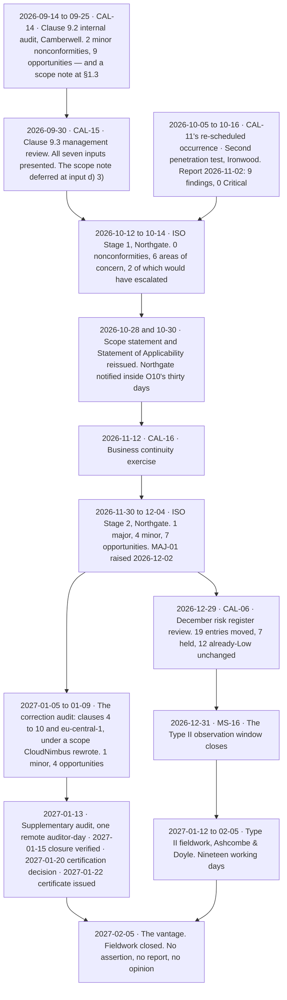

# Diagram — The Assurance Calendar as It Actually Ran

| Field | Value |
|---|---|
| Document ID | CNB-TRUST-2027-D32 |
| Version | 1.0 |
| Date | 2027-02-05 |
| Owner | Rahul Bhargava |
| Approver | Karim Haddad |
| Classification | Confidential — Trust &amp; Assurance Programme // Illustrative Portfolio Sample |

**The two engagements are two chains that touch twice.** Stage 2 sits inside the observation window and
`MAJ-01` was raised twenty-nine days before it closed — the collision **08.12** owns. And the certificate is
dated inside the fieldwork period, which is why an entity that had not volunteered the finding on the second
day of fieldwork would have had the service auditor find a certificate dated 2027-01-22 and ask what it was
for.

## The sixteen calendar items, planned in January 2026 and run

`01.11` §5 fixed sixteen recurring activities with a named owner each, and said two things about them that
this table tests. **The frequency stated is the frequency the examination will sample against**, which makes
the calendar a commitment rather than an intention. And **the calendar is deliberately not divided into SOC
2 activities and ISO activities**, because CAL-07 produces evidence serving CC6.2, CC6.3 and Annex A
controls in the A.5 and A.8 families at once.

| ID | Activity | Frequency | Owner | What ran, 2026-07-01 to 2027-02-05 |
|---|---|---|---|---|
| CAL-01 | Trust Committee | Monthly | Marisol Vega | Ran monthly throughout |
| CAL-02 | Trust Working Group | Weekly | Rahul Bhargava | Ran weekly throughout |
| CAL-03 | Audit &amp; Risk Committee report | Quarterly | Karim Haddad | Q3 and Q4. **The Q4 occurrence carried R-08's High-band retention**, discharging the second limb of `03.02` §6 |
| CAL-04 | Board security update | Quarterly | Karim Haddad | Q3 and Q4 |
| CAL-05 | Service-auditor checkpoint | Monthly from 2026-04 | Rahul Bhargava | Ran monthly. **The four weekly fieldwork status meetings were arranged here**, not in January 2027 |
| CAL-06 | Risk register review | Quarterly | Karim Haddad | **2026-09-29** and **2026-12-29**. Late in the quarter by design — DEC-602 |
| CAL-07 | Access review | Quarterly | Wes Delacroix | **2026-07-27** and **2026-10-09**. Both completed on time and evidenced; **three of the forty-seven revocations arising were not** |
| CAL-08 | Sub-processor and vendor assurance review | Quarterly | Tobias Lund | **2026-07-30** and **2026-10-07**. One Tier 1 vendor with no current artefact at both |
| CAL-09 | Backup restore test | Monthly | Wes Delacroix | **Five of six.** July 07-16, **August none**, September 09-23 with the 09-25 re-run, October 10-21, November 11-18, December 12-16 |
| CAL-10 | Disaster recovery exercise | Annual | Wes Delacroix | **2026-08-19.** RTO 2h51m against 4h; RPO 4m12s against 15m |
| CAL-11 | Penetration testing | Annual and after significant change | Karim Haddad | **2026-05-04 to 05-22** outside the window, and **2026-10-05 to 10-16** inside it |
| CAL-12 | Security awareness training | Annual, plus within 14 days of hire | Hannah Brill | The calendar occurrence was 2026-06. **`CNB-C-008` was re-scheduled to 2026-11** so that the control had a population |
| CAL-13 | Policy review and reissue | Annual | Rahul Bhargava | The calendar occurrence was 2026-06. **`CNB-C-010` was re-scheduled to 2026-12** |
| CAL-14 | Internal audit (clause 9.2) | Annual programme, risk-weighted | Karim Haddad | **2026-09-14 to 09-25**, and the correction audit of **2027-01-05 to 01-09**. **Coverage was undefined when it was set** — `01.11` §7 |
| CAL-15 | Management review (clause 9.3) | Annual, minimum | Elise Fontaine | **2026-09-30** |
| CAL-16 | Business continuity exercise | Annual | Wes Delacroix | **2026-11-12** |

**One line of sixteen did not run when it was due, and it is CAL-09's August occurrence.** Everything else
on the calendar operated, including the four items whose anniversaries had to be moved to give a control a
population inside the window. **A calendar with one missed occurrence in six months is a calendar being
operated**, and the missed one is `D-06-01`, test exception 1, and a clause 10.2 nonconformity at the same
time.

## What the calendar did not fix, and it is the entry the phase is about

**CAL-14 reads "Annual programme, risk-weighted."** That fixes frequency and prioritisation basis. It fixes
**nothing about coverage**: not whether the programme audits the requirements of clauses 4 to 10, not
whether it reaches all three regions in an ISMS scope that is the whole organisation, not whether the ISMS
is covered in one cycle or across several, and not who defines the audit criteria and scope for each
individual audit — which clause 9.2.2 a) requires **for each audit**.

`01.11` §7 recorded that in January 2026, deferred the definition to an internal audit charter, raised
**`PR-06`** against the exposure, and said in terms that leaving it undefined was a decision rather than an
oversight. **The charter was never written. The audit ran to the programme document instead. `MAJ-01` is
what that produced**, and `diagrams/08-the-major-and-where-it-was-already-written-down.md` follows the whole
chain.

## The three cadences the window taught something about

**Quarterly is where a single slip becomes fifty per cent.** `04.11` §3 published the arithmetic before the
window opened: a quarterly control has two occurrences in six months, so one late occurrence is a deviation
rate of 50%. CAL-06, CAL-07 and CAL-08 all stayed quarterly and all four pairs of occurrences happened —
and the two exceptions arising from CAL-07 and CAL-08 are against the **other limbs** of their controls,
the revocations and the artefact refresh, not against the reviews themselves. **The cadence exposure did not
land where the arithmetic predicted, and the population that produced deviations was the one underneath the
occurrence.**

**Annual, inside a six-month window, is a population of one or zero.** Ten annual controls were re-scheduled
into the window under ADR-0019 and disclosed; each has a population of one and each was tested in full,
because a population of one cannot be sampled. `CNB-C-136`'s single occurrence did not happen, which is a
deviation rate of one hundred per cent on a population of one — **and it is a nonconformity and not a test
exception**, because `CNB-C-136` is ISO-only.

**Monthly absorbs a slip and does not forgive it.** CAL-09's six occurrences make a missed month 16.7%
rather than 50%, which is the reason `04.11` §3 says cadence choices were made against the arithmetic rather
than against operational comfort. It is still a missed occurrence, it was not re-performed and back-dated —
ADR-0026 — and the denominator carries it permanently.

## Cross-References

| Document | Relationship |
|---|---|
| [08.00 Phase 08 README](../08.00-README.md) | Phase index and the vantage |
| [08.01 The Clause 9.2 Internal Audit](../08.01-the-clause-9-2-internal-audit.md) | CAL-14's occurrence, and the coverage that was never defined |
| [08.03 ISO Stage 1 and What a Readiness Review Does Not Do](../08.03-iso-stage-1-and-what-a-readiness-review-does-not-do.md) | Stage 1, and the reissues that followed it |
| [08.04 The Second Penetration Test](../08.04-the-second-penetration-test.md) | CAL-11's re-scheduled occurrence |
| [08.08 The Observation Window Closes](../08.08-the-observation-window-closes.md) | The window's operating record and the December CAL-06 review |
| [08.10 The Type II Fieldwork](../08.10-the-type-ii-fieldwork.md) | The populations each cadence produced, and the ten with a population of one |
| [diagrams/08-the-major-and-where-it-was-already-written-down.md](08-the-major-and-where-it-was-already-written-down.md) | CAL-14's undefined coverage, followed to December |
| [diagrams/08-two-frameworks-one-week.md](08-two-frameworks-one-week.md) | Where each of the window's findings goes in each vocabulary |
| [01.11 Assurance Calendar and Obligations](../../01-program-foundation-dual-framework-governance/01.11-assurance-calendar-and-obligations.md) | CAL-01 to CAL-16 as set, §6's month-by-month view and §7's recorded gap |
| [04.11 Control Ownership and Operating Cadence](../../04-unified-control-framework-and-policy-architecture/04.11-control-ownership-and-operating-cadence.md) | §3's cadence arithmetic and §4's ten re-scheduled annual controls |
| [06.12 Quarter Three Operating Record](../../06-availability-processing-integrity-and-operations/06.12-quarter-three-operating-record.md) | CAL-07, CAL-08, CAL-09 and CAL-10 as they ran in the third quarter |
| [07.12 Quarter Four to Date — Operating Record](../../07-confidentiality-privacy-and-third-party-assurance/07.12-quarter-four-to-date-operating-record.md) | CAL-08's Q4 occurrence and CAL-16 |
