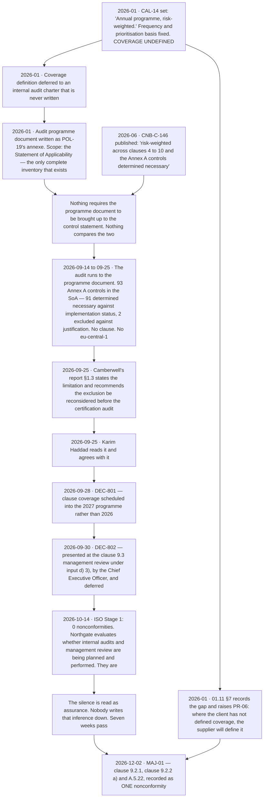

# Diagram — The Major, and Where It Was Already Written Down

| Field | Value |
|---|---|
| Document ID | CNB-TRUST-2027-D29 |
| Version | 1.0 |
| Date | 2027-02-05 |
| Owner | Karim Haddad |
| Approver | Rahul Bhargava |
| Classification | Confidential — Trust &amp; Assurance Programme // Illustrative Portfolio Sample |

## Four moments, and what would have had to happen at each

**The finding had four exits and used none of them.** Each row below is a point at which the organisation
held the fact, in writing, with an owner, and could have acted on it. The right-hand column is what would
have had to happen — not what somebody should have felt, but what document, control or decision would have
had to exist.

| Moment | What was held | What would have had to happen |
|---|---|---|
| **2026-01** — the calendar and the programme document | CAL-14 fixes frequency and not coverage; `01.11` §7 says so in terms; `PR-06` names the exposure; the programme document is scoped by the Statement of Applicability | **The internal audit charter that coverage was deferred to would have had to be written** before the programme was set, with a coverage matrix carrying a row for every clause of 4 to 10 and every location in the ISMS scope. `CNB-C-150` is that requirement, admitted **twelve months late on this row's own clock** — January 2026, when coverage was deferred to a charter, to its admission on 2027-01-08 |
| **2026-06** — the library is built | `CNB-C-146` states a programme across clauses 4 to 10; the programme document states one across the Statement of Applicability. **Both documents are correct on their own faces** | **Something would have had to compare them.** Nothing in the library requires any two documents describing the same activity to be read against each other, and nothing does now — that is `IS-35`, referred, and open |
| **2026-09-25 to 09-30** — the scope note | Camberwell's §1.3 note, read on the day, agreed at DEC-801, minuted at the management review at DEC-802 | **A second internal audit would have had to be commissioned inside the 2026 cycle** — scoped, resourced and completed in the nine weeks before Stage 2 opened. The decision was that 2027 was soon enough |
| **2026-10-14 to 11-30** — after Stage 1 | Zero nonconformities and six areas of concern, none of them about the internal audit programme | **The organisation would have had to ask what Stage 1 was capable of finding.** Stage 1 evaluates whether internal audits are being planned and performed. It does not evaluate what they covered — ADR-0036 |

## The two documents, side by side

| | The audit programme document | `CNB-C-146` |
|---|---|---|
| Written | **January 2026**, at chartering | **June 2026**, when the control library was built |
| Lives in | POL-19's annexe | The unified control library |
| Says the scope is | The controls determined necessary in the **Statement of Applicability** | *"risk-weighted **across clauses 4 to 10 and the Annex A controls determined necessary**"* |
| Was it wrong when written | **No.** In January the Statement of Applicability was the only complete inventory of auditable things the organisation had | **No.** It is a correct description of what a clause 9.2 programme covers |
| Who read it | The internal auditor, who audited to it | Anybody auditing the library, who reads a correct row and moves on |
| What it produced | An audit of the 93 Annex A controls in the Statement of Applicability — the 91 determined necessary and the 2 excluded | The sentence Northgate quoted back at CloudNimbus |

**This is the failure mode reading the library cannot find.** Phase 05 found five control statements that
did not say what a later phase needed. Phase 06 found `CNB-C-096`, which said how often and never said what.
Phase 07 found `CNB-C-127`, whose alert condition was about the arrival of a record rather than its content.
**Every one of those is visible on the page.** This one is not: the statement was right and the practice was
wrong, and **reading the library tells you nothing is missing.**

## Where each vocabulary puts it

**`MAJ-01` is an ISO major nonconformity and it is not a SOC 2 test exception.** Clause 9.2 has no trust
services criterion; `CNB-C-146` is ISO-only and cites a dash in its `Criteria` column; `04.07` §3.3 refused
in advance to cite CC4.1 against it, on the ground that the citation would assert that the criterion
requires an ISO internal audit programme, which it does not. **There is no Section IV row for it to be a
deviation in.**

What reaches the examination is the fact itself, as **contradictory evidence about the entity's monitoring
activities**, evaluated by the engagement team against **CC4.1** and **CC4.2** — and, as information
provided by management, a **Section V** disclosure that is not covered by the service auditor's opinion and
that says so on its own face. `diagrams/08-two-frameworks-one-week.md` routes it alongside the three other
worked cases, and **08.12** argues it.

## And the sentence the diagram exists to support

**An entity that failed to notice a gap has a detection problem. An entity that noticed it, wrote it down,
took it to its highest governance body and decided to leave it has a different problem** — and the second
one is not the kind that better monitoring answers, because the monitoring already worked.

Every artefact in the chain above exists and is retained: `01.11` §7's recorded position and `PR-06`;
EV-802's programme document as it stood; EV-801's report with §1.3 exactly as delivered; EV-804's management
review minute with input d) 3) complete; EV-806's Stage 1 report. **The record is not thin. It is complete,
and it is the evidence.**

## Cross-References

| Document | Relationship |
|---|---|
| [08.05 Stage 2 and the Major Nonconformity](../08.05-stage-2-and-the-major-nonconformity.md) | The chapter this diagram belongs to; `MAJ-01` in full and why major |
| [08.01 The Clause 9.2 Internal Audit](../08.01-the-clause-9-2-internal-audit.md) | §5, the scope note read and deferred twice |
| [08.02 The Clause 9.3 Management Review](../08.02-the-clause-9-3-management-review.md) | Input d) 3), and a control that guarantees the agenda |
| [08.03 ISO Stage 1 and What a Readiness Review Does Not Do](../08.03-iso-stage-1-and-what-a-readiness-review-does-not-do.md) | §5, and the seven weeks after |
| [08.07 Correction, Corrective Action and the Certificate](../08.07-correction-corrective-action-and-the-certificate.md) | §3's root cause and the three-part corrective action |
| [adr/ADR-0036](../adr/ADR-0036-a-clean-stage-1-is-not-assurance.md) | The misreading recorded rather than the decision |
| [adr/ADR-0040](../adr/ADR-0040-cnb-c-150-is-admitted-outside-the-window.md) | The control that answers the instance and nothing else |
| [diagrams/08-two-frameworks-one-week.md](08-two-frameworks-one-week.md) | Where `MAJ-01` goes in each vocabulary, alongside three other cases |
| [logs/raid-log.md](../logs/raid-log.md) | `IS-35` as the class of failure, and `IS-36` |
| [logs/evidence-index.md](../logs/evidence-index.md) | EV-801, EV-802, EV-804 and EV-806 |
| [01.11 Assurance Calendar and Obligations](../../01-program-foundation-dual-framework-governance/01.11-assurance-calendar-and-obligations.md) | CAL-14, §7 and `PR-06` |
| [04.07 ISO-Only Controls and ISMS Machinery](../../04-unified-control-framework-and-policy-architecture/04.07-iso-only-controls-and-isms-machinery.md) | `CNB-C-146` as published, and §3.3's refusal |
