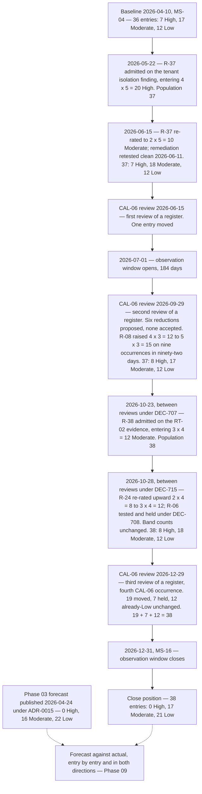

# Diagram — The Register from Baseline to Close

| Field | Value |
|---|---|
| Document ID | CNB-TRUST-2027-D30 |
| Version | 1.0 |
| Date | 2027-02-05 |
| Owner | Karim Haddad |
| Approver | Rahul Bhargava |
| Classification | Confidential — Trust &amp; Assurance Programme // Illustrative Portfolio Sample |

## The arithmetic

| Point | High | Moderate | Low | Total |
|---|---|---|---|---|
| Baseline, 2026-04-10 | 7 | 17 | 12 | **36** |
| After R-37's admission, 2026-05-22 | 8 | 17 | 12 | **37** |
| After R-37's re-rating, 2026-06-15 | 7 | 18 | 12 | **37** |
| After the September review, 2026-09-29 | 8 | 17 | 12 | **37** |
| After R-38's admission, 2026-10-23 | 8 | 18 | 12 | **38** |
| After R-24's re-rating, 2026-10-28 | 8 | 18 | 12 | **38** |
| **Leaving the December review, 2026-12-29** | **0** | **17** | **21** | **38** |

**R-24's row is the one to read.** Its score rose by four on 2026-10-28 and **no band count moved**, which is
why the register's summary arithmetic is not the register. **A movement that does not change a band is still
a movement, and a log that records only band changes has stopped measuring.**

## The December review in one table

| Disposition | Entries | Which |
|---|---|---|
| **Moved** | **19** | R-01 to R-08, R-10 to R-17, R-21, R-22, R-23 |
| — of which two steps | 6 | R-01, R-05, R-08, R-10, R-13, R-14 |
| — of which one step | 13 | R-02, R-03, R-04, R-06, R-07, R-11, R-12, R-15, R-16, R-17, R-21, R-22, R-23 |
| **Held with a stated reason** | **7** | R-09, R-18, R-19, R-20, R-24, R-37, R-38 |
| **Already Low, unchanged** | **12** | R-25 to R-36 |
| **Total** | **38** | 19 + 7 + 12 = 38 |

**Four of the seven held are held because their described event occurred** — R-09, R-18, R-24 and R-38 —
**and three because they cannot move**: R-19, R-20 and R-37 all sit at likelihood 2 with an impact of 5, and
the next likelihood step is 1, which `03.02` reserves for the not-reasonably-foreseeable.

## Three properties of this line that are worth naming

**The population has changed twice in the register's life and both changes were additions.** R-37 on
2026-05-22, when the penetration test disproved AS-02; R-38 on 2026-10-23, when the RT-02 job was found to
have deleted nothing for sixty-eight nights and disproved AS-01 in the terms `02.12` §4 stated it. **Nothing
has ever been closed and nothing has ever been removed.** A risk that stops being likely is re-rated, not
deleted, and a register that shrinks when a treatment lands is a register that has forgotten what it was
counting.

**Two movements went upward and neither was proposed by anybody.** R-08 in September, from 4 × 3 = 12 to
5 × 3 = 15, because `03.02` §2 puts likelihood 5 at *occurring now, or expected more than once a year* and
R-08's event occurred nine times in ninety-two days — the register's first likelihood-5 entry, at an anchor
that had stood empty since the baseline. R-24 in October, from 2 × 4 = 8 to 3 × 4 = 12, because the entry
Phase 03 named as sitting on the eight floor **could not move down and nothing stopped it moving up, and
nobody had asked.**

**The whole of the visible movement falls at one review.** A register has been reviewed three times —
2026-06-15, 2026-09-29 and 2026-12-29 — and the first two produced two movements between them, **one down in
June and one up in September**. The third produced nineteen. R-24's upward move belongs to neither of the
first two: it fell **between** reviews, on 2026-10-28. That shape invites the rubber-stamp objection and
08.08 §5 meets it head-on: **every earlier review said on the record that it was waiting for a
population, and the December review is the first at which the population exists.** The September refusals
and the December acceptances have to be read together or neither means anything.

## What this diagram does not show

**It does not show the forecast against the actual.** The dotted lines meet at Phase 09 and stop there. 0 ·
16 · 22 was published on 2026-04-24 after the harness proved it reachable, and marking a close position
against a forecast in the same document that produced the close position would be the register grading its
own movement.

**It does not show treatment.** TP-01 to TP-34 sit underneath every one of these transitions and none of
them appears, because a rating moves on evidence of what happened rather than on a completed treatment item
— which is the rule GOV-32's Basis column exists to enforce.

**And it does not show what any of this means for the examination.** A risk register is management's
instrument. It is not a control, it is not in Section IV, and no rating on this line is a statement about
whether any trust services criterion was achieved.

## Cross-References

| Document | Relationship |
|---|---|
| [08.08 The Observation Window Closes](../08.08-the-observation-window-closes.md) | §5, the seven held, the six two-step movements and the objection |
| [08.13 Phase Summary and Transition](../08.13-phase-summary-and-transition.md) | §6, the close position carried to Phase 09 |
| [governance/GOV-32](../governance/GOV-32-december-cal-06-register-review.md) | The entry-level record behind the December column |
| [adr/ADR-0039](../adr/ADR-0039-nineteen-entries-move-at-one-review.md) | The decision and the objection |
| [logs/raid-log.md](../logs/raid-log.md) | The register position carried forward |
| [03.04 Risk Register — Baseline](../../03-risk-assessment-treatment-and-statement-of-applicability/03.04-risk-register-baseline.md) | The thirty-six entries, the movement rules and DEC-306 |
| [03.07 Risk Acceptance and Residual Risk](../../03-risk-assessment-treatment-and-statement-of-applicability/03.07-risk-acceptance-and-residual-risk.md) | The forecast and ADR-0015 |
| [03.02 Risk Criteria and Scoring Scale](../../03-risk-assessment-treatment-and-statement-of-applicability/03.02-risk-criteria-and-scoring-scale.md) | The likelihood anchors and the eight floor |
| [06.13 Phase Summary and Transition](../../06-availability-processing-integrity-and-operations/06.13-phase-summary-and-transition.md) | §4, the September review and R-08's first likelihood-5 rating |
| [governance/GOV-27](../../07-confidentiality-privacy-and-third-party-assurance/governance/GOV-27-q4-privacy-review-and-the-admission-of-cnb-c-149.md) | R-38's admission, R-24's upward movement and R-06 held, in October |
