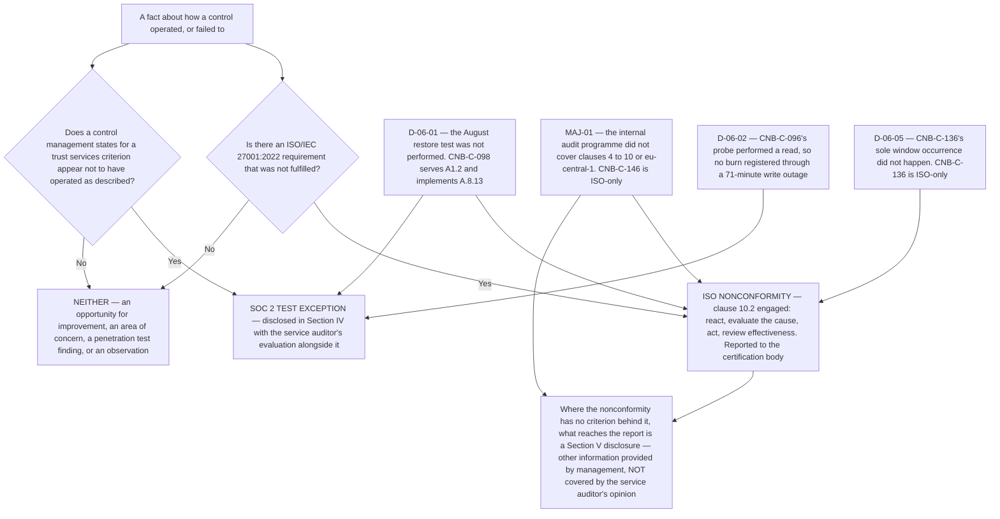

# Diagram — Two Frameworks, One Week

| Field | Value |
|---|---|
| Document ID | CNB-TRUST-2027-D31 |
| Version | 1.0 |
| Date | 2027-02-05 |
| Owner | Rahul Bhargava |
| Approver | Karim Haddad |
| Classification | Confidential — Trust &amp; Assurance Programme // Illustrative Portfolio Sample |

## The four facts, and the four different answers

| Fact | ISO nonconformity? | SOC 2 test exception? | Why |
|---|---|---|---|
| `D-06-01` — the August restore test was not performed | **Yes** — clause 10.2, `CA-06-01` | **Yes** — exception 1, A1.2, 1 of 6, **16.7%** | `CNB-C-098` is a dual control. It serves **A1.2** and implements **A.8.13**, and one missed occurrence engages both frameworks at once |
| `MAJ-01` — the internal audit programme did not cover clauses 4 to 10 or `eu-central-1` | **Yes** — major, clause **9.2.1** and **9.2.2 a)**, and **A.5.22** | **No** | Clause 9.2 has no trust services criterion and `CNB-C-146` is ISO-only. **There is no Section IV row for it to be a deviation in** |
| `D-06-02` — `CNB-C-096`'s probe performed a read | **No** | **Yes** — exception 2, **A1.1 and A1.2** | Nothing failed to conform: every word of the control was satisfied. The statement was **silent** about what a probe must exercise, and a design corrected by amendment is a **correction** under clause 10.2, not a corrective action |
| `D-06-05` — `CNB-C-136`'s sole window occurrence did not happen | **Yes** — clause 10.2, `CA-06-04` | **No** | `CNB-C-136` is ISO-only. A deviation rate of **one hundred per cent on a population of one**, against nothing the examination assesses |

**One organisation. One observation window. Four facts and four different answers.**

## Why nothing about the shared library resolves this

CloudNimbus operates **one** control library — 148 rows when the window opened, 149 when it closed, 150
today — of which **112 serve both frameworks**, 21 serve SOC 2 alone and 15 serve ISO alone. The library is
the integration. It is not, and was never going to be, a translation.

**The two frameworks classify failures by different tests.**

**ISO asks whether a requirement was not fulfilled.** The requirements are clauses 4 to 10. Annex A is a
reference set reached through clause 6.1.3 c), and the Statement of Applicability records which of its 93
controls are necessary and whether each is implemented. A nonconformity is the non-fulfilment of a
requirement, and clause 10.2 attaches to it: react and correct, evaluate the need to eliminate the cause,
implement, review effectiveness, retain documented information.

**SOC 2 asks whether a control management stated did not operate as described, on an occasion the service
auditor selected.** The criteria are TSP section 100's sixty-one. **The trust services criteria contain no
controls** — management designs and describes them, and the service auditor evaluates whether they meet the
criteria. An exception is a fact about a sample, disclosed in Section IV with the practitioner's evaluation,
and it does not automatically modify the opinion.

Those questions have different answers about the same event, and **both answers are correct**. A programme
that mapped one vocabulary onto the other would be asserting that a CPA firm and an accredited certification
body had reached the same conclusion, which neither of them did and neither of them could.

## What a wrong word costs

**Each of these three errors is one word, and each produces a document that says something untrue about
which independent party concluded what.**

| Error | What it produces |
|---|---|
| Calling `MAJ-01` a test exception | It lands in **Section IV**, where it reads as a deviation the service auditor's opinion covers — against a control that is not in Section IV and a criterion that does not exist |
| Calling `D-06-02` a nonconformity | Clause 10.2 requires a cause to eliminate. There is no cause: the control was silent, the silence was completed by amendment, and the corrective action would be a document with nothing in it |
| Calling `D-06-05` an exception | It attributes a deviation to a criterion no control serves, and produces a Section IV entry a reader cannot trace to any row of the description |

**A programme that maps its two frameworks onto one control library still has to keep two vocabularies, and
the place that gets tested is the week they collide.**

## And the week they collided

Stage 2 ran **2026-11-30 to 2026-12-04**, inside an observation window that ran **2026-07-01 to
2026-12-31**. `MAJ-01` was raised on **2026-12-02**, twenty-nine days before the window closed. **ADR-0005
accepted that collision knowingly in January 2026 and did not discover it.**

The consequence is the arrow this diagram ends on. A major nonconformity raised by an accredited
certification body against clause 9.2 is **contradictory evidence about the entity's monitoring
activities**, and monitoring is what **CC4.1** and **CC4.2** are about. The engagement team evaluated it as
such and **recorded** that the seven controls CloudNimbus states for those two criteria had themselves
operated. **The placement was management's determination and not the engagement team's** — DEC-813, Marisol
Vega, 2027-01-19, with ADR-0038 carrying the structural argument: **Section V — other information provided by
management, which is not covered by the service auditor's opinion, and which management states on the face of
the section rather than leaving to the reader to know.**

## Cross-References

| Document | Relationship |
|---|---|
| [08.12 The Scheduling Collision](../08.12-the-scheduling-collision.md) | The chapter this diagram belongs to; §5 argues all four cases |
| [08.11 The Nine Test Exceptions](../08.11-the-nine-test-exceptions.md) | Exceptions 1 and 2, which appear here with opposite answers |
| [08.05 Stage 2 and the Major Nonconformity](../08.05-stage-2-and-the-major-nonconformity.md) | `MAJ-01` as Northgate stated it |
| [08.10 The Type II Fieldwork](../08.10-the-type-ii-fieldwork.md) | `CNB-C-136` at a population of one, and what a population of one does to a rate |
| [logs/finding-log.md](../logs/finding-log.md) | Every finding of the phase with its classification |
| [04.07 ISO-Only Controls and ISMS Machinery](../../04-unified-control-framework-and-policy-architecture/04.07-iso-only-controls-and-isms-machinery.md) | `CNB-C-136` and `CNB-C-146`, and why an ISO-only row has no criterion |
| [04.06 Controls for Availability, Processing Integrity, Confidentiality and Privacy](../../04-unified-control-framework-and-policy-architecture/04.06-controls-for-availability-processing-integrity-confidentiality-and-privacy.md) | `CNB-C-096` and `CNB-C-098` as published |
| [04.03 Mapping Methodology and Its Limits](../../04-unified-control-framework-and-policy-architecture/04.03-mapping-methodology-and-its-limits.md) | The 112 / 21 / 15 split, and a mapping as an assertion by the mapper |
| [06.12 Quarter Three Operating Record](../../06-availability-processing-integrity-and-operations/06.12-quarter-three-operating-record.md) | `D-06-01`, `D-06-02` and `D-06-05` with the clause 10.2 test applied to each |
